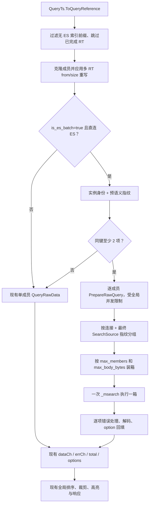

# UQ `query_raw` Elasticsearch 按连接攒批实现计划

## 1. 设计摘要

首期在普通 `query_raw` 路径增加一个仅针对直连 Elasticsearch 的可选执行计划器。

计划器不会合并查询语义，而是：

1. 在 `QueryReference` 展平后创建成员；
2. 用无 I/O 的预指纹先排除不同条件和明显不同语义；
3. 每个候选成员独立准备 alias、mapping、formatter 和最终 `SearchSource`；
4. 按有效连接和最终请求体再次分组；
5. 按成员数、NDJSON body bytes 装箱；
6. 每箱发一次 `GET /_msearch`；
7. responses 按成员顺序逐项解码并回填现有通道。

`is_es_batch` 缺省/`false`、未命中资格或在准备前无法安全分组时，继续走当前单成员
`QueryRawData`。成员已成功准备但最终指纹不确定时走 prepared single executor；mapping
或 DSL 构造等准备本身失败时，按当前契约返回该成员错误，不重复查询。

## 2. 调用链与改造点



核心改造点：

- `pkg/unify-query/service/http/query.go`
  - 保留响应汇总逻辑；
  - 将“逐成员立即查询”改为“构造成员后交给执行计划器”；
  - scroll 函数不改。
- 新建 `pkg/unify-query/service/http/query_raw_es_batch.go`
  - 成员预分组；
  - 共享并发控制；
  - 批次和单成员调度；
  - 把结果写回现有聚合结构。
- `pkg/unify-query/tsdb/elasticsearch/instance.go`
  - 从 `QueryRawData` 抽出可复用的准备和解码阶段；
  - 单查询仍复用同一套实现。
- 新建 `pkg/unify-query/tsdb/elasticsearch/raw_batch.go`
  - 最终指纹；
  - NDJSON 编码与装箱；
  - `_msearch` 执行和逐项响应转换。
- `pkg/unify-query/service/http/settings.go`、`hook.go`
  - 保留批次成员数、body 和 ES 内部并发等服务端容量配置。
- `pkg/unify-query/query/structured/query_ts.go`
  - 增加顶层可选参数 `is_es_batch`，缺省值为 `false`。

## 3. 数据结构

### 3.1 HTTP 层成员

在 `service/http` 内定义未导出的 `rawQueryMember`，至少保存：

```go
type rawQueryMember struct {
    ordinal     int
    query       *metadata.Query
    instance    tsdb.Instance
    tableUUID   string
    preGroupKey string
}
```

要求：

- `ordinal` 来自新建的稳定成员收集函数，用于确定性装箱和响应归位；不能直接采用当前 `QueryReference.Range` 的遍历次序，因为其顶层是 Go map；
- `query` 已深拷贝必要可变字段，尤其是 `ResultTableOption`；
- 不能在不同成员间共享后续会被修改的 `SearchSource`、formatter 或 option；
- `preGroupKey` 不能包含或输出凭据。

### 3.2 ES 准备结果

在 `elasticsearch` 包先定义成员私有的完整字段元数据；它是高亮预取与正式准备之间唯一允许复用的 mapping 输入：

```go
type PreparedFieldMetadata struct {
    indexes         []string
    physicalIndexes []string
    fieldMap         metadata.FieldsMap
}
```

三项在创建后视为不可变并做必要深拷贝。只有完整成功结果可以缓存；仅有 `QueryFieldMap` 返回的 field map 不能作为正式准备输入。

再定义 `PreparedRawQuery`。内部字段不对日志序列化，至少包含：

```go
type PreparedRawQuery struct {
    query           *metadata.Query
    indexes         []string
    physicalIndexes []string
    source          *elastic.SearchSource
    body            string
    countQuery       elastic.Query
    formatter        *FormatFactory
    fieldMap         metadata.FieldsMap
    connectionKey    [32]byte
}
```

约束：

- `indexes`、`physicalIndexes`、`source`、`body` 和连接身份在准备完成后视为不可变；
- `source` 必须已应用 search-after；
- `body` 是稳定编码后的最终 source，不含索引目标；
- `connectionKey` 仅进程内比较；
- formatter 和 field map 仍逐成员保存；formatter 的 `SetData` 会修改成员内状态，因此必须由该成员独占并只执行一次解码，不能跨成员或并发复用；
- 每个准备结果最多执行一次。

### 3.3 批次结果

批次返回与请求等长、同序：

```go
type RawBatchResult struct {
    Rows   []map[string]any
    Size   int64
    Total  int64
    Option *metadata.ResultTableOption
    Err    error
}
```

HTTP 层不根据 `_index` 猜成员身份，只按请求位置取对应结果。

## 4. 成员构造与预分组

### 4.1 保留当前重写顺序

先以排序后的 reference name 遍历 `QueryReference`，保留 reference slice 的请求顺序，并为路由成员生成稳定排序键。排序键至少包含 TableUUID、DB、存储身份和规范化查询语义；完全相同的重复成员可保持相邻。不得直接把当前 map 遍历顺序当作 `ordinal`。

每个成员依次执行：

1. 克隆 `metadata.Query`；
2. 克隆 `ResultTableOption`；
3. search-after 模式下跳过已完成 RT；
4. 计算并合并 label map；
5. 多路由且非 multi-from 时执行当前 `size += from; from = 0`；
6. 获取 TSDB 实例；
7. 判定 batch 资格。

顺序不得改变，否则最终 ES window 和上层裁剪会发生差异。

### 4.2 有效连接身份

为 `*elasticsearch.Instance` 增加只用于进程内规划的方法，身份由以下有效配置稳定计算：

- address；
- username；
- password；
- 由当前 context 和实例配置合成、排序后的有效 headers；
- 必要的连接行为配置。

实现可使用固定长度摘要作为 map key，但：

- 不提供 String 方法；
- 不写入 span/log/metric；
- 不持久化；
- 观测只使用另行生成的低基数匿名序号或区间标签。

BKData 代理在首期资格判断前直接排除。

### 4.3 预语义指纹

预指纹只用于安全地减少准备等待，不是最终正确性依据。至少纳入：

- `AllConditions`；
- `QueryString`、`IsPrefix`；
- `TimeField` 和查询时间单位；
- `Field`、`Source`、`FieldAlias`；
- `Orders`；
- `From`、`Size`；
- `ResultTableOption.From`、`SearchAfter`；
- `Collapse`；
- 会改变 `SearchSource` 的其他 query flags。

排除：

- `DB`、`DBs`；
- `TableID`、`TableUUID`；
- 仅用于输出归属、routeInfo 或消息的字段。

采用显式投影结构后做稳定 JSON 编码，不能直接序列化整个 `metadata.Query` 再删字段。最终 body 指纹仍是执行正确性的权威门禁；预投影遗漏通常只会增加准备开销，但若遗漏新的条件类字段会违反“不同条件不成批”的保守策略。因此新增会改变条件或 ES body 的 Query 字段时，字段覆盖测试必须要求显式分类。

分组为“连接身份 + 预指纹”。组大小小于 2 的成员立即走当前单查询路径。用户 Event Logs 中条件不同的两个成员会在这一层分开，不等待批次准备。

## 5. ES 查询准备重构

### 5.1 抽取 `PrepareRawQuery`

从当前 `QueryRawData` 抽取准备函数，顺序保持不变：

1. `checkQuery`；
2. 克隆 query 和 option；
3. `getAlias`；
4. `fieldMapWithPhysicalIndexes`；
5. 应用 `maxSize` 和 option from；
6. 创建逐成员 `FormatFactory`；
7. `buildESQuerySource`；
8. 应用 search-after；
9. 稳定序列化最终 body。

任何一步失败都返回该成员错误。不能用其他成员的 mapping、field map 或 formatter 代替。

### 5.2 单路径复用

将现有 `QueryRawData` 改为：

1. `PrepareRawQuery`；
2. 单 `_search` 执行；
3. 公共响应校验和 fallback；
4. `DecodeRawResult`；
5. 向传入 dataCh 写行。

先完成这个无行为变化重构并跑全量相关测试，再实现 `_msearch`。这样批次和单查询不会维护两套 query builder/decoder。

### 5.3 高亮 mapping 复用

HTTP 层当前高亮 `QueryFieldMap` 是可选预取，失败后 `QueryRawData` 仍会在正式查询准备中再次获取 mapping。重构必须保留这一容错语义：

1. 候选成员通过 ES 内部窄接口预取完整 `PreparedFieldMetadata`，同时取得 alias/index targets、physical indexes 和 field map；不能复用只有 field map 的 `QueryFieldMap` 结果；
2. 完整预取成功时，`PrepareRawQuery` 重新在本地派生 alias 校验复用身份，但直接复用 physical indexes 和 field map，不再发第二次远端 `IndexGet`/`GetMapping`；
3. 预取失败或结果不完整时不把成员标记为失败，`PrepareRawQuery` 按当前行为完整执行一次正式 alias/mapping；
4. 正式 mapping 失败时才返回成员错误，不做第三次隐式尝试；
5. 缓存只保存完整成功结果并归属于单个成员，不能跨成员复用 formatter 或可变状态。

非候选单查询保持原行为。需要差分测试证明字段大小写判断和高亮结果不变。

## 6. 最终分组

### 6.1 最终指纹

最终组键：

```text
connectionKey + SHA-256(final SearchSource body)
```

其中 body 必须包含：

- 过滤条件；
- 时间范围；
- query string；
- sort 和 unmapped_type；
- `_source` projection；
- from/size；
- search-after；
- collapse；
- 其他最终 DSL。

索引目标不包含在 body 指纹中；每个子请求仍使用自己的 indexes。

即使预指纹相同，只要最终 body 不同也必须拆组。脱敏多路由样本中的多种 body 会在这里自然分开。

### 6.2 稳定顺序

组内按稳定 `ordinal` 排序，装箱后也保持这个顺序。map 遍历顺序不能影响：

- 哪些成员进入同一箱；
- NDJSON 行顺序；
- responses 与成员的映射；
- 测试输出。

## 7. NDJSON 编码与装箱

### 7.1 编码格式

每个成员编码为两行：

```text
{"index":["alias-or-pattern-1","alias-or-pattern-2"]}
{"query":{...},"sort":[...],"from":0,"size":100}
```

最终 body：

- 每行以 `\n` 分隔；
- 整体以 `\n` 结束；
- header 只写当前单查询路径实际需要的 index；
- 不把 index 放入 URL；
- content type 使用 ES 接受的 NDJSON 类型。

建议在 UQ 侧显式构造 NDJSON，并通过 olivere client 的 `PerformRequest` 发出，以便：

- 精确计算字节数；
- 明确固定 path；
- 明确 header 支持集合；
- 解码为 `elastic.MultiSearchResult`。

`PerformRequestOptions.Body` 必须传 `string`，不能传 `[]byte`：olivere v7 会把非 string body 再做 JSON marshal，`[]byte` 会变成 base64 字符串。必须同时显式设置 `ContentType: "application/x-ndjson"`。精确 body bytes 用 `len([]byte(ndjsonString))` 计算。

不能依赖估算的字符数或索引数量。

### 7.2 装箱算法

按稳定顺序做 first-fit sequential packing：

1. 新建空箱；
2. 编码下一个成员；
3. 若加入后超过 `max_members` 或 `max_body_bytes`，先封箱；
4. 将成员放入新箱；
5. 完成后封最后一箱。

每个成员必须恰好出现一次。单成员编码已经超过 body 预算时：

- 不截断；
- 不拆 query；
- 使用该成员已经完成准备的 prepared single executor，不重新执行 alias/mapping；
- 记录区间化的 oversized fallback 指标。

### 7.3 请求参数

请求：

- method：与已验证客户端行为一致的 GET；
- path：`/_msearch`；
- query param：仅在配置大于 0 时设置 `max_concurrent_searches`；
- timeout：复用当前 ES client timeout 和 context；
- headers：复用当前认证上下文，并增加正确 content type。

## 8. 并发调度

### 8.1 一个共享 I/O 限流器

准备和执行不能各自创建容量为 4 的独立池，否则总并发会从 4 变成 8。

在单次 `queryRawWithInstance` 内创建共享限流器。`QueryMaxRouting > 0` 时容量等于该值；`QueryMaxRouting <= 0` 时使用 no-op limiter，保留当前 ants pool 的 unlimited 语义，不能创建容量为 0 的 semaphore。以下操作都各占一个令牌：

- 非候选成员的完整现有查询；
- 候选成员的 mapping/DSL 准备；
- 一个 `_msearch` batch 执行；
- 需要保留的成员级补充查询。

这样 UQ 到 ES/其他 TSDB 的并发 HTTP 操作仍有明确上限。

### 8.2 候选组协调

每个预分组由一个不占令牌的 coordinator 管理。`QueryMaxRouting > 0` 时，准备和执行通过固定数量 worker 或有界 dispatcher 取任务，不能为全部成员先创建 goroutine 再阻塞在 semaphore 上；避免请求路由数较大时产生 O(N) parked goroutine。

1. 为组内成员并发准备，实际 I/O 获取共享令牌；
2. 等待本组准备结束；
3. 把成功成员按最终指纹分组和装箱；
4. 对箱并发执行，每箱获取共享令牌；
5. mapping、DSL 构造等准备失败成员直接写成员错误；仅分组资格或指纹无法确认的成员才走 single executor；
6. 最终指纹只剩一项时，使用 prepared single executor，不重复 mapping。

非候选成员可以与候选准备并行执行。顶层只在所有 coordinator 和单成员任务结束后关闭 dataCh/errCh。

实现必须避免在持有共享令牌时等待同一限流器中的子任务，以防死锁。

missing-mapping 空检查和单成员 retry 由当前 batch worker 在同一个令牌内依次执行，不再嵌套 Acquire，也不等待同一限流器中的子任务。网络调用保持串行，因此实际并发不会超过 `QueryMaxRouting`；`QueryMaxRouting=1` 的故障注入测试必须证明整个“首次请求 → 空检查 → retry”完成且最大 inflight 始终为 1。

## 9. 执行、解码和错误

### 9.1 `_msearch` 整体响应

整体 HTTP 返回后先检查：

- transport error；
- HTTP status；
- JSON decode error；
- `len(responses) == len(requests)`。

这些错误属于 batch transport 错误：对该批只向公共错误收敛链路写入一次受控错误，批内所有成员对 rows、total、option 和成功计数均贡献为零；成员影响数通过独立低基数计数记录，不把同一个原始错误复制成 N 条公共错误或日志。

timeout、429、5xx 和连接错误不展开为 N 次 `_search`。

首期不实现 endpoint/media type 自动兼容回退，也不维护能力负缓存。404/405/415 与其他
transport 错误一样使该批失败；目标环境兼容性通过 APM Trace 请求显式 opt-in 后验证。
这样不会在 batch 已 claim 成员后再转交 prepared single，也不会在故障时展开 N 路
`_search`。

### 9.2 子响应

每个 `elastic.SearchResult` 依次执行：

1. 记录低基数分片状态；
2. 使用 batch 专用的结构化错误提取，复用单查询的错误分类语义，但不能直接复用会拼接 URL/index 的 `handleESError` 文本渲染；
3. 判断缺 mapping 空索引 fallback；
4. 无错误则使用该成员 formatter 解码；
5. 生成该成员 total、size 和 option。

子响应错误只影响本成员。

batch item error 至少保存状态、错误类型和脱敏原因。对外错误、日志、span 和 metric 都不能包含 URL、索引、认证头或查询值；使用 sentinel 捕获测试验证这些值零出现。

### 9.3 缺 mapping fallback

单查询路径继续使用现有 `_search` fallback。批次路径逐 child 检测相同的 missing-mapping 条件；命中后复用该成员自己的 alias、count query、formatter 和 field type，先做空索引精确检查，再执行一次单成员 `_search` retry。多个失败 child 在当前 batch worker 中依次处理，不重放成功 sibling，不进行二次组装。

batch fallback 使用独立的脱敏观测字段，只记录固定 reason、计数、阶段和区间值；现有 fallback 中的失败索引、重试索引、完整 retry body、endpoint 和原始错误不得进入新增 span/log。成功和失败分支都使用 sentinel 捕获测试验证这些值零出现。

不能：

- 因一个 child 失败重放整批；
- 让已成功成员执行两次；
- 把多个成员索引合并到 retry URL。

fallback 状态固定为 attempted/recovered/failed。只有 retry 响应再次通过 child 错误校验后才计为 recovered；retry HTTP 返回但仍有 shard failure 不能计为成功。

### 9.4 回填现有聚合器

每个成功结果：

- rows 逐项写入现有 `dataCh`；
- `successedPaths` 加 1；
- `resultTableOptions.SetOption(member.tableUUID, option)`；
- 响应 total 累加该成员 `Total`。

成员错误写入现有 `errCh`。上层 `QueryRawPartial`、全失败、全局排序和裁剪代码保持不变。

## 10. 请求控制与容量配置

`/query/ts/raw` 的顶层请求结构增加：

```text
is_es_batch
```

参数契约：

- 缺省或 `false`：不调用 batch planner，完整走原逐 RT 路径；
- `true`：允许直连 ES 成员进入 planner；
- opt-in 不是强制合并，不会跳过连接、conditions、最终 DSL 或装箱预算门禁；
- 只在 `/query/ts/raw` 生效，`raw_with_scroll` 和其他接口不读取；
- APM `TraceQuery.query_by_trace_ids` 按需传 `true`，其他调用方不被隐式启用。

`service/http` 仅保留以下服务端容量配置：

```text
http.query.raw.es_batch.max_members
http.query.raw.es_batch.max_body_bytes
http.query.raw.es_batch.max_concurrent_searches
```

校验：

- `max_members >= 2`；
- `max_body_bytes > 0`；
- `max_concurrent_searches >= 0`，0 表示不发送参数；
- 非法数值在启动时使用安全默认并给出不含敏感信息的告警。

首期默认：

```yaml
http:
  query:
    raw:
      es_batch:
        max_members: 16
        max_body_bytes: 1048576
        max_concurrent_searches: 4
```

不读取或改变 `is_merge_db`。部署顺序为 UQ 先、APM 后：新 UQ 对缺省/`false` 保持原路径；
旧 UQ 按现有 JSON 解码行为忽略未知的 `is_es_batch` 字段并保持原路径。

## 11. 可观测性

### 11.1 Span

新增请求级或 batch 级低基数字段：

- `es_batch_requested`；
- `es_batch_candidate_members`；
- `es_batch_pre_groups`；
- `es_batch_final_groups`；
- `es_batch_requests`；
- `es_batch_single_fallbacks`；
- `es_batch_member_count`；
- `es_batch_body_bytes`；
- `es_batch_item_errors`；
- `es_batch_transport_error`；
- `es_batch_fallback_reason`。

批大小和 body bytes 可记录数值到单个 batch span；指标必须区间化。

### 11.2 指标

至少能回答：

1. 原本 N 个 ES member 变成多少次 search HTTP；
2. 有多少成员因连接、语义、body 或兼容性未攒批；
3. child error 和 whole-batch error 是否上升；
4. 准备、ES 执行、总时延是否改善；
5. batch size/body size 分布；
6. 请求 opt-in 的调用范围。

禁止 labels：

- table_id；
- index/alias；
- TraceID；
- ES URL；
- query fingerprint；
- 原始错误全文。

### 11.3 敏感信息

本次新增代码不得沿用“完整 headers/body 写 span”的方式。连接身份和最终指纹仅内存使用，错误消息需要截断和脱敏。

现有完整查询日志治理另立任务，不混入本次功能 diff。

## 12. 测试策略

### 12.1 TDD 顺序

1. 先冻结单查询准备/执行/解码契约；
2. 写不同条件不成批的失败测试；
3. 写同条件同连接形成 `_msearch` 的失败测试；
4. 实现最小 planner 和 encoder；
5. 写 child partial、search-after、重复 alias、fallback；
6. 运行现有 golden 回归门禁，补集成测试、benchmark 和目标环境观测。

### 12.2 ES 包测试

覆盖：

- prepare 与原 QueryRawData body/rows/total/option 等价；
- search-after 在最终 body 指纹前生效；
- 不同 mapping 派生 body 分组；
- NDJSON header/body 和末尾换行；
- `RequestURI` 以 `/_msearch` 为固定路径且不含 index；
- member/body 双预算边界；
- responses 顺序映射；
- 一个 child error；
- response 数量不匹配；
- batch transport 429/5xx/timeout；
- endpoint/media type 不支持时整批失败且不展开单查；
- 缺 mapping retry 只重试对应 child；
- 重复 alias 仍保留两个 child；
- race 下 prepared state 不共享修改。

### 12.3 HTTP 层测试

覆盖：

- `data_label` 展开同连接同语义；
- 显式多 `query_list` 同连接同语义；
- 用户 Event Logs 形态的不同 conditions；
- 不同连接；
- BKData 代理；
- `is_es_batch` 缺省/`false`；
- `raw_with_scroll` 和普通 raw 中的 scroll/slice；
- highLight；
- search-after；
- global sort/crop；
- partial success 和全失败；
- result_table_id 的 routeInfo 来源和 result_table_options 不变。
- batch/member/request/body/error/fallback/耗时观测正确且指标标签低基数。

### 12.4 query golden

当前 checkout 的全部 enabled golden 在 `is_es_batch` 缺省时全量运行，用于冻结 handler、
路由展开和普通 ES 下游请求构造。runner 已最小扩展为按非空行解析 `_msearch` NDJSON，并
新增一个顶层 `is_es_batch=true` 的显式双 `query_list` provisional case。

启用 batching 后的以下行为由单元/httptest 集成测试覆盖：

- TraceID 模板的显式多 RT 同连接同语义正例；
- 单 data_label 展开同连接多 RT 正例；
- Event Logs 形态的不同 conditions 负例；
- NDJSON wire、固定 `/_msearch` 路径、child partial 和响应解复用。

新增 case 只保留用户提供的生产 Trace 入口形态；route/dependencies 是脱敏固定 fixture，
expected 为真实 handler 回放，标记 `outputs_kind=handler_replay` 和
`provisional_output`，不计入 production output 采样收敛。后续捕获到完整、版本钉住且可
关联的 production input/output 后，再按 golden 采样流程判断是否升级来源。

### 12.5 验证命令

从 `pkg/unify-query` 模块根执行：

```bash
go test ./tsdb/elasticsearch -count=1
go test ./service/http -count=1
go test ./internal/online_cases/query_golden_cases -count=1
go test -race ./tsdb/elasticsearch ./service/http -count=1
go test ./... -count=1
go vet ./...
```

若仓库全量检查存在与本改动无关的既有失败，必须同时给出目标包结果和全量失败边界，不能只报告“测试通过”。

## 13. 部署验证与回退

1. 先部署 UQ，保持所有现有请求不传 `is_es_batch`。
2. 在测试 UQ 和代表性 ES 版本比较参数缺省/`false` 与 `true`。
3. UQ 验证通过后再部署 APM，由 `TraceQuery.query_by_trace_ids` 对目标请求传
   `is_es_batch=true`；不通过连接范围配置扩大调用面。
4. 验证 Trace 预计算正向场景和 Event Logs 不同 conditions 负向场景。
5. 从 `max_members=5` 或更小的容量预算开始，再逐步提高到 `16`，观察 body、ES
   rejected、timeout 和 p95。
6. 200 RT 压测通过后再评估是否提高成员上限。
7. 任一正确性差异、child error 上升、ES rejected 或延迟回归时，由 APM 去掉或置
   `is_es_batch=false` 恢复原路径，不依赖 UQ 发布回滚。

线上验收结果应回填 `validation.md`，记录版本、请求参数、流量窗口、前后指标和结论。

## 14. 实现边界检查

本地实现与后续验证按以下决策执行：

- “一次 ES 请求”解释为一次 HTTP 往返，不要求合成一个逻辑搜索；
- 不同 conditions 不能同 batch；
- `_msearch` 是首期唯一批量 transport；
- `is_merge_db` 不复用；
- mapping 首期逐成员准备；
- scroll 和 BKData 代理首期排除；
- transport 故障不做 N 路放大回退；
- 请求参数缺省关闭；
- 公共请求只增加顶层可选参数 `is_es_batch`；
- 不把敏感连接、headers、query body 加入新观测。

这些边界均已有代码、运行时或隔离实验依据；没有待需求方确认后才能编码的空白项。
