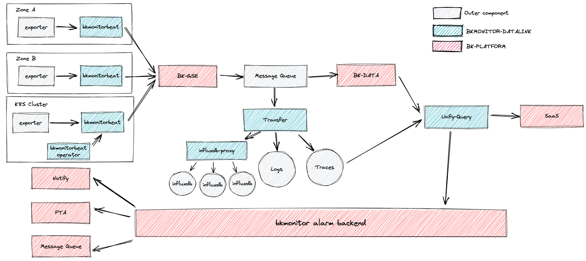

---
[](./LICENSE.txt)
[]()
[](https://github.com/TencentBlueKing/bkmonitor-datalink/pulls)

# 可观测数据链路

数据链路为蓝鲸可观测平台提供通用统一的数据采集、转换和存查能力。


## 总览
 - 设计理念：

    数据链路为蓝鲸可观测平台底层模块，提供通用统一的数据采集、转换和存查能力。 
    同时，链路中各个模块通过配置发布、消息队列等中间件实现解耦且兼容各个领域中的社区标准协议，以期各个模块都可以按需插拔使用

 - 代码目录：

 ```
 .
├── docs // 文档内容
└── pkg // 代码模块
    ├── transfer // 数据转换模块
    ├── influxdb-proxy // influxdb高可用模块
    ├── unify-query // 统一查询模块
    ├── bk-monitor-worker // 任务管理模块
    ├── ingester // 第三方告警事件接收模块
    ├── bkmonitorbeat // 通用指标及事件采集器
    ├── bkmonitor-operator // k8s采集任务调度器
    ├── libgse // GSE管道封装SDK
    └── kits // 公共方法SDK
```

 - 架构简图：


## 功能
| 模块                 | 用途                            |   
|--------------------|-------------------------------|
| bkmonitorbeat      | 通用采集器，负责指标数据及主机事件采集           |
| bkmonitor-operator | 用于k8s集群中，负责监控采集任务调度           |
| transfer           | 数据转化模块，负责数据格式转换并投递至各存储模块      |
| influxdb-proxy     | 基于OSS influxdb实现的influxdb高可用模块 |
| unify-query        | 统一查询模块，实现基于influxdb的promQL查询能力 |

## 社区支持
- [wiki链接](https://bk.tencent.com/docs/document/7.0/248/40001)
- [白皮书](https://bk.tencent.com/docs/document/7.0/248/40001)
- [蓝鲸论坛](https://bk.tencent.com/s-mart/communities)
- [蓝鲸 DevOps 在线视频教程](https://bk.tencent.com/s-mart/community/question/9066)
- 蓝鲸社区QQ群: 495299374

## 蓝鲸社区
- [BK-CI](https://github.com/Tencent/bk-ci)：蓝鲸持续集成平台是一个开源的持续集成和持续交付系统，可以轻松将你的研发流程呈现到你面前。
- [BK-BCS](https://github.com/Tencent/bk-bcs)：蓝鲸容器管理平台是以容器技术为基础，为微服务业务提供编排管理的基础服务平台。
- [BK-CMDB](https://github.com/Tencent/bk-cmdb)：蓝鲸配置平台（蓝鲸CMDB）是一个面向资产及应用的企业级配置管理平台。
- [BK-PaaS](https://github.com/Tencent/bk-PaaS)：蓝鲸PaaS平台是一个开放式的开发平台，让开发者可以方便快捷地创建、开发、部署和管理SaaS应用。
- [BK-SOPS](https://github.com/Tencent/bk-sops)：标准运维（SOPS）是通过可视化的图形界面进行任务流程编排和执行的系统，是蓝鲸体系中一款轻量级的调度编排类SaaS产品。

## 代码共建
如果你有好的意见或建议，欢迎给我们提 Issues 或 Pull Requests，为蓝鲸开源社区贡献力量。关于 bk-base 分支管理、Issue 以及 PR 规范，
请阅读 [Contributing Guide](docs/guides/contributing.md)。

[腾讯开源激励计划](https://opensource.tencent.com/contribution) 鼓励开发者的参与和贡献，期待你的加入。

## License
BKMONITOR-DATALINK 是基于 MIT 协议， 详细请参考 [LICENSE](./LICENSE.txt)
