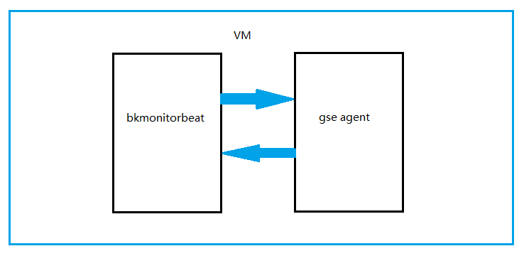
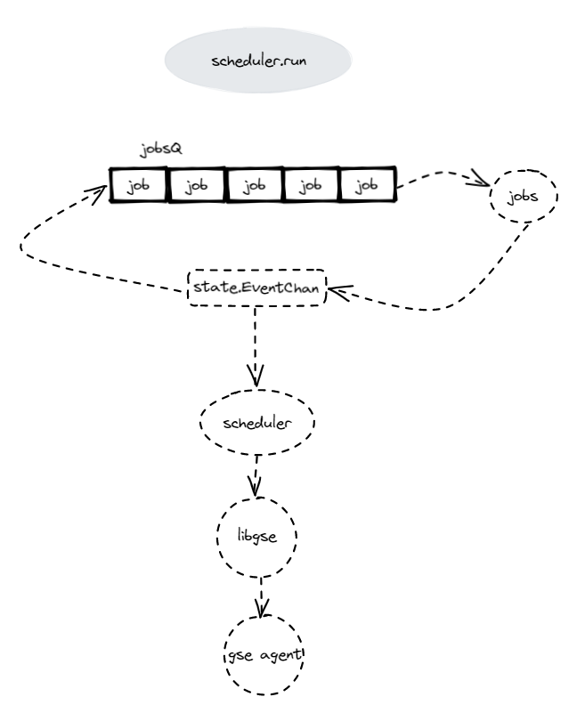

# bkmonitorbeat

> bkmonitorbeat 是蓝鲸监控的底层采集器组件
### 通信方式
bkmonitorbeat 直接与gse agent 采用 domain socket方式进行通信。


### 采集任务

* basereport: 主机基础数据采集，cpu / 内存 / 磁盘等数据。
* exceptionbeat: 异常事件采集，如 corefile / OOM / 磁盘只读 / 磁盘空间不足。
* http: HTTP 请求结果采集，status code 。
* keyword: 日志关键字采集。
* kubeevent: 容器事件数据采集。
* metricbeat: 兼容 Prometheus 上报采集。
* ping: ICMP PING 指标采集。
* procconf: 通过 CMDB hostid 文件同步进程采集配置任务。
* proccustom: 自定义进程采集任务。
* processbeat: 进程信息采集。
* procsync: 同步进程配置到子配置目录下。
* script: 采集脚本执行结果，并解析成 Prometheus 格式的指标。
* static: 主机静态数据采集。
* tcp: TCP 探测采集。
* trap: 网络设备探测采集。
* udp: UDP 探测采集。

### 采集配置

采集任务依靠节点管理下发，其中的配置文件需要经过模板渲染，模板样例位于 [./support-files/templates] 文件夹。

### 组织目录

* beater: 负责配置和任务的生成。
* configs: 配置相关。
* define: 定义的模型。
* docs: 文档相关。
* http: 拉取 prometheus 指标数据的 http 服务端
* metrics: 初始化每个任务的普罗指标参数
* report: 通过命令行上报数据。
* scheduler: 调度器，目前有 checker / cron / keyword / listen 多种。
* script: 工具脚本。
* support-files: 模板文件，包括主模板和子模板。
* tasks: 采集任务，上述介绍的采集内容。
* template: 模板示例文件。
* test: 测试相关。
* utils: 工具类。

### 构建

```shell
GO111MODULE=on GOOS=${your_os} go build -o bkmonitorbeat -tags "basetask basescheduler bkmonitorbeat"
```

### 调度原理


启动调度器，主线程消费任务时间 channel ，监听到事件发送到 libgse ，再通过 libgse domain socket 上报 gse agent ：
```go
func (bt *MonitorBeater) Run() error {
  
...
	err = bt.Scheduler.Start
	}(bt.ctx)
	if err != nil {
		return err
	}
...

loop:
	for bt.status == define.BeaterStatusRunning {
		...
		case event := <-bt.EventChan:
			bt.PublishEvent(event)
			logger.Debugf("beater publish event: %v", event)
		...
		}
	}
```
调度器将任务组入队列：
```go
func (s *Daemon) Start(ctx context.Context) error {
...
	s.jobs.Push(jobs...)
...
}
```

定时处理任务，从队列 jobsQ 获取定时任务，遍历 jobs ，将处理后的 job 写入 channel ，本次任务组处理完成，更新每个任务的时间，重新入队列等待下次定时任务。
```go
func (s *Daemon) run(ctx context.Context) {
	...
loop:
	for s.Status == define.SchedulerRunning {
		ticker := s.ticker
		logger.Debug("waiting jobs")
		select {
		case <-ctx.Done():
			...
		case now, ok := <-ticker.C:
			...
			jobsQ := state.jobs
			state.jobAtomic.Run(func() {
				jobs := jobsQ.PopUntil(now)
				jobLen := len(jobs)
				if jobLen <= 0 {
					return
				}
				logger.Infof("scheduler ready to run %v jobs", jobLen)
				for _, job := range jobs {
					go func(job Job) {
						task := job.GetTask()
						taskID := task.GetTaskID()
						defer utils.RecoverFor(func(err error) {
							logger.Errorf("run task %v panic: %v", taskID, err)
						})
						logger.Debugf("scheduler running job: %v", taskID)
						taskLabels := metrics.GetTaskLabels(task)
						gm.TaskRunTotal.With(taskLabels).Inc()
						startTime := time.Now()
						job.Run(state.EventChan)
						gm.TaskRunSeconds.With(taskLabels).Observe(utils.GetDurationSecondsSince(startTime))
					}(job)
				}
				for _, job := range jobs {
					// 计算任务的下一次执行时间
					job.Next()
				}
				jobsQ.Push(jobs...)
			})
		}
	}

	logger.Infof("scheduler stop with status: %v", s.Status)
	s.waitgroup.Done()
}
```

## Contributing

我们诚挚地邀请你参与共建蓝鲸开源社区，通过提 bug、提特性需求以及贡献代码等方式，一起让蓝鲸开源社区变得更好。


## License

基于 MIT 协议，详细请参考 [LICENSE](./LICENSE)
