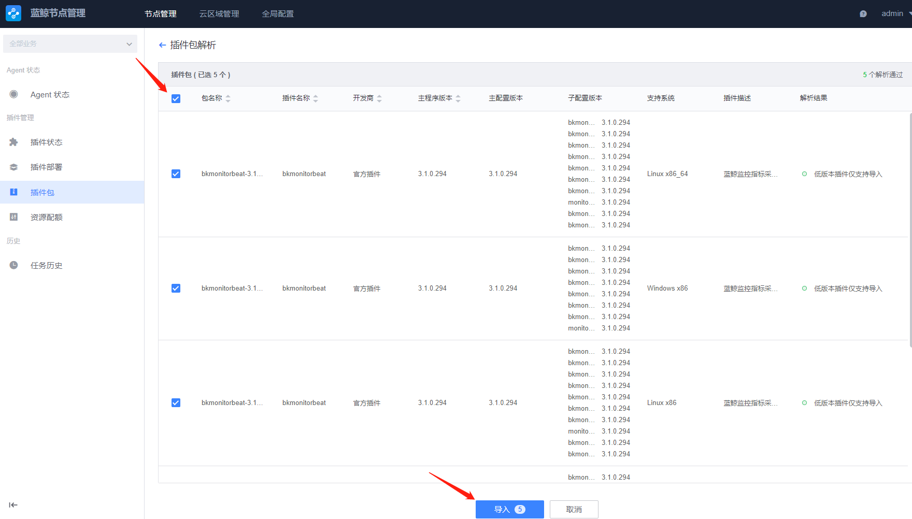
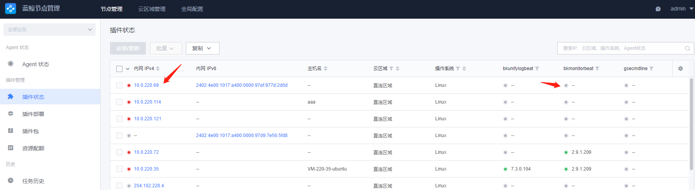
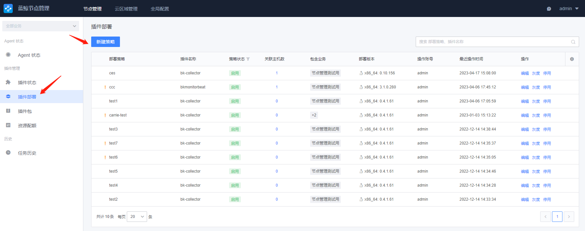
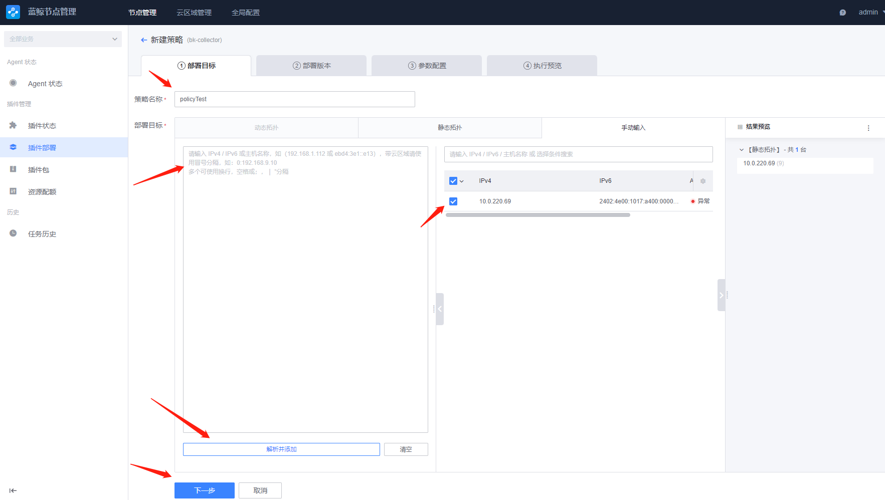
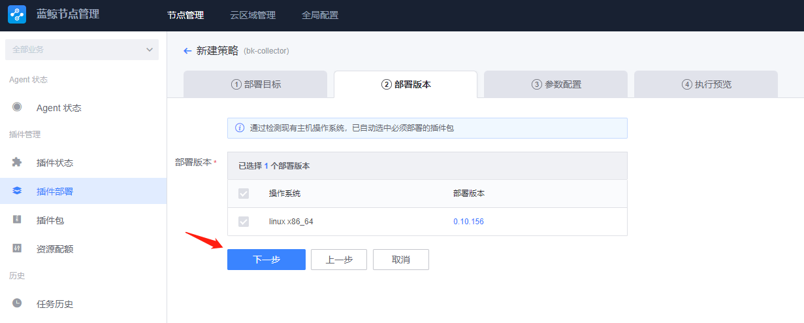
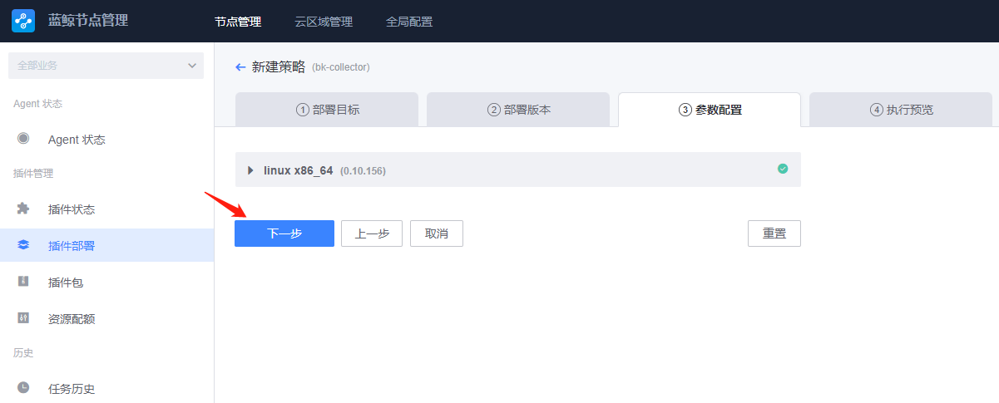
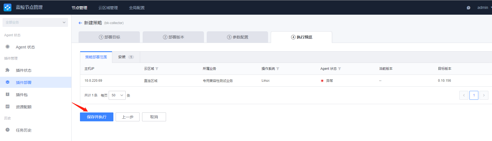

# 采集器主配置说明

## 配置样例

```yaml
# ================================ Outputs =====================================
output.bkpipe:
  synccfg: true
  endpoint: '/var/run/ipc.state.report'
  # 地址分配方式，static：静态 dynamic：动态
  bk_addressing: static
  hostip: 0.0.0.0
  cloudid: 0
  hostid: 3

path.logs: '/var/log/gse'
path.data: '/var/lib/gse'
path.pid: '/var/run/gse'
seccomp.enabled: false


# ================================ Logging ======================================
# Available log levels are: critical, error, warning, info, debug
logging.level: debug
logging.path: '/var/log/gse'
logging.maxsize: 200
logging.maxage: 10
logging.backups: 5


# ============================= Resource ==================================
resource_limit:
  enabled: true
  cpu: 1    # CPU 资源限制 单位 core(float64)
  mem: -1 # 内存资源限制 单位 MB(int)，-1 代表无限制

# ================================= Tasks =======================================
bkmonitorbeat:
  node_id: 0
  ip: 127.0.0.1
  bk_cloud_id: 0
  # 主机CMDB信息hostid文件路径
  host_id_path: /var/lib/gse/host/hostid
  # 子任务目录
  include: '/usr/local/gse/plugins/etc/bkmonitorbeat'
  # 当前节点所属业务
  bk_biz_id: 1
  # stop/reload旧任务清理超时
  clean_up_timeout: 1s
  # 事件管道缓冲大小
  event_buffer_size: 10
  # 启动模式：daemon（正常模式）,check（执行一次，测试用）
  mode: daemon
  disable_netlink: false
  metrics_batch_size: 1024
  # 管理服务，包含指标和调试接口, 可动态reload开关或变更监听地址（unix使用SIGUSR2,windows发送bkreload2）
  # admin_addr: localhost:56060
  # ================================ BK Metrics Pusher =================================================
  bk_metrics_pusher:
    disabled: false
    dataid: 1100014
    period: 60s
    batch_size: 1024
    labels: []
    metric_relabel_configs:
      - source_labels:
          - __name__
        regex: ^(go_|process_|bkmonitorbeat_global_|bkmonitorbeat_metricbeat_metrics_sent_total|bkmonitorbeat_metricbeat_process_duration_seconds).*
        action: keep

  # 心跳采集配置
  heart_beat:
    global_dataid: 1100001
    child_dataid: 1100002
    period: 60s
    publish_immediately: true

  # 静态资源采集配置
  static_task:
    dataid: 1100010
    tasks:
    - task_id: 100
      period: 1m
      check_period: 1m
      report_period: 6h

  # 主机性能数据采集
  basereport_task:
    task_id: 101
    dataid: 1001
    period: 1m
    cpu:
      stat_times: 4
      info_period: 1m
      info_timeout: 30s
    disk:
      stat_times: 1
      mountpoint_black_list: ["docker","container","k8s","kubelet"]
      fs_type_white_list: ["overlay","btrfs","ext2","ext3","ext4","reiser","xfs","ffs","ufs","jfs","jfs2","vxfs","hfs","apfs","refs","ntfs","fat32","zfs"]
      collect_all_device: true
    mem:
      info_times: 1
    net:
      stat_times: 4
      revert_protect_number: 100
      skip_virtual_interface: false
      interface_black_list: ["veth", "cni", "docker", "flannel", "tunnat", "cbr", "kube-ipvs", "dummy"]
      force_report_list: ["bond"]

  # 主机异常事件采集（磁盘满、磁盘只读、Corefile 事件以及 OOM 事件）
  exceptionbeat_task:
    task_id: 102
    dataid: 1000
    period: 1m
    check_bit: "C_DISK_SPACE|C_DISKRO|C_CORE|C_OOM"
    check_disk_ro_interval: 60
    check_disk_space_interval: 60
    check_oom_interval: 10
    used_max_disk_space_percent: 95

  # 进程采集：同步 CMDB 进程配置文件到 bkmonitorbeat 子任务文件夹下
  procconf_task:
    task_id: 103
    period: 1m
    perfdataid: 1007
    portdataid: 1013
    converge_pid: true
    disable_netlink: false
    hostfilepath: /var/lib/gse/host/hostid
    dst_dir: '/usr/local/gse/plugins/etc/bkmonitorbeat'

  # 进程状态
  procstatus_task:
    dataid: 0
    task_id: 105
    period: 1m
    # 上报周期
    report_period: 24h
```
## 配置说明

output.bkpipe:

| 配置项           | 类型     | 必须  | 说明                                                             |
|---------------|--------|-----|----------------------------------------------------------------|
| endpoint      | string | 是   | 连接gse agent的domain socket 文件 ， 默认： '/var/run/ipc.state.report' |
| bk_addressing | string | 是   | 地址分配方式，static：静态 dynamic：动态    默认： static                      |
| hostip        | string | 是   | 节点ip                                                           |
| cloudid       | int    | 是   | 云区域id        默认： 0                                             |
| hostid        | int    | 是   | 节点id          默认： 1                                            |


| 配置项               | 类型     | 必须  | 说明                       |
|-------------------|--------|-----|--------------------------|
| path.logs         | string | 是   | 日志路径，默认 '/var/log/gse'   |
| path.data         | string | 是   | db数据路径，默认 '/var/lib/gse' |
| path.pid          | int    | 是   | pid文件路径，  '/var/run/gse' |
| seccomp.enabled   | bool   | 是   | 默认false                  |

Logging：

| 配置项       | 类型       | 必须   | 说明                                                                                         |
|-----------|----------|------|--------------------------------------------------------------------------------------------|
| level     | string   | 是    | 日志级别 error, warning, info, debug      默认：error                                             |
| path      | string   | 是    | 日志路径       默认'/var/log/gse'                                                                |
| maxsize   | int      | 是    | 单个日志文件最大长度 默认200 单位M                                                                       |
| maxage    | int      | 是    | 根据文件名中编码的时间戳保留旧日志文件的最大天数。请注意，一天被定义为24小时，由于夏令时、闰秒等原因，可能与日历天不完全对应。默认情况下，不会根据年龄删除旧的日志文件。 默认10 |
| backups   | int      | 是    | 要保留的旧日志文件的最大数量 默认5                                                                         |

resource_limit:

| 配置项        | 类型       | 必须    | 说明                                         |
|------------|----------|-------|--------------------------------------------|
| enabled    | bool     | 是     | 资源限制开关 默认 true                             |
| cpu        | int      | 是     | CPU 资源限制 单位 core(float64)                  |
| mem        | int      | 是     | 内存资源限制 单位 MB(int)，-1 代表无限制                 |

bkmonitorbeat:

| 配置项                 | 类型       | 必须        | 说明                                                                                         |
|---------------------|----------|-----------|--------------------------------------------------------------------------------------------|
| node_id             | int      | 是         | 本节点id                                                                                      |
| ip                  | string   | 是         | 本节点ip 默认：127.0.0.1                                                                         |
| bk_cloud_id         | int      | 是         | 云区域id 默认：0                                                                                 |
| host_id_path        | string   | 是         | 主机CMDB信息hostid文件路径 默认：/var/lib/gse/host/hostid                                             |
| include             | string   | 是         | 子任务目录        默认：'/usr/local/gse/plugins/etc/bkmonitorbeat'                                 |
| bk_biz_id           | int      | 是         | 当前节点所属业务      默认：   1                                                                      |
| clean_up_timeout    | string   | 是         | stop/reload旧任务清理超时  默认：  1s                                                                |
| event_buffer_size   | int      | 是         | 事件管道缓冲大小  默认：  10                                                                          |
| mode                | string   | 是         | 启动模式：daemon（正常模式）,check（执行一次，测试用）  默认：daemon                                               |
| disable_netlink     | bool     | 是         | unix端口数据是否使用netlink方式获取 默认： true                                                           |
| metrics_batch_size  | int      | 是         | 普罗米修斯指标数据分片长度  默认： 512                                                                     |
| admin_addr          | string   | 是         | 管理服务，包含指标和调试接口, 可动态reload开关或变更监听地址（unix使用SIGUSR2,windows发送bkreload2）  默认：localhost:56060   |

heart_beat:

| 配置项                    | 类型       | 必须  | 说明                       |
|------------------------|----------|-----|--------------------------|
| global_dataid          | int      | 是   | 心跳全局dataid 默认： 1100001   |
| child_dataid           | int      | 是   | 心跳子dataid 默认：  1100002   |
| period                 | string   | 是   | 心跳频率 默认：60s              |
| publish_immediately    | bool     | 是   | 调度启动后是否立即发送心跳 默认：true    |

static_task:

| 配置项               | 类型      | 必须    | 说明                |
|-------------------|---------|-------|-------------------|
| dataid            | string  | 是     | 上报数据id 默认：1100010 |
| tasks:            |         | 是     | 任务列表              |
| task_id           | int     | 是     | 任务id 默认：100       |
| period            | int     | 是     | 采集频率 默认：1m        |
| check_period      | int     | 是     | 检查频率  默认：1m       |
| report_period     | string  | 是     | 上报频率 默认6h         |

basereport_task:

| 配置项                    | 类型            | 必须      | 说明                                                                                                                                               |
|------------------------|---------------|---------|--------------------------------------------------------------------------------------------------------------------------------------------------|
| task_id                | int           | 是       | 任务id 默认：101                                                                                                                                      |
| dataid                 | int           | 是       | 上报数据id 默认：1001                                                                                                                                   |
| period                 | string        | 是       | 采集频率 默认：1m                                                                                                                                       |
| cpu:                   |               | 是       | cpu指标                                                                                                                                            |
| stat_times             | int           | 是       | 用于计算每次调用的时间间隔，公式为：period/stat_times 默认：4                                                                                                         |
| info_period            | string        | 是       | 未使用                                                                                                                                              |
| info_timeout           | string        | 是       | 未使用                                                                                                                                              |
| disk:                  |               | 是       | 磁盘指标                                                                                                                                             |
| stat_times             | int           | 是       | 用于计算每次调用的时间间隔，公式为：period/stat_times 默认：1                                                                                                         |
| mountpoint_black_list  | string        | 是       | 挂载点过期黑名单正则匹配串 默认：["docker","container","k8s","kubelet"]                                                                                          |
| fs_type_white_list     | string        | 是       | fs过期白名单正则匹配串 默认：["overlay","btrfs","ext2","ext3","ext4","reiser","xfs","ffs","ufs","jfs","jfs2","vxfs","hfs","apfs","refs","ntfs","fat32","zfs"] |
| collect_all_device     | bool          | 是       | 是否采集所有 默认true                                                                                                                                    |
| mem:                   |               | 是       | 内存指标                                                                                                                                             |
| info_times             | int           | 是       | 用于计算每次调用的时间间隔，公式为：period/stat_times 默认：1                                                                                                         |
| net:                   |               | 是       | 网络指标                                                                                                                                             |
| stat_times             | int           | 是       | 用于计算每次调用的时间间隔，公式为：period/stat_times 默认：4                                                                                                         |
| skip_virtual_interface | bool          | 是       | 是否初始化虚拟网卡列表，用于后面过滤 默认：false                                                                                                                      |
| interface_black_list   | string        | 是       | 过滤网卡黑名单 默认： ["veth", "cni", "docker", "flannel", "tunnat", "cbr", "kube-ipvs", "dummy"]                                                          |
| force_report_list      | string        | 是       | 强制上报网卡列表    默认： ["bond"]                                                                                                                         |

## 系统异常事件采集数据格式

exceptionbeat_task:

| 配置项                           | 类型     | 必须   | 说明                                                                                                                                                                                                                                                                                |
|-------------------------------|--------|------|-----------------------------------------------------------------------------------------------------------------------------------------------------------------------------------------------------------------------------------------------------------------------------------|
| data_id                       | int    | 否    | 上报数据id，默认值-1，表示数据将在gse_data丢弃                                                                                                                                                                                                                                                     |
| check_bit                     | string | 否    | 异常检测标志，控制上报的异常事件类型，默认值为空。支持的异常检测标志包括：C_DISKRO、C_DISK_SPACE和C_CORE、C_OOM。其中：<br>C_DISKRO表示磁盘只读异常检测，<br>C_DISK_SPACE表示磁盘空间不足异常检测，<br>C_CORE表示core文件检测，<br>C_OOM表示内存溢出异常采集。<br>需要配置多种异常检测时，检测标志以'&#x7C;'分隔，如"C_DISKRO&#x7C;C_DISK_SPACE&#x7C;C_CORE"`表示同时支持磁盘只读、磁盘空间不足和core文件3种异常检测。 |
| check_disk_ro_interval        | int    | 否    | 磁盘只读检测周期，单位为秒，默认值3600                                                                                                                                                                                                                                                             |
| check_disk_space_interval     | int    | 否    | 磁盘空间不足检测周期，单位为秒, 默认值3600                                                                                                                                                                                                                                                          |
| check_oom_interval            | int    | 否    | 内存溢出检测周期，单位为秒, 默认值3600                                                                                                                                                                                                                                                            |
| used_max_disk_space_percent   | int    | 否    | 磁盘空间使用率阈值，百分比，默认值90，即当磁盘空间使用率达90%时，上报磁盘空间不足异常事件                                                                                                                                                                                                                                   |


## 异常事件类型

- [磁盘只读](#磁盘只读)
- [磁盘空间不足](#磁盘空间不足)
- [core文件](#core文件)
- [OOM事件](#OOM事件)
- [异常事件附加信息](#异常事件附加信息)

## 异常事件数据格式

### 磁盘只读

#### 数据样例

```json
{
  "isdst": 0,
  "server": "127.0.0.1",
  "time": "2018-08-02 15:08:09",
  "timezone": 8,
  "utctime": "2018-08-02 15:08:09",
  "utctime2": "2018-08-02 07:08:09",
  "value": [
    {
      "event_desc": "",
      "event_raw_id": 886,
      "event_source_system": "",
      "event_time": "2018-08-02 15:08:09",
      "event_title": "",
      "event_type": "gse_basic_alarm_type",
      "extra": {
        "bizid": 0,
        "cloudid": 0,
        "host": "127.0.0.1",
        "ro": [
          {
            "fs": "tmpfs",
            "positoin": "/sys/fs/cgroup",
            "type": "tmpfs"
          }
        ],
        "type": 3
      }
    }
  ]
}
```

#### 数据格式说明

| 字段 | 类型 | 说明 |
|--- | --- |---|
| isdst | int | 是否启用夏令时标志位，0为未启用夏令时，1为已启用夏令时。默认值为0 |
| server | string | 机器ip |
| time | string | 数据上报时间（本地时间），格式为`“yyyy-MM-dd hh:mm:ss”` |
| timezone | int | 时区 |
| utctime | string | 数据上报时间（本地时间），格式为`“yyyy-MM-dd hh:mm:ss”` |
| utctime2 | string | 数据上报时间（UTC时间），格式为`“yyyy-MM-dd hh:mm:ss”` |
| value | array | 系统异常事件对象数组，详见value定义 |

##### value

| 字段 | 类型 | 说明 |
|--- | --- |---|
| event_desc | string | 事件的描述，默认为空字符串 |
| event_raw_id | int | 异常事件id，递增值 |
| event_source_system | string | 事件来源系统，默认为空字符串 |
| event_time | string | 异常事件采集时间（本地时间），格式为`“yyyy-MM-dd hh:mm:ss”` |
| event_title | string | 事件的描述，默认为空字符串 |
| event_type | string | 默认为"gse_basic_alarm_type" |
| extra | dict | 系统异常事件额外信息，详见extra定义 |

##### extra

| 字段 | 类型 | 说明 |
|--- | --- |---|
| bizid| int | 开发商id |
| cloudid | int | 云区域id |
| host | string | 主机ip地址 |
| type | int | 系统异常事件类型：<br>3:磁盘只读，<br>6:磁盘空间不足，<br>7:core文件，<br>9:OOM事件  |
| ro | array | 磁盘只读信息对象数组，其中：<br>fs:磁盘名称，<br>position:磁盘挂载路径，<br>type:磁盘类型 |

### 磁盘空间不足

#### 数据样例

```json
{
  "isdst": 0,
  "server": "127.0.0.1",
  "time": "2018-08-31 20:01:19",
  "timezone": 8,
  "utctime": "2018-08-31 20:01:19",
  "utctime2": "2018-08-31 12:01:19",
  "value": [
    {
      "event_desc": "",
      "event_raw_id": 1,
      "event_source_system": "",
      "event_time": "2018-08-31 20:01:19",
      "event_title": "",
      "event_type": "gse_basic_alarm_type",
      "extra": {
        "avail": 12517412,
        "bizid": 0,
        "cloudid": 0,
        "disk": "/",
        "file_system": "/dev/sda1",
        "free": 64,
        "fstype": "ext4",
        "host": "127.0.0.1",
        "size": 20511312,
        "type": 6,
        "used": 6928940,
        "used_percent": 36
      }
    }
  ]
}
```

#### 数据格式说明

| 字段 | 类型 | 说明 |
|--- | --- |---|
| isdst | int | 是否启用夏令时标志位，0为未启用夏令时，1为已启用夏令时。默认值为0 |
| server | string | 机器ip |
| time | string | 数据上报时间（本地时间），格式为`“yyyy-MM-dd hh:mm:ss”` |
| timezone | int | 时区 |
| utctime | string | 数据上报时间（本地时间），格式为`“yyyy-MM-dd hh:mm:ss”` |
| utctime2 | string | 数据上报时间（UTC时间），格式为`“yyyy-MM-dd hh:mm:ss”` |
| value | array | 系统异常事件对象数组，详见value定义 |

##### value

| 字段 | 类型 | 说明 |
|--- | --- |---|
| event_desc | string | 事件的描述，默认为空字符串 |
| event_raw_id | int | 异常事件id，递增值 |
| event_source_system | string | 事件来源系统，默认为空字符串 |
| event_time | string | 异常事件采集时间（本地时间），格式为`“yyyy-MM-dd hh:mm:ss”` |
| event_title | string | 事件的描述，默认为空字符串 |
| event_type | string | 默认为"gse_basic_alarm_type" |
| extra | dict | 系统异常事件额外信息，详见extra定义 |

##### extra

| 字段 | 类型 | 说明 |
|--- | --- |---|
| bizid| int | 开发商id |
| cloudid | int | 云区域id |
| host | string | 主机ip地址 |
| type | int | 系统异常事件类型：<br>3:磁盘只读，<br>6:磁盘空间不足，<br>7:core文件，<br>9:OOM事件  |
| avail | int | 可用空间，单位kB |
| disk | string | 磁盘挂载的路径 |
| file_system | string | 文件系统 |
| free | int | 可用空间，百分比。例如，值为10时，表示磁盘可用空间占10% |
| fstype | string | 文件系统类型 |
| size | int | 磁盘大小，单位kB |
| used | int | 磁盘已使用空间大小，单位kB |
| used_percent | int | 磁盘已使用空间比率，百分比。例如，值为90时，表示磁盘已使用90% |

### core文件

#### 数据样例

```json
{
  "isdst": 0,
  "server": "127.0.0.1",
  "time": "2018-03-01 11:45:42",
  "timezone": 8,
  "utctime": "2018-03-01 11:45:42",
  "utctime2": "2018-03-01 03:45:42",
  "value": [
    {
      "event_desc": "",
      "event_raw_id": 11,
      "event_source_system": "",
      "event_time": "2018-03-01 11:45:42",
      "event_title": "",
      "event_type": "gse_basic_alarm_type",
      "extra": {
        "bizid": 0,
        "cloudid": 0,
        "corefile": "/data/corefile/core_101041_2018-03-10",
        "filesize": "0",
        "host": "127.0.0.1",
        "type": 7
      }
    }
  ]
}
```

#### 数据格式说明

| 字段 | 类型 | 说明 |
|--- | --- |---|
| isdst | int | 是否启用夏令时标志位，0为未启用夏令时，1为已启用夏令时。默认值为0 |
| server | string | 机器ip |
| time | string | 数据上报时间（本地时间），格式为`“yyyy-MM-dd hh:mm:ss”` |
| timezone | int | 时区 |
| utctime | string | 数据上报时间（本地时间），格式为`“yyyy-MM-dd hh:mm:ss”` |
| utctime2 | string | 数据上报时间（UTC时间），格式为`“yyyy-MM-dd hh:mm:ss”` |
| value | array | 系统异常事件对象数组，详见value定义 |

##### value

| 字段 | 类型 | 说明 |
|--- | --- |---|
| event_desc | string | 事件的描述，默认为空字符串 |
| event_raw_id | int | 异常事件id，递增值 |
| event_source_system | string | 事件来源系统，默认为空字符串 |
| event_time | string | 异常事件采集时间（本地时间），格式为`“yyyy-MM-dd hh:mm:ss”` |
| event_title | string | 事件的描述，默认为空字符串 |
| event_type | string | 默认为"gse_basic_alarm_type" |
| extra | dict | 系统异常事件额外信息，详见extra定义 |

##### extra

| 字段 | 类型 | 说明 |
|--- | --- |---|
| bizid| int | 开发商id |
| cloudid | int | 云区域id |
| host | string | 主机ip地址 |
| type | int | 系统异常事件类型：<br>3:磁盘只读，<br>6:磁盘空间不足，<br>7:core文件，<br>9:OOM事件  |
| corefile | string | 产生的core文件路径（绝对路径）。监控系统/proc/sys/kernel/core_pattern定义的core文件生成路径，一旦该目录下产生文件，则上报core文件异常事件 |
| filesize | string | 产生的core文件的大小，单位B |

### OOM事件

#### 数据样例

```json
{
  "isdst": 0,
  "server": "127.0.0.1",
  "time": "2018-03-01 11:45:42",
  "timezone": 8,
  "utctime": "2018-03-01 11:45:42",
  "utctime2": "2018-03-01 03:45:42",
  "value": [
    {
      "event_desc": "",
      "event_raw_id": 11,
      "event_source_system": "",
      "event_time": "2018-03-01 11:45:42",
      "event_title": "",
      "event_type": "gse_basic_alarm_type",
      "extra": {
        "bizid": 0,
        "cloudid": 0,
        "host": "127.0.0.1",
        "type": 9,
        "total": 3,
        "process": "oom/java/consul",
        "message": "total-vm:44687536kB, anon-rss:32520504kB, file-rss:0kB, shmem-rss:0kB"
      }
    }
  ]
}
```

#### 数据格式说明

| 字段 | 类型 | 说明 |
|--- | --- |---|
| isdst | int | 是否启用夏令时标志位，0为未启用夏令时，1为已启用夏令时。默认值为0 |
| server | string | 机器ip |
| time | string | 数据上报时间（本地时间），格式为`“yyyy-MM-dd hh:mm:ss”` |
| timezone | int | 时区 |
| utctime | string | 数据上报时间（本地时间），格式为`“yyyy-MM-dd hh:mm:ss”` |
| utctime2 | string | 数据上报时间（UTC时间），格式为`“yyyy-MM-dd hh:mm:ss”` |
| value | array | 系统异常事件对象数组，详见value定义 |

##### value

| 字段 | 类型 | 说明 |
|--- | --- |---|
| event_desc | string | 事件的描述，默认为空字符串 |
| event_raw_id | int | 异常事件id，递增值 |
| event_source_system | string | 事件来源系统，默认为空字符串 |
| event_time | string | 异常事件采集时间（本地时间），格式为`“yyyy-MM-dd hh:mm:ss”` |
| event_title | string | 事件的描述，默认为空字符串 |
| event_type | string | 默认为"gse_basic_alarm_type" |
| extra | dict | 系统异常事件额外信息，详见extra定义 |

##### extra

| 字段 | 类型 | 说明 |
|--- | --- |---|
| bizid| int | 开发商id |
| cloudid | int | 云区域id |
| host | string | 主机ip地址 |
| type | int | 系统异常事件类型：<br>3:磁盘只读，<br>6:磁盘空间不足，<br>7:core文件，<br>9:OOM事件 |
| total | string | 周期内发生OOM异常事件的总数 |
| process | string | 发生OOM异常的进程，使用/分隔 |
| message | string | OOM异常样例信息 |

### 异常事件附加信息

此处附加信息是采集器框架所用库携带上报的，没有被使用。

```json
{
  "agent": {
    "ephemeral_id": "05b033b6-3177-465e-902e-e225c078e0b2",
    "hostname": "VM_147_154_centos",
    "id": "199f1f66-317f-4059-b967-755a518f9c0c",
    "type": "exceptionbeat",
    "version": "V1.0.0"
  },
  "ecs": {
    "version": "1.0.0"
  }
}
```

| 字段 | 类型 | 说明 |
|--- | --- |---|
| agent.ephemeral_id | string | 采集器实例的唯一识别码                               |
| agent.hostname     | string | 主机名                                             |
| agent.id           | string | 存放采集器运行环境的唯一识别码，对应采集器运行的机器 |
| agent.type         | string | 采集器的名称                                         |
| agent.version      | string | 采集器的版本                                         |
| ecs.version        | string | elastic的字段规范版本                                |


procconf_task:

| 配置项          | 类型       | 必须    | 说明                                                               |
|--------------|----------|-------|------------------------------------------------------------------|
| task_id      | int      | 是     | 任务id 默认：103                                                      |
| period       | string   | 是     | 同步时间周期 默认1m                                                      |
| perfdataid   | int      | 是     | 性能指标数据id 默认：1007                                                 |
| portdataid   | int      | 是     | 端口数据id 默认：1013                                                   |
| converge_pid | bool     | 是     | 是否采集pid信息 默认：true                                                |
| hostfilepath | string   | 是     | hostid路径 默认：/var/lib/gse/host/hostid                             |
| dst_dir      | string   | 是     | 同步 CMDB 进程配置文件的路径 默认： '/usr/local/gse/plugins/etc/bkmonitorbeat' |

procstatus_task:

| 配置项           | 类型     | 必须  | 说明            |
|---------------|--------|-----|---------------|
| dataid        | string | 是   | 上报数据id 默认：0   |
| task_id       | string | 是   | 任务id 默认：105   |
| period        | int    | 是   | 采集周期 默认：1m    |
| report_period | int    | 是   | 上报周期 默认：24h   |


# 采集器子配置说明

## 配置样例

### http拨测任务

```yaml
type: http
name: http_task
version: 1.1.1

dataid: 1011
max_buffer_size: 10240
max_timeout: 15000ms
min_period: 3s
tasks: 
  - task_id: 10001
    bk_biz_id: 2
    period: 1m
    target_ip_type: 0
    dns_check_mode: single
    available_duration: 3000ms
    insecure_skip_verify: true
    disable_keep_alives: false
    timeout: 15000ms
    steps: 
      - url: https://www.baidu.com
        url_list: 
        method: GET
        headers: 
        available_duration: 3000ms
        request: 
        request_format: raw
        response: 
        response_format: nin
        response_code: 
```

| 配置项                         | 类型         | 必须    | 说明                                                                                   |
|-----------------------------|------------|-------|--------------------------------------------------------------------------------------|
| type                        | string     | 是     | 拨测类型 默认：http                                                                         |
| name                        | string     | 是     | 任务名称 默认： http_task                                                                   |
| version                     | int        | 是     | 版本号 默认： 1.1.1                                                                        |
| dataid                      | int        | 是     | 上报数据id 默认： 1011                                                                      |
| max_buffer_size             | int        | 是     | 缓冲区最大空间 默认： 10240                                                                    |
| max_timeout                 | string     | 是     | 最大超时时间 默认： 15000ms                                                                   |
| min_period                  | string     | 是     | 最小拨测周期 默认： 3s                                                                        |
| tasks:                      |            | 是     | 任务列表                                                                                 |
| task_id                     | int        | 是     | 任务id 默认： 10001                                                                       |
| bk_biz_id                   | int        | 是     | 当前节点所属业务 默认： 2                                                                       |
| period                      | string     | 是     | 拨测周期 默认： 1m                                                                          |
| target_ip_type              | int        | 是     | 目标ip类型 0-auto 4-ipv4 6-ipv6 默认： 0                                                    |
| dns_check_mode              | string     | 是     | dns解析模式 ： all-表示拨测所有ip， single-表示随机拨测1个ip 默认： single                                 |
| available_duration          | string     | 是     | 允许延迟时间 默认：3000ms                                                                     |
| insecure_skip_verify        | string     | 是     | 是否跳过https证书检查 默认： true                                                               |
| timeout                     | string     | 是     | 检测超时（connect+read总共时间） 默认： 15000ms                                                   |
| steps:                      |            | 是     | 采集步骤                                                                                 |
| url                         | string     | 是     | 要拨测的url 默认： https://www.baidu.com                                                    |
| url_list                    | string     | 是     | 要拨测的url列表  如 <br/>- http://www.qq.com  <br/>- http://ipv6-only.bktencent.com 默认： nil |
| method                      | string     | 是     | 请求方式 默认： GET                                                                         |
| headers                     | string     | 否     | 请求头 默认： nil                                                                          |
| available_duration          | string     | 是     | 允许延迟时间 默认：3000ms                                                                     |
| request                     | string     | 否     | 请求内容 默认： nil                                                                         |
| request_format              | string     | 是     | 请求格式（raw/hex） 默认： raw                                                                |
| response                    | string     | 否     | 应答内容 默认： nil                                                                         |
| response_format             | string     | 是     | 内容匹配方式 默认： nin                                                                       |
| response_code               | string     | 否     | 错误码 默认： nil                                                                          |

### tcp拨测任务

```yaml
type: tcp
name: tcp_task
version: 1.1.1
dataid: 1009
max_buffer_size: 10240
max_timeout: 15000ms
min_period: 3s
tasks:
  - task_id: 10002
    bk_biz_id: 2
    period: 5s
    timeout: 15000ms
    target_ip_type: 0
    dns_check_mode: all
    target_host: www.qq.com
    target_host_list:
      - www.qq.com
      - ipv6-only.bktencent.com
    target_port: 80
    available_duration: 3000ms
    request:
    request_format: raw
    response:
    response_format: nin
```

| 配置项                 | 类型     | 必须     | 说明                                                                      |
|---------------------|--------|--------|-------------------------------------------------------------------------|
| type                | string | 是      | 拨测类型 默认：tcp                                                             |
| name                | string | 是      | 任务名称 默认： tcp_task                                                       |
| version             | int    | 是      | 版本号 默认： 1.1.1                                                           |
| dataid              | int    | 是      | 上报数据id 默认： 1009                                                         |
| max_buffer_size     | int    | 是      | 缓冲区最大空间 默认： 10240                                                       |
| max_timeout         | string | 是      | 最大超时时间 默认： 15000ms                                                      |
| min_period          | string | 是      | 最小拨测周期 默认： 3s                                                           |
| tasks:              |        | 是      | 任务列表                                                                    |
| task_id             | int    | 是      | 任务id 默认： 10002                                                          |
| bk_biz_id           | int    | 是      | 当前节点所属业务 默认： 2                                                          |
| period              | string | 是      | 拨测周期 默认： 1m                                                             |
| timeout             | string | 是      | 检测超时（connect+read总共时间） 默认： 15000ms                                      |            |       |                                                            |
| target_ip_type      | int    | 是      | 目标ip类型 0-auto 4-ipv4 6-ipv6 默认： 0                                       |
| dns_check_mode      | string | 是      | dns解析模式 ： all-表示拨测所有ip， single-表示随机拨测1个ip 默认： single                    |
| target_host         | string | 是      | 要拨测的url 默认： https://www.baidu.com                                       |
| target_host_list    | string | 是      | 要拨测的url列表 如：<br/>- www.qq.com<br/>- ipv6-only.bktencent.com<br/>默认： nil |
| target_port         | int    | 是      | 端口号 默认80                                                                |
| available_duration  | string | 是      | 允许延迟时间 默认：3000ms                                                        |
| request             | string | 否      | 请求内容 默认： nil                                                            |
| request_format      | string | 是      | 请求格式（raw/hex） 默认： raw                                                   |
| response            | string | 否      | 应答内容 默认： nil                                                            |
| response_format     | string | 是      | 内容匹配方式 默认： nin                                                          |

### udp拨测任务

```yaml
type: udp
name: udp_task
version: 1.1.1
dataid: 1010
max_buffer_size: 10240
max_timeout: 15000ms
min_period: 3s
tasks:
  - task_id: 10003
    bk_biz_id: 2
    times: 3
    period: 5s
    timeout: 15000ms
    target_ip_type: 0
    dns_check_mode: all
    target_host: www.qq.com
    target_host_list:
      - www.qq.com
      - ipv6-only.bktencent.com
    target_port: 53
    available_duration: 3000ms
    request:
    request_format: hex
    response:
    response_format: hex|nin
    wait_empty_response: true
```

| 配置项                                    | 类型      | 必须    | 说明                                                                      |
|----------------------------------------|---------|-------|-------------------------------------------------------------------------|
| type                                   | string  | 是     | 拨测类型 默认：udp                                                             |
| name                                   | string  | 是     | 任务名称 默认： udp_task                                                       |
| version                                | int     | 是     | 版本号 默认： 1.1.1                                                           |
| dataid                                 | int     | 是     | 上报数据id 默认： 1010                                                         |
| max_buffer_size                        | int     | 是     | 缓冲区最大空间 默认： 10240                                                       |
| max_timeout                            | string  | 是     | 最大超时时间 默认： 15000ms                                                      |
| min_period                             | string  | 是     | 最小拨测周期 默认： 3s                                                           |
| tasks:                                 |         | 是     | 任务列表                                                                    |
| task_id                                | int     | 是     | 任务id 默认： 10003                                                          |
| bk_biz_id                              | int     | 是     | 当前节点所属业务 默认： 2                                                          |
| period                                 | string  | 是     | 拨测周期 默认： 1m                                                             |
| timeout                                | string  | 是     | 检测超时（connect+read总共时间） 默认： 15000ms                                      |            |       |                                                            |
| target_ip_type                         | int     | 是     | 目标ip类型 0-auto 4-ipv4 6-ipv6 默认： 0                                       |
| dns_check_mode                         | string  | 是     | dns解析模式 ： all-表示拨测所有ip， single-表示随机拨测1个ip 默认： single                    |
| target_host                            | string  | 是     | 要拨测的url 默认： https://www.baidu.com                                       |
| target_host_list                       | string  | 是     | 要拨测的url列表 如：<br/>- www.qq.com<br/>- ipv6-only.bktencent.com<br/>默认： nil |
| target_port                            | int     | 是     | 端口号 默认80                                                                |
| available_duration                     | string  | 是     | 允许延迟时间 默认：3000ms                                                        |
| request                                | string  | 否     | 请求内容 默认： nil                                                            |
| request_format                         | string  | 是     | 请求格式（raw/hex） 默认： hex                                                   |
| response                               | string  | 否     | 应答内容 默认： nil                                                            |
| response_format                        | string  | 是     | 内容匹配方式 默认： hex                                                          |nin                                                           |

### icmp拨测任务

```yaml
type: ping
name: icmp_task
version: 1.1.1
dataid: 1100003
max_buffer_size: 10240
max_timeout: 15000ms
min_period: 3s
tasks:
  - task_id: 10004
    bk_biz_id: 2
    period: 10s
    timeout: 15000ms
    max_rtt: 3000ms
    total_num: 3
    ping_size: 68
    target_ip_type: 0
    dns_check_mode: all
    targets:
        - target: ipv6-only.bktencent.com
          target_type: domain
        - target: www.qq.com
          target_type: domain
```

| 配置项                 | 类型         | 必须    | 说明                                                   |
|---------------------|------------|-------|------------------------------------------------------|
| type                | string     | 是     | 拨测类型 默认：ping                                         |
| name                | string     | 是     | 任务名称 默认： icmp_task                                   |
| version             | int        | 是     | 版本号 默认： 1.1.1                                        |
| dataid              | int        | 是     | 上报数据id 默认： 1100003                                   |
| max_buffer_size     | int        | 是     | 缓冲区最大空间 默认： 10240                                    |
| max_timeout         | string     | 是     | 最大超时时间 默认： 15000ms                                   |
| min_period          | string     | 是     | 最小拨测周期 默认： 3s                                        |
| tasks:              |            | 是     | 任务列表                                                 |
| task_id             | int        | 是     | 任务id 默认： 10004                                       |
| bk_biz_id           | int        | 是     | 当前节点所属业务 默认： 2                                       |
| period              | string     | 是     | 拨测周期 默认： 1m                                          |
| timeout             | string     | 是     | 检测超时（connect+read总共时间） 默认： 15000ms                   |            |       |                                                            |
| max_rtt             | string     | 是     | 最大往返时间 默认：3000ms                                     |
| total_num           | int        | 是     |                                                      |
| ping_size           | int        | 是     |                                                      |
| target_ip_type      | int        | 是     | 目标ip类型 0-auto 4-ipv4 6-ipv6 默认： 0                    |
| dns_check_mode      | string     | 是     | dns解析模式 ： all-表示拨测所有ip， single-表示随机拨测1个ip 默认： single |
| targets             |            | 是     | 目标列表                                                 |
| target              | string     | 是     | 目标host                                               | 
| target_type         | string     | 是     | host类型 domain-域名， ip-纯ip 默认：domain                   |

### 脚本任务

```yaml
type: script
version: 1.0
max_timeout: 60s
min_period: 3s
dataid: 1500087
tasks:
  - task_id: 37
    bk_biz_id: 2
    period: 60s
    timeout: 60s
    user_env: {}
    dataid: 1500087
    command: /usr/local/gse/plugins/etc/bkmonitorbeat/mando.sh 
    labels:
    - bk_collect_config_id: "37"
      bk_target_cloud_id: "0"
      bk_target_ip: "0.0.0.1"
      bk_target_service_category_id: ""
      bk_target_service_instance_id: ""
      bk_target_topo_id: ""
      bk_target_topo_level: ""
```

| 配置项                                   | 类型              | 必须  | 说明                                                                                   |
|---------------------------------------|-----------------|-----|--------------------------------------------------------------------------------------|
| type                                  | string          | 是   | 拨测类型 默认：script                                                                       |
| version                               | int             | 是   | 版本号 默认： 1.0                                                                          |
| max_timeout                           | string          | 是   | 脚本执行超时时间 默认60s                                                                       |
| min_period                            | string          | 是   | 最小拨测周期 默认： 3s                                                                        |
| dataid                                | int             | 是   | 上报数据id 默认： 1500087                                                                   |
| tasks:                                |                 | 是   | 任务列表                                                                                 |
| task_id                               | int             | 是   | 任务id 默认： 37                                                                          |
| bk_biz_id                             | int             | 是   | 当前节点所属业务 默认： 2                                                                       |
| period                                | string          | 是   | 拨测周期 默认： 60s                                                                         |
| timeout                               | string          | 是   | 脚本执行超时时间 默认60s                                                                       |            |       |                                                            |
| user_env                              | string          | 否   | 环境变量 默认 {}                                                                           |
| dataid                                | int             | 是   | 上报数据id 默认： 1500087                                                                   |
| command                               | int             | 是   | 脚本文件路径 如：/usr/local/gse/plugins/etc/bkmonitorbeat/test.sh ，脚本默认放在bkmonitorbeat子配置目录下 |
| labels:                               |                 | 是   | 附带标签项                                                                                |
| bk_collect_config_id                  | string          | 否   |                                                                                      |
| bk_target_cloud_id                    | string          | 否   | 云区域id                                                                                |
| bk_target_ip                          | string          | 否   | 目标ip                                                                                 | 
| bk_target_service_category_id         | string          | 否   |                                                                                      |
| bk_target_service_instance_id         | string          | 否   |                                                                                      |
| bk_target_topo_id                     | string          | 否   |                                                                                      |
| bk_target_topo_level                  | string          | 否   |                                                                                      |

### metricbeat任务

```yaml
type: metricbeat
name: cw_Linux_SNMP
version: 1.0
max_timeout: 60s
min_period: 3s
dataid: 1572954
tasks: 
  - task_id: 68
    bk_biz_id: 2
    period: 60s
    timeout: 60s
    module:
      module: prometheus
      metricsets: ["collector"]
      enabled: true
      hosts: ["0.0.0.1:/snmp?target=0.0.0.1:161"]
      metrics_path: ''
      namespace: cw_Linux_SNMP
      dataid: 1572954     
    labels:
    - bk_target_ip: "0.0.0.1"
      bk_target_topo_id: ""
      bk_target_cloud_id: "0"
      bk_target_device_ip: "0.0.0.1"
      bk_collect_config_id: "68"
      bk_target_topo_level: ""
      bk_target_service_category_id: ""
      bk_target_service_instance_id: ""
```

| 配置项                            | 类型           | 必须    | 说明                                                                                   |
|--------------------------------|--------------|-------|--------------------------------------------------------------------------------------|
| type                           | string       | 是     | 拨测类型 默认：metricbeat                                                                   |
| name                           |              |       |                                                                                      |
| version                        | int          | 是     | 版本号 默认： 1.0                                                                          |
| max_timeout                    | string       | 是     | 脚本执行超时时间 默认60s                                                                       |
| min_period                     | string       | 是     | 最小拨测周期 默认： 3s                                                                        |
| dataid                         | int          | 是     | 上报数据id 默认： 1500087                                                                   |
| tasks:                         |              | 是     | 任务列表                                                                                 |
| task_id                        | int          | 是     | 任务id 默认： 37                                                                          |
| bk_biz_id                      | int          | 是     | 当前节点所属业务 默认： 2                                                                       |
| period                         | string       | 是     | 拨测周期 默认： 60s                                                                         |
| timeout                        | string       | 是     | 脚本执行超时时间 默认60s                                                                       |            |       |                                                            |
| module:                        |              | 是     | 模块                                                                                   |
| module                         | int          | 是     | 上报数据id 默认： 1500087                                                                   |
| metricsets                     | int          | 是     | 脚本文件路径 如：/usr/local/gse/plugins/etc/bkmonitorbeat/test.sh ，脚本默认放在bkmonitorbeat子配置目录下 |
| enabled                        | bool         | 是     | 默认：true                                                                              |
| hosts                          | string       | 是     | 默认：["0.0.0.1:/snmp?target=0.0.0.1:161"]                                              |
| metrics_path                   | string       | 否     |                                                                                      |
| namespace                      | string       |       | 默认： cw_Linux_SNMP                                                                    |
| dataid                         | int          | 是     | 上报数据id 默认： 1572954                                                                   |
| labels:                        |              | 是     | 附带标签项                                                                                |
| bk_collect_config_id           | string       | 否     |                                                                                      |
| bk_target_device_ip            | string       | 否     |                                                                                      |
| bk_target_cloud_id             | string       | 否     | 云区域id                                                                                |
| bk_target_ip                   | string       | 否     | 目标ip                                                                                 | 
| bk_target_service_category_id  | string       | 否     |                                                                                      |
| bk_target_service_instance_id  | string       | 否     |                                                                                      |
| bk_target_topo_id              | string       | 否     |                                                                                      |
| bk_target_topo_level           | string       | 否     |                                                                                      |

### snmptrap任务

```yaml
type: snmptrap
name: snmptrap_task
version: 1.1.1
dataid: 0
tasks: 
   - task_id: 59
     bk_biz_id: 2
     dataid: 1572893
     target: 254
     community: public
     listen_ip: 0.0.0.1
     listen_port: 162
     snmp_version: v1
     aggregate: True
     period: 60s
     oids: 
        "1.3.6.1.2.1.1": "system"
        "1.3.6.1.6.2.1": "rfc1157Proxy"
        "1.3.6.1.2.1.1.6": "sysLocation"
     usm_info: 
        - context_name: 
          msg_flags: noAuthNoPriv
          usm_config:
             username: 
             authentication_protocol: MD5
             authentication_passphrase: 
             privacy_protocol: DES
             privacy_passphrase: 
             authoritative_engineID: 
             authoritative_engineboots: 1
             authoritative_enginetime: 1
     labels: 
        - bk_target_ip: "0.0.0.1"
          bk_target_topo_id: "373"
          bk_target_cloud_id: "0"
          bk_collect_config_id: "59"
          bk_target_topo_level: "module"
          bk_target_service_category_id: ""
          bk_target_service_instance_id: "254"
```
| 配置项                           | 类型         | 必须   | 说明                                                                                   |
|-------------------------------|------------|------|--------------------------------------------------------------------------------------|
| type                          | string     | 是    | 拨测类型 默认：snmptrap                                                                     |
| name                          | string     | 是    | 任务名称 默认：snmptrap_task                                                                |
| version                       | int        | 是    | 版本号 默认： 1.1.1                                                                        |
| dataid                        | int        | 是    | 上报数据id 默认： 0                                                                         |
| tasks:                        |            | 是    | 任务列表                                                                                 |
| task_id                       | int        | 是    | 任务id 默认： 37                                                                          |
| bk_biz_id                     | int        | 是    | 当前节点所属业务 默认： 2                                                                       |
| dataid                        | int        | 是    | 上报数据id 默认： 1572893                                                                   |
| target                        | int        | 是    | 标签号  默认：  254                                                                        |
| community                     | string     | 是    | 未使用                                                                                  |
| listen_ip                     | string     | 是    | 监听ip 默认：  0.0.0.1                                                                    |
| listen_port                   | int        | 是    | 监听端口 默认：  162                                                                        |
| snmp_version                  | string     | 是    | 默认：  v1                                                                              |
| aggregate                     | bool       | 是    | 默认：  True                                                                            |
| period                        | string     | 是    | 拨测周期 默认： 60s                                                                         |
| oids                          |            | 是    | SNMP对象标识映射                                                                           |
| usm_info:                     |            | 是    | 模块                                                                                   |
| context_name:                 | int        | 是    | 上报数据id 默认： 1500087                                                                   |
| msg_flags                     | int        | 是    | 脚本文件路径 如：/usr/local/gse/plugins/etc/bkmonitorbeat/test.sh ，脚本默认放在bkmonitorbeat子配置目录下 |
| usm_config:                   |            | 是    |                                                                                      |
| username                      | string     | 是    |                                                                                      |
| authentication_protocol       | string     | 是    | 默认： MD5                                                                              |
| authentication_passphrase     | string     | 是    | 默认：                                                                                  |
| privacy_protocol              | string     | 是    | 默认： DES                                                                              |
| privacy_passphrase            | string     | 是    |                                                                                      |
| authoritative_engineID        | int        | 是    |                                                                                      |
| authoritative_engineboots     | int        | 是    | 默认：1                                                                                 |
| authoritative_enginetime      | int        | 是    | 默认：1                                                                                 |
| labels:                       |            | 是    | 附带标签项                                                                                |
| bk_collect_config_id          | string     | 否    | 默认： "59"                                                                             |
| bk_target_cloud_id            | string     | 否    | 云区域id 默认： "0"                                                                        |
| bk_target_ip                  | string     | 否    | 目标ip                                                                                 | 
| bk_target_service_category_id | string     | 否    | 默认： ""                                                                               |
| bk_target_service_instance_id | string     | 否    | 默认："254"                                                                             |
| bk_target_topo_id             | string     | 否    | 默认： "373"                                                                            |
| bk_target_topo_level          | string     | 否    | 默认：                                                                                  |

### proccustom任务

```yaml
name: proccustom_task
version: 1.0.0
type: proccustom
period: 1m0s
dataid: 1500008
task_id: 1187504423
port_dataid: 1500009
match_pattern: transfer
process_name: ""
extract_pattern: ""
exclude_pattern: ""
pid_path: ""
proc_metric: []
port_detect: true
ports: []
listen_port_only: false
report_unexpected_port: false
disable_mapping: false
labels:
    - bk_biz_id: "2"
      bk_collect_config_id: "46"
      bk_target_cloud_id: "0"
      bk_target_ip: 0.0.0.1
      bk_target_service_category_id: ""
      bk_target_topo_id: ""
      bk_target_topo_level: ""
```

| 配置项                            | 类型         | 必须   | 说明                      |
|--------------------------------|------------|------|-------------------------|
| type                           | string     | 是    | 拨测类型 默认：proccustom      |
| name                           | string     | 是    | 任务名称 默认：proccustom_task |
| version                        | string     | 是    | 版本号 默认： 1.0.0           |
| dataid                         | int        | 是    | 上报数据id 默认： 1500008      |
| task_id                        | int        | 是    | 任务id 默认： 1187504423     |
| port_dataid                    | int        | 是    | 端口上报数据id 默认： 1500009    |
| match_pattern                  | string     | 是    | 正则匹配串 默认： transfer      |
| process_name                   | string     | 否    | 进程名 默认： ""              |
| extract_pattern                | string     | 否    | 正则提取串 默认： ""            |
| exclude_pattern                | string     | 否    | 正则排除串 默认： ""            |
| pid_path                       | string     | 否    | pid文件路径 默认： ""          |
| proc_metric                    | string     | 否    | 默认： []                  |
| port_detect                    | bool       | 是    | 默认： true                |
| ports                          | string     | 否    | 默认： []                  |
| listen_port_only               | bool       | 是    | 默认： false               |
| report_unexpected_port         | bool       | 是    | 默认： false               |
| disable_mapping                | bool       | 是    | 默认： false               |
| labels:                        |            | 是    | 附带标签项                   |
| bk_collect_config_id           | string     | 否    |                         |
| bk_target_cloud_id             | string     | 否    | 云区域id                   |
| bk_target_ip                   | string     | 否    | 目标ip                    | 
| bk_target_service_category_id  | string     | 否    |                         |
| bk_biz_id                      | string     | 否    |                         |
| bk_target_topo_id              | string     | 否    |                         |
| bk_target_topo_level           | string     | 否    |                         |

### processbeat任务

```yaml
type: processbeat
name: processbeat_task
task_id: 0
version: 1.0.0
portdataid: 1013
topdataid: 0
perfdataid: 1007
period: 1m0s
hostfilepath: ""
processes:
    - name: uwsgi
      displayname: open_paas-apigw
      protocol: ""
      ports: []
      paramregex: uwsgi-open_paas-apigw.ini
      bindip: ""
      bind_info:
        - ip: 0.0.0.1
          ports:
            - 8005
          protocol: tcp
    - name: cmdb_hostserver
      displayname: cmdb_hostserver
      protocol: ""
      ports: []
      paramregex: ""
      bindip: ""
      bind_info:
        - ip: 0.0.0.2
          ports:
            - 9007
          protocol: tcp      
cmdb_level_max_length: 0
ignore_cmdb_level: false
must_host_id_exist: false
monitor_collector_path: ""
converge_pid: true
```
| 配置项                    | 类型       | 必须  | 说明                         |
|------------------------|----------|-----|----------------------------|
| type                   | string   | 是   | 拨测类型 默认：processbeat        |
| name                   | string   | 是   | 任务名称 默认：processbeat_task   |
| version                | string   | 是   | 版本号 默认： 1.0.0              |
| task_id                | int      | 是   | 默认： 0                      |
| portdataid             | int      | 是   | 上报数据id 默认： 1013            |
| topdataid              | int      | 是   | 上报数据id 默认： 0               |
| perfdataid             | int      | 是   | 上报数据id 默认： 1007            |
| period                 | string   | 是   | 采集周期 默认：1m0s               |
| hostfilepath           | string   | 否   | host文件路径 默认： ""            |
| processes:             |          | 是   | 进程信息                       |
| name                   | string   | 否   | 进程名                        |
| displayname            | string   | 否   | 上报名称                       |
| protocol               | string   | 否   | 默认：""                      |
| ports                  | string   | 否   | 默认：[]                      |
| paramregex             | string   | 是   | 进程信息正则匹配串                  |
| bindip                 | string   | 否   | 默认：""                      |
| bind_info：             |          | 是   | 进程绑定ip和端口信息                |
| ip                     | string   | 是   | 进程绑定ip                     |
| ports                  | int      | 是   | 进程监听端口                     |
| protocol               | string   | 是   | 网络协议                       |
| converge_pid           | bool     | 否   | 是否采集pid信息 默认：true          |

### 采集器插件导入

进入蓝鲸智云桌面选择节点管理：


插件包-导入插件：


点击上传-选择 bkmonitorbeat 包-下一步：


导入成功-下一步：


选择要更新的版本-导入：



###采集器插件部署

选择插件状态查找未部署 bkmonitorbeat 的节点：



选择插件部署-新建策略：



策略名称-部署目标-手动输入-解析并添加-下一步：



部署版本-下一步-参数配置-下一步：





执行预览-保存并执行：



等待下发脚本：


