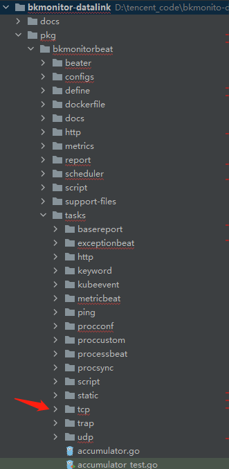
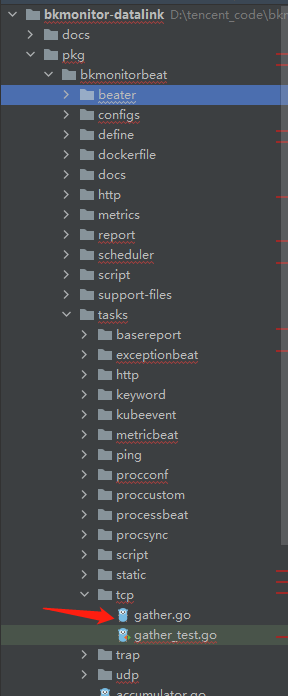

# 采集器开发方法

## 以 tcp 拨测任务为例：

* 创建任务配置文件， 可参考如下配置：
```yaml
type: tcp
name: tcp_task
version: 1.1.1
dataid: 1009
max_buffer_size: 10240
max_timeout: 15000ms
min_period: 3s
tasks:
  - task_id: 10058
    bk_biz_id: 2
    target_ip_type: 0
    dns_check_mode: single
    period: 60s
    timeout: 15000ms
    target_host: 10.0.0.1
    target_host_list:
    target_port: 80
    available_duration: 3000ms
    request:
    request_format: raw
    response:
    response_format: nin
```

* pkg/bkmonitorbeat/tasks 目录下创建子任务目录，注意目录名与配置中的 type 名称相同即 tcp：



* pkg/bkmonitorbeat/tasks/tcp 目录下创建任务文件取名为 gather.go :



* gather.go 文件中定义 New 方法，用于实例化 tcp 任务对象 ：

```go
func New(globalConfig define.Config, taskConfig define.TaskConfig) define.Task {
	gather := &Gather{}
	gather.GlobalConfig = globalConfig
	gather.TaskConfig = taskConfig

	gather.m = metrics.GetDefaultMetrics().TCP
	gather.gm = metrics.GetDefaultMetrics().Global
	gather.mLabels = metrics.GetConfigTaskLabels(taskConfig)

	gather.Init()

	return gather
}
```

* pkg/bkmonitorbeat/beater/taskfactory/ 目录下创建任务初始化文件 tcp.go ， 并定义初始化方法：


```go
func init() {
	SetTaskConfigByName(define.ModuleTCP, func() define.TaskMetaConfig { return new(configs.TCPTaskMetaConfig) })
	Register(define.ModuleTCP, tcp.New)
}
```

* 在任务执行文件 gather.go 中定义 Run 方法，用于执行 tcp 拨测任务的具体动作：
```go
func (g *Gather) Run(ctx context.Context, e chan<- define.Event) {
	var (
		startAt = time.Now()
	)

	hosts := make([]string, 0)
	resultMap := make(map[string][]string)
	taskConf := g.TaskConfig.(*configs.TCPTaskConfig)
	success := false
	defer func() {
		if !success {
			g.gm.TaskFailedTotal.With(g.mLabels).Inc()
		}
	}()
	var errCode define.BeatErrorCode = define.BeatErrCodeOK
	defer func() {
		metrics.SetCounterVecErrorCode(g.m.ResultTotal, g.mLabels, int(errCode))
	}()

	g.PreRun(ctx)
	defer g.PostRun(ctx)

	// todo： tcp 拨测任务具体行为
        ...
	
	//任务执行结果通过 e 上报
	event = tasks.NewSimpleEvent(g)
        event.StartAt = startAt
        event.TargetHost = taskConf.TargetHost
        event.TargetPort = taskConf.TargetPort
        e <- event
        ...
}
```
任务数据通过 channel e 上报。

* 调度器进行周期调度各个任务的 Run 方法：
```go
  go func(job Job) {
        task := job.GetTask()
        taskID := task.GetTaskID()
        defer utils.RecoverFor(func(err error) {
            logger.Errorf("run task %v panic: %v", taskID, err)
        })
        logger.Debugf("scheduler running job: %v", taskID)
        taskLabels := metrics.GetTaskLabels(task)
        gm.TaskRunTotal.With(taskLabels).Inc()
        startTime := time.Now()
        job.Run(state.EventChan)
        gm.TaskRunSeconds.With(taskLabels).Observe(utils.GetDurationSecondsSince(startTime))
	}(job)
```
自此 tcp 拨测任务就开发完成了，可自行测试效果。
