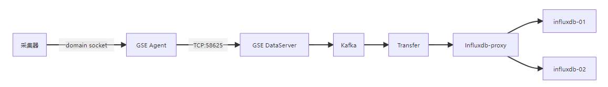
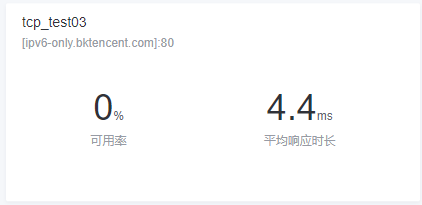

# 采集器常见问题排除思路

## 链路无数据排查

### 链路整体流转过程



上图是蓝鲸监控平台采集数据的整体流转过程。下面将会讨论，当链路中出现无数据上报时的排查思路。

### 排查手段

优先确保任务配置的准确性，包括主配置中是否有内置指标任务配置，子配置是否存在是否配置正确。

一、 排查 kafka 中是否存在数据: 

1. 我们建议先通过 kafka 中的数据入手，判断数据异常是出现在采集端还是服务端。用户可以参考一下命令消费 kafka 中的数据观察

 ```shell 
 ./bin/kafka-console-consumer.sh --bootstrap-server kafka.service.consul:9092 --topic 0bkmonitor_10010
```

2. 如果我们是排查某个 IP 上报失败的情况，那么我们可以通过 grep 进行过滤

 ```shell
./bin/kafka-console-consumer.sh --bootstrap-server kafka.service.consul:9092 --topic 0bkmonitor_10010 | grep $IP
 ```

3. 如果发现 kafka 中无数据，则需要排查采集端，否则需要排查服务端。通常是服务端出现异常，无数据情况是大规模跨业务的出现；如果是部分机器存在上报异常，那么更多是采集端异常导致。
  
二、 排查采集端是否正常
 
1. 先观察采集器日志中是否有上报失败的情况：
```docs
2021-05-26T13:36:59+08:00 client.go:152 ERR try 1 times
2021-05-26T13:37:02+08:00 client.go:152 ERR try 2 times
2021-05-26T13:37:05+08:00 client.go:169 CRIT connect failed, program quit [dial unix /usr/local/gse_bkte/agent/data/ipc.state.report: connect: connection refused]   
```
 那么表示机器上的 GSE agent 异常，采集器无法通过 domain socket 上报数据。

 如果 GSE agent 无异常，则可通过 strace 命令检查数据是否真实发送到 GSE agent ：

查询采集器进程 PID ：
```shell
ps -ef |grep bkmonitorbeat
```

结果如下：
```docs
root      9198 26184  0 10:48 pts/0    00:00:00 grep --color=auto bkmonitorbeat
root     26101     1 20 Apr24 ?        07:24:41 ./bkmonitorbeat -c ../etc/bkmonitorbeat.conf
```

通过 strace 观察是否有 GSE 写调用并过滤指标关键字 如 cpu 指标：
```shell
strace -p 26101 -s 300000 -t -ewrite -f 2>&1 | grep cpu
```

结果如下：
```docs
[pid 26104] 10:49:26 write(7, "\0\0\0\t\0\30\0\25dH\2216\0\0\6\230\0\0\0\0\0\0\0\0\0\0\0\0\0\0\0\0\0\0\0\0\0\0\0\0\0\0\1\230\0\0\0\0\0\0\0\0\0\0\0\0\0\0\0\0\0\0\0\0\0\0\0\0\0\0\0\0\0\0\0\0\0\0\0\0\0\0\0\0\0\0\0\0\0\0\0\0\0\0\0\0\0\0\0\0\0\0\0\0\0\0\0\0\0\0\0\0\0\0\0\0\0\0\0\0\0\0\0\0\0\0\0\0\0\0\0\0\0\0\0\0\0\0\0\0\0\0\0\0\0\0\0\0\0\0\0\0\0\0\0\0\0\0\0\0\0\0\0\0\0\0\0\0\0\0\0\0\0\0\0\0\0\0\0\0\0\0\0\0\0\0\0\0\0\0\0\0\0\0\0\0\0\0\0\0\0\0\0\0\0\0\0\0\0\0\0\0\0\0\0\0\0\0\0\0\0\0\0\0\0\0\0\0\0\0\0\0\0\0\0\0\0\0\0\0\0\0\0\0\0\0\0\0\0\0\0\0\0\0\0\0\0\0\0\0\0\0\0\0\0\0\0\0\0\0\0\0\0\0\0\0\0\0\0\0\0\0\0\0\0\0\0\0\0\0\0\0\0\0\0\0\0\0\0\0\0\0\0\0\0\0\0\0\0\0\0\0\0\0\0\0\0\0\0\0\0\0\0\0\0\0\0\0\0\0\0\0\0\0\0\0\0\0\0\0\0\0\0\0\0\0\0\0\0\0\0\0\0\0\0\0\0\0\0\0\0\0\0\0\0\0\0\0\0\0\0\0\0\0\0\0\0\0\0\0\0\0\0\0\0\0\0\0\0\0\0\0\0\0\0\0\0\0\0\0\0\0\0\0\0\0\0\0\0\0\0\0\0\0\0\0\0\0\0\0\0\0\0\0\0\0\0\0\0\0\0\0\0\0\0\0\0\0\0\0\0\0\0\0\0\0\0\0\0\0\0\0\0\0\0\0{\"bizid\":0,\"bk_agent_id\":\"\",\"bk_biz_id\":2,\"bk_cloud_id\":0,\"bk_cmdb_level\":[{\"bk_biz_id\":2,\"bk_module_id\":345,\"bk_set_id\":162},{\"bk_biz_id\":2,\"bk_module_id\":346,\"bk_set_id\":162},{\"bk_biz_id\":2,\"bk_module_id\":379,\"bk_set_id\":166},{\"bk_biz_id\":2,\"bk_module_id\":383,\"bk_set_id\":166},{\"bk_biz_id\":2,\"bk_module_id\":385,\"bk_set_id\":166},{\"bk_biz_id\":2,\"bk_module_id\":344,\"bk_set_id\":162},{\"bk_biz_id\":2,\"bk_module_id\":339,\"bk_set_id\":162},{\"bk_biz_id\":2,\"bk_module_id\":340,\"bk_set_id\":162},{\"bk_biz_id\":2,\"bk_module_id\":341,\"bk_set_id\":162},{\"bk_biz_id\":2,\"bk_module_id\":342,\"bk_set_id\":162}],\"bk_host_id\":2,\"cloudid\":0,\"cost_time\":58,\"dataid\":1572885,\"dimensions\":{\"bk_biz_id\":2,\"cpu_name\":\"core1\"},\"error_code\":0,\"exemplar\":{},\"group_info\":[{\"bk_collect_config_id\":\"55\",\"bk_target_cloud_id\":\"0\",\"bk_target_ip\":\"127.0.0.1\",\"bk_target_service_category_id\":\"\",\"bk_target_service_instance_id\":\"\",\"bk_target_topo_id\":\"340\",\"bk_target_topo_level\":\"module\"}],\"gseindex\":1326629,\"hostname\":\"VM-1-40-centos\",\"ip\":\"10.0.1.40\",\"localtime\":\"2023-04-26 10:49:25\",\"message\":\"success\",\"metrics\":{\"cpu_usage\":90.000000},\"node_id\":\"0:127.0.0.1\",\"task_id\":55,\"task_type\":\"script\",\"time\":1682477365,\"type\":\"script\",\"usertime\":\"2023-04-26 02:49:25\",\"utctime\":\"2023-04-26 02:49:25\"}", 1712) = 1712
...
```

说明 cpu 指标数据已真实上报给 GSE Agent 。此时应该检查 GSE Agent 状态。

2. 检查 GSE Agent 状态

当检查采集器正常后并确认 GSE Agent 进程存活后，此时需要关注是否可能 GSE Agent 到 GSE DataServer 之间存在问题。可以通过命令

```shell  
netstat -np | grep 58625
 ```

如果发现 S-Q 存在阻塞，那么需要检查 GSE Agent 到 GSE DataServer 之间的网络是否存在异常情况

3. 排查无发现

如果上述采集端都无异常情况，并确定 kafka 中无数据，此时需要检查 GSE DataServer 到 kafka 的链接是否正常。具体排查方式，请参考 GSE DataServer 维护手册。

三、 排查服务端是否正常

服务端的功能排查，主要集中在 transfer 和 influxdb-proxy 两个模块。两个模块都提供有指标接口，分别可以通过 `curl $BK_MONITORV3_TRANSFER_IP:$BK_TRANSFER_HTTP_PORT/metrics` 或  `curl $BK_MONITORV3_INFLUXDB_PROXY_IP:$BK_INFLUXDB_PROXY_PORT/metrics` 的方式获取两个模块的指标数据。下面将分别说明，在排查无数据问题过程中，需要特别注意的指标及其含义:
         
1. 排查 transfer 是否正常

  * 指标 transfer_pipeline_frontend_dropped_total

    含义: transfer 拉取 kafka 数据失败条数

    处理建议: 如果观察该值不断增长，需要观察 transfer 日志，排查 transfer 与 kafka 的链接是否正常

  * 指标 transfer_pipeline_processor_dropped_total

    含义:  transfer 处理异常数据丢弃数量

    处理建议: 如果观察该值不断增长，观察日志确认数据被丢弃原因

  * 指标 transfer_pipeline_backend_dropped_total

    含义: transfer 数据入库丢弃数量

    处理建议: 如果该值不断增长，可以观察日志确认写入失败原因，同时检查对应的存储 influxdb/ES 是否有异常

如果观察到是写入异常或无任何异常指标，此时需要观察 influxdb-proxy

2. 排查 influxdb-proxy 及 influxdb

  * 指标 influxdb_proxy_backend_alive_status

    含义:  influxdb_proxy_backend_alive_status

    处理建议: 如果发现有任何一个后端为0，表示此时 proxy 到 influxdb 链接异常，需要检查 influxdb 为何不存活或链接异常

  * 指标 influxdb_proxy_backend_backup_status

    含义:  influxdb-proxy 异常数据备份数量

    处理建议: 如果该值不断在增长，此时应该检查 influxdb-proxy 确认 influxdb 写入异常原因，并对 influxdb 进行修复


## 常见任务排查步骤

一、 metricbeat 采集 
  
* 检查配置项是否准确，可参考如下配置:

```yaml
type: metricbeat
name: httpsrvsmall
version: 1.0
max_timeout: 60s
min_period: 3s
dataid: 1500084
tasks:
  - task_id: 35
    bk_biz_id: 2
    period: 60s
    timeout: 60s
    module:
      module: prometheus
      metricsets: ["collector"]
      enabled: true
      hosts: ["127.0.0.1:18881/metrics"]
      metrics_path: ''
      namespace: httpsrvsmall
      dataid: 1500084
    labels:
    - bk_collect_config_id: "35"
      bk_target_cloud_id: "0"
      bk_target_ip: "127.0.0.1"
      bk_target_service_category_id: ""
      bk_target_service_instance_id: ""
      bk_target_topo_id: ""
      bk_target_topo_level: ""
```

* 提取 hosts 并测试 url 是否能获取指标数据
```shell
curl 127.0.0.1:18881/metrics
```
* 提取采集器日志检查数据是否上报 gse Agent 以及 kafka 是否有消费，详细可参考 <链路无数据排查>

二、 拨测

* 需要先考虑是调试的时候没有成功，还是拨测成功页面没有数据
调试的时候没有成功：


可根据响应码分析失败原因。

还是拨测成功页面没有数据:



检查拨测配置是否准确，可参考如下配置：

```yaml
type: http
name: http_task
version: 1.1.1
dataid: 1011
max_buffer_size: 10240
max_timeout: 15000ms
min_period: 3s
tasks:
  - task_id: 10049
    bk_biz_id: 2
    period: 60s
    target_ip_type: 0
    dns_check_mode: single
    available_duration: 3000ms
    insecure_skip_verify: true
    disable_keep_alives: false
    timeout: 15000ms
    steps:
      - url: http://ipv6-only.bktencent.com
        url_list:
        method: GET
        headers:
        available_duration: 3000ms
        request:
        request_format: raw
        response:
        response_format: nin
        response_code:
```
如配置无问题则需通过代码逻辑和日志寻找失败原因，如无数据上报可参考 <链路无数据排查>

三、 进程采集 

   进程采集分为基于 CMDB 配置的进程监控和基于动态进程采集插件的进程监控

   1. 基于 CMDB 配置的进程监控适合于进程名称和端口固定的情况

* 检查配置是否正确 bkmonitorbeat_processs.conf，可参考如下配置:

```yaml
 logging.level: debug
 max_procs: 1
 output.gse:
   endpoint: /var/run/ipc.state.report
 path.data: /var/lib/gse
 path.logs: /var/log/gse
 path.pid: /var/run/gse
 processbeat.converge_pid: true
 processbeat.hostfilepath: /var/lib/gse/host/hostid
 processbeat.monitor_collector_path: /usr/local/gse/plugins/etc/processbeat
 processbeat.perfdataid: 1007
 processbeat.portdataid: 1013
 processbeat.processes:
   - name: mysqld
     displayname: mysqld
     protocol: ""
     ports: []
     paramregex: /var/lib/mysql/mysql.sock --port=3306
     bindip: ""
     bind_info:
       - ip: 0.0.0.0
         ports:
           - 3306
         protocol: tcp
```

* 手动检查进程是否存在或者进程启动命令是否符合正则匹配项:

> ps -ef | grep mysqld

如无数据上报可参考 <链路无数据排查>

  2. 基于动态进程采集插件的进程监控

适合于在 CMDB 中无法定义固定的进程名称匹配端口情况，比如端口是随时变化的，且无固定端口，故无法通过方式在 CMDB 中定义端口方式监控

* 检查配置是否正确 如 monitor_process_sub_0001_host_001.conf，可参考如下配置：

 ```yaml
# 子配置信息
name: proccustom_task
version: 1.0.0
type: proccustom
period: 60s
dataid: 1572897
task_id: 25
port_dataid: 1572898
match_pattern: bkmonitorbeat
extract_pattern: ""
proc_metric: []
port_detect: true
ports: []
listen_port_only: false
report_unexpected_port: false
disable_mapping: false
# 注入的labels
labels:
    - bk_biz_id: "2"
      bk_collect_config_id: "25"
      bk_target_cloud_id: "0"
      bk_target_host_id: "773"
      bk_target_ip: "127.0.0.1"
      bk_target_service_category_id: ""
      bk_target_topo_id: ""
      bk_target_topo_level: ""
tags: null
```

* 手动检查进程是否存在

> ps -ef | grep bkmonitorbeat

如配置无问题但无数据上报可参考 <链路无数据排查>
