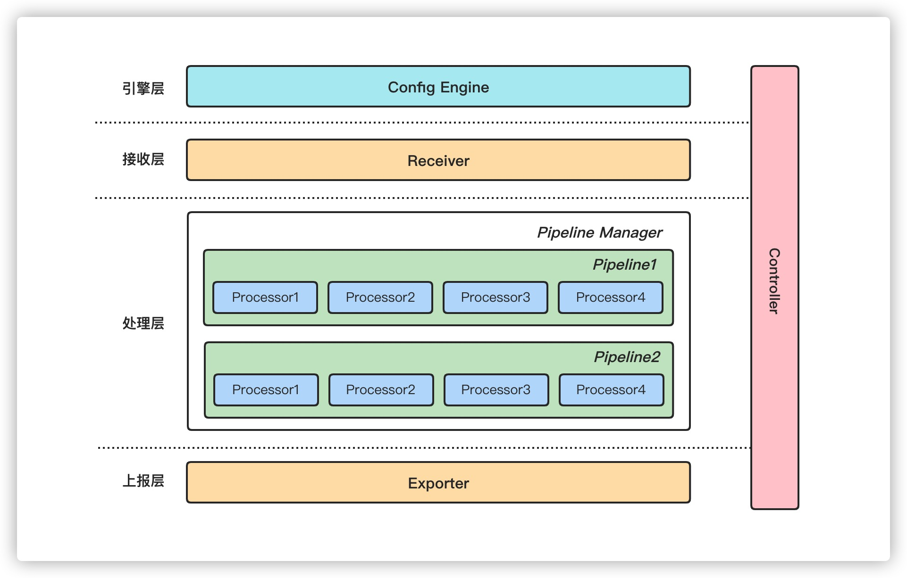

# bk-collector

## 📣 简介

bk-collector 是腾讯蓝鲸的 APM 服务端组件，负责接收蓝鲸监控的自定义时序指标及自定义事件上报，以及 Prometheus、OpenTelemetry、Jaeger、Skywalking 等主流开源组件的遥测数据，并对数据进行清洗后转发至蓝鲸 Gse 数据管道。

***bk-collector 整体架构图如下：***



### 1）引擎层

[confengine](./confengine): 引擎层负责加载和处理配置数据，对 [elastic/beats](https://github.com/elastic/beats) 的配置库进行了简单封装。

bk-collector 是一个通用的数据接收和清洗框架，依赖配置进行启动和处理数据，参考 **Configuration** 章节。

### 2）接收层

[receiver](./receiver): 接收层负责接收来个多个组件的上报的数据，目前已实现的组件包括：

| 组件                      | Http(Traces) | Http(Metrics) | Http(Logs) | Http(Profiles) | Grpc(Traces) | Grpc(Metrics) | Grpc(Logs) | Tars(Metrics) |
|-------------------------|--------------|---------------|------------|----------------|--------------|---------------|------------|---------------|
| jaeger                  | ✅            |               |            |                |              |               |            |               |
| otlp                    | ✅            | ✅             | ✅          |                | ✅            | ✅             | ✅          |               |
| skywalking              | ✅            | ✅             |            |                |              |               |            |               |
| pushgateway(prometheus) |              | ✅ (pb+text)   |            |                |              |               |            |               |
| remotewrite(prometheus) |              | ✅ (pb+text)   |            |                |              |               |            |               |
| fta                     |              | ✅             |            |                |              |               |            |               |
| beat                    |              |               | ✅          |                |              |               |            |               |
| pyroscope               |              |               |            | ✅              |              |               |            |               |
| tars                    |              |               |            |                |              |               |            | ✅             |

[proxy](./proxy): 接收自定指标和自定义时序数据上报。

### 3）处理层

[processor](./processor): 负责对数据进行清洗，目前已内置了多种处理器和流水线模型。

Pipeline 流水线接口定义

```golang
// Pipeline 流水线接口定义
type Pipeline interface {
	// Name 流水线名称
	Name() string

	// RecordType 流水线数据类型
	RecordType() define.RecordType

	// AllProcessors 返回所有 Processor
	AllProcessors() []string

	// PreCheckProcessors 返回所有 PreCheck 类型 Processor
	PreCheckProcessors() []string

	// SchedProcessors 返回所有调度类型 Processor
	SchedProcessors() []string

	// Validate 流水线配置校验
	Validate() bool
}
```

流水线支持在中间节点 FanOut，不过只支持 FanOut 一次，即 FanOut 出来的流水线无法再进行第二次 FanOut。

```docs
即 R1 -> P1 -> P2 -> P3 -> E1
             \ P4 -> P5 /
```

假设现在有如下 pipeline 配置。

```docs
Pipeline: tokenchcker=> attributefilter => resourcefilter => sampler
```

对应到程序中，每条数据在流水线中被抽象为一个 Task，每个 Task 会记录自己的处理步骤。

```docs
Task:
- stage1: {processor: tokenchcker}
- state2: {processor: attributefilter}
- stage3: {processor: resourcefilter}
- stage4: {processor: sampler}
```

Task 代表着调度单元。

```go
type Task interface {
	PipelineName() string
	Record() *Record
	StageCount() int
	StageAt(i int) string
}
```

处理层交由调度器驱动。

### 4）上报层

[exporter](./exporter): 上报层负责将数据上报至蓝鲸 Gse 数据管道，或者在测试场景下直接定向到标准输出。

traces 和 logs 数据会被转换成 `flat_batch` 类型交由 transfer 处理，并落盘至 ES，而 prometheus 和 metrics 数据则会被转换为 **自定义指标** 被 transfer 清洗后落盘至 Influxdb。

```yaml
# 开发用途 -> 标准输出
output.console:

# 测试用途 -> 直接丢弃
output.dropper:

# 生产用途 -> Gse Agent
output.bkpipe:
  endpoint: /var/run/ipc.state.report
  synccfg: true
```

### 5）控制器

[controller](./controller): 控制器负责调度和管理不同分层的组件，调度模型可以并发地尽可能地使用机器计算资源。

processor 被设计成无状态组件，且 processor 相互之间独立，互不依赖。bk-collector 启动时，默认会运行与机器核心数等同数量的 worker。每个 worker 都持有全局的 pipeline 配置以及 processor 实例。所以 worker 之间也是独立的。

processor 数据流动通过 channel 来通信。

```
                     抢占任务消费（fanout）      
                   | (OS thread1) worker1: process.task.stage1 -> process.task.stage2 -> ...   |
                   | (OS thread2) worker2: process.task.stage1 -> process.task.stage2 -> ...   |   （fanin）输出到消费管道
  dispatch_task => | (OS thread3) worker3: process.task.stage1 -> process.task.stage2 -> ...   |  => exporter
                   | (OS thread4) worker4: process.task.stage1 -> process.task.stage2 -> ...   |
                   | (OS thread5) worker5: process.task.stage1 -> process.task.stage2 -> ...   |

```

## 🔰 构建

```shell
$ make build
```

## 📝 使用

### Processor

bk-collector 提供了多种内置的 Processor 进行数据的清洗，具体配置请参考 [example.yml](./example/example.yml)

* apdexcakcalator: 耗时健康度处理器
* attributefilter: 属性清洗处理器
* dbfilteer: db 数据处理器
* forwarder: 数据转发器
* licensecheker: license 校验器
* metricsfilter: 指标清洗处理器
* pproftranslator: pprof 数据协议转换器
* probefilter: 探针根据配置上报数据处理器
* ratelimiter: 限流处理器
* resourcefilter: 资源清洗处理器
* sampler: 采样处理器
* servicediscover: 服务发现处理器
* tokenchecker: 令牌检查处理器
* tracesderiver: traces 数据派生处理器

processor 接口定义。

```golang
// Processor 代表着数据处理器
type Processor interface {
	// Name 返回采集器名称
	Name() string

	// IsDerived 标识处理器是否属于可派生类型
	IsDerived() bool

	// IsPreCheck 标识处理器是否处于预处理类型
	// 默认处理器中预处理类型的有 proxyvaliator/tokenchecker/ratelimiter/licensechecker
	IsPreCheck() bool

	// Process 方法会就地修改传入的 *define.Record，当且仅当需要衍生出另外的 Record 才会返回 *define.Record 实例
	Process(originalRecord *define.Record) (derivedRecord *define.Record, err error)

	// Reload 重载 processor 配置
	// 对于无状态的 processor 可支持替换实例所有变量
	// 对于有状态的 processor 需要`谨慎地`处理所有变量 避免内存/goroutines 泄漏
	Reload(config map[string]any, customized []SubConfigProcessor)

	// MainConfig 获取主配置信息
	MainConfig() map[string]any

	// SubConfigs 获取子配置信息
	SubConfigs() []SubConfigProcessor

	// Clean 清理 Processor
	Clean()
}
```

其中 precheck 类型的设计是为了避免异步 pipeline 处理而无法返回给用户权限或者限流错误信息。另外在构建 pipeline 的时候，precheck 类型的 processor 要置于 processor 列表的最前面，否则构建会报错。

### Pipeline

Pipeline 由 processor 实例构成，一个类型的 processor 可以有多个实现（比如参数配置不同）。目前提供了多种类型的 pipeline 类型：

* traces
* traces.derived
* metrics
* metrics.derived
* logs
* logs.derived
* pushgateway
* remotewrite
* proxy
* pingserver
* fta
* pyroscope
* beat

derived 后缀的 pipeline 类型用于处理派生类型的数据。派生指的是从一条流水线衍生出另外一种类型的数据，比如黄金指标的提取。

## Configuration

bk-collector 有三种类型的配置，程序的最终配置结果是三者的并集：

1. 主配置：进程本身启动的基础配置，包括类似像日志配置，服务端口配置等。
2. 平台配置：对主配置进行补充的数据处理配置。
3. 子配置：针对每个独立应用（token 作为区分标识）的个性化配置。

本项目提供了多个配置文件示例：

* [example.yml](./example/example.yml): 处理器配置示例文件
* [main.yml](./example/main.yml): 主配置文件
* [platform.yml](./example/platform.yml): 平台配置文件

### 1）配置层级

配置层级跟随业务层级，所有的 processor 和 pipeline 配置遵循同名覆盖规则，子配置优先级高于父配置。

```go
// TierConfig 实现了层级 Config 管理和查找的能力
// Processor 配置总共有四个搜索路径，搜索顺序为 1) -> 2) -> 3) -> 4)
//
// 4) global.config		全局主配置（KeyGlobal）
// 3) subconfigs.default	子配置默认配置（SubConfigFieldDefault）
// 2) subconfigs.service	子配置服务级别配置（SubConfigFieldService）
// 1) subconfigs.instance	子配置实例级别配置（SubConfigFieldInstance）
//
// 一个子配置文件描述了某个唯一标识的应用的自定义配置
```

## ⛏ 代码质量

### 1）本地测试

本地开发的时候可启动一个示例 agent 进行数据上报，已经内置了多个上报测试样例，如：

* [example/otmetrics](./example/otmetrics)
* [example/jaegertraces](./example/jaegertraces)
* [example/ottraces](./example/ottraces)
* [example/prompushgateway](./example/prompushgateway)
* [example/fta](./example/fta)
* [example/promremotewrite](./example/promremotewrite)

```shell
$ cd example/ottraces
$ go run .
```

再使用 example 配置启动 bk-collector 进程即可看到数据，启动进程。

```shell
$ make dev
...
{"@timestamp":"2022-02-28T07:03:53.969Z","@metadata":{"beat":"bk-collector","type":"_doc","version":"unknown"},"dataid":1001,"version":"1.0.0","data":[{"metrics":{"runtime.go.mem.heap_inuse":0},"target":"otlp","dimension":{"telemetry_sdk_language":"go","telemetry_sdk_name":"opentelemetry","telemetry_sdk_version":"1.4.0","fake_new_key":"fake_new_value","service_name":"unknown_service:runtime"},"timestamp":1646031833}]}
{"@timestamp":"2022-02-28T07:03:53.969Z","@metadata":{"beat":"bk-collector","type":"_doc","version":"unknown"},"dataid":1001,"version":"1.0.0","data":[{"metrics":{"runtime.go.mem.heap_inuse":0},"target":"otlp","dimension":{"service_name":"unknown_service:runtime","telemetry_sdk_language":"go","telemetry_sdk_name":"opentelemetry","telemetry_sdk_version":"1.4.0","fake_new_key":"fake_new_value"},"timestamp":1646031833}]}
{"@timestamp":"2022-02-28T07:03:53.969Z","@metadata":{"beat":"bk-collector","type":"_doc","version":"unknown"},"dataid":1001,"version":"1.0.0","data":[{"metrics":{"runtime.go.mem.heap_inuse":0},"target":"otlp","dimension":{"telemetry_sdk_name":"opentelemetry","telemetry_sdk_version":"1.4.0","fake_new_key":"fake_new_value","service_name":"unknown_service:runtime","telemetry_sdk_language":"go"},"timestamp":1646031833}]}
```

代码格式化。

```shell
$ make lint
```

### 2）管理接口

bk-collector 提供了一系列 admin 操作接口。

* /-/logger: 动态调整日志配置
* /-/reload: 重载配置

接口响应如下：

**POST /-/logger**

logger level 目前支持： debug/info/warn/error/panic/fatal。

```shell
$ curl -XPOST -d "level=debug" http://$host/-/logger
{"status": "success"}
```

**POST /-/reload**

```json
{"status": "success"}
```

### 3）单元测试

```shell
$ make test
```

如若使用的是 **Goland IDE**，则可使用内置的 `Run with Coverage` 查看测试结果。

### 4）基准测试

压测报告参考 [benchmark.md](./benchmark.md)

### 5）参与贡献

* Fork 本仓库并新建分支，使用 `make dev` 可以运行程序。 
* 使用 `make install` 按照前置检查工具。
* 提交代码前确保已经执行代码检查及单测（`make lint && make test`）。
* 中文文档或注释书写请参考 [中文技术文档的写作规范](https://github.com/ruanyf/document-style-guide)。
* 单测请尽量参照项目整体风格，包括命名，书写方式。
* 如果新增 **recevier** 请提供 [example](https://github.com/TencentBlueKing/bkmonitor-datalink/tree/master/pkg/collector/example) 运行示例。
* 版本号更新 [VERSION](./VERSION)

### 6）可观测性

自监控使用 [prometheus/client-go](https://github.com/prometheus/client-go) 进行上报。所有指标均以 `bk_collector` 开头。如 `bk_collector_uptime`

#### overview

| 名称 | 描述                                       | 类型 |
| --- |------------------------------------------- | -- |
| app_build_info | 进程构建信息                                   | Gauge |
| app_version | 进程版本信息                                   | Counter |
| panic_total | 进程 panic 次数 | Counter |
| beat_sent_bytes_size | beat 发送字节数分布 | Histogram |
| beat_sent_bytes_total | beat 发送字节数计数器 | Counter |

#### config engine

| 名称 | 描述                                       | 类型 |
| --- |------------------------------------------- | -- |
| engine_load_config_success_total | engine 加载成功配置次数                         | Counter |
| engine_load_config_failed_total | engine 加载失败配置次数                          | Counter |

#### controller

| 名称 | 描述                                       | 类型 |
| --- |------------------------------------------- | -- |
| controller_reload_success_total | controller reload 成功次数                  | Counter |
| controller_reload_failed_total | controller reload 失败次数                   | Counter |
| controller_reload_duration_seconds | controller reload 耗时                  | Histogram |

#### receiver

| 名称 | 描述                                       | 类型 |
| --- |------------------------------------------- | -- |
| semaphore_acquired_num | receiver 请求占用信号量 | Gauge |
| semaphore_acquired_success | receiver 占用信号量成功计数器 | Counter |
| semaphore_acquired_failed | receiver 占用信号量失败计数器 | Counter |
| semaphore_acquired_duration_seconds | receiver 获取信号量耗时 | Histogram |
| receiver_token_info | receiver 处理 token 元信息 | Gauge |
| receiver_handled_total | receiver 处理数据次数                          | Counter |
| receiver_dropped_total | receiver 丢弃数据次数                          | Counter |
| receiver_skipped_total | receiver 忽略数据次数（空数据）                     | Counter |
| receiver_received_bytes_total | receiver 接收字节总数 | Counter |
| receiver_received_bytes_size | receiver 接收字节数分布 | Histogram |
| receiver_internal_error_total | receiver 内部解析错误次数                        | Counter |
| receiver_handled_duration_seconds | receiver 处理耗时                            | Histogram |
| receiver_precheck_failed_total | receiver percheck 失败次数 | Counter |
| receiver_precheck_success_total | receiver percheck 成功次数 | Counter |

#### proxy

| 名称 | 描述                                       | 类型 |
| --- |------------------------------------------- | -- |
| proxy_handled_total | proxy 处理数据次数 | Counter |
| proxy_dropped_total | proxy 丢弃数据次数 | Counter |
| proxy_internal_error_total | proxy 内部解析错误次数 | Counter |
| proxy_handled_duration_seconds | proxy 处理耗时 | Histogram |
| proxy_received_bytes_total | proxy 接收字节总数 | Counter |
| proxy_received_bytes_size | proxy 接收字节数分布 | Histogram |

#### exporter

| 名称 | 描述                                       | 类型 |
| --- |------------------------------------------- | -- |
| exporter_sent_duration_seconds | exporter 发送耗时                            | Histogram |
| exporter_sent_total | exporter 发送次数                          | Counter |
| exporter_handled_event_total | exporter 处理事件次数                          | Counter |
| exporter_queue_full_total | exporter 队列满次数 | Counter |
| exporter_queue_tick_total | exporter 队列触发 ticker 次数 | Counter |
| exporter_queue_pop_batch_size | exporter 队列发送批次大小分布 | Histogram |
| converter_failed_total | converter 转换数据错误次数（NaN、Inf）              | Counter |
| converter_span_kind_total | converter 转换 span kind 统计 | Counter |

#### pipeline

| 名称 | 描述                                       | 类型 |
| --- |------------------------------------------- | -- |
| pipeline_built_failed_total | pipeline 构建失败次数                          | Counter |
| pipeline_built_success_total | pipeline 构建成功次数                          | Counter |
| pipeline_dropped_total | pipeline 处理过程丢弃数据次数（数据异常）                | Counter |
| pipeline_skipped_total | pipeline 处理完成为空数据次数（空数据）                 | Counter |
| pipeline_handled_total | pipeline 处理次数                            | Counter |
| pipeline_handled_duration_seconds | pipeline 处理耗时                            | Histogram |
| pipeline_exported_duration_seconds | pipeline export 耗时                            | Histogram |

#### time series

| 名称 | 描述                                       | 类型 |
| --- |------------------------------------------- | -- |
| accumulator_series_exceeded_total | 累加器 series 超限次数 | Counter |
| accumulator_series_count | 累加器 series 数量 | Gauge |
| accumulator_added_series_total | 累加器新增 series 次数 | Counter |
| accumulator_gc_duration_seconds | 累加器 gc 耗时 | Histogram |
| accumulator_published_duration_seconds | 累加器 publish 耗时 | Histogram |
| series_limiter_exceeded_total | series 计数器超限次数 | Counter |
| series_limiter_count | series 计数器序列数量 | Gauge |
| series_limiter_added_total | series 计数器新增次数 | Counter |
