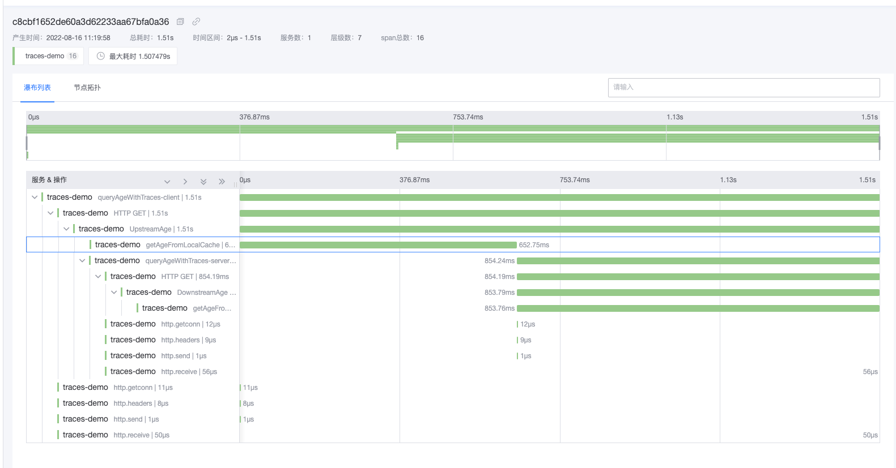

# ottraces

本示例用于展示 opentelemetry traces 的使用和上报。本示例会运行两个 service，upstream（local cache） 以及 downstream（remote cache）。同时会有一个客户端周期性地请求 upstream 获取数据，如若 upstream 中没有数据，则穿透到 downstream 去获取。



### 启动参数

```shell
Usage of ./ottraces:
  -downstream string
        downstream server address for testing (default "localhost:56099")
  -endpoint string
        report endpoint (default "localhost")
  -exporter string
        exporter represents the standard exporter type, optional: stdout/http/grpc (default "stdout")
  -token string
        authentication token (default "Ymtia2JrYmtia2JrYmtiaxUtdLzrldhHtlcjc1Cwfo1u99rVk5HGe8EjT761brGtKm3H4Ran78rWl85HwzfRgw==")
  -upstream string
        upstream server address for testing (default "localhost:56089")
```

### 需要注意的地方

#### 1）版本依赖

opentelemetry 有着一套**难以言语**的版本方案，所以请用户在使用的时候需要谨慎地关注好版本问题。本示例只保证在示例下的 gomod 搭配下能够正常运行，其他的版本不做保证。请搜索代码中 `TODO` 关键字查看细节。
