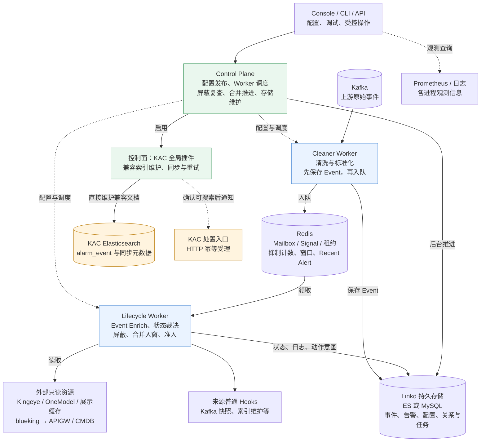
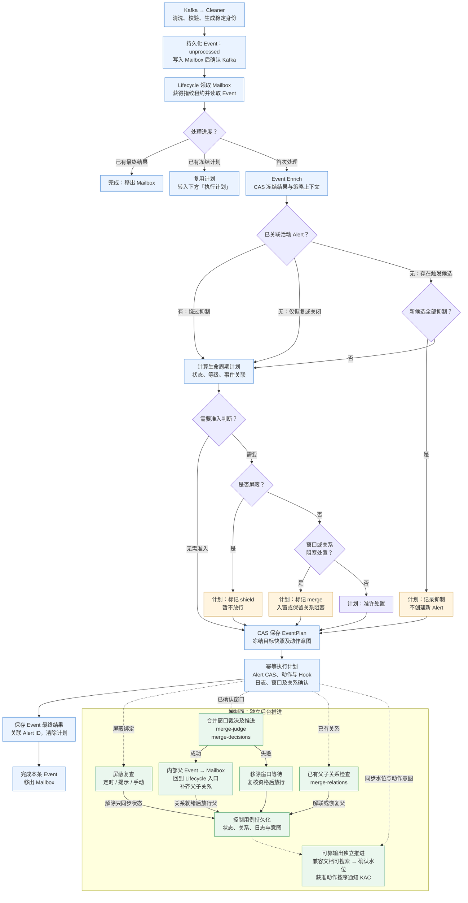

# Linkd 总体设计

> 本文按 2026-10-08 工作区代码描述进程职责与处理流程，不代表生产部署或外部系统联调结果。
> Event Enrich、三类策略、控制面任务及可靠输出的规则与验收记录见
> [开发方案](event-enrich-and-alarm-policies.md)；KAC 当前出口以[全局兼容插件](kac-compatibility-plugin.md)为准。

当前 Go 包组织与依赖规则见[包结构](package-structure.md)。图中的职责分组不要求与 Go 包一一对应。

本设计以 [`define.md`](define.md) 为领域最终事实。早期工作树和讨论稿不是可兼容版本，不增加别名、
迁移或双写路径；需要版本化的输入、输出协议在各自契约中独立定义。

## 整体架构

核心后端由 Cleaner、Lifecycle、Control Plane 三个角色组成，可以独立部署，也可以通过
`all-in-one` 在同一进程运行。Console 是独立服务；屏蔽复查、合并裁决、存储维护与可靠投递
属于控制面内部任务，不需要额外部署同名常驻进程。

图中实线表示主要数据访问或调用，虚线表示配置调度、观测查询或异步通知。

图中省略重复的存储访问线：Console 直接只读查询业务存储与 Redis；控制面使用 Redis 调度、
读取策略窗口，并通过持久存储保存配置、关系和可靠投递进度。KAC 插件从这些持久待办继续推进。
普通 Hooks 包括 Kafka 快照、活跃策略索引及旧 KAC Hook；旧 KAC Hook 与插件可靠处置受互斥约束。

Linkd 的 ES/MySQL Repository 保存告警事实与持久控制进度；外部 Kingeye MySQL、OneModel 和展示
缓存提供只读信息。KAC `alarm_event` 是独立兼容存储，即使 Linkd Repository 选择 MySQL，也仍由
插件写入 KAC Elasticsearch。控制面按配置启用相关任务，图示不意味着每个部署都启用了所有依赖。

`blueking` 统一保存应用凭据及多租户开关，`resources.cmdb` 启用 CMDB APIGW 读取。单租户使用
`admin`；多租户按实际租户查询并缓存 `bk_admin`，查询失败或空结果不回退猜测身份。该开关不改变
Event/Alert、管理 API、存储和 Redis 的租户作用域，详见[配置指南](../guides/configuration.md)。

## 处理链路

以下图示区分计划计算、业务写入与后台推进。策略判定发生在计划生成阶段，可能更新 Redis 计数或
候选占位；Alert 事实在计划冻结后写入，窗口确认后再进入后台裁决。虚线表示异步扫描或事件提示，
不表示 Lifecycle 要同步等待后台任务完成。

- **Enrich 属于 Event。** 每条不同 Event 保存自己的逐等级丰富结果；Alert 只复制 opening Event
  的首次快照，后续 Event 不实时刷新它。丰富结果冻结后重投复用；已有 EventPlan 时直接补齐执行，
  不重新丰富或重新裁决。
- **活动 Alert 绕过防抖和关联聚合。** 已活动但尚被屏蔽或合并等待的告警也遵守这条规则；
  是否可以处置由独立准入判断决定。新候选按严重程度依次判断，全部被抑制才没有新 Alert。
- **状态分别保存。** `status` 仅为 `active / recovered / closed`；`shield`、`merge`、`admission`、
  同步水位与待入队动作意图分别表达其他状态。`suppressed` Event 也可能更新既有 Alert 的最近事件信息，
  不能把“抑制处置”统一解释为“Alert 完全不变”。
- **解除与放行分开。** 定时解除屏蔽、人工关闭父后解除子关系，都等待下一条触发 Event 再判断处置；
  合并失败释放则会复核成员当前资格，满足条件时可由控制任务放行。全部真实成员终结才自动恢复父。
- **内部父 Event 直接进入 Mailbox。** 它使用 `builtin_alarm_merge` 的 Lifecycle，默认空 Enrich，
  不经过外部 Kafka/Cleaner，不递归入窗；父子关系就绪后才允许父处置。
- **状态同步与处置通知分开。** 屏蔽、合并等待中的 Alert 仍可同步兼容文档。曾放行告警的终态
  可生成恢复/关闭动作，未放行告警的终态只同步状态；图中的触发准入分支不拦截终态流转。
- **失败保留可重试状态。** 策略依赖故障按规则记录跳过，既有屏蔽复查失败保留绑定；核心存储、
  租户、租约或动作入队失败不能伪装成功。执行失败保留 Mailbox 队首，已生效计划按原计划补齐；
  仅首项尚未生效且原版本已被其他操作推进时，允许撤销计划重算。

实际流程入口见 [ProcessEvent](../../internal/lifecycle/plan.go)、[处置准入](../../internal/lifecycle/shield.go)
与[控制面任务目录](../../internal/controlplane/process/task_status.go)。图中省略的多级别组合、策略预算及
失败分类，分别以 [Lifecycle](../modules/lifecycle.md)和[开发方案](event-enrich-and-alarm-policies.md)为准。

## 模块边界

- `internal/config` 严格读取静态 YAML 和全局 Severity；来源由 `internal/eventsource` 持久化发布，`internal/taskdispatch` 为 Cleaner/Lifecycle 分配任务。
- `internal/cleaner` 的 Processor 通过具体 SourceCleaner 解析来源事实，再由 EventFactory 补齐受控字段并构造 `domain.Event`；专用 Runtime 负责消息队列无关的并发、lane 内连续批量副作用和确认。内置 `standard` 接收 JSON object；来源、稳定 record ID 和接收时间来自信封；租户由来源固定配置或 payload/header 的一致性规则确定，完整 payload 写入 `source_raw_data`。
- `internal/store` 保存 Event、独立处理元数据、Alert 和 AlertLog；配置、关系和可靠投递各有持久化边界。
  Elasticsearch 数据进程只访问控制面
  存储管理任务准备好的 alias；Lifecycle 只提交 Alert 逻辑终态，Active 到 History 的搬迁由控制面异步完成。
- `internal/controlplane/process` 装配管理 API、配置发布恢复和调度，并监督屏蔽复查、合并窗口/关系推进、
  抑制受控对账及可靠投递；同时维护 Elasticsearch Schema、时间桶、终态归档和 Redis Signal 安全裁剪。
- `internal/lifecycle` 按 `(bk_tenant_id, event_source_id, fingerprint)` 关联 active Alert，在 Event 丰富后
  执行策略、等级和状态裁决，冻结处理计划并完成 CAS、输出意图及部分成功恢复。
- `internal/lifecycle/kafkahook` 根据 Alert change/cause 输出 V1 完整快照，不要求每次变更都存在 Event。
- `internal/blueking` 统一 APIGW 身份解析与租户用户缓存；`internal/cmdb` 负责 CMDB 请求及完整性检查。
- `internal/kaccompat` 直接维护 KAC 兼容索引和文档，`internal/projection` 与 `internal/actiondelivery`
  分别推进持久同步和获准动作，不由普通 Hook 承担可靠重试。
- `console` 通过正式 API 管理 EventSource、预览策略和提交受控命令；业务存储、运行态与指标查询只读。
  策略编辑仍由外部配置管理方负责。

## 身份与租户

- 所有数据、查询、锁、信号和缓存键都带租户作用域。
- EventID/AlertID 使用 `<YYYYMMDDHHMMSS>.<tenant>.<event_source_id>.<16 hex>`；时间固定按 UTC 秒解析，
  摘要使用不同 domain seed 的 SHA-256 前 64 bit。Event 摘要包含完整 received_at 和稳定来源身份，Alert
  摘要包含 opening Event，因此重投不变。
- fingerprint 只由 EventSource 配置的稳定 Event 字段生成；`source_alert_id` 只能作为 fingerprint 输入，不能形成查询旁路。
- `related_tenant_id` 非空时强制覆盖租户；否则优先读取 payload 的 `bk_tenant_id`，缺失时使用信封租户，两处非空且不一致则拒绝。

## 一致性与恢复

Repository 不提供 Event、Alert、AlertLog 与 Kafka 的跨对象事务。生命周期通过以下手段收敛部分成功：

- Event 先 CAS 冻结逐等级丰富结果，再 CAS 保存多级别裁决计划，之后执行 Alert 副作用；完成时清除计划。Event 处理结果和 `related_alert_ids` 使用同一次 CAS 更新；
- Alert 使用存储专属 `VersionToken` 有界重试；
- fingerprint Redis lease 降低同一问题的并发竞争；
- Redis Mailbox 用单一 List 保存待处理 Event ID，空到非空时原子写入唤醒 Signal；
- Event 去重由 Repository 负责；Elasticsearch Event create 使用 `refresh=false`，Cleaner 只在主分片确认
  后入 Mailbox，重复身份和 Lifecycle 单 Event 读取均使用 realtime GET；Mailbox 允许少量重复引用，终态
  Event 在 Lifecycle 中直接短路；
- Elasticsearch Lifecycle 使用共享 Redis Recent Alert 缓存保存最近 refresh 窗口内的 Alert 写入；Event 裁决先查
  缓存，写 Alert 后先更新缓存，借此取消数据路径上的 search refresh 等待；
- Cleaner 以目标 Signal Group 的 `lag + pending` 做可配置短缓存的近似全局背压，默认缓存 1 秒；
- 恢复使用 `EventProcessing.plan` 中已冻结的目标快照和原版本进行实时核对；已完成的操作不再重复改变状态，未完成的操作继续原计划；
- AlertLog、直接关闭 operation 和 Kafka message ID 均使用稳定输入生成确定性身份。

上游消息只能在 Event 已持久化且 Mailbox 入队成功后确认。确认前由 MQ 重投恢复；确认后 Redis
Mailbox 数据安全依赖 Redis 自身持久化和复制。并发、批次、重试和关闭等待必须有硬上限并传播
`context.Context`。

## 当前实现边界

当前已实现领域对象、配置、`standard` Cleaner、内存/MySQL/Elasticsearch Repository、Redis
Mailbox、Event Enrich、三类策略、生命周期、管理 API 人工关闭、普通 Hooks、可靠动作意图、控制面
补扫及重试、rawgen 和 Console。蓝鲸调用已有全局配置和 APIGW 客户端；KAC 插件已有直接写兼容
Elasticsearch 及 HTTP 处置通知的装配，具体范围见[全局兼容插件](kac-compatibility-plugin.md)。

当前代码接线不等于外部系统已接入：KAC 的策略同步、生命周期命令转发、旧状态写入退出和处置入口
适配仍需跨仓实施及验证。本页不以本地模拟接收端或测试入口宣称实际 KAC 应用、生产网关权限或切流
完成；不改变[开发方案](event-enrich-and-alarm-policies.md)中带日期的历史验收记录。

当前提供两种后端运行模式：用于测试和小规模部署的 `all-in-one`，以及可独立扩缩容的 Cleaner、
Lifecycle、控制面（API / Leader / Manager）三进程模式。常驻进程入口对应 `linkd run cleaner`、
`linkd run lifecycle` 和 `linkd run control-plane`；职责、故障域和当前完成度见[部署模式与进程拓扑](deployment.md)。

## 详细设计入口

- [核心数据模型](define.md)：Event、EventProcessing、Alert、AlertLog；
- [EventSource](../modules/event-source.md)：来源配置与 Flow 装配；
- [Cleaner](../modules/cleaner.md)：原始消息到 Event、批量副作用和 ACK；
- [Lifecycle](../modules/lifecycle.md)：Mailbox、状态裁决、恢复和输出；
- [消息消费运行时](message-consumption-runtime.md)：MQ 通用 Session、Receipt、Outcome 和背压；
- [核心存储契约](core-storage-contract.md)：Repository、批量创建和 CAS；
- [Event 丰富与告警策略](event-enrich-and-alarm-policies.md)：字段、三类策略和验收边界；
- [KAC 全局兼容插件](kac-compatibility-plugin.md)：兼容存储、字段所有权与可靠处置；
- [Console](../guides/console.md)：查询、调试、受控操作与观测入口。
