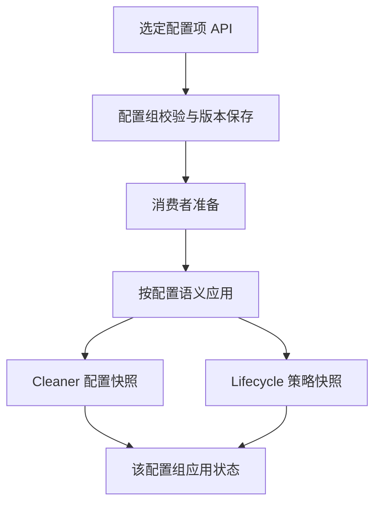

# 部分配置动态化设计方案

状态：待评审方案，未实现。日期：2026-09-06。

本文只讨论选定配置项的运行时变更，候选用例为全局告警等级 Severity。
[EventSource 动态配置](event-source-dynamic-configuration.md)是独立工作，不纳入本项的存储对象、
发布事务、开发范围和验收清单。本文替代原先将两者合并的整体方案，不代表现行能力。

## 1. 目标与边界

按实际需求逐项开放动态配置，明确每一项的类型、作用域、消费者、校验、生效时机和恢复语义。
不把 `config.Config` 整体替换成动态 map，不以“可改配置”代表“可安全热更新”。

| 本项负责 | 本项不负责 |
| --- | --- |
| 选定的部署级业务配置；当前候选为 `Config.Severity` | EventSource CRUD、来源同步和配置所有权 |
| 等级名称/priority/全局默认值的可变边界 | 来源内 severity_mapping 与来源 default_severity 的管理 |
| 各消费者的加载、应用状态、版本和恢复 | 来源 Flow 调度、启停和 Kafka 订阅迁移 |
| 后续配置项逐项评审接入 | 自动把全部 YAML 配置或运行参数动态化 |

本项可以在 EventSource 仍静态的部署中独立实现。若某配置改变 Event 生成结果，必须在本项解决跨版本
重投一致性，或暂不开放该项；不能把未完成的 EventSource 项目视为已经提供了保证。

## 2. 当前代码与首个候选配置

[config/severity.go](../../internal/config/severity.go)定义冻结的全局等级表；
[cleaner/event_factory.go](../../internal/cleaner/event_factory.go)将来源等级映射为标准 name；
[lifecycle/processor.go](../../internal/lifecycle/processor.go)用 priority 决定升级、抑制和同级更新。
Event/Alert 保存 name，不保存冻结的全局 priority。

| 配置 | 消费者 | 建议首期边界 |
| --- | --- | --- |
| Severity levels 新增 | Cleaner、Lifecycle | 允许新增，先保证所有合格消费者可识别 |
| 已发布 name/priority | Lifecycle、历史对象解释 | 首期固定；改名、删除、重排另行实现 |
| 全局 default_severity | Cleaner | 只有重放版本边界验证后才开放在线修改 |
| 其他部分配置 | 按实际字段确定 | 当前无已确认清单，暂不扩大范围 |

新增等级也可能改变清洗结果：当前映射链在使用默认值前，会检查来源原值是否命中全局等级名称。
原来走默认值的同一输入，新增同名等级后会直接命中。因此新增等级也需要清洗版本固定，不能仅做
Lifecycle 字典追加就宣称可安全上线。

静态启动项继续为角色、监听、认证、配置存储连接、业务存储连接、Mailbox 拓扑和进程资源硬上限。
全局 Cleaner 默认预算等运行参数仅是后续候选，不在本次设计中自动列为支持。

## 3. 本项管理模型与写入

采用有类型的配置组，例如 `SeverityPolicy`，候选封装为：部署与管理作用域、配置组名、schema version、
revision、expected revision、spec、内容摘要、操作者和变更原因。配置组内关联字段一起校验/保存，
不同配置组不默认形成一个全局发布事务。

接口、版本和状态与来源管理分开，候选路由为 `/api/v1/settings/severity` 及其校验/应用/状态入口。
修改使用 CAS 和幂等键；配置入库与消费者应用分别记录。不能以来源发布成功代表全局配置生效。

首期按部署级配置设计，只有平台权限可以写。租户覆盖未定义，不做隐式继承合并。管理键、缓存和审计
带 deployment 与显式作用域，接口统一鉴权与脱敏。

权威存储的选型独立评审；可以与来源共用数据库实例，但保持独立对象、仓储、版本和事务。
需要不可变历史版本、原子当前指针、审计与幂等结果；不能让默认值或本地缓存覆盖已保存配置。
仅动态化已选择的配置组，其他项继续读取 YAML；动态组的 YAML 只允许显式初始导入，不持续双写。

本项先围绕 API 管理设计；若实际需要主动拉取选定配置组，再单独定义提供方、游标、删除和归属契约。
不因为 EventSource 需要同步，就自动复用它的 provider 对象和管理规则。

## 4. 生效流程

控制面承担配置组管理，仍使用既有进程；all-in-one 与分进程装配使用相同语义。
消费者通过受认证的读取接口加载不可变快照，通知加周期轮询兜底，消息热路径不读配置库。

每项配置定义自己的生效模式：下一次无副作用操作读取、暂停/重建组件、或具有持久化版本的业务切换。
一条消息/一次裁决只读取一个快照，禁止执行中途混用新旧字段。

状态区分 desired、prepared、applied 与 blocked/failed，报告消费者范围、失败阶段及错误。
发布失败保留有效旧状态，不静默使用内置默认值；回滚产生新 revision，不能删除恢复需要的历史。
组级存储原子性不等于跨进程同时生效，跨消费者的顺序与失败恢复按具体配置设计。

## 5. Severity 的安全生效

### 5.1 首期策略

- 已发布 name/priority 固定，新增 name 与 priority 唯一；不能因整数之间没有空位静默重排。
- Lifecycle 先准备扩展后的字典，再允许 Cleaner 使用会生成新 name 的清洗快照。
- Lifecycle 有效字典单调扩展，回滚默认值不能删除已发布名称；历史 Alert 必须仍可解释。
- 两个等级从同一快照比较。未知等级先加载所需版本，失败则保留待处理，不猜默认值或 Discard。
- 不重算历史 Event，不因更新字典自动批量修改活动 Alert。

### 5.2 本项自身的重放约束

全局默认值变化以及新增等级的直接匹配，都可能改变同一原始消息生成的 Event。
必须为输入记录固定清洗使用的 Severity 版本，并保留完整历史解释能力。
仅给 Event 加版本字段无法约束在 Event 创建前或创建后未 ACK 时的重新解析。

当前 Kafka 输入可采用 partition offset → 清洗策略版本区间，并在切换时暂停领取、排空连续成功前缀、
持久化边界后恢复。需验证 rebalance、失联旧节点、持久化前后崩溃、多 Event 展开与人工回放。
未知区间不能套用最新策略；保留窗口至少覆盖可重放数据与故障恢复需求。

如果来源动态化已经实现相关区间机制，可复用其经验证的技术能力；如果尚未实现，本项需独立实现所需
能力，或先交付配置管理、将影响清洗结果的在线应用保持关闭。复用不意味着绑定两个业务项目的交付。

### 5.3 后续若需要在线重排 priority

候选语义：首次 Lifecycle 裁决选择当时激活的策略，在第一次 Alert 副作用前通过 EventProcessing CAS
固定 decision_policy_revision；后续重试使用同一版本比较 incoming 与 active。
策略必须能识别两者名称并满足 Event 的版本要求，不能跨不同版本拼接 priority。

这会影响尚未开始裁决的旧 Event，但不改变已开始裁决的重试，不立即重算全部 Alert。需同步设计历史
保留、部分成功恢复与审计。当前没有该字段/流程，不能仅替换 SeverityTable 的底层 map 就开放重排。
名称改名/删除、租户覆盖和存量告警重算是独立业务需求，仍需专门设计。

## 6. 与 EventSource 的唯一必要衔接

两项分别有自己的写入口、版本、应用状态和回滚。来源字段管理归来源项目；全局配置管理归本项目。

当来源映射要引用新增等级时：先应用等级配置，验证消费者就绪，再提交来源映射；后一步失败不会回滚
已发布等级，维持来源旧映射并单独重试。禁止让两个修改组成一个隐式原子发布。

运行时清洗需要读到满足引用约束的来源和等级快照；分别保存来源版本与策略版本，并在消息边界固定
有效组合。配置编辑可以独立，运行时组合必须有效。并发发布不能让 mapping 引用尚未准备的等级。
本项交付时负责扩展原有静态等级只读视图及组合校验，不要求来源项目提前实现全局策略发布。

## 7. 故障与资源边界

冷启动无可信组版本时不以默认值冒充成功。控制面不可用期间，能否继续处理及最长失联时间由该配置
的消费资格契约确定；不得让失联旧消费者处理只有新版本才可解释的数据。
多副本发布需要有效任期、资格撤销和存储 fencing，选举未实现前保持单控制面。

限制组数量、载荷、历史版本容量、下载/应用并发和重试；历史仍被引用时不能因容量上限删除，应阻止新
发布。状态按配置组和消费者报告，审计记录变更原因与版本，避免以 revision 生成无限指标 label。

## 8. 本项实施与验收

| 阶段 | 独立交付范围 | 验收重点 |
| --- | --- | --- |
| S1：清单与管理 | 确认第一批字段、类型化存储/API/CAS/审计，先以 Severity 为候选 | 引用校验、权限、幂等、静态/动态权威边界 |
| S2：消费者应用 | 快照加载、准备/应用状态、Severity 固定版本及重放保护 | 同次处理不混用版本、新增名称导致映射变化、全局默认值跨版本重投 |
| S3：恢复与高可用 | 历史保留、回滚、失联消费者、任期与故障恢复 | 未识别等级不误丢、旧 Alert 可比较、部分应用可恢复 |
| S4：按需扩展 | 独立评审新的配置组或 priority 重排 | 各项明确消费者、生效边界和专属回归场景 |

本项可先在静态 EventSource 部署中验收；与动态来源同时使用时另做组合变更测试。
实现时执行 `make check`、race 与显式外部集成验证，不能用 API 保存成功替代运行时验证。
当前仅设计修改，未实现动态配置或执行运行验证。

## 9. 待收敛决策

- 第一批字段是否只覆盖 Severity，具体需要新增、默认值还是 priority 重排。
- 本项存储、动态组初始化和变更入口；不继承来源方案的未确认选型。
- 各配置组消费者的失联预算、重放窗口和历史版本保留。

后续只有出现真实共享消费者、且边界已验证时，才考虑提取纯技术能力；不先建设两项共用的通用配置平台。
