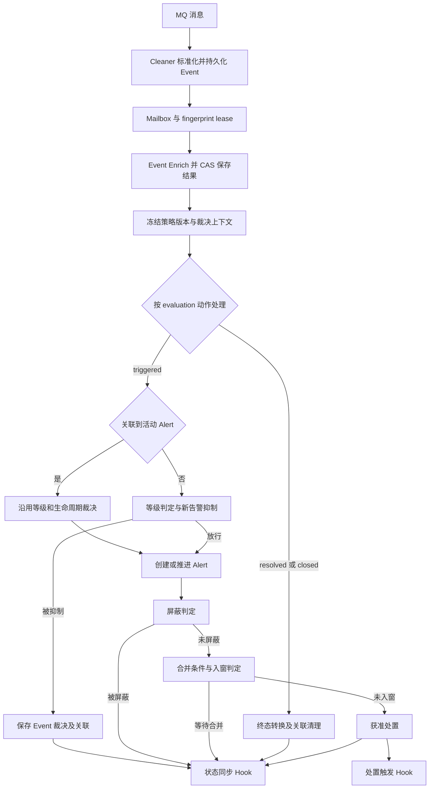
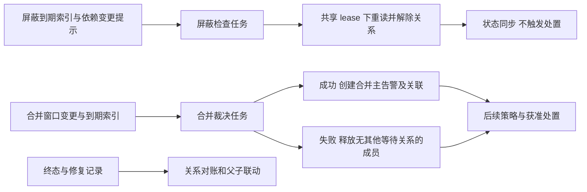

# Event 丰富与告警抑制、屏蔽、合并开发方案

> 2026-10-08 新决策：[KAC 全局兼容插件](kac-compatibility-plugin.md)统一启用兼容存储和处置通知，
> Linkd 直接接管原 alarm_event 索引及告警状态，移除逐来源/逐租户目标和 projection_endpoint。
> 正文按当前实现维护；第 11.1 节中带日期的 HTTP 投影、来源目标及验收记录保留为历史，不能覆盖新实现。

> 状态：核心处理及全局兼容插件已实现，现有实现已完成本地验收；KAC 接入及部分 Console 增强仍未完成。
> 更新时间：2026-10-08。本文记录已确认业务规则、当前字段与配置、历史实施证据及剩余差距。
> 当前完成边界以第 11.2 节为准，历史验证证据见第 11.1 节；本地验收不表示 KAC 实际应用联调或生产上线。
> 本轮决策：Alert 固定使用 opening Event 结果；KAC alarm_event 是 Alert 的兼容投影；策略异常跳过并观测；
> Redis 计数/窗口丢失后重新累计，不做强一致重建。合并主告警采用成员集合身份、内部 Event、默认空 Enrich 和独立内置 EventSource。

阅读入口：

- [总体流程](#2-总体流程与处理边界)与[字段变更](#3-字段与存储变更计划)。
- [公共配置](#5-公共策略配置与匹配)、[抑制](#6-抑制策略详细设计)、[屏蔽](#7-屏蔽策略详细设计)、[合并](#8-合并策略详细设计)。
- [一致性与恢复](#9-redis持久化与恢复协议)、[API 与 Console](#10-apihook-与-console)。
- [实施阶段](#11-开发阶段与代码影响)、[验收矩阵](#12-测试与验收矩阵)、[决策记录](#13-差异清单与已确认决策)。
- [当前能力与剩余差距](#112-当前能力与剩余差距2026-10-08)：区分核心实现、KAC 接入、Console 增强和真实环境验收。

## 1. 目标、基线与决策状态

### 1.1 本次交付范围

目标是在 Linkd 内承接 KAC 原有的告警抑制、屏蔽和合并能力，同时将 Enrich 前移到 Event，并提供
Console 管控、调试和观测入口。本文是这项跨模块改造的统一开发与验收入口；实现已同步到模型、
配置与模块文档，历史阶段记录保留当时的能力边界。

本次开发范围包括 Linkd 后端、存储、策略同步 API、控制面任务、Hook 协议适配和 Console。
KAC 侧的配置同步程序、旧处理入口改造、历史运行状态迁移和正式切流不在本次范围内。
KAC 仍是策略编辑入口，Console 不另建一套可与 KAC 互相覆盖的策略编辑流程。

调研基线：

| 对象     | 源码快照                                          | 本文如何使用                                                         |
| -------- | ------------------------------------------------- | -------------------------------------------------------------------- |
| Linkd    | `bkmonitor-datalink` 的 `feat/linkd-dev@49e0db23` | 当前模型、Enrich、Lifecycle、Repository、控制面与 Console 的改造起点 |
| KAC      | `kingeye@1874066858`                              | 抑制、屏蔽、合并的行为基线，不代表已读取目标环境线上配置             |
| 编写时验证状态 | 方案起草时仅只读源码调查与文档编写            | 后续实际实现和验证证据持续记录在第 11.1 节，不用基线代替当前状态       |

### 1.2 已确认的要求

| 主题       | 决定                                                                         |
| ---------- | ---------------------------------------------------------------------------- |
| KAC 一致性 | 核心策略逻辑尽量保持一致；影响业务结果的调整须列出差异，不能默默替换         |
| 策略作用域 | 策略按租户管理，可以匹配多个 EventSource；不归属于单个 EventSource           |
| 防抖       | 按同一来源告警身份分别计数，不把不同来源的次数自动相加                       |
| 关联聚合   | 按选择的字段跨来源关联；除非显式选择来源字段，否则分组不包含 EventSource     |
| 抑制归属   | 抑制判定属于 Event；不能把正常主 Alert 标成“被抑制”                          |
| 丰富归属   | Event 保存 Enrich 信息；策略使用丰富后的有效视图                             |
| Alert 丰富 | 固定使用创建该 Alert 的首条有效触发 Event，后续 Event 不刷新其丰富或展示快照 |
| Alert 状态 | `status` 只描述生命周期；屏蔽、合并使用独立字段                              |
| 解除屏蔽   | 定时任务只解除关系、写流水、同步状态；等下一条触发 Event 才继续后续处理      |
| 合并执行   | Lifecycle 判定是否入窗；控制面独立裁决合并和失败释放                         |
| 输出       | 同步完整状态，并阻断被抑制、屏蔽或等待合并时的处置触发                       |
| 匹配引擎   | Go 内存匹配；优先复现 KAC 语义，无法等价的配置明确报告或拒绝                 |
| 目标解析   | Linkd 自行实现完整目标解析，不要求 KAC 同步已展开实例快照                    |
| 工程修正   | 接受 Redis 原子更新、无碰撞分组编码、确定性合并身份及周期窗口交界修复        |

本轮进一步确认：

| 主题         | 决定                                                                                                |
| ------------ | --------------------------------------------------------------------------------------------------- |
| 防抖时间     | 按首次参与裁决的处理时间计算滑动窗口，达到阈值的当前 Event 放行                                     |
| 依赖屏蔽选主 | 已放行活动主告警优先；没有时第一个原子登记成功的候选成为主告警；已建立关系不随新主告警切换          |
| 策略时区     | 显式时区，缺省 Asia/Shanghai；跨午夜拆为两段；时间起止边界沿用包含语义                              |
| 多级别丰富   | 公共查询执行一次，等级相关结果按 evaluation 保存；同 Event 对同策略同身份最多计数一次               |
| 分组有效值   | 明确定义有效类型与空值，0/false 有效，不保留 KAC 的 falsy 判断                                      |
| KAC 数据关系 | alarm_event 是 Alert 的兼容投影；一个 Alert 生命周期对应一条稳定投影，更新而非逐 Event 新建         |
| 投影可靠性   | 持久化待同步状态、异步重试、版本防回退、失败可重试；不能依赖可丢失的 Redis 计数状态                 |
| 策略故障     | 本版运行时评估或协调失败跳过受影响策略，记录指标、日志与诊断，不因策略故障长期阻塞事件              |
| Redis 丢失   | 计数重新计数、窗口重新累计，允许短期策略效果改变，正常运行，不暂停等待全量重建                      |
| 合并主告警   | 已确认：成员集合身份、内部 Event、默认空 Enrich、独立内置 EventSource，以及先主告警后成员关系的顺序 |

本文正文描述当前实现规格；精确 HTTP 路径、字段编码和预算以对应契约及代码为准。
第 13 节记录已确认业务结论和后续调整，未完成能力在第 11.2 节单独列明，不以规划代替实现。

### 1.3 调研基线与目标的差异

| 调研基线代码                                           | 目标改造                                                               |
| ------------------------------------------------------ | ---------------------------------------------------------------------- |
| Event 只允许补写 `related_alert_ids`，没有 Enrich 字段 | 来源事实继续不可变，允许通过专用 CAS 追加并冻结 Enrich 结果            |
| 创建新 Alert 时才执行 Enrich                           | 每条不同 Event 在策略裁决前执行并保存丰富结果                          |
| 同级推进、原地升级沿用 Alert 旧丰富结果                | 保留首次快照；新 Alert 直接复制 opening Event 的丰富结果，不再独立丰富 |
| `suppressed` 主要表达同 fingerprint 的等级抑制         | 区分等级抑制、重复触发、防抖未达阈值、关联聚合等原因                   |
| suppressed Event 必须存在关联 Alert                    | 防抖未达阈值时允许无 Alert，仍可追溯窗口和后续结果                     |
| Alert 只有生命周期状态和丰富状态                       | 增加正交的屏蔽、合并信息                                               |
| FinalHook 以 Alert 快照为输入                          | 区分 Event 裁决、Alert 状态变化与获准处置动作                          |
| 没有三类策略配置和运行时                               | 增加策略快照、匹配、Redis 协调与控制面任务                             |

本表保留方案编写时的基线差异；实施进度见第 11.1 节。现行模型以[核心模型](define.md)、[丰富设计](enrich.md)和[Lifecycle](../modules/lifecycle.md)为准。
上述差异是本次计划修改的明确目标，不是当前代码违反已实现契约的缺陷报告。

## 2. 总体流程与处理边界

### 2.1 事件主流程



图中的“放行”只说明通过相应阶段，不代表下游副作用已成功。每个阶段都必须分别记录判定结果与
执行结果。被抑制 Event 仍是已持久化、可查询的事实；不得因为没有 Alert 而丢失它的丰富和诊断。

执行要点：

1. Cleaner 继续负责稳定身份、标准等级、原始快照和入队；不增加策略查询或外部丰富调用。
2. Lifecycle 在已有 fingerprint 串行边界内先完成 Event 丰富，再根据冻结的输入生成处理计划。
3. 同一 Event 有多个 evaluation 时，共享丰富结果，逐 evaluation 记录动作与结果；数组顺序不代表执行顺序。
4. 恢复/关闭绕过触发准入门槛，不能因防抖未达次数、屏蔽或等待合并而失去清理机会。
5. 同一 Event 的终态与新触发组合沿用现有等级裁决规则；策略不能提前吞掉合法的终态或升级操作。
6. Event、Alert、日志与输出仍按稳定身份和既有 CAS 计划处理重试；Redis 策略窗口不要求跨存储强一致重建。
7. 策略评估/协调异常跳过当前受影响策略并继续后续流程，记录 skipped/error；租户校验、基础持久化、
   生命周期 lease 和必需的投影意图保存失败不能伪装成普通策略跳过，具体分类见第 9 节。
8. **防抖和关联聚合只约束尚无活动 Alert 的新告警候选。** 按 `(tenant, source, fingerprint)` 找到活动
   Alert 后，同级重复触发、更新、低等级触发和升级都不执行这两项策略，也不增加计数或抢占聚合窗口。
   `close_and_create` 升级虽会创建新 Alert，仍属于已有活动生命周期的升级，不能重新等待防抖或被聚合吞掉。
   此边界不依赖 Alert 是否已获准处置：屏蔽中、合并等待中的活动 Alert 同样绕过这两项策略。
   屏蔽、合并和重复处置判断分别继续执行；绕过防抖不意味着再次获准处置。

### 2.2 控制面独立流程



控制面不能直接绕过 Lifecycle 私有实现修改 Alert。复用消费者定义的窄用例接口、同一租户边界、
fingerprint lease、CAS、日志身份和 Hook 装配。事件提示只用于加速，定时检查负责在没有新 Event 时推进任务。

全局 `plugins.kac` 开启后，控制面另行运行兼容索引维护、投影生产/写入和动作入队/发送循环。
Alert 业务 CAS 保存同步要求和获准动作意图；兼容 ES 文档确认可搜索后，已获准动作才通过发送门槛。
来源 Release 仅用于业务溯源，不提供 KAC 出口路由；索引维护失败独立重试，可靠任务保留待办。

### 2.3 三种容易混淆的身份

| 身份                              | 示例用途                                   | 不能替代什么                           |
| --------------------------------- | ------------------------------------------ | -------------------------------------- |
| `EventID`                         | 一次输入事实的去重、Enrich 结果与裁决身份  | 不能用来累计“同一个告警问题”的持续次数 |
| `(tenant, source, fingerprint)`   | Linkd 生命周期关联、默认重复抑制和防抖计数 | 不能直接用于跨来源关联聚合             |
| `(tenant, policy_version, group)` | 关联聚合或合并分组                         | 不能取消成员自身的来源身份或租户边界   |

KAC 的“同一事件计数”中，`event_id` 表达告警关联身份。它不等于 Linkd 表示一次消息事实的 `EventID`。
迁移必须按语义映射，不能只因为字段同名就直接替换。

## 3. 字段与存储变更计划

### 3.1 Event

| 字段                   | 类型与初值建议                      | 写入者及语义                                                      |
| ---------------------- | ----------------------------------- | ----------------------------------------------------------------- |
| `enrich_status`        | 现有 EnrichStatus，创建时 `pending` | Lifecycle 丰富结束后写入 `succeeded/partial/failed/skipped`       |
| `enrich`               | JSON object                         | 逐 severity 保存 `{severity,status,data}`；data 复用 `processors` envelope、patches 和 diagnostics |
| `enriched_at`          | 可空 UTC 时间                       | 丰富结果正式提交时间；不是业务身份组成部分                        |
| `enrich_config_digest` | 字符串                              | 标识本次实际使用的丰富配置，辅助重放与排障                        |
| `related_alert_ids`    | 最多 32 个 ID，与 evaluation 上限一致                    | 保存本次直接影响或实施抑制的 Alert，不塞入全部窗口成员            |

约束与写入流程：

- `SourceRawData`、身份、来源版本、evaluations、values、dimensions 等来源事实不被丰富覆盖。
- 生效视图由 Event 来源字段和有序补丁计算；`extra_data` 不充当 Enrich 状态或临时工作区。
- 丰富结果通过专用 CAS 从 pending 提交至完成态；完成态重试读取同一结果，不按新配置覆盖。
- CAS 前进程失败可能重新调用只读 Processor；因此“结果复用”不等于外部查询只调用一次。
- 保存完成结果前不得执行 Redis 计数、占位、入窗或外部业务动作。
- 预览只执行只读计算，不写 Event、不计数、不创建窗口。

### 3.2 EventProcessing 与 EventPlan

当前在现有对象中保存以下信息，不另建一套互相竞争的 Event 总状态：

| 对象/字段                         | 内容                                                      |
| --------------------------------- | --------------------------------------------------------- |
| `EventProcessing.policy_decision` | 保存抑制、屏蔽和合并裁决摘要及逐 evaluation 结果             |
| `EventProcessing.policy_context.releases` | 已实现：冻结策略 ID、类型、版本和编译摘要；不保存完整配置副本 |
| `policy_context.evaluated_at` | 已实现：首次策略时间，重试复用 |
| `policy_context.reason_code` | 已实现：配置依赖失败时记录 `policy_load_failed`，与无策略区分 |
| `Event.merge_origin` | 内置来源的不可变裁决引用：operation_id、策略版本、window_id、成员摘要/数量；外部来源不能写入 |
| `policy_decision.shield` | 新匹配或复查绑定的策略版本、原因、绑定 ID；复查旧绑定显式标记 `from_binding` |
| `policy_decision.suppression`     | 已实现活动 Alert 绕过、逐等级计数/阈值、策略版本、固定聚合窗口及主 Alert 引用；失败按独立 skipped 诊断保存 |
| `EventPlan` 扩展                  | 稳定步骤 ID、待执行的策略状态变更、输出意图及其完成标记   |

`policy_context` 在 Event Enrich 完成后、Plan 或任何策略 Redis 操作前通过 Event Result CAS 保存。
它只允许首次写入或相同值重试；后续 CAS 省略该字段表示保留，不能用 nil 清空。临时 Plan 撤销、
最终结果提交和消息重投均保留这份上下文。授权或租户错误仍拒绝处理，不按普通配置读取失败降级。

原因码包括 `duplicate_trigger`、`clip_below_threshold`、`aggregation_suppressed`；既有
`severity_suppressed`、`evaluation_superseded` 保持各自含义。失败诊断使用独立错误字段，不能把
Redis 故障伪装成这些正常业务结果。

Event 级 `state` 继续聚合逐 evaluation 结果；例如同一 Event 的低等级触发被抑制、高等级恢复成功，
必须能同时查询两个结果。纯防抖抑制允许 `related_alert_ids` 为空。已完成 Event 不回写成“放行”，
通过抑制窗口成员关系查询后续建立的 Alert。

无 Alert 的裁决记录保存在 EventProcessing 和策略运行记录中，不生成虚假的 AlertID 来满足 AlertLog 校验。

### 3.3 Alert

| 字段                   | 建议形态                                                                          | 含义                                                                                            |
| ---------------------- | --------------------------------------------------------------------------------- | ----------------------------------------------------------------------------------------------- |
| `status`               | 现有枚举                                                                          | 仅描述 active/recovered/closed                                                                  |
| `shield`               | `{active, bindings, next_check_at}`                                               | 当前屏蔽关系摘要；bindings 指向策略版本、依赖 Alert 和有效区间                                  |
| `merge`                | `{role, state, pending, relation_ids, operation_id, relations_ready}`                                 | 原始/合并主告警角色，等待或参与合并的独立状态                                                   |
| `trigger_event_id`      | EventID                                                                           | 创建本 Alert 的 opening Event；创建后固定不变                                                   |
| `enrich_status/enrich` | 现有类型                                                                          | opening Event 的完整丰富快照，后续不刷新                                                        |
| `admission` | `{admitted_at, severity, cause_type, cause_id}` | 最近一次实际放行，升级被屏蔽时保留旧等级，不能据此抑制尚未放行的新等级 |
| `policy_tags` | 排序去重的正整数 ID 列表 | 策略显式追加的 KAC 标签，与 opening Event 的普通标签分开；总量最多 256 |
| `merge_change` | `{kind, operation_id, window_id, relation_id, effective_at, before, after, action_ready}` | 合并释放、建联、父就绪、解除和父恢复的待完成输出/流水意图；与状态 CAS 一起保存，后续事件及直接关闭先完成它 |
| `policy_change` | 控制面状态变更的待完成意图 | Alert 状态 CAS 同时保存前后绑定与稳定操作；完成状态输出尝试及流水后仅清除元数据 |
| `revision`             | 正整数，首次为 1                                                                  | Alert 业务快照的单调版本；用于投影排序，不能使用不透明 Repository VersionToken 或 UpdateAt 比较 |
| `projection`           | `targets[target_id]: {source_version, action_enabled, required_revision, synced_revision, synced_at}`，重试诊断另存任务 | 必需 KAC 投影的持久化同步进度；action_enabled 显式选择获准动作，省略/false 只同步状态 |
| `action_pending` | `{revision, action, cause_type, cause_id, targets[target_id]: source_version}` | 与获准业务变更同次 CAS 保存的入队意图，全部目标任务持久且排序可见后清除；不是远端处置状态 |

`merge.role` 建议区分 `original/aggregate`；成员状态建议为 `none/pending/merged/released`。
由于同一成员可以命中多个策略，标量状态只是摘要，具体等待与父子关系由关系记录决定。
合并主告警是否结束仍看 `status`，不能从 `merge.state` 推断。

当前模型使用可选 `Alert.merge`：nil 表示原始告警未参与合并；非空时 role 只允许 original/aggregate，state
只允许 none/pending/merged/released。`pending` 最多 32 项，每项保存窗口 ID、策略版本、分组键、首次
Event/等级、命中组、开始及截止时间；同一窗口引用不可原地改时间或成员匹配视图。关系摘要最多 32 项，
完整关系需要独立分页。aggregate 的 operation_id 不可改变，relations_ready 必须由真实关系建立后推进，
不能用预计父 AlertID 或 Redis 的成功冻结代替。当前已实现模型、用例端口、生产 Worker 和独立裁决/关系任务；完整组合验收仍在推进。

同一个 Alert 可以同时满足：

```text
status=active,    shield.active=true,  merge.state=none
status=active,    shield.active=false, merge.state=pending
status=recovered,shield.active=false, merge.state=merged
```

Alert 不增加 `suppressed` 生命周期或通用抑制标志。后续同身份 Event 可以推进最近发生时间、计数、
生命周期及屏蔽/合并状态，但不刷新 Alert 的标题、内容、主体展示、普通标签、来源扩展和丰富快照。
明确的策略标签变更属于独立策略动作，不是从后续 Event 自动刷新普通标签。该 Event 被重复触发抑制时
不再次触发处置；跨来源聚合抑制也不覆盖主 Alert 内容。

这里“第一条 Event”指**实际创建该 Alert 的 opening Event**，不一定是最早进入防抖的 Event。
例如 E1、E2 被防抖抑制，E3 达到阈值创建 A1，则 A1 固定使用 E3 的来源字段、Enrich 结果和对应等级视图。
E3 是 partial/failed 时也按实际状态保留，本版不借后续 E4 自动补丰富；每条后续 Event 的独立结果仍可查询。
等级原地升级只更新等级和生命周期，沿用首次丰富；close_and_create 产生的新 Alert 使用创建它的新 Event。

Alert 初始输入基底和丰富补丁一起冻结，禁止把后续 Event 的补丁应用到首次 Alert 的旧字段。
业务字段或策略状态变化递增 revision 并提交新的投影目标；仅更新投影 ACK、重试次数时不递增业务 revision，
避免投影 ACK 自身触发无限同步。

### 3.4 策略与运行记录

本版分开处理可丢失的策略运行状态与需要可靠同步的告警事实，不为 Redis 计数/窗口增加完整恢复日志。

| 对象                            | 存储                             | 主要内容及丢失语义                                                              |
| ------------------------------- | -------------------------------- | ------------------------------------------------------------------------------- |
| PolicyRecord / PolicyRelease / PolicyOperation | ES 或 MySQL                      | 配置、版本、编译结果和停用/删除信息；必须持久化                                 |
| Event / EventProcessing         | ES 或 MySQL                      | 来源事实、丰富、裁决或跳过诊断；已完成结果继续复用                              |
| Alert / AlertLog                | ES 或 MySQL                      | 生命周期、首次丰富、屏蔽/合并摘要及业务日志；必须持久化                         |
| 抑制计数、聚合占位及短期成员    | Redis                            | 允许故障丢失；后续事件重新累计、重新建立窗口                                    |
| 未裁决 MergeWindow 与条件成员   | Redis                            | 允许故障丢失；不从历史 Event 全量回放重建                                       |
| ShieldBinding / MergeRelation   | Alert 中的有界摘要及分页关系存储 | 已经发生的业务关系需可查询；查询加速索引可用 Redis，丢失不暂停全局处理          |
| 完成的合并/释放结果             | Event/Alert/日志及稳定操作身份   | 保存已经生效的业务结果，不作为未裁决窗口的强一致恢复日志                        |
| ProjectionTask / ActionDelivery | ES 或 MySQL                      | KAC 投影及获准处置的待投递记录、版本、重试、结果；不因 Redis 计数丢失而删除     |
| projection 同步目标/水位        | Alert 的持久化元数据             | Alert 提交与 required_revision 同一次 CAS；补扫可发现尚未生成或未完成的投影任务 |

禁止把所有成员无限追加进一个 Alert 或 Redis value；列表分页、计数有界。Alert 的 pending 合并摘要
保存原窗口截止时间，窗口丢失时仍能到期结束等待，不能永久挂在 pending；不必为此重建丢失的历史成员。

ES/MySQL 和内存仓储同步实现业务字段往返、CAS、关系及投影任务查询。ES 查询检查 timed_out 和分片
失败；不完整结果记录为依赖失败，按第 9 节分类处理，不能假报“查询成功且没有成员”。

### 3.5 日志、查询与枚举联动

AlertLog 的 `operation_kind` 需扩展屏蔽、解除、等待合并、合并、释放及关系结束等可区分操作；
`params` 保存策略版本、窗口/关系引用和原因，不能放入无上限的成员列表。控制面推动的变化使用稳定
system operation cause，不伪造来源 Event；已有 Event 驱动的变化保留真实 Event cause。

Event 查询增加丰富状态、抑制原因和策略身份过滤；Alert 查询分别增加屏蔽状态、合并阶段和关系过滤。
ES mapping、MySQL 字段/索引、实体 clone/normalize/validate、局部更新白名单、事件重投对比、
归档复制、Console 查询 DTO 和 Hook 编码必须一起调整。仅在 Go struct 增加字段不足以完成交付。

## 4. Event Enrich 的迁移细节

### 4.1 接口与执行频率

```go
// 当前已采用的 Event 丰富接口。
type Input struct {
    Event   domain.Event
    Preview bool
}

type EventEnricher interface {
    Enrich(ctx context.Context, input enrich.Input) (enrich.Result, error)
}
```

输入直接使用 Event；Scope、Router、Processor、TestSource、观察指标和预览接口同步改名和调整。
不先创建虚拟 Alert，不保留内部 Alert 输入兼容层。已有 `processors` envelope 和可丰富字段保护规则复用。

Enrich 从“每次新建 Alert”变为“每条不同 Event”。重复上报但 EventID 不同也需要丰富，这是支持
事件级策略匹配的成本变化。必须复用请求内缓存、有界工作池和已提交结果，并重新测量依赖请求量；
不使用跨 Event 的无版本缓存悄悄替代本次输入。

一个 Event 有多个 severity evaluation 时，与等级无关的资源查询只执行一次；文案算法等依赖等级的
部分显式接收 evaluation 上下文，结果按标准 severity 关联保存。Alert 创建时复制公共结果和其选中等级
的结果；不将 Event 强行压成一个 severity。自定义规则明确读取 event 或当前 evaluation，禁止隐式任选。
新增逐 evaluation 结果要一起扩展 enrich envelope 校验及预览，具体内部编码由实现确定，不再作为业务待决项。

### 4.2 持久化与重投

1. Cleaner 创建 pending Event；ACK 仍以 Event 持久化和 Mailbox 入队成功为边界。
2. Lifecycle 获取 Event，已完成处理则复用结果；丰富未完成则按其来源发布版本执行。
3. CAS 保存丰富结果、配置摘要及完成时间。
4. 冻结当前策略版本、目标解析证据和首次裁决时间。
5. Redis 正常时使用稳定操作身份去重，将裁决或策略跳过结果保存到 EventPlan/处理结果；Redis 丢失后允许
   尚未持久化结果的操作按新状态执行，不为恢复已丢计数、窗口增加全量意图日志。
6. 提交最终 EventProcessing 后才允许移除对应 Mailbox 队首。

必须修改 Event replacement/redelivery 校验，使“新消息中未含服务端追加的 enrich”与“来源事实发生
冲突”可以区分。来源重投不能擦除已完成 Enrich 或策略结果。

### 4.3 失败与 Alert 投影

- 沿用已有单 Processor failed/partial 和后续 Processor 继续执行机制；父取消立即返回。
- 缺少可信实例身份时，依赖该字段的条件必须报告不可评估，不能把错误当作空字符串而误命中否定条件。
- 创建 Alert 时复制 opening Event 的快照并固定来源；后续触发、恢复、关闭 Event 均不刷新该快照。
- 第一条 Event 的丰富失败不会被后续成功结果静默覆盖；Event 详情可查看后续结果，但本版不增加自动或手动刷新 Alert 功能。
- 策略需要的字段因丰富失败而不可评估时，跳过受影响策略并记录诊断、指标和日志，不拿历史 Alert 丰富结果补当前 Event。
- Alert 详情明确展示 opening Event 及其丰富状态，避免把首次快照描述成实时资源状态。

## 5. 公共策略配置与匹配

### 5.1 配置封装

建议 Linkd 同步接口使用如下封装。`spec` 尽量保留 KAC 字段名，运行时使用发布时生成的规范化结构。
下文示例中的 `schema_version` 是拟新增的 Linkd 策略输入版本，不表示 KAC 现有 API 已有该字段。

```json
{
  "schema_version": 1,
  "bk_tenant_id": "tenant-a",
  "type": "suppression",
  "id": "policy-db-noise",
  "expected_version": 0,
  "operation_id": "kac-sync-policy-db-noise-001",
  "spec": {
    "name": "数据库告警抑制",
    "is_enable": true,
    "updated_at": "2026-09-29T09:00:00+08:00",
    "space_code": "bkcc__2",
    "timezone": "Asia/Shanghai",
    "policy": {
      "A": {
        "condition": "wildcard",
        "target_key": "name",
        "target_value": "数据库"
      },
      "expression": "A"
    },
    "activate_times": [
      {
        "period": "everyday",
        "open_clock_time": "00:00:00",
        "close_clock_time": "23:59:59"
      }
    ],
    "scheme": [
      {
        "name": "防抖抑制",
        "type": "clip",
        "duration": 60,
        "duration_type": "second",
        "count": 3
      },
      {
        "name": "关联聚合",
        "type": "aggregation",
        "duration": 10,
        "duration_type": "minute",
        "fields": ["model_id", "model_inst_id", "name"]
      }
    ]
  }
}
```

公共规则：

- `type` 建议为 `suppression/shield/merge`；同步适配将 KAC 的 `converge` 映射为 `suppression`。
- 身份为 `(bk_tenant_id, type, id)`；同一租户内 ID 不因 EventSource 改变。
- 配置更新使用 `expected_version` 防止旧配置覆盖新配置；相同 operation 和相同内容重试返回同一结果。
- 原始配置可查询，规范化配置补充秒数、编译条件和摘要；不信任调用方传入的 `real_duration` 或 `is_effective`。
- KAC 这三类策略当前主要按 `updated_at` 倒序执行；保留该顺序，相同时间以 ID 稳定排序。
- `model_id/target_descriptor` 成对提供；KAC 屏蔽要求目标范围，抑制和合并允许无实例描述。
- 无目标描述不代表跨租户或绕过业务范围。业务空间、实例范围、筛选条件分别校验后取交集。
- KAC 的权限、标签目录和展示名称不能凭空推导；适配所需的数据源和未支持字段必须在发布时可见。

KAC 的 `alarm_tags` 应作为屏蔽/合并配置的业务字段保留：命中或生成主告警时按原规则应用标签。
标签不是租户授权凭据；不能通过编辑标签扩大实例查询范围。

配置更新只影响新的裁决。已保存步骤和合并窗口继续引用原 Release；删除保留 tombstone 和尚被引用的
旧快照，完成清理后再按保留规则回收。停用/删除时安排待完成窗口释放和屏蔽关系检查，不直接删除 Redis key。

### 5.2 条件与字段映射

| KAC 配置         | Linkd 实现方向                           | 必须验证的差异                               |
| ---------------- | ---------------------------------------- | -------------------------------------------- |
| `term/terms`     | 单值或集合精确匹配                       | 数字/字符串转换、多值字段和缺失值            |
| `wildcard`       | 复现 KAC“包含”的已知文本规范化后匹配     | KAC 实际执行 `match_phrase`，不是 `*` 通配符 |
| `regexp`         | 预编译并对齐完整值匹配                   | ES 正则、Python 正则与 Go 正则语法不能混同   |
| `must_not_*`     | 对定义明确的匹配结果取反                 | 不可评估不是 false，不能通过取反变成命中     |
| `expression`     | 解析标识符、AND、OR 和括号为有界表达式树 | 拒绝未知变量、非法语法与超深树               |
| `bk_obj_asst_id` | 租户内解析 canonical 关系和方向          | 不直接将旧模型短名当 OneModel model_id       |

KAC 已有 AST 是对账输入，不能当作当前正式匹配引擎：源码最后仍返回 legacy ES 的结果。
Linkd 迁移需与实际 ES 结果对照，尤其是中文、连续空格、大小写、空数组、缺失字段和正则特殊语法。
不支持的表达式返回具体配置位置；不得悄悄忽略条件或退化为全量匹配。

旧字段通过显式只读适配视图映射：

| KAC 字段                            | 数据来源计划                                                      |
| ----------------------------------- | ----------------------------------------------------------------- |
| `name/content/object`               | Event 或 Alert 的有效标题、内容、主体展示                         |
| `level`                             | 当前 evaluation 的标准 severity 与 KAC 等级映射                   |
| `source_id/source_name`             | 丰富后的 KAC 来源身份，不能直接假定等于 Linkd EventSourceID       |
| `alarm_time`                        | 当前处理对象对应的来源发生时间，保持时间单位与时区说明            |
| `model_id/model_inst_id/entity_uid` | 丰富后的可信 canonical 实例身份                                   |
| `bk_biz_id` 等业务字段              | 按现有丰富分组映射，区分来源业务和资源所属业务                    |
| 自定义字段                          | 显式映射到有效视图中的 labels/extra_data，不遍历原始 payload 兜底 |

`EventID`、生命周期 fingerprint、KAC 来源 event_id 分属不同身份空间，不能作为别名混用。
`conductor`、有效标签目录等依赖 KAC 处置态的条件列为兼容清单项目，未具备数据源时必须拒绝，不能假支持。

### 5.3 生效时间

保留 `activate_times` 的任一时间段有效即生效语义：

| `period`      | 配置字段                                                |
| ------------- | ------------------------------------------------------- |
| `once`        | `open_datetime_once`、`close_datetime_once`             |
| `everyday`    | `open_clock_time`、`close_clock_time`                   |
| `every_week`  | 每日时段及 `day_for_week`，周一为 1，支持逗号列表或 `*` |
| `every_month` | 每日时段及 `day_for_month`，支持逗号列表或 `*`          |

KAC 时间判定两端包含，普通策略空时间集合不生效；依赖屏蔽在启用后不依赖这些时段。
跨午夜时段不得自动换一种解释，应拆成两个时段或在校验时明确拒绝。
Linkd 策略明确保存 timezone，缺省 `Asia/Shanghai`，存储绝对时间统一 UTC；周期时段按该时区求值，
不跟随进程操作系统时区漂移。同步端未传时区时使用上述缺省。KAC 当前主要按服务器 TIME_ZONE 判断，
此处改成明确策略时区，属于本轮已接受的行为整理。跨午夜区间发布时拒绝，要求配置为两个区间。

### 5.4 目标解析

沿用 OneModel `TargetDescriptorV1`，不由 KAC 预先展开：

```json
{
  "schema_version": 1,
  "model_id": "cw-Host",
  "selectors": [
    {
      "type": "instances",
      "instances": [
        {
          "model_id": "cw-Host",
          "model_inst_id": "101",
          "entity_uid": "cw-Host|101"
        }
      ]
    },
    {
      "type": "topo_node",
      "provider": "cmdb_mainline",
      "topology_node_id": "module-8",
      "bk_biz_id": 2
    },
    { "type": "dynamic_group", "provider": "kingeye", "dynamic_group_id": "23" }
  ]
}
```

示例身份用于说明结构，实际值必须来自当前租户对象目录。selector 合并后去重，随后与策略业务范围取交集。
平台自建动态分组应读取分组定义、模型及范围并按条件实时求值，不能把成员缓存当完整解析结果。
拓扑节点与动态分组需要保持 KAC 现有业务范围约束；动态拓扑、关系方向和 canonical ID 复核不能省略。

上述交集以所有 selector 完整成功为前提：显式实例缺失或不属于授权业务，不是可以静默丢弃的有效
空成员；任何 selector 不完整时整条策略不可求值，不使用其他 selector 的成功子集。合法节点/动态
分组完整查询后的零成员则是有效空集合，不影响仍由其他 selector 选中的实例。全局业务从当前租户
业务目录展开，拓扑指定 `bk_biz_id` 时只读取该分支，未指定时逐业务解析；绑定具体业务的动态组在
该业务内执行，全局动态组仍受策略授权范围限制。当前租户确实没有可用业务时返回完整空集合，不能
借用其他租户或把全局标记解释成无约束查询。selector 顺序不改变最终排序并集，逐项计数可包含重叠
实例；去重不会重置请求的页数、候选数和字节预算。

基于现有 OneModel SDK 扩展分页查询、拓扑成员读取和动态分组定义读取；共享只读 resources 连接。
定义读取可使用已有 Kingeye MySQL 适配方式，成员与关系使用实际模型数据源；不能假定所有模型都落在同一 ES alias。
解析失败、超限或部分结果均产生明确诊断，不返回截断成功。

当前实例目标分页每页 200 条，一次解析最多 256 页、20000 个候选、32 MiB 实例数据及 10000 个最终
实例。主机拓扑另以每节点 200 条 Scroll 读取完整 membership，最多 20000 条路径记录、32 MiB 累计
投影数据；路径去重后仍需回查真实实例及所属业务。成功、失败和取消都释放查询快照，不能只限制
单页而无限累计祖先路径。节点不存在属于解析失败；合法节点完整读取后的零成员属于有效空集合。
服务实例通过部署级 `resources.cmdb` 读取实际服务详情与执行主机；显式服务实例要求具体业务。
服务拓扑直接读取业务/集群/模块成员；主机拓扑缓存空或失败时回源，真实树和租户模型目录校验 locator。
动态组仍使用 KAC strict fetcher 对应的定义/实例数据面。调用身份、分页完整性及硬预算见
[CMDB 实时读取配置](../guides/configuration.md#蓝鲸全局配置与-cmdb-实时目标读取)。

### 5.5 分组有效值与编码规则

以下规则统一用于关联聚合 fields 与合并 aggregate_fields；不再保留 KAC 把 0/false 当缺失的行为。
规则只定义分组有效性，不改变筛选条件对 exists、不等于或空值的显式语义。

| 值                               | 是否有效                     | 处理规则                                             |
| -------------------------------- | ---------------------------- | ---------------------------------------------------- |
| 字段缺失、null                   | 否                           | 当前候选不能形成完整分组                             |
| 空字符串、仅空白字符串           | 否                           | 用 Unicode 空白判断是否为空，不形成空分组            |
| 非空字符串                       | 是                           | 保留原文、大小写与实际空白；不自动转数字             |
| 有限数字，包括 0、负数和小数     | 是                           | 数值规范化，1 与 1.0 等价，负零与 0 等价             |
| true / false                     | 是                           | 保留布尔类型，false 不等于 0 或字符串 false          |
| 空数组 []、空对象 {}             | 否                           | 视为不完整分组                                       |
| 非空数组                         | 是，前提是所有元素递归有效   | 保留元素类型、顺序和重复项；不自动展开成多个分组     |
| 非空对象                         | 是，前提是所有属性值递归有效 | 属性名排序后规范化，值类型保持；对象键顺序不影响分组 |
| NaN、Infinity 或超出声明预算的值 | 否                           | 非法 JSON/载荷优先在输入边界拒绝；运行时不可用记诊断 |

例如数字 0、布尔 false、字符串 "0" 是三个不同分组；["a", "b"] 与 ["b", "a"] 不同。
非空对象只因字段顺序不同仍是同组。使用类型化规范 JSON 元组或等价长度前缀编码，再生成摘要；
禁止使用字符串简单拼接或任意对象的语言默认打印值作为 key。

多个分组字段必须全部有效。任一无效时，跳过该策略的本次聚合/合并步骤，记录 invalid_group_value，
继续其余适用策略和后续流程；不丢弃 Event/Alert，也不使用空值兜底聚在一起。一个策略的无效分组
不能覆盖其他策略已经产生的合法关系。条件常量中的 0/false 同样不能被配置解析器当成未提供。

## 6. 抑制策略详细设计

### 6.1 功能与配置

| 功能         | 配置                                              | 行为                                                       |
| ------------ | ------------------------------------------------- | ---------------------------------------------------------- |
| 自动重复抑制 | 无独立 KAC scheme                                 | 已存在实际放行的同身份生命周期时，不再次产生有效触发动作   |
| 防抖         | `type=clip`、`duration`、`duration_type`、`count` | 尚无活动 Alert 的同身份在统计时间内达到次数后放行          |
| 关联聚合     | `type=aggregation`、时长、`fields`                | 首个有效成员成为主告警，在有效期内抑制尚无活动 Alert 的同组 Event |

`duration_type` 保留 `second/minute/hour`，发布时转为秒；次数和时长必须为正且有硬上限。
同一策略同时配置两种 scheme 时，先防抖，放行后再关联聚合。多个策略按配置顺序推进，已被抑制的
候选不继续进入后续屏蔽、合并和处置，但其 Event 仍完成存储与状态同步。
多个 triggered evaluation 按严重程度依次尝试：高等级被策略抑制后，可以继续判断较低等级；选中一个放行等级后，
其余尚未参与策略的低等级触发由原等级规则抑制。单条 Event 对同一防抖策略始终只贡献一次计数。

活动 Alert 的判定在本次 Event 的生命周期裁决入口进行。若该 Event 同时终结已有 Alert 并触发其他等级，
继续按原等级规则推进，不在同一次处理中重新套入防抖或聚合；下一条 Event 到达时确实已无活动 Alert，
才从新告警候选开始评估。活动 Alert 的升级、重复与终态处理仍保存逐 evaluation 结果。

### 6.2 防抖例子与边界

配置：60 秒内同身份出现 3 次。

| 到达     | EventID | fingerprint | 判定                                     |
| -------- | ------- | ----------- | ---------------------------------------- |
| 第 0 秒  | E1      | F1          | 第 1 次，抑制，尚无 Alert                |
| 第 10 秒 | E2      | F1          | 第 2 次，抑制                            |
| 第 20 秒 | E3      | F1          | 达到第 3 次，允许创建 Alert A1           |
| 重投 E3  | E3      | F1          | 复用原结果，不变成第 4 次                |
| 第 30 秒 | E4      | F1          | 同身份已放行，记录重复触发抑制及 A1 关联 |
| 第 40 秒 | E5      | F2          | 另一身份独立计数                         |

不同来源即使 fingerprint 文本相同也独立计数。KAC 同一批次中被自动收敛的不同记录仍参与次数统计；
Linkd 应按不同 EventID 逐项统计，不因消费批次大小变化而少计。

本轮已确认改为**处理时间滑动窗口**：以 Event 首次参与本策略裁决的时间 t 为当前时间，统计闭区间
`[t-duration, t]` 中的不同 EventID，达到阈值的当前 Event 放行；配置阈值为 1 时首条即可放行。
同一 Event 的多个等级对同一策略、同一告警身份最多贡献一次计数。策略匹配仍逐 evaluation 解释。
重试复用首次判定时间；来源发生时间仅用于事实展示，不再混入防抖窗口。Redis 计数和聚合窗口采用毫秒精度，时长配置仍为整数秒。

例如 60 秒内 3 次，按第 0、50、70、80 秒参与裁决：到第 70 秒仅有 50、70 两条，到第 80 秒有
50、70、80 三条，当前 Event 放行。第 0、30、60 秒则在第 60 秒放行，因为起点边界包含。
发生于 10:00、积压到 10:10 才参与裁决的消息计入 10:10 附近的处理窗口。这是明确调整 KAC 混合时间
实现后的语义，应作为预期差异测试，不能继续要求特殊分支逐行兼容。

未达到阈值期间收到恢复/关闭：清理该身份的防抖统计，即使没有 Alert 也要保存终态 Event 的清理结果。
下一次新的触发从新的统计周期开始。不能先因“没有 active Alert”返回 orphan 而跳过清理。

### 6.3 跨来源关联聚合

字段配置 `model_id + model_inst_id + name` 时：

```text
来源 A：Event EA → cw-Host / 101 / 数据库不可用 → 主 Alert A1
来源 B：Event EB → cw-Host / 101 / 数据库不可用 → EB 被抑制并关联 A1
来源 B：Event EC → cw-Host / 102 / 数据库不可用 → 另一分组
```

Key 至少包含部署、租户、策略版本、字段序列和规范化字段值；不能额外加入来源。
按第 5.5 节的明确类型和值规则编码，避免 `ab+c` 和 `a+bc` 碰撞；0/false 有效，不复制旧的隐式字符串转换。
这些已确认差异进入兼容对照测试。

聚合窗口从首个放行成员开始，后续被抑制成员不延长窗口。主告警提前恢复或关闭时解除占位，
后续触发不继续被已经终结的主告警抑制。被抑制成员自身终结只能清理其自身关系，不能删除另一主告警占位。

### 6.4 原子性与清理

- Redis 脚本原子执行成员去重、计数、阈值裁决、主告警占位及必要反向索引更新。
- 聚合候选占位与已放行登记分开；候选租期 30 秒，其他候选有界等待，最多 64 次 × 25ms。真实主告警
  创建并通过处置门槛后登记；未放行、较后策略抑制或丢失占位时不能把 pending 当作有效主。
- 主活动性使用实时单文档读取；复核后再次原子比较 owner/代次，再保存当前 Event 的首次关联结果。
  这是一次有明确检查点的裁决，不宣称 Redis 与主存储具有跨系统事务。
- 同一操作重试返回首次结果；计数和结果不能分别写入而留下重复累计窗口。
- 抑制关联主告警必须能够验证其活动性及放行登记；`Alert.status=active` 本身不足以说明它已通过屏蔽。
- 关闭清理按反向索引定位，比较 owner AlertID 与登记代次后删除，禁止请求路径全局 `KEYS` 扫描。
- TTL 用于物理回收；逻辑到期时间保存在 Redis 状态和必要的 Alert 等待摘要中。
- Redis 状态存在时同 operation 重试不重复累计；状态丢失后计数从新到事件重新累计，不暂停、不全量重建。
- Redis 操作异常跳过当前受影响策略并记录错误；业务结果持久化成功前不将未知结果记为正常未命中或抑制成功。

当前已实现按租户/方式的抑制运行登记、精确快照和保留成员只读查询，契约见
[抑制运行态 API](../reference/contracts/policy-runtime-api.md#抑制路由和查询范围)。防抖补充策略/来源/身份/时长/
阈值元数据，聚合补充固定分组及候选/主与已确认抑制 Event 的成员集合；查询不改变业务计数、成员或 TTL。
每租户、每种抑制方式的登记上限为 65,536，防抖和单聚合窗口的保留成员上限为 10,000；每次写入最多
清除 256 个过期登记。新登记/新成员超限沿用预算失败跳过语义，已有冻结重试仍复用原结果。
这些上限在超预算时触发跳过，范围内的滑动计数和聚合选主遵循前述语义；调整上限须同步边界测试和契约。

## 7. 屏蔽策略详细设计

### 7.1 时间屏蔽配置

以下为 `type=shield` 对应的 `spec` 示例：

```json
{
  "name": "主机维护窗口",
  "is_enable": true,
  "updated_at": "2026-09-29T09:00:00+08:00",
  "space_code": "bkcc__2",
  "timezone": "Asia/Shanghai",
  "reason": "计划维护",
  "shield_type": "time_shield",
  "shield_mode": "",
  "model_id": "cw-Host",
  "target_descriptor": {
    "schema_version": 1,
    "model_id": "cw-Host",
    "selectors": [
      {
        "type": "instances",
        "instances": [
          {
            "model_id": "cw-Host",
            "model_inst_id": "101",
            "entity_uid": "cw-Host|101"
          }
        ]
      }
    ]
  },
  "policy": {
    "A": {
      "condition": "wildcard",
      "target_key": "name",
      "target_value": "数据库"
    },
    "expression": "A"
  },
  "activate_times": [
    {
      "period": "once",
      "open_datetime_once": "2026-09-29 10:00:00",
      "close_datetime_once": "2026-09-29 11:00:00"
    }
  ]
}
```

先判断启用和生效时间，再匹配业务范围、目标实例和条件。命中后创建 ShieldBinding，更新
`Alert.shield`，保留 `Alert.status=active`，停止本次合并及处置触发，同时继续状态同步。

### 7.2 自定义依赖屏蔽配置

`policy` 用来选择被依赖的主告警，`rely_policy` 用来选择需要屏蔽的候选告警，二者不能倒置：

```json
{
  "name": "主机故障屏蔽应用连通性告警",
  "is_enable": true,
  "updated_at": "2026-09-29T09:00:00+08:00",
  "space_code": "bkcc__2",
  "timezone": "Asia/Shanghai",
  "reason": "关联主机故障",
  "shield_type": "rely_shield",
  "shield_mode": "custom_shield",
  "model_id": "cw-Host",
  "target_descriptor": {
    "schema_version": 1,
    "model_id": "cw-Host",
    "selectors": [
      {
        "type": "instances",
        "instances": [
          {
            "model_id": "cw-Host",
            "model_inst_id": "101",
            "entity_uid": "cw-Host|101"
          }
        ]
      }
    ]
  },
  "policy": {
    "A": {
      "condition": "term",
      "target_key": "name",
      "target_value": "主机不可达"
    },
    "expression": "A"
  },
  "rely_policy": {
    "B": {
      "condition": "wildcard",
      "target_key": "name",
      "target_value": "连接失败"
    },
    "expression": "B"
  },
  "time_range_before": 5,
  "time_range_after": 10,
  "activate_times": []
}
```

时间范围单位保持 KAC 的**分钟**：候选告警发生时间在主告警发生前 5 分钟至后 10 分钟之间。
这是成员匹配时间范围，不应不经说明就当成主告警恢复时间或屏蔽关系强制 TTL。

依赖屏蔽的 `model_id/target_descriptor` **仅限制主告警**。子告警按同一租户的业务范围、
`rely_policy`、前后时间范围及配置的关系条件匹配，不要求属于主目标实例集合。例如目标只选择交换机，
仍可屏蔽符合关系条件的主机告警。此规则同时适用于自定义依赖和 CMDB 依赖，时间屏蔽仍对待屏蔽
告警应用目标集合。2026-10-06 已确认该差异：旧 KAC 把主目标集合再次用于子查询，会排除集合外的子。

主告警选择已明确为：优先选择已放行且仍活动的候选，按发生时间倒序、AlertID 升序稳定排序；没有时，
第一个通过 Redis 原子登记的待处理候选成为主告警。保留主告警不能屏蔽自身的规则，不再模拟 KAC 跨
批次“取最早”的隐含边界。并发登记只允许一个成功，失败方使用已登记结果。

ShieldBinding 保存建立时选定的主告警，不因后来出现更新主告警自动迁移；主告警结束后按解除逻辑处理。
只判断当前待处理候选，不回扫已放行历史告警重新屏蔽，不撤销已经发生的处置。

当前实现细节：

- 已放行主要求 `active`、未屏蔽，且最近放行的 severity 等于当前 severity。旧等级曾放行、升级后尚未放行的 Alert 不具备该资格。
- 先选主，再检查子 Event 的前后分钟闭区间；最新主不在子时间范围时，不退而选择更旧的主。`close_and_create` 的同一来源/fingerprint 旧 Alert 不可屏蔽新生命周期。主 Alert 使用固定 opening 快照与 BeginAt；待处理主使用登记 Event 的冻结丰富结果与 OccurredAt。
- 主候选读取按明确租户分页，每页最多 32 条；单次策略检查最多 4096 条、32 MiB，整个屏蔽求值最多 10 秒。读取不完整、超限或实时复核失败时跳过该策略，不从部分结果选主。一次策略内复用完整业务/目标解析结果。
- 新选主时，单条候选因丰富结果不完整而无法读取业务、实例或条件字段，不具备新主资格，继续完成其他候选的扫描；业务范围或目标解析失败仍跳过整条策略。已建绑定的原主无法求值时保留绑定等待重查，不据此解除或改绑。
- Redis 键按 deployment、tenant、策略 ID/版本/digest 隔离，不含 EventSource。pending 租期 30 秒，其他来源最多等待 64 次、每次 25ms；真实 Alert CAS 成功后标记 registered。该主即使被后续策略屏蔽，仍可作为登记的待处理主。
- registered 缓存回收时间为 30 天，owner 反向索引最多 512 项。它们都是协调缓存预算，不是绑定有效期；缓存丢失允许正常重新登记。恢复/关闭按 owner 和 Event 身份清理，旧清理不会删除后来的主。
- ShieldBinding 的 `main_candidate` 仅在使用登记 Event 视图时保存；不存在该字段时使用主 Alert 的 opening 视图。定时检查固定原主，不在原主结束后自动迁移或新建另一条依赖绑定；下一条触发 Event 才重新执行新匹配。

### 7.3 CMDB 依赖屏蔽

配置仍为 `shield_type=rely_shield`，将 `shield_mode` 改为 `cmdb_shield`，在 `rely_policy` 条件中
使用 `bk_obj_asst_id` 描述关联关系。执行步骤为：

1. 按主条件选出被依赖告警，读取其可信 canonical 模型和实例身份。
2. 按租户解析 KAC 关系标识与 OneModel 关系方向，查出可关联的目标实例。
3. 将关系范围、候选条件、前后时间范围结合，排除主告警自身。
4. 保存主/被屏蔽告警关联和使用的策略版本，供恢复及 Console 解释。

主实例缺失、关系查询失败、结果不完整时不能扩大范围。原始关系码与 canonical 关系映射由适配器
显式维护；不能因两个系统均叫“模型 ID”就直接互换。当前适配器保留 KAC 原始 `bk_obj_asst_id`，
按 OneModel `relation_identity` 双向查询，不从短 `relation_code` 拼接；两端 canonical 模型必须经
当前租户的 CMDB/legacy 模型目录核对。

当前有界读取规则为：每个方向最多 1024 条边，双向目标 ID 去重后的并集最多 1024 个，再查询当前
目标实例；每次响应最多 1 MiB。各方向和实例查询都必须完整成功，超过任一预算即整条策略跳过，
既有绑定在依赖不可求值时保留。这是本版明确的关系读取上限；关系使用 OneModel 权威关系边，不以 CMDB 其他接口猜测关系。主机拓扑回源属于目标解析，不改变关系查询接口。
查询前校验租户、模型、起点、关系标识、limit 和过滤条件；响应缺少 `hits.hits`、为 null、带有第二个
JSON 值、部分分片失败或超时均不能当作空关系。复核边两端 canonical 身份及当前实例所属边集合，
最终完整校验所有成员后才判定候选命中，不因首项匹配而忽略后续损坏或重复身份。

### 7.4 定时解除与重复事件

依赖主恢复/关闭后，在其真实 Alert 终态已提交的清理路径发布 Pub/Sub 提示；Worker、人工关闭及复用
相同处理器的系统终态使用同一入口。Redis channel 按 deployment 和 tenant 哈希隔离，载荷只有租户及
主 Alert ID，最多 2 KiB，接收后再次核对租户 channel。发布最多一秒，没有订阅者或失败均不阻止已提交
终态；提示不写持久待办，没有故障回放或 Redis 重建要求。取消仍向上层传递。

独立 shield-hints 控制任务订阅该部署的租户 channel。握手最多三秒，断连五秒后重试；退出显式关闭
订阅连接，不遗留阻塞读取。进程内最多 64 个未结束主提示（含当前页），同租户/主重复合并，队列满丢弃
加速机会。每页最多 16 个当前依赖子告警、查询五秒、页执行上下文 45 秒；满页回到队尾继续，避免单主
大量子关系独占提示队列。失败页丢弃本次提示，原定时扫描继续补齐，不把失败伪装成已检查。

诊断保留最多 16 个绑定和 256 个候选规则步骤，按步骤来源分别解释保留、解除、未命中和跳过；
检查/请求记录最大 256 KiB，Console 每页显示 16 步。解除后继续评估当前规则所产生的合法候选步骤
不会因旧的“只接受绑定诊断”校验而丢失，实际策略执行顺序不变。

检查与定时/手动入口共享四个实际执行名额、正式子告警 fingerprint lease、原绑定复查和状态输出；
不因提示更换主告警、重新丰富、重建抑制窗口或放行处置。最近诊断 trigger=hint，无手动 request_id。
ES 用同次 Alert 写入的主 ID 派生索引定位，MySQL 在租户工作集合内过滤；完整存储边界见
[屏蔽与控制面工作](core-storage-contract.md#屏蔽与控制面工作)。

`linkd.policy.shield.hints` 按固定 outcome 记录发布/无订阅者/发布失败、订阅、非法载荷、排队/合并/丢弃及
检查页成功/失败。这是各步骤的观察数，不是唯一提示数、解除数或处置数；业务身份只进入安全日志。


| 情况                           | 动作                                       |
| ------------------------------ | ------------------------------------------ |
| 时间屏蔽已过有效期             | 重查当前关系和其他有效屏蔽条件，确认后解除 |
| 依赖主告警恢复/关闭            | 事件提示加速检查；定时任务补偿遗漏提示     |
| 被屏蔽 Alert 自身恢复/关闭     | 终结生命周期并清理活动屏蔽关系             |
| 策略停用/删除                  | 停止新匹配并安排已有关联检查               |
| 依赖读取失败或 CAS 冲突        | 保留待检查记录，有界重试，不假成功         |
| 关系已解除，没有新 Event       | 只同步状态和流水，不触发处置或合并         |
| 解除后收到新的 triggered Event | 重新执行适用的触发策略流程                 |

解除关系与“已通过触发准入”是两件事。实现需要保留本生命周期是否实际放行的独立登记，避免解除后
下一条 Event 又被自动重复抑制永久拦住。该登记属于准入协议，不应塞进 `Alert.status`。

## 8. 合并策略详细设计

### 8.1 配置示例

以下为 `type=merge` 的 `spec`。`policy` 是条件组数组，不是普通策略的单个表达式对象：

```json
{
  "name": "数据库与应用联合故障",
  "is_enable": true,
  "updated_at": "2026-09-29T09:00:00+08:00",
  "space_code": "bkcc__2",
  "timezone": "Asia/Shanghai",
  "activate_times": [
    {
      "period": "everyday",
      "open_clock_time": "00:00:00",
      "close_clock_time": "23:59:59"
    }
  ],
  "merge_cycle": 60,
  "max_merge_field_length": 500,
  "is_cycle_merge": false,
  "aggregate_fields": ["bk_biz_id", "model_id", "model_inst_id"],
  "policy": [
    {
      "A": {
        "condition": "wildcard",
        "target_key": "name",
        "target_value": "数据库"
      },
      "expression": "A"
    },
    {
      "B": {
        "condition": "wildcard",
        "target_key": "name",
        "target_value": "应用连接失败"
      },
      "expression": "B"
    }
  ],
  "new_alarm_config": [
    { "key": "name", "value": "实例 ${model_inst_id} 联合故障" },
    {
      "key": "content",
      "value": "共 ${alarm_num} 条告警：${cw_merged_content}"
    },
    { "key": "level", "value": "critical" },
    { "key": "bk_biz_id", "value": "${bk_biz_id}" },
    { "key": "model_id", "value": "${model_id}" },
    { "key": "model_inst_id", "value": "${model_inst_id}" }
  ]
}
```

`merge_cycle` 单位为秒；`aggregate_fields` 为空表示策略内不按字段分组。选定字段的有效值统一遵循
第 5.5 节：0/false 有效，缺失/null/空白或空集合无效；不再保留 KAC 真假值判断，不用空对象身份填补。

### 8.2 入窗与裁决

1. 仅对本次通过抑制、屏蔽的候选进行合并匹配，合并主告警跳过此阶段。
2. 分别匹配各条件组，按策略版本和聚合字段归组；同一 Alert 可以命中多个条件组及多个策略。
3. Redis 原子去重并登记成员，保存首次匹配时间；重试不能移动其时间分数或延长窗口。
4. 更新 Redis 待检查索引和成员；Alert 持久化 pending 窗口引用及原截止时间，暂缓处置。未裁决窗口本身不双写完整恢复日志。
5. 控制面按冻结策略快照重读成员状态并裁决，冻结一次成功裁决的成员集合。

| 模式                   | 何时裁决成功                                               | 何时失败释放     |
| ---------------------- | ---------------------------------------------------------- | ---------------- |
| `is_cycle_merge=false` | 窗口内所有条件组均有成员且去重后至少两个 Alert，可提前成功 | 窗口到期仍不满足 |
| `is_cycle_merge=true`  | 等窗口结束后检查相同条件                                   | 窗口结束不满足   |

同一条告警即使命中全部条件组也不能独自形成合并。窗口采用首次匹配时建立的边界，不做因每次上报
而无限延长的会话窗口。周期窗口结束后新到成员进入下一窗口，不能留在待删除的旧窗口中。
KAC 以整秒处理时间及结束前一秒查询成员；Linkd 采用毫秒处理时间的半开区间 `[started_at, deadline)`：
截止前一毫秒属于旧窗口，精确截止点进入新窗口；周期裁决在 `now >= deadline` 时执行。
固定源码对照还确认，KAC 周期裁决使用 `window - 1` 作门槛，因此 60 秒窗口可能在第 59 秒请求合并；
Linkd 仍等待第 60 秒，遵守上述精确截止点规则，相关差异纳入显式对照用例。

当前已实现的入窗与冻结边界：

- Redis 原子登记最多 256 个唯一 Alert，每条成员区分 reserved/committed。Lifecycle 保存 Alert 的等待引用后才确认成员；未确认记录不能参与成功裁决。
- 同一窗口内重复 Alert 复用首次 Event、条件组及匹配时间；新 Event 不扩充该成员的首次快照。独立裁决按真实 Alert 的 opening 有效字段、当前等级及冻结策略重新验证条件和分组。
- 单个 Alert 最多并行等待 32 个策略窗口。一个 Alert 命中多个条件组仍只计一次，至少两个唯一 Alert 且覆盖全部组才可成功。
- 单租户待检查提示最多 4096 个，分页最多 32 个；窗口和首次 Event 裁决缓存保留 48 小时用于常规重试，缓存 TTL 不是逻辑窗口截止时间。
- 候选加入、成员确认都会推进窗口 revision；裁决使用读取的 revision 冻结，期间发生新加入/确认时必须重读，不能冻结不完整集合。
- 冻结后的窗口不接受新成员，新成员可建立下一窗口。确认完成只清理旧窗口提示，不删除新窗口或重写分组指针。
- 原始成员等待期间不处置，不登记为聚合抑制的已放行主；恢复/关闭清空等待，保留独立历史状态，未曾放行的终态不发送处置 Hook。
- `WithMergeEvaluator`、`MergeJudge` 和持久化执行器已共同接入 Worker/控制面；Worker 负责入窗和确认，三个独立循环负责窗口、裁决恢复与关系终态，不在生命周期主线程等待窗口结束。

### 8.3 成功后的主告警与父子关系

已确认沿用 KAC“窗口裁决后生成模板主告警，再进入抑制、屏蔽和后续处理”的思路。Linkd 使用内部
Event 作为主 Alert 的 opening Event，主告警默认空 Enrich，输出归属独立的内置合并 EventSource。

#### 8.3.1 身份与成员集合

| 身份               | 组成与用途                                                                   |
| ------------------ | ---------------------------------------------------------------------------- |
| 主告警 fingerprint | 租户 + 合并策略 ID + 排序去重后的子 AlertID 集合，使用无碰撞编码及哈希域隔离 |
| 本次合并操作身份   | 对固定域 `merge-decision`、租户、窗口 ID 的无歧义 JSON 编码做 SHA-256；一窗一个裁决 |
| 内部 EventID       | 由本次合并操作与首次冻结的时间锚点确定生成，不能在重试时改用当前时间         |
| 主 AlertID         | 复用现有从 opening Event 生成的确定性规则                                    |
| KAC 投影 alarm_id  | 根据租户 + 主 AlertID 确定，遵循一 Alert 一投影规则                          |

成员使用子 AlertID，不使用子 EventID；同一子告警持续上报不会改变主告警 fingerprint。
逻辑指纹不加入窗口/策略版本；这些属于本次操作身份。相同聚合字段但成员集合变化会形成不同逻辑指纹，
不把多个不同成员窗口持续追加成一条动态变更成员的主告警。

操作身份在实现中收敛为租户 + 窗口：窗口身份已包含策略版本、分组和首个事件；成员集合保留为裁决的
不可变内容。同窗口出现另一份成员裁决时持久化 Claim 拒绝冲突。这样 Redis 丢失后可直接定位数据库裁决，
无需全量扫描或额外维护“窗口 → 裁决”的第二份索引。此调整不改变主告警 fingerprint 或模板的成员语义。

```text
策略 P + 子 Alert A、B → 逻辑主告警 M1
策略 P + 子 Alert A、C → 不同逻辑主告警 M2
同一次 A、B 合并操作重试 → 同一内部 Event 和同一创建结果
```

跨窗口出现相同成员集合时，按正常 fingerprint 生命周期规则查找当前主 Alert，不为窗口变化强制新建；
原主 Alert 已终结而出现新的有效合并操作时，新的 opening Event 可以开启下一生命周期。Redis 窗口丢失
仍按第 9 节重新累计，不为追求丢失前后的操作身份完全一致增加全量窗口恢复。

#### 8.3.2 内部 Event 与模板

控制面裁决后，读取并冻结成员 Alert 的有效快照及策略模板，生成真实的系统内部 Event，表达
“这些成员在本次策略窗口中形成一条合并告警”。通过统一的 Event 持久化和 Mailbox 入队用例进入
Lifecycle，不先发送外部 Kafka 消息再绕回 Cleaner，也不直接绕过领域校验创建 Alert。

- Event 记录租户、内置合并来源及 Release、标准 severity、模板字段、裁决身份、策略版本和成员集合引用。
  完整成员列表由分页关系/裁决结果承载，不无限塞入 Event/Alert 的单字段。
- 模板保留 `${alarm_num}`、`${字段}`、`${cw_merged_字段}`，分别表示唯一成员数、聚合字段值和成员字段集合。
- 保留 `###` 连接和截断语义；集合输出稳定排序，按 Unicode 字符截断。`max_merge_field_length` 在发布时冻结，省略时为 500，显式有效值为 200..65536；0、null 及越界值拒绝。
- 模板输出必须满足标准 Event 校验；确定可校验的字段在策略发布时检查，运行时数据造成的非法结果按
  策略失败记录和观测，不能写出缺失等级/身份的半成品主告警。
- 主告警的内容来自模板及成员摘要，不将任意子 Alert 的完整来源、指标和丰富结果当成全部成员的共同事实。

当前模板编译与渲染的有效值约定：

| 配置/输出 | 规则 |
| --- | --- |
| `new_alarm_config` | 1..64 个唯一 key，必须显式提供非空 `name`、`level`；key 必须属于已声明字段目录 |
| `${alarm_num}` | 冻结且去重的 Alert 成员数，2..256；同一 Alert 命中多个条件组仍计一次 |
| `${字段}` | 只能引用 `aggregate_fields`；逐成员验证类型化分组值有效且相同，取按 AlertID 排序的首成员文本，不因读取顺序变化而漂移 |
| `${cw_merged_字段}` | 读取全部冻结成员有效字段，转为文本后去重、升序排序、`###` 连接，只截断该变量，不截断外层模板 |
| 复杂变量值 | 数组保留顺序，对象键按 JSON 编码稳定排序，例如 `{"a":1,"b":[false,null]}`；不使用 Python 对象文本 |
| 其他变量值 | 字符串按原文；数字保留 JSON 数值精度；单值布尔/null 仍为 KAC 的 `True`、`False`、`None`；真实缺失的合并字段显示 `--` |
| 字段不可用 | 丰富失败等导致字段不可求值时，整次渲染返回失败；不能以 `--` 掩盖读取失败 |
| 模板字面量 | 支持字符串、JSON 数字、布尔、数组和对象；null 拒绝。仅顶层字符串解释变量，数组/对象字面量中的字符串不展开 |
| 数值/布尔输出 | number 字段允许数字或合法 JSON 数字文本并写入数值；boolean 字段允许布尔或 `true/false/True/False` 文本；不把 0、空字符串当成布尔 |
| 日期输出 | date 字段只接受 RFC3339（含可选小数秒）或 `YYYY-MM-DD HH:MM:SS` 文本，不接受 date math 或数字猜测 |
| 字符串输出 | `name/content/object/level/model_id/model_inst_id` 必须是文本；name/object 最多 256 **字节**，level 最多 32 字节，其余受 Event 及整体预算约束 |
| 编译预算 | 每个 value 的 JSON 编码最多 64 KiB，每个字符串最多 256 片段，最多 128 个不同变量 |
| 运行预算 | 模板累计读取文本最多 32 MiB，字段输出树最多 1 MiB、64 层及 16384 节点；整体超限失败，不做额外静默截断 |

成员中的 `${...}` 始终作为普通数据插入，不进行第二次变量展开。未识别或未闭合的模板变量在发布时拒绝；
普通 `$` 文本允许。这与 KAC 的未识别变量保留、字符串反复替换有所区别，属于明确有效输入与确定性处理。
同步 KAC 的全局 `max_merge_field_length` 时应将其显式写入策略 Spec，后续修改通过新 Release 生效，
不在一次渲染或重试中读取可变全局配置。

标准 Event 允许空内容，但现行 KAC Kafka Hook 另外要求 `name` 和 `content` 非空。内置合并来源
使用该 Hook 时，模板也必须提供可渲染为非空的 `content`；否则属于输出协议失败，按普通 Hook
失败流水处理，不代表合并裁决失败或回滚父告警。后续可靠 KAC 投影协议与该旧输入 Hook 分开实现。

输出字段映射如下，不推导未配置的成员公共事实：

| 模板 key | 内部 Event 字段 |
| --- | --- |
| `name/content/object` | `title/content/subject_name` |
| `level` | 单条 triggered evaluation 的标准 severity；接受当前固定等级表中的标准名称及无歧义 KAC 别名，未知或有碰撞的别名失败，不回退默认等级 |
| `item/strategy/strategy_id/dimension_info` | `extra_data.display_name/strategy_name/monitor_template_id/dimension_text` |
| 其他内置可写字段 | `extra_data.<key>`；`bk_biz_id` 等业务字段需要显式配置，不从第一条子告警隐式继承，不自动填 0 或空串 |
| 自定义字段 | 使用已声明 `field_mappings` 的精确 labels/extra_data 对象路径；不创建数组下标，不允许重叠写入路径 |
| labels 输出 | 只允许扁平标量；数值若无法通过现有 Scalar 的 float64 表达并保留数值则拒绝，需使用字符串标签或 extra_data |

身份、时间、租户、source、action、`entity_uid` 和 `tag_info` 不可作为模板写入目标，其 labels/extra_data
别名也不能通过自定义映射覆盖。系统固定来源为 `source_id=builtin_alarm_merge`、`source_name=告警合并`，
触发态为 firing。策略 `alarm_tags` 排序后保存至 `Event.merge_origin.alarm_tags`，创建主 Alert 时写入独立
`policy_tags`；裁决记录会核对标签与冻结策略一致，不把策略标签混入任意子告警的 labels。

`Journal.RenderAndPrepare` 从持久化成员集合读取完整快照，生成并保存 Event 后才允许投递。
已 prepared 的重试直接复用原 Event，即使当前来源已停用、等级配置改变也不重新渲染；这只表示完成
同一已准备操作的重试，不允许使用停用来源开始新的准备。控制执行器在 prepared 前遇到模板或来源禁用
等业务不可用结果时，记录 parent_template_unavailable 并释放成员；来源读取、核心存储和取消错误保留原阶段重试。

内置合并来源的 Enrich 默认空链，按统一空链约定保存结果，不再重复执行子来源的 Enrich。
需要补充主告警专属信息时，可以显式配置该内置来源自己的处理器链；从内部 Event 的明确字段开始查询，
不继承或合并子来源的 Processor 配置。主 Alert 固定保存其内部 opening Event 的首次结果，后续不实时刷新。

#### 8.3.3 内置来源与处理路径

使用保留的 `builtin_alarm_merge` 内置 EventSource，拥有独立的 Release、Enrich 和 Hook 配置。
当前实现使用 `storage.type=internal_merge`，配置、发布、调度与 Console 已区分该类型；无需 Kafka
输入块，不启动 Cleaner，也不进行 topic 探测。内置来源只在调用 `EnsureMergeSource` 且记录不存在时
创建首个发布；已有配置、停用/删除状态不会被系统初始化覆盖。配置 Lifecycle 的控制面在调度历史检查及
首次初始化成功之后调用该入口，避免把新部署误判为协调历史丢失，也不绕过已有部署的历史丢失保护。

- 系统内部创建 Event；不对外接收 MQ 消息，不启动 Cleaner，不分配外部 Kafka 分区。
- 复用现有 Lifecycle worker、Mailbox 和控制面，不增加新的常驻进程。
- 主告警使用内置来源自己的普通 Hook；KAC 由全局插件统一绑定，不任选或合并子来源的 Hook 列表。
- 内部 Event 冻结所用来源 Release，重试复用；配置版本、租户和身份仍遵守普通领域校验。
- 内部合并标记由可信创建路径写入，外部消息不能自行声明该标记来绕过合并判定。
- 主 Event/Alert 继续接受抑制、屏蔽及获准后续处置，明确跳过再次合并，防止递归。

#### 8.3.4 创建顺序、关系与正常重试

```text
窗口满足条件并冻结本次裁决
  → 确定主 fingerprint、内部 EventID 和预期主 AlertID
  → 持久化内部 Event 并加入 Mailbox
  → Lifecycle 处理内部 Event，创建或关联真实主 Alert
  → 幂等建立父子关系，再更新成员合并状态
  → 完成本次合并，按资格执行可靠投影及后续处置
```

与 KAC 当前“先把成员标记已合并，再创建主告警”的顺序相比，Linkd 先确认真实主 Alert 存在，再完成
成员关系和合并状态。不能因为只是计算出了预期 ID 就提前宣布主告警已经创建。
内部 Event 被策略抑制而未形成主 Alert 时，记录真实处理结果，不伪造已建立的父子关系或成功创建日志。

同一操作重复执行应读取已有 Event/Alert 并幂等补齐关系；单步成功不意味着整个合并已完成。
关系尚未补齐时不提前触发主告警处置，状态投影允许通过后续版本补齐。已生效业务结果使用现有持久化
计划、日志和稳定操作身份保护；这不要求恢复已经丢失的未裁决 Redis 窗口。

当前已经实现的持久化/投递协议：

- `merge_decisions` 单文档保存固定策略、选中成员 ID、完整待清理成员 ID、时间锚点及阶段；`merge_members` 按租户/操作/成员分行保存首次 Alert 快照，禁止重新读取实时 Alert 覆盖它。
- 阶段为 capturing → prepared → waiting_parent → linking → completed；不满足条件、渲染失败或正式父 Event 未形成自身主告警时走 releasing → completed。父 Event 尚未准备时才能直接转为渲染失败；已入队事件不能按“结果未知”当成失败。
- 准备父 Event 前必须完整读取成员快照，最多 256 成员、总计 32 MiB；单文档上限 8 MiB，成员查询最多 16 条/页。所有快照缺失、存储错误与 CAS 冲突都不能伪装成完成。
- 父 Event 的身份、来源版本、字段、MergeOrigin 和时间先保存在 prepared 阶段，然后 create-only 写 EventStore、加入正式 Mailbox，最后记录 waiting_parent。入队结果不确定时重试同一 Event，不重新渲染或改用当前时间。
- 真实内部 Event 经 Lifecycle 创建 `merge.role=aggregate`、`relations_ready=false` 的 Alert，继续接受抑制/屏蔽并跳过递归合并；关系未就绪时不设置处置放行记录。
- linking 只能由真实读取、带仓储版本的父 Alert 推进；仅计算出 expected ID 不够。已有真实父终结时保留父身份，进入 ending → completed，仅解除关系，不走普通失败释放。聚合抑制关联的其他 Alert 不冒充本次成员集合的父告警。
- 每个成员的关系/释放步骤确认后推进有界前缀进度；成功完成还要求真实父的关系已就绪。capture_offset 记录已确认快照前缀，单轮最多确认 16 项，重试不从头读取已完成前缀。
- 业务 completed 后仍保留在工作扫描中，直到窗口提示清理成功且 window_finished=true。Redis 清理失败保留重试入口；缓存清理确认不改业务结果。

上述用例、模板编译/渲染、失败释放、成功关系写入与终态联动已接入独立控制任务；验收证据及剩余范围见第 11.1 节。

成功关系保存在 `merge_relations`，父和选中成员的反查引用保存在 `merge_relation_refs`，均由 ES/MySQL
提供单文档 CAS。引用仅用于查找，关系状态始终实时读取权威组；不把 preparing 显示为已完成合并。

| 关系字段 | 约束与用途 |
| --- | --- |
| id / bk_tenant_id | ID 复用裁决操作身份；存储 key 和所有读取显式隔离租户 |
| window_id / group_key / policy | 冻结窗口、分组键及策略 ID/version/digest，创建后不可更换 |
| parent_alert_id / parent_fingerprint | 从带仓储版本的真实父读取，禁止先写预计父身份 |
| members | 排序唯一的 2～256 个选中成员，逐项 pending/linked/terminal；terminal 只表示观察到真实终态 |
| wait_member_ids | 冻结的完整候选集合（最多 256），包含未选中的候选；结束时清理整个集合 |
| state | preparing → ready → ending → ended；准备中也可直接进入 ending |
| index_offset | 父反查引用优先，再逐成员引用；写引用成功后才推进，重试核对 create-only 内容 |
| end_offset | 对 wait_member_ids 的已完成解除前缀；保存失败重试同一成员，不产生新的动作身份 |
| end_reason / end_started_at / ended_at | parent_ended 或 members_ended；首次解除意图和完成时间保存后不改写 |
| created_at / updated_at | 创建锚点使用冻结裁决时间，步骤时间单调前进 |

反查与成员查询均最多 16 条/页，游标绑定租户和 Alert/关系。先确认查询引用和每个实际成员，再设置
ready，最后由父自身的 fingerprint lease 确认仍有真实活动成员并按资格放行。任一步基础读取、CAS、
流水或取消失败都不推进其完成前缀。一个原始成员可保留多个父关系；关系完整历史不堆入 Alert。

多策略产生的父子关系继续支持多对多和分页查询。子告警的真实生命周期与 merge 状态分别保存，
主告警结束不把仍在触发的子告警改为 recovered。

### 8.4 失败释放与生命周期联动

- 到期未成功的窗口只释放不在其他有效窗口等待、也未被成功合并的成员。
- 释放时重读 Alert；终态成员不重新产生触发动作。
- 释放直接继续后续处置，不重新执行抑制、屏蔽和合并，避免循环等待。
- 子告警全部恢复或关闭时恢复主告警；事件驱动更新加控制面周期对账，不能只扫描固定近三天。
- 主告警关闭/恢复后结束相应合并关系；不得把仍在触发的子告警 `status` 伪造成 recovered。
- **父 Alert 人工关闭后，仅解除关系，等待下一条触发 Event 再判断处置。** 即使最后一条关系已解除，也不自动补发子处置、不刷新 admission、不伪造触发 Event。
- 多个主告警共享成员时，清理一个关系不影响其他关系；失败释放和父终态解除使用不同操作类型，不能复用前者的自动准入规则。

当前已实现的失败释放用例：

1. `Journal.ReleaseStep` 只处理已经进入 releasing 的持久化裁决，每次最多一个候选，按固定
   `wait_member_ids` 和 `member_offset` 推进。普通窗口失败裁决不能早于原 deadline；模板失败等
   已确认的提前取消仍使用 succeeded 裁决的 releasing 分支。无效或倒退的进度时间在成员副作用前拒绝。
2. `MergeOperator` 通过与正式 Worker 相同的来源配置、实时仓储和 fingerprint lease 调用
   `Processor.ReleaseMergeWindow`；最多 4 个并发，单项 10 秒。不同时取得多个成员锁。
3. 只移除该窗口的 pending 引用；其他窗口和已经成功的关系原样保留。仍有窗口为 pending，
   有成功关系为 merged，两者均无则 released。终态成员不恢复成活动状态。
4. 仅在成员仍为 active、当前未屏蔽、没有其他窗口/成功关系、当前等级尚未放行且仍存在于等级表时
   生成处置资格；只读取当前已保存状态，不重新执行抑制、屏蔽匹配、合并或丰富。等级已移除时结束
   等待但不放行，并记录 unknown_severity 日志。Release 不伪造新的 Event，不改变 opening 事实。
5. Alert CAS 同时保存 `merge_change` 和必要的 admission；输出及 merge_release 流水完成后，
   仅清除意图元数据，不再次推进 UpdateAt。新 Event、直接关闭和屏蔽检查都会先完成已有意图，
   禁止使用后来的 Alert 快照替换尚未完成的释放输出。
6. 成员更新、缓存、输出取消、流水或 CAS 失败都返回失败，裁决游标不前移；成员已成功、游标保存
   失败时重复释放同一窗口，不新增放行。尚未落库的 reserved 候选实时返回 NotFound 时没有可放行
   的 Alert，可推进清理；租户不符、错误对象、未完成意图或仍在该窗口等待的响应均拒绝推进。

当前已实现的关系终态用例：

1. ReconcileRelationStep 实时检查父及固定成员，任何成员仍活动则保持父状态。读取失败或缺失不代表
   子告警已经恢复；已确认的 terminal 成员是不可逆的终态事实。全部子终结后仅恢复内置 aggregate 父，
   使用 recovered/system/merge_members_ended，并保留 opening 事实和既有 admission。
2. 已被人工关闭的父不改写 status、end_type、end_reason 或 end_at。首次观察到父终态后持久化 ending，
   每次仅处理一个查询引用或一个待清理成员；创建阶段已 completed 的裁决无需重新打开，关系独立结束。
3. 活动成员只移除该组 relation_id 和 window_id，保留其他关系、等待、屏蔽和 admission；记录 merge_end
   流水并输出状态，不产生 action。终态成员保留历史摘要，不覆盖其真实恢复/关闭结果。
4. 全部引用和候选清理确认后才记录 ended；关系完成 CAS 与创建裁决完成 CAS 任一步失败均可补齐。
   已选中成员读取缺失按错误处理，未选中的 reserved 候选确认从未落库时可以推进。
5. 父恢复、成员解除与建联共用 merge_change 意图；父未曾放行时系统恢复只同步状态，已放行父可发送恢复
   action。流水失败后的重试使用原 cause 和原快照，不能用后续新 Event 的结果替换。
6. 关系工作扫描无最近天数限制，已结束组仍推进游标；创建裁决已完成但关系仍活动的组继续被扫描。
   控制任务需按关系串行执行建联和解除，再分别取得单 Alert 的 fingerprint lease，不同时持有父子锁。

普通 Hook 目前仍沿用“普通错误生成日志并继续”的既有规则；中断重试可能重复投递同一 cause，
不能将上述意图机制宣称为已经完成 P6 的可靠处置/投影 ACK。持久化 pending 扫描和丢失释放保护已由
独立控制任务执行；迟到的 reserved 成员在原裁决完成后落库时，按已有裁决补齐释放或父终态解除，不重新选成员。

## 9. Redis、持久化与恢复协议

### 9.1 运行状态与可靠投影的边界

已确认：计数和未裁决窗口允许丢失并重新累计；不暂停策略等待恢复，不建设跨 Redis/数据库的完整
策略意图日志、全量事件回放或强一致窗口重建。Event/Alert 已持久化的事实不回滚，已完成的裁决仍复用。
KAC 投影属于另一条可靠性边界，按第 10 节持久化和重试，不能随可丢失的计数状态一起丢弃。

Redis 逻辑 key 继续带 deployment、tenant、policy-version，并按以下用途隔离：

```text
deployment / tenant / suppression / policy-version / identity-or-group
deployment / tenant / suppression-owner / alert-id
deployment / tenant / shield-due
deployment / tenant / shield-dependents / relied-alert-id
deployment / tenant / merge-window / policy-version / group / window-id
deployment / tenant / merge-due
```

正常运行保留 Lua 原子去重、计数与占位，使用稳定 Event/操作身份，不把“允许故障丢失”解释为取消
正常并发保护。状态丢失时无法保证尚未持久化裁决的尝试仍按原次数执行，这是本版接受的边界。
本规则针对新增策略状态，不改变既有 MQ ACK、Event 持久化、调度身份和生命周期锁的安全前提。

### 9.2 状态丢失后的具体行为

| 丢失对象                                   | 后续行为                                                                                   |
| ------------------------------------------ | ------------------------------------------------------------------------------------------ |
| 防抖计数/去重集合                          | 后续尚未完成裁决的 Event 从当前可用状态重新计数；已处理 Event 不重放                       |
| 关联聚合占位                               | 后续候选可以成为新主告警，允许短期多产生有效告警；不强制反查所有历史主告警                 |
| 未裁决合并窗口/成员                        | 新候选建立新窗口，已经完成处理的旧 Event 不为补齐窗口而重放                                |
| 待检查 Redis 索引                          | 控制面从有界业务查询重新发现待检查 Alert/关系，正常事件继续处理                            |
| 只有 Alert 留有旧 pending 窗口引用         | 到原截止时间后，确认不存在对应持久化裁决才按丢失窗口释放；已终态不触发，已有裁决继续原执行进度 |
| Redis 窗口仍有成员，但 Alert 已终态/已释放 | 当前状态优先，忽略陈旧成员；不能重新激活或再次处置                                         |

重新建立窗口不能把旧窗口已释放成员无条件重新入窗。新触发 Event 可以正常重新判定，控制面不主动
制造触发事件。这里不保证故障前后的策略结果完全相同；计数阈值和分组规则仍用于新累计状态。

### 9.3 本版故障处理

“跳过”表示本次受影响策略未执行成功，保存 skipped/error 原因并继续其他策略或后续流程；
不能把它编码为正常未命中，也不能因失败保留一个伪造的成功抑制结果。

| 故障                                              | 处理                                                                                 |
| ------------------------------------------------- | ------------------------------------------------------------------------------------ |
| Enrich 部分失败、匹配字段不可用                   | 跳过依赖该字段的策略，记录 Processor 和策略诊断                                      |
| 目标/关系查询超时、结果超限或不完整               | 跳过该次策略，记录安全错误码、指标和日志                                             |
| 新准入时 Redis 计数/占位/入窗调用失败             | 跳过受影响策略；不为了策略错误长期重试队首；可能已部分写入的状态由到期和有界清理收敛 |
| 屏蔽检查本轮依赖读取失败                          | 跳过本轮检查、保留原关系，下轮再检查；不误报已经解除                                 |
| 合并裁决本轮读取失败                              | 跳过本轮裁决，不假成功、不以错误空结果判定失败；后续周期继续                         |
| 关闭后的策略 Redis 清理失败                       | 不回滚已持久化终态；记录清理失败，后续定时清理或 TTL 收敛                            |
| Event/Alert 持久化失败、CAS 冲突或基础 lease 失败 | 沿用核心处理重试/取消规则；这不是可以忽略的策略匹配错误                              |
| KAC 投影/必需处置投递失败                         | 持久化失败状态，独立重试；不丢弃待投递记录                                           |
| 进程取消、租户校验失败、非法发布配置              | 取消或拒绝；不能通过策略跳过绕过安全和输入约束                                       |

策略跳过允许本应被抑制、屏蔽或合并的候选继续放行；已确认本版优先保持处理可用性。指标按阶段、
策略类型、错误分类聚合，日志保留租户、策略版本、Event/Alert 和 operation 的定位上下文，不记录敏感 payload。

### 9.4 锁与硬上限

单 Alert 变更沿用 fingerprint lease，跨来源分组用 Redis 原子操作；合并任务不同时持有多个
fingerprint 锁互相等待。初版不增加全局强一致策略锁或跨存储事务框架。

建议运行预算：屏蔽扫描 5 秒、合并检查 1 秒、待检查关系补扫 30 秒；任务批次 100、并发 4、单次 I/O
超时 3 秒、单轮上限 10 秒。它们是预算，不是容量或延迟承诺。
配置数量、表达式深度、窗口成员、请求字节和重试队列必须有硬上限；配置超限拒绝发布，运行时策略
求值超限按本节跳过并观测。核心存储、必需投递记录容量不足仍执行背压，不能按策略跳过丢弃业务事实。
Redis Cluster 仅在完成实际 hash slot 和集成验证后声明支持，不作为本版强制新增交付范围。

合并运行时当前预算：三个循环共用 4 个执行名额，每页 16 项、单项 10 秒、单页 45 秒。
merge-judge 与 merge-decisions 在扫描到末页后等待 1 秒，merge-relations 等待 30 秒；未到末页继续推进。
关系检查在同一窗口租约和 10 秒期限内，若上一步推进了持久化版本，最多连续执行 16 个步骤；
每步最多逐项确认 16 个真实成员终态，遇到活动成员停止本轮恢复复核；无进展或关系已结束立即停止。
终态确认保留在关系成员上，取消/超时后从未确认项继续，避免每轮从头读取而永久耗尽预算。
全部选中成员确认后仍由 Lifecycle 在父锁内复核并恢复父；人工关闭父优先保留原结束原因。
解除阶段每步最多处理一个等待身份，取消/失败保留已完成前缀，下一轮继续。
ES 合并文档写入不等待搜索刷新，逐步推进使用实时 GET/CAS；运行态列表和后台扫描接受刷新延迟。
策略配置和发布操作继续等待搜索可见，具体契约见[核心存储](core-storage-contract.md#合并控制面工作)。
租户/窗口租约串行化三类操作及跨实例重试，租期至少 30 秒。单 Alert 操作另取正式 fingerprint lease，
不同时持有多个 Alert 锁。错误记录安全分类、租户与窗口身份，不输出原始载荷或连接凭据。

## 10. API、Hook 与 Console

### 10.1 管理 API

| 方法与路径                                            | 用途                                                |
| ----------------------------------------------------- | --------------------------------------------------- |
| `GET /api/v1/policies`                                | 按租户、类型、启用状态分页查询                      |
| `GET/PUT/DELETE /api/v1/policies/{type}/{id}`         | 获取、带版本更新及发布删除记录                      |
| `GET /api/v1/policies/{type}/{id}/releases/{version}` | 查询不可变配置与编译结果                            |
| `POST /api/v1/policies/preview`                       | 只读匹配与分组求值，不模拟计数或窗口状态             |
| `POST /api/v1/enrich/preview`                         | 输入改为 EventID 或 Event JSON，返回有效 Event 视图 |
| `GET /api/v1/policy-runtime/suppression/{kind}`        | 分页查询防抖或跨来源聚合运行态                      |
| `GET /api/v1/policy-runtime/shield/alerts`             | 分页查询屏蔽关系与状态输出待办                      |
| `GET /api/v1/policy-runtime/merge/{resource}`          | 分页查询合并窗口、裁决或关系                        |
| `POST /api/v1/policy-runtime/suppression/{kind}/{id}/reconcile` | 原 owner/代次下的受控对账                   |
| `POST /api/v1/policy-runtime/shield/alerts/{id}/reconcile` | 原 Alert 版本下的屏蔽复查                        |
| `POST /api/v1/policy-runtime/merge/{kind}/{id}/requests` | 原持久控制点下接续裁决或检查关系                  |

可靠投影提供 `GET /api/v1/projection-tasks` 及详情、冻结快照查询，
`POST /api/v1/projection-tasks/{id}/retry` 恢复失败任务；动作任务使用 `/api/v1/action-deliveries`。
重试沿用原身份，不创建新的 Alert 或 KAC 文档。完整路径、请求字段及版本要求分别见
[策略 API](../reference/contracts/policy-api.md)、[运行态 API](../reference/contracts/policy-runtime-api.md)、
[兼容存储](../reference/contracts/kac-alert-projection-v1.md)和[动作投递](../reference/contracts/kac-action-delivery-v2.md)。

所有请求显式提供租户并复核对象归属；管理 API 使用 `Internal-Token: Bearer <JWT>`，认证见
[内部 HTTP JWT 契约](../reference/contracts/internal-token.md)；Worker 内部配置读取使用独立 Worker Token。
HTTP 成功区分“配置已发布”“运行检查已受理”和“操作已完成”。
不将原始错误、数据库连接配置或完整敏感 payload 返回浏览器。

KAC 配置同步程序尚未接入，需要稳定版本/操作身份、失败重试和保存/同步状态展示。
Linkd 的编辑、已发布和待发布版本不能直接代表所有 Worker 已切换。

### 10.2 Hook 分类与 KAC 投影契约

来源装配将 Kafka V1 和活动策略索引 Hook 标记为 `state`，旧 KAC 输入 Hook 标记为 `action`。
动作 Hook 只接收已获准触发和曾放行告警的终态；状态 Hook 保留屏蔽、合并等独立状态变化。
已有 Alert 保存可靠动作目标时，旧 KAC Hook 额外跳过输出，避免后续来源重新启用旧 Hook 引起重复
处置。全局插件为新 Alert 统一绑定 `kac`，同时开启兼容存储与可靠动作，没有逐来源的仅投影配置。
旧 Hook 的独立边界见[旧 KAC 输出契约](../reference/contracts/kac-alarm-output.md)。

#### 10.2.1 数据关系与权威边界

**KAC alarm_event 是 Linkd Alert 在 KAC 中的兼容投影。** 保留它是为了让现有查询、关联和处置逻辑
继续工作，不再把它定义为“每来一条 Event 就新增一条 KAC 告警记录”。

```text
多个 Linkd Event → 一个 Linkd Alert 生命周期 → 一个稳定 KAC alarm_event 投影
无 Alert 的被抑制 Event → Linkd Event/诊断查询，不创建 KAC alarm_event
Alert 恢复/关闭/屏蔽/合并变化 → 更新同一条 alarm_event
```

这里 alarm_event 沿用 KAC 现有 ES 文档/索引的称呼，不代表新增关系型表。
Linkd 是共享告警事实、生命周期、屏蔽和合并状态的权威端；KAC 保留独有的分派、处理人、工单、通知
执行记录等业务字段。投影采用字段所有权明确的局部更新，不整篇覆盖 KAC 独有内容。

| 数据                                            | 写入规则                                                                                        |
| ----------------------------------------------- | ----------------------------------------------------------------------------------------------- |
| 稳定身份、初始展示/丰富、当前等级、来源生命周期 | 由 Alert 映射；初始展示仍来自 opening Event                                                     |
| 屏蔽状态、合并状态、父子关系与终态原因          | 由 Linkd 当前业务状态投影；KAC 不再次执行三类策略                                               |
| KAC 分派、处理人、工单及执行记录                | 由 KAC 维护，普通同步重试不清空、不重置                                                         |
| KAC 旧单一 status                               | 通过兼容适配把 Linkd 多个状态维度与 KAC 本地处置态合成为旧读路径需要的值；不能每次重置 received |
| KAC 发起的人工关闭及策略配置修改                | 分别经 Linkd 生命周期命令或策略 API 生效；KAC 不独立修改共享告警事实                            |

兼容 status 映射、优先级和处置态恢复已实现，唯一权威位置是
[兼容存储的字段所有权](../reference/contracts/kac-alert-projection-v1.md#索引与字段所有权)。
普通同步保留 KAC 处置态，生命周期/屏蔽/合并转换按兼容规则更新，解除后恢复保存的处置态。
KAC 独有处置字段无需反向复制成 Linkd 生命周期字段；KAC 应用仍须适配命令入口与写入边界。

#### 10.2.2 稳定身份、版本与写入

- 新投影使用 `(bk_tenant_id, AlertID)` 唯一定位，alarm_id 为确定性的 `linkd-` 前缀 UUID。
  不把 UpdateAt、EventID 或本次 outcome 纳入文档身份；内部任务保存 linkd_alert_id 供精确回查。
- [KAC Alert 兼容存储 V1](../reference/contracts/kac-alert-projection-v1.md)由 Linkd 直接写 ES，
  后台任务、即时动作入队和全局自动绑定已装配，不要求 KAC 提供状态投影 HTTP 接收端。
- Alert 使用单调业务 revision。版本、摘要、物理索引、待应用快照及暂存处置态保存在独立隐藏
  `.linkd-kac-state-<alias摘要>` 索引，不向 KAC 原 mapping 增加 linkd_revision/linkd_alert_id 字段。
  同版本同内容幂等，低版本不能覆盖高版本，同版本不同内容显式冲突；Repository VersionToken 不作业务版本。
- 同一 Alert 始终更新同一条投影，包括终态。ES rollover 后要定位该文档真实索引并更新，不因 write alias
  变化重新创建另一份同 ID 文档；需要稳定路由/文档定位信息及重复投影检测。
- 初次写入只初始化一次 KAC 本地默认字段。重试不重写首次 storage_time，不把已分派/已关闭状态重置 received。

#### 10.2.3 待同步记录与重试

Alert revision、同步水位、持久化任务、独立补扫/写入循环、失败重试、ACK、未完成任务预算和
Console 管理已接入正式进程。Linkd Repository 可使用 ES 或 MySQL，兼容文档始终直接写 KAC ES。
revision 必填且范围为 1..2^53-1；ACK 不推进业务 revision/update_at。source_version 仅记录业务来源版本，
不参与路由或凭据选择。全局插件开启后，普通与内置来源的新 Alert 均绑定 `kac`；冻结计划和已生成任务
继续复用原身份及快照。本版不做首次启用回填或旧目标迁移，配置见[全局插件](kac-compatibility-plugin.md)。

补扫每页最多 16 个目标，按租户/Alert/目标分页，包含终态及所有历史桶；ES 归档不等待投影完成。
归档过渡期间只合并确认水位，不覆盖业务差异。具体仓储约束见[核心存储契约](core-storage-contract.md#投影待办与归档)。

插件无需在 EventSource 或租户中分别声明。同步水位按稳定 target_id 保存；生产内置目标固定为 `kac`。
采用持久化同步目标及任务，Redis 仅可用于唤醒或加速：

1. Alert 业务变更时，同一次 CAS 递增 revision 并设置 projection.targets[target_id].required_revision；同步 ACK 的元数据更新
   不递增业务 revision。这样进程在“Alert 已提交、投影任务未生成”之间退出，仍能发现未同步状态。
2. 投影任务生产器分页扫描 required_revision 大于 synced_revision 的对象，幂等创建待投递任务。
   身份至少包含租户、AlertID、目标和 revision，保存目标快照及安全错误上下文。
3. 每个 Alert/目标串行发送，其他 Alert 独立并发；失败退避重试，单次执行有超时和并发上限。
4. Linkd 兼容写入器确认 ES 文档版本、身份和搜索可见性后推进 synced_revision；
   先写 ES、后确认本地导致的重试由稳定身份和独立元数据版本收敛。
5. 自动重试耗尽转为 failed 保留记录，Console 支持按稳定操作身份恢复投递；未确认记录不得按短期窗口 TTL 删除。
6. 周期补扫修复漏建任务和漏 ACK，并核对投影落后状态；此补扫仅为可靠投影，不重建防抖计数或合并窗口。
7. Alert 归档到 History 时保留未确认同步标记和投递任务，补扫必须覆盖未完成同步的终态对象；
   不能只扫描 Active 索引而漏掉恢复/关闭，也不能在必需投递确认前回收唯一的快照与任务。

纯状态同步允许追上当前最新完整快照，不要求 KAC 重演每条中间 Event；有处置语义的动作必须有独立
持久化 ActionDelivery，不能因状态合并而丢掉。尚未创建投影任务期间源 Alert 已升级/终结，也要最终
同步当前状态，不能补发一个旧 firing 把 KAC 再次打开。

#### 10.2.4 与处置触发的关系

| 用途           | 输入与保证                                                     |
| -------------- | -------------------------------------------------------------- |
| 通用状态观测   | Event 裁决或 Alert/关系变化；Event-only 消息不写入 alarm_event |
| KAC Alert 投影 | 以 Alert 为主体的有版本状态同步，持久化重试并可查询同步水位    |
| 处置触发       | 仅本次获准动作，持久化独立投递身份；重复请求由接收方幂等处理   |

KAC 处置依赖对应 alarm_event 已经入库并可查询。ActionDelivery 必须等待所需投影版本确认可见，
不能仅以消息已发出或 ES HTTP 200 判定可继续；兼容写入器检查写入及 refresh 分片结果并确认搜索可见性。
同一告警的状态与动作按版本/操作顺序协调；若较新终态已经应用，不能再执行会重新激活它的旧触发动作，
应记录过期动作跳过原因。单个目标失败不会阻塞其他告警的投递。

已实现独立的 [KAC 动作投递 V1](../reference/contracts/kac-action-delivery-v2.md)：冻结获准动作、
ES/MySQL 持久任务、与投影共用目标租约、按业务版本执行、投影可见性门槛、HTTP 受理确认和有界重试。
前序失败保留顺序屏障，较新终态可见后旧 firing 可以跳过；结果不确定时保存标记并重投相同动作身份。
Lifecycle 已接入与 Alert 业务 CAS 同时持久的 action_pending 及独立 ActionRecorder 端口；全部目标入队
并确认排序可见前保留原意图，阻止下一业务版本覆盖原动作快照。投影 ACK 仍可更新；清除意图不改变
revision/update_at。不能将 Record 注册成普通失败后仅记流水的 Hook。详细字段、重试、扫描与归档约束见
[Lifecycle 原子动作意图](../reference/contracts/kac-action-delivery-v2.md#lifecycle-原子动作意图)。
动作查询、冻结请求、顺序观察、失败恢复 API 及 Console 页面已接入正式管理入口。
独立动作补扫/发送、持久投影确认 Gate 与 Console 按需指标、日志定位已实现；
控制面启动、业务入口即时动作入队和 Lifecycle 全局目标自动绑定均已装配。
模拟接收端测试不代表真实 KAC 已接入。

当前普通 Hook 失败后只记流水的行为，不足以实现新的 KAC 投影。新可靠投递路径明确注册用途，现行
Kafka Alert V1 和 KAC Alarm 协议仍按各自版本说明；不能给所有既有插件自动宣称新增保证。

KAC 仍需实现动作接收端、转交生命周期命令并退出旧告警事实写入和索引维护。
Linkd 直接写兼容 ES 已有本地验收，但真实 KAC 幂等受理、页面查询与并发处置协作仍需联调。

### 10.3 Console 页面

| 页面/区域     | 主要内容                                                      | 操作边界                               |
| ------------- | ------------------------------------------------------------- | -------------------------------------- |
| 策略列表      | 三类策略、业务范围、配置启用、编辑/发布/pending 版本；提供逐策略执行观察（含重试与重查） | 配置只读，跳转 KAC 编辑       |
| 策略详情      | 已保存配置、待发布快照、版本差异、目标范围和编译摘要         | 只读查看                               |
| 策略调试      | EventID/AlertID/样例、临时配置、依赖角色、逐条件结果与分组键 | 匹配预览及隔离计数/窗口模拟 |
| 抑制运行态    | 分组、计数、阈值、期限、主 Alert、成员 Event 和终态清理记录   | 分页查询、受控对账                     |
| 屏蔽关系      | 被屏蔽 Alert、原因、依赖主告警、计划检查/解除时间和失败       | 请求检查，不提供绕过条件的任意删除     |
| 合并窗口      | 条件组满足情况、成员、倒计时、决策、主子关联、释放原因        | 接续未完成裁决或检查关系，不重置业务结果 |
| Event 详情    | 原始/有效视图、Enrich 诊断、抑制结果、窗口与关联              | 不要求必须存在 Alert                   |
| Alert 详情    | 生命周期、屏蔽、合并分别展示；丰富来源 Event；关系时间线      | 沿用已有人工关闭入口                   |
| Control Plane | 任务参数、最近成功、页面工作数量/年龄和执行错误             | 使用统一任务状态与观测接口，不冒充全局积压 |

Alert 详情已展示已保存的业务版本、屏蔽/合并维度、历史准入和逐目标要求/确认版本，支持展开绑定和等待。
水位表与任务状态分别观察；全局插件启用后由正式后台循环推进。投影/动作任务页展示 KAC 文档身份、
冻结请求、重试进度、安全错误及确认信息，另有进程指标与日志定位字段。
可以跳转当前 Linkd Alert、恢复失败任务；配置可选全局告警 URL 模板后也可直达 KAC，未配置时不显示入口。
Event 详情不假定一定存在 KAC 文档。原方案中的状态序列模拟和统计增强见第 11.2 节。

所有页面均保留租户上下文。状态颜色和筛选分别对应生命周期、屏蔽、合并，不合成为一个“综合 status”。
来自 KAC 的配置不能在 Console 静默修改；运维操作必须能追溯操作人、原因、operation 和最终结果。

KAC 配置导航按租户和类型显式设置页面 URL，可用已确认对应的策略 ID、租户、业务范围占位符。
不自动推断两个系统的策略映射，也不替用户切换 KAC 登录租户。历史版本查看始终保留，编辑入口打开
KAC 当前配置；未配置时明确显示不可用。参数与运行方式见[Console 配置入口](../guides/console.md#kac-配置入口)。

### 10.4 指标与诊断

当前策略指标按有限类别统计抑制、屏蔽、合并及提示结果，包含跳过/故障分类；具体策略、计数、窗口和
关系细节由 Event 诊断、运行态 API 和日志定位。控制面提供任务执行耗时与最近成功，投影/动作页提供
页面工作观察、年龄、失败和执行情况；页面观察不等于全局积压总量。Event Enrich 已有每 Event/Processor
耗时、依赖请求量、结果和载荷预算观测。

已增加独立匹配耗时、到期检查延迟、缓存初始化和采样结果指标；策略列表通过 Redis 有界小时桶
查询逐策略观察。它们是包含重试的执行观察，不是唯一事件统计，语义及边界见[策略 API](../reference/contracts/policy-api.md)。

EventID、AlertID、策略运行窗口 ID 不作为 Prometheus 标签；高基数细节由日志和分页运行态 API 提供。
日志记录身份、阶段和安全错误码，不记录完整凭据、完整原始消息或未脱敏配置值。

## 11. 开发阶段与代码影响

| 阶段              | 交付                                                         | 主要改造面                                | 验收出口                                                               |
| ----------------- | ------------------------------------------------------------ | ----------------------------------------- | ---------------------------------------------------------------------- |
| P0 规格与对照样例 | 全部已确认决策固化、KAC 对照样例                             | 本文及 fixtures                           | 按已定规则实现，不再等待第 8 点决策                                    |
| P1 Event Enrich   | 字段、CAS、重投、Scope、预览和 Alert 投影                    | domain、enrich、store、lifecycle、Console | 重投复用、事实不变、被抑制 Event 可观测                                |
| P2 策略基础       | 配置发布、编译、内存匹配、完整目标解析                       | 控制面 API、策略服务、OneModel/数据源     | 同输入解释一致、租户隔离、目标完整性                                   |
| P3 抑制           | 自动抑制、滑动防抖、跨来源聚合、跳过和终态清理               | Event 裁决、Redis、业务日志               | 阈值、并发、故障重计数与跨来源清理                                     |
| P4 屏蔽           | 三种配置路径、关系和定时解除                                 | Alert 用例、控制面任务                    | 无新 Event 可解除，解除不触发处置                                      |
| P5 合并           | 入窗、两模式裁决、内部 Event、默认空丰富、内置来源、父子关系 | Lifecycle、合并任务、配置与调度           | 重试不重复创建、不启动外部 Cleaner、主告警存在后建立关系、禁止递归合并 |
| P6 输出与 Console | Alert 到 KAC 稳定投影、持久化重试、Hook 分类和页面           | Hook、投递任务、API、Console              | 投影不重复、不回退、不覆盖 KAC 本地字段；明确尚未切流                  |

不按文档标题预建空包。策略发布/匹配、Event 抑制、Alert 屏蔽和合并裁决各自形成清晰消费边界，
接口由消费方定义；控制面通过用例协作，不跨包依赖 Lifecycle 私有实现。

实现时需要同步的权威材料：核心模型、总体架构、丰富与自定义丰富、Lifecycle、存储契约、配置指南、
OneModel 查询能力、输出协议、Console 指南和术语表。内部未稳定模型直接演进，不创建无使用者的双写层。
现有真实测试数据是否需要保留应在实施前单独核对；不得以早期项目为理由直接清空用户数据。

### 11.1 实施进度与验收记录（2026-10-07）

以下清单和带日期阶段记录保存各次实现与本地验收证据。其中逐来源目标、HTTP 状态投影、ESB/逐租户
调用身份已经被第五十九、六十阶段替换；旧描述不再作为当前配置或运行方式。
清单勾选表示对应阶段验收完成，不能把历史条目数量当成完整业务闭环的完成率。
当前能力和未完成项统一见第 11.2 节，现行出口与 API 见第 10 节和对应契约。

- [x] P1 模型基础：Event 丰富结果、完成时间、配置摘要；逐 severity envelope；冻结与来源重投隔离；整条结果 1 MiB 预算。
- [x] P1 存储基础：Memory/ES/MySQL 专用丰富 CAS；ES 现有索引安全追加 mapping；Repository 观测包装同步。
- [x] P3 存储前置：无 Alert 的 suppressed Event、逐 evaluation 结果和计划可以保存、重读、重投。
- [x] P1 主流程：Event 输入的 Enricher/Scope/Router/Processor/TestSource；跨 evaluation 公共查询复用；配置版本冻结；每条 Event 丰富 CAS 先于策略。
- [x] P1 展示和快照：opening Event 的 Alert 固定快照、trigger_event_id、只读预览、Event 详情和 Console 类型。
- [x] P2 公共基础：三类配置编译/发布/删除/API、持久化操作身份与定时恢复、表达式匹配、时区和有效值；真实 ES 查询对照与 ES/MySQL 发布契约。
- [x] P2 匹配与装配：有效字段视图、逐组纯匹配、只读策略预览、Worker 授权读取、运行时目录缓存、正式 Lifecycle 的 PolicyContext CAS。
- [x] P0 固定源码对照基础：六个 KAC 文件摘要保护，实际函数 AST 执行 46 个时间/分组/模板场景及四组身份关系；13 个值/配置差异和四组身份差异均对应已确认调整，真实 ES 条件对照复验通过。
- [x] P0 状态序列对照基础：固定 KAC 计数/聚合/入窗/裁决源码执行 16 组序列，Linkd 使用真实 Redis，合并同时经过 Lifecycle/Memory/MergeJudge；四项时间、重投与批次差异显式声明，其他序列一致。
- [x] P0 屏蔽选主对照：四个固定 KAC 文件执行 21 个入口/时间/选主场景；Linkd 使用真实 Redis 与 Lifecycle/Memory。18 个结果一致，首次原子登记及两种主目标集合外子告警的差异均已确认，旧目标 AND 过滤由真实 ES 验证。
- [x] P0/P2 目标完善：显式服务实例及服务拓扑的 CMDB 实时来源、主机拓扑回源；静态/动态/拓扑组合与关系分页已验证，新增固定 KAC 实际函数的身份、属性及默认值对照。普通非主机模型不能套用主机投影；KAC 应用本身未作为集成测试服务。
- [x] P3 防抖：Redis 闭区间滑动计数、同 Event 去重、首次结果缓存、owner 绑定/反向清理；正式 Worker 生命周期接入及真实 Redis race 测试通过。
- [x] P3 活动绕过：入口关联活动 Alert 后不执行防抖/聚合；原地升级、关闭后新建升级、重复、低等级及终态/触发组合均有回归。
- [x] P3 裁决存储：逐等级计数/跳过诊断随 Plan 冻结并最终保留，Memory/ES/MySQL 契约验证；人工关闭及无 Alert 的单独恢复/关闭联动清理。
- [x] P3 聚合：跨来源候选占位、真实主创建后登记、实时活动性复核、原子抑制确认、固定窗口、owner/代次清理；Redis + Memory Lifecycle 32 来源并发验证。
- [x] P3 默认重复处置抑制：保存最近放行等级；同级重复保留状态更新和诊断，不再次执行 action Hook。
- [x] P3 自动流程基础：真实 ES/MySQL、Kafka、Redis 上的防抖阈值、活动升级绕过、首次丰富快照保留、恢复重新计数、跨来源聚合和人工关闭清理。
- [x] P3 合并组合：防抖通过后进入合并等待、活动等待告警升级绕过防抖/聚合、等待成员不登记聚合主、恢复后重新计数；两个 Repository 后端通过。
- [x] P3 三类组合：真实 ES/MySQL 验证防抖到屏蔽、被屏蔽告警不登记聚合主/合并窗口、定时解除等待新 Event、活动绕过后入窗、父关闭仅解除及下一 Event 再准入。
- [x] P3 运行态查询：当前防抖计数、固定聚合窗口、策略/身份/代次及成员只读分页；管理 JWT、租户/过滤/游标隔离、无写入/续期；ES/MySQL 自动链路核对终态清理与换代。
- [x] P3 查询边界容量：真实 Redis 验证 65,536 项登记和 10,000 成员的有界读取/预算拒绝、既有重试及物理保留期；这是边界集合测试，不是同规模真实 Event 吞吐测试。
- [x] P3 终态清理记录：独立持久意图、两类登记删除计数、故障/零值/此前结果未确认分离；原终态原因去重，租户历史 API，正式 Worker/人工关闭/合并终态接入。
- [x] P3 清理明细与对账：Lua 原子返回逐窗口/代次、缺失元信息显式区分；持久显式命令、正式身份租约内重读 owner、原代次条件删除、有效候选占位保护；真实 Redis 与 ES/MySQL 自动流程验证。
- [x] P4 时间屏蔽基础：独立状态/放行记录/策略标签、冻结绑定、复查、状态输出意图及无 Event 的定时解除；Memory 流程与真实 ES/MySQL 工作扫描契约通过。
- [x] P4 依赖执行：自定义/CMDB 条件、跨来源有界选主与原子登记、固定视图绑定、主终态清理和定时解除；Redis 并发与 Memory Lifecycle 流程、真实 ES/MySQL 候选分页/绑定存储契约通过。
- [x] P4 时间屏蔽自动流程：真实业务空间/OneModel 静态实例选择、无 Event 的定时到期解除、下一条触发才放行；两个 Repository 后端验证。
- [x] P4 依赖自动流程：真实元数据/OneModel 静态目标、双向 CMDB 关系、跨来源最新主选择与固定绑定、依赖故障保留/跳过、主恢复/关闭后自动解除及下一 Event 再准入；两个 Repository 后端验证。
- [x] P4 关系查询与终态历史：租户内绑定筛选分页、精确状态与解除历史；来源终态、人工关闭和合并父恢复清理绑定并补齐解除记录，待输出意图失败重试。
- [x] P4 目标自动流程：真实 MySQL 动态定义、typed nested 实例查询、主机拓扑 Scroll/PIT 跨页与去重；租户/业务隔离、故障保留及成员变化后自动解除，两个 Repository 后端通过。
- [x] P4 事件提示：Worker/直接关闭发布租户隔离 Pub/Sub，64 主提示合并队列、当前主依赖分页、正式共享复查/诊断与定时兜底；真实双后端验证未来定时期限下来源恢复/人工关闭触发解除且无新增处置。
- [x] P4 关系/分页容量：真实 1024 关系边界、单向/并集 1025 超限、既有绑定保留；真实双后端验证跨来源 65 子告警分多页提示解除且零额外处置。4096 主候选与 32 MiB 完整性边界由单测验证。
- [x] P4 混合目标：真实双后端验证三类 selector 的六种顺序、重叠去重、全局业务/固定业务分组/跨业务拓扑、空范围及部分失败；分支退出仅解除失去全部匹配的成员，下一 Event 才放行。
- [x] P4 显式服务实例、服务拓扑实际成员、主机 CMDB 回源与故障保留/完整零成员解除。
- [x] P4 复查诊断：独立最新诊断和持久化显式请求、版本门槛、定时/手动共用检查器；真实 ES/MySQL 契约及自动链路验证保留/partial、重复命令和无额外处置。
- [x] P5 入窗基础：独立 AlertMerge/MergeWait、Event 裁决诊断、Lifecycle 入窗/确认端口、Redis 两类固定窗口/原子冻结、真实成员重读裁决器；已验证并发、边界与多策略等待。
- [x] P5 裁决与内置输入：持久化执行记录/成员快照/单调阶段，父 Event 冻结后落库和 Mailbox 投递；internal_merge 来源、独立 Release、仅 Lifecycle 调度、MergeOrigin 与父角色，Console 来源编辑适配。
- [x] P5 模板：发布时变量/类型/目标/预算编译，稳定 JSON 与 Unicode 截断、完整成员快照渲染，父 Event 来源/身份/时间/标签冻结，准备后重试复用及真实 Lifecycle 父角色验证。
- [x] P5 失败释放：单窗口释放、待输出意图及 admission CAS、逐候选裁决进度、来源 Hook/同 fingerprint lease 装配端口；中断重试不越过未完成成员。
- [x] P5 关系用例：真实父子关系/分页反查、逐成员补齐、父就绪后准入；父终态仅解除、全部子终态恢复父、持久化解除进度和无时间截断的关系扫描。
- [x] P5 工作发现：Memory/ES/MySQL 逐窗口分页、终态待输出意图扫描、按窗口直接定位裁决、丢失等待的到期释放保护、ES 待输出终态暂缓归档。
- [x] P5 运行装配：窗口/裁决/关系三个独立循环，共享并发与窗口租约；内置来源初始化、真实父 Event/Mailbox、生产 Worker 入窗，迟到成员及完成后缓存提示重试。
- [x] P5 自动流程基础：真实 ES/MySQL 上非周期窗口跨来源建父、实际 Hook、人工关闭父后仅解除关系、下一条子 Event 再准入、全部子恢复联动父、成员不足到期释放。
- [x] P5 周期与多策略：真实双后端验证周期到期门槛/连续窗口、重复不延长、两个成功父关系及一个失败窗口并存、逐个关闭父、结束历史和最后解除后下一 Event 才放行。
- [x] P5 关系边界审计：读取的租户/ID/CAS 版本/完整快照与父来源/角色校验先于副作用；部分建联重试、终态成员、父提前结束、多关系和取消回归；关系补扫按最多 16 个有进展步骤推进。
- [x] P5 满窗口容量：真实 ES/MySQL 的 256 成员捕获/建联/父准入、全子恢复及完整关系结束；恢复复核在读取预算耗尽后保存终态进度。单窗口本地结果不代表生产吞吐承诺。
- [x] P5 受控接续：原持久版本、完整命令去重、开始/最终结果和未确认标记；正式控制面与自动任务共享窗口租约/执行器，接续裁决或检查关系，不重置业务 outcome。真实双后端验证活动关系保留、父关闭解联和已完成任务不重启。
- [x] P6 基础：Alert 业务 revision 与逐目标必需/已同步水位、业务 CAS 原子推进及 ACK 元数据边界；Memory/ES/MySQL 有界补扫，终态归档后继续发现，归档并发 ACK 收敛。
- [x] P6 投递用例：独立 V1 协议与固定 UUID、业务内容摘要、ES/MySQL 持久任务/失败保留/版本 CAS、单步生产/发送/重试/ACK；同目标 Redis 租约、有界并发/重试与确认可见性门槛。
- [x] P6 自动运行器基础：独立生产/投递循环、满页推进与取消前缀、同租户准入串行、1024 未完成任务预算；真实 ES/MySQL+Redis+模拟接收端验证退避、重启补 ACK、终态同步和失败恢复。
- [x] P6 投影运行观测基础：八项固定阶段指标、真实循环开始/退出、合法页数量/年龄/观察时间及异常概况日志；真实 ES/MySQL 独立运行器抓取 exporter 验证退出归零，失败扫描不覆盖合法页面、无高基数标签。
- [x] P6 管理接口：正式控制面任务存储和租户查询/冻结快照/失败恢复，原 CAS 与完整命令去重、最新恢复记录；真实 ES/MySQL+Redis 的管理 HTTP 与独立运行器联动验证通过。
- [x] P6 动作基础：独立 V1 请求/受理确认、冻结动作快照、ES/MySQL 持久任务、投影门槛/共享目标租约、原版本顺序和失败屏障、有界重试/人工恢复；真实业务仓储和投影任务、Redis、模拟 HTTP 接收端组合验证。
- [x] P6 动作入队：逐目标显式动作开关、Lifecycle 同业务 CAS 保存 action_pending、完整原快照按序入队、ACK 竞争/响应未知重试、Memory/ES/MySQL 有界补扫端口及 ES 未入队终态归档保护；真实 Lifecycle 与双后端任务/Redis 组合验证。
- [x] P6 动作自动运行器基础：独立补扫/发送、共享四路预算、正式 fingerprint lease 重读适配；真实双后端验证无 Event 入队、投影等待、管理恢复、重启去重、旧触发跳过与关闭投递；固定分类指标和有界日志。
- [x] P6 持久投影确认门槛：正式 ProjectionGate 核对来源发布/目标、ACK 原请求任务、可见回执和同版本摘要，返回前重读业务状态；真实 ES/MySQL 的投递与自动循环已替换测试 Gate，取消、并发、错作用域/版本和存储失败有回归。
- [x] P6 来源目标基础：kac_targets 随 Release 冻结、同租户部署凭据与站点授权、原版本有界解析、Token 轮换及脱敏；真实 ES/MySQL 发布重开验证，动作目标与旧 KAC Hook 互斥。
- [x] P6 控制面后台投递：按显式部署凭据启用四个循环，原 Release 解析、正式 Gate、同目标租约及 fingerprint 租约/近期缓存接线；真实双后端进程验证投影等待、原地址重试、管理恢复、终态同步和真实任务状态。
- [x] P6 即时动作入队接线：独立仅入队 Recorder，Worker 共享连接/预算，关闭/屏蔽/合并共享入口按需连接；真实双后端验证关闭 API 返回前排序可见，以及自动后台关闭时 Worker 补旧意图、升级和关闭的三条原顺序任务。
- [x] P6 Hook 归属：状态/动作分类，来源发布互斥及运行时已有可靠动作绑定保护；真实双后端验证跨 Release 重新启用旧 KAC Hook 后零旧动作消息、即时入队和普通状态输出保留。
- [x] P6 策略投递组合基础：真实双后端验证屏蔽到期/未准入关闭、失败窗口释放、成功成员建联/未准入恢复、父关闭解联及下一 Event 放行；逐次比较完整业务投影，五个绑定 Alert 仅产生六条预期动作。
- [x] P6 依赖投递组合基础：自定义/CMDB 两类、集合外子实例、最新主与固定绑定、关系故障保留、主恢复/关闭的真实 hint 解除及下一 Event 再匹配；真实双后端每轮四个子投影、四条可靠动作，未准入终态无动作。
- [x] P6 合并父投递基础：真实周期裁决生成内部 Event，初始目标在正式父租约内显式绑定；关系就绪放行、单成员终结保留、全成员终结系统恢复、人工父关闭仅解联均经真实控制任务与可靠出口验证，双后端每轮两投影/四动作。
- [x] P6 生命周期自动目标绑定及主/子均自动绑定后的组合回归；KAC 真实接收端仍属第 13.4 节后续接入。
- [x] P6 Console 基础：Alert 详情分开展示屏蔽、合并、历史准入和逐目标投影水位；归档副本按单调 ACK 选择，业务/水位冲突显式报错；组件、查询连接层与浏览器测试通过。
- [x] P6 Console 配置/匹配：三类策略租户分页、配置启用筛选、编辑/发布/pending 区分、精确版本和差异对比；Event/Alert ID 或 JSON、临时配置、依赖角色和逐条件结果；只读代理、取消及浏览器验证。
- [x] P6 Console 合并查询：租户内临时窗口、持久化裁决/过滤分页、完整首次成员快照、Alert 父子关系及结束历史；正式只读 API、并发/响应预算及上下文跳转。
- [x] P6 Console 屏蔽查询：租户内按策略/固定主/类型查询当前绑定与待输出、精确 Alert 状态及变更历史；生命周期/屏蔽/历史准入分离，刷新回到历史首页，正式只读代理与浏览器验证。
- [x] P6 Console 抑制历史：Event 详情展示逐等级历史裁决、当时防抖计数、聚合候选/主、固定窗口和活动绕过；准确策略版本及同租户 Alert 跳转、步骤本地分页和只读刷新。
- [x] P6 Console 抑制当前态：租户/方式/策略/来源/登记主筛选、当前观察时间、计数/阈值、窗口期限与代次、成员分页；刷新重读首页与成员，处理零计数、到期/丢失和游标冲突。
- [x] P6 Console 屏蔽复查：最新检查与逐绑定原因、请求记录、原版本提交和异步结果；服务端认证操作者、跨刷新保持不确定命令，组件/代理/浏览器验证。
- [x] P6 Console 投影任务基础：任务筛选、冻结快照、远端确认与本地 ACK 区分，认证操作者、最近恢复记录和跨刷新不确定命令重投；组件/代理与模拟 API 浏览器验证通过，真实 ES/MySQL 的查询、恢复及刷新读取验证通过。
- [x] P6 Console 真实联调基础：Chrome 连接正式 Console/控制面和 ES/MySQL，验证 Event 丰富/抑制、三类运行态、手动复查、父关闭解联及下一 Event 放行；读取无计数副作用，实际 Kafka action 数量核对。
- [x] P6 Console 抑制清理记录：来源/指纹/Alert/Event 筛选、原实体跳转和详情、零值/失败/此前结果未确认提示；只读代理、组件与模拟 API 浏览器验证通过，真实两后端验证父关闭后的持久清理记录。
- [x] P6 Console 抑制对账：原 owner/代次命令、异步结果和请求历史、不确定命令跨刷新重试、窗口消失后独立读取；清理历史增加窗口/代次筛选与明细分页。模拟浏览器及真实两后端未绑定计数保留场景通过。
- [x] P6 Console 合并接续：实时控制点、认证操作者、原版本提交、请求历史和执行前后进度；跨刷新保持不确定命令，本次操作与整个任务完成分开展示，代理/组件/模拟浏览器及真实两后端活动关系检查通过。
- [x] P6 动作管理：正式控制面租户 API/原请求/队首观察/失败恢复、认证操作者与原命令去重；Console 分开显示入队、投影可见、持久受理和过期跳过，保留未知响应后的原命令，Alert 详情增加独立入队意图及跳转。
- [x] P6 Console 动作观测基础：按需读取八组进程指标，独立时间/进程筛选、取消和有界只读代理；日志定位及业务流水跳转，组件/Chrome 与真实 Prometheus 查询验证。
- [x] P6 Console 投影观测基础：七个按需进程面板，与动作观测共用两请求/四路查询预算；阶段与结果分别校验，无数据不补零，组件/代理/Chrome 和真实 Prometheus 查询通过。
- [x] P6 Console KAC 配置导航：按租户/类型显式入口、编码占位符、历史查看与当前编辑分离；未配置/失败/刷新、跨租户切换及新窗口隔离有组件/Chrome 验证，正式 Console HTTP 验证认证与子路径，Helm 仅注入 Console。
- [x] P6 Console 真实时序：正式 all-in-one、真实 ES/MySQL、独立 Prometheus 与 Chrome 联合验证四个任务状态、投影/动作面板、实际确认、进程/时间筛选、无数据和只读性；实际 KAC 部署的入口、登录租户和编辑权限仍按第 13.4 节后续接入时验证。
- [x] 综合验收：全量 make check、三类策略真实 Redis 并发/故障回归、ES/MySQL 正式进程流程、KAC/CMDB 协议模拟、此前有界容量与 Console 浏览器验证、权威文档同步；证据及运行边界见第五十八阶段。

已执行：领域与存储单元测试、race；真实 ES 7.17.7 普通/批量 Repository 契约及既有索引追加 mapping 保留来源数据；
真实 MySQL 9.5.0 Repository 契约。只使用本轮测试创建的隔离索引/数据库，结束时清理这些测试资源。
此前基础阶段的 `make check` 已通过（格式、Go 单测、vet、race、golangci-lint、Console、Helm 和发布脚本）；
静态分析 0 issues，Console 单测 306 通过/5 跳过。文档检查为 162 个本地链接/锚点、14 个 JSON 示例均通过。
真实存储验证命令分别为设置 `LINKD_TEST_ELASTICSEARCH_URL` 后执行 `go test -race -count=1 ./internal/store/elasticsearch -run 'TestElasticsearch(Batched)?RepositoryContract|TestElasticsearchAddsEnrichmentMapping'`，
以及设置 `LINKD_TEST_MYSQL_DSN` 后执行 `go test -race -count=1 ./internal/store/mysql -run '^TestRepositoryContract$'`。
这些结果证明模型和存储边界，不证明 三类策略已运行。

基线 `go test ./...` 发现现行 KAC Hook 的 source_name 与已发布契约/回归测试不符；本轮按原契约修复为固定“鲸眼监控”，
没有把新投影协议混入现行输出。
第二阶段已实现 Event 输入的 Enricher/Scope、逐等级有序结果、请求缓存、来源发布版本解析、Lifecycle CAS 接入，
以及 Console 的 Event 预览、等级选择、丰富筛选与详情。
已通过 Enrich/Lifecycle/控制面的 race 回归和 Console 预览浏览器测试（桌面及移动视图）。
真实 all-in-one 在 ES 7.17.7 与 MySQL 9.5.0 下均通过：每套输入 12 条，持久化 10 Event / 5 Alert / 19 日志 / 10 输出，
包含 3 个 Kafka Cleaner 分片和 2 个 Lifecycle 副本，断言每条 Event 完成处理前已提交丰富结果。
测试固定历史数据通过 storage prepare 准备桶；MySQL 版本用显式期望值核对。上述业务 E2E 使用空丰富链，
不等于已验证真实 KAC 数据源、历史丰富 Release 的跨进程故障回放或三类策略。`trigger_event_id` 复用为 opening Enrich 来源，避免重复字段。
新增回归覆盖共享查询但等级结果分离、不同 Event 独立查询、首次失败快照不被刷新、计划失败后结果复用、历史版本隔离与关闭。
后续验收继续核对完整门禁，不能以局部测试替代整项完成。

第三阶段已实现公共策略包，兼容细节见[KAC 匹配对照](../research/2026-09-30-kac-policy-matching.md)，并提供[配置发布 API v1](../reference/contracts/policy-api.md)。
新增验证包含每个发布写入点前/后的中断、同操作并发、竞争编辑、删除重试、旧请求返回原版本、JSON 格式幂等、
分页租户边界与只读 API；后台 `policy-publication` 每 5 秒恢复一页 pending，并纳入任务状态与指标。
真实 ES 7.17.7 与 MySQL 9.5.0 均通过策略存储 CAS、部署/租户隔离、重开存储和发布重试契约。
KAC 同配置 ES 查询与内存匹配器对照已覆盖中文、分词、大小写、Unicode 空白、多值、缺失/否定、正则和 keyword 长度边界。
本阶段 `make check` 再次通过，静态分析 0 issues；完整目标解析和三类策略执行尚未完成，不能据此宣称已生效。

目标解析基础也已补充静态/动态/拓扑 selector 的完整性判断、当前租户全局业务展开、请求内候选/分页预算，
以及 Kingeye MySQL 的只读定义适配；真实 MySQL 9.5.0 已验证定义更新、作用域隔离、重复身份拒绝。
主机拓扑分页适配已经过模拟传输测试，非主机拓扑（尤其 KAC 服务实例直查）、真实拓扑 ES 集成、
关系大集合分页和三类执行器装配仍未完成。现有主机适配器对其他模型明确返回不可求值，不返回伪造空结果。

第四阶段已实现 Event/Alert 有效字段视图、失败字段的不可求值传播、逐组只读匹配、策略预览 API，
并按租户/任务授权向 Lifecycle Worker 提供已发布记录及精确 Release。策略目录缓存最长 5 秒，有大小和数量预算。
正式 Lifecycle 现在在 Enrich 后固定 PolicyContext；新增回归覆盖计划失败后的同版本重试、上下文保留、
跨租户拒绝、默认等级与 native 名称、否定条件不能利用丰富失败、0/false 分组和真实缺失。
真实 Memory/ES/MySQL 契约验证上下文冻结、不可覆盖、计划清除、终态与重投保留；既有 ES 索引追加
`processing.policy_context` mapping 的测试证明保留来源数据和丰富结果。
本次真实 all-in-one 在 ES 7.17.7 和 MySQL 9.5.0 均再次通过，保持 12 输入、10 Event、5 Alert、19 日志、10 输出；
增加不同租户、同策略 ID、不同编译摘要的停用策略，逐 Event 校验 Worker 读取并保存了正确租户版本。
该测试验证配置链路与状态存储，不验证抑制副作用。
当前匹配预览明确返回 `mode=matching_only`，不增加计数或窗口。

第五阶段已接入防抖执行。真实 Redis 测试覆盖 32 路同 Event/不同 Event、闭区间滑动、来源/租户隔离、
残缺计数重开、旧 owner 清理保护；Redis + Memory Lifecycle 集成覆盖阈值新建、活动升级绕过和有/无 Alert 的终态重计数。
真实 ES 7.17.7 与 MySQL 9.5.0 契约通过，验证 `policy_decision` 不可改写、最终 CAS 不得丢失、读回与重投保留。
正式 Worker 与人工关闭入口已装配 Redis 计数清理，指标 `linkd.policy.suppression.decisions` 仅使用固定分类，日志不输出后端敏感错误。
第六阶段已接入跨来源关联聚合。候选登记分为 pending 和 admitted：30 秒候选占位不会抑制其他 Event，
真实主 Alert 创建后才登记；其他来源实时复核该主仍 active，并原子确认 owner/代次不变后冻结抑制结果。
争抢最多等待 64 次、每次 25ms，仍忙时记录 `aggregation_busy` 并跳过受影响策略；没有无限自旋。
较后策略抑制当前等级时撤销前面候选占位；失效主告警即使漏了 Redis 清理，也会在下次复核时释放。
窗口从首次候选处理时间起固定，不因后续成员或登记重试延长。旧 owner 终态不会清理新窗口。
真实 Redis + Memory Lifecycle 测试覆盖 32 来源只产生一个主、跨来源关联、活动 Alert 绕过、终态复核、
过期后重开、旧 owner 关闭、较后策略抑制撤销占位、租户拒绝；业务范围解析使用受控 fixture，不等于完整 CMDB 集成。
本阶段随后接入时间屏蔽：新建 Alert 若未放行，不登记聚合主；真实主复核同时检查屏蔽与放行记录。
合并等待尚未接入，P5 仍需执行同一限制，不能据此视为三类策略组合验收完成。
多个等级可能关联不同主，整体关联上限从 2 扩为 32；单级关联仍最多 2 个，不收集整窗所有成员。
本阶段完整 `make check` 再次通过；真实 ES 7.17.7（普通/批量）与 MySQL 9.5.0 契约新增验证三个等级关联不同主，
保留窗口引用、最终 CAS、读回和深拷贝隔离。文档 163 个本地链接/锚点和 14 个 JSON 示例通过。
抑制前一阶段的 ES/MySQL 多 Worker 基础 E2E 仍保持 12 输入、10 Event、5 Alert、19 日志、10 输出；
这些场景发布的是停用策略，不替代新增聚合业务在真实主存储上的端到端验收。
屏蔽、合并及获准处置/可靠投影尚未完成，不能将本阶段视为三类策略全部生效。

第七阶段已完成时间屏蔽与独立 `shield-check` 任务。Alert 新增独立 shield、admission、policy_tags 和待完成状态意图；
定时解除、首次放行、被屏蔽升级后的下一次触发、同级重复和来源终态均有测试。时间段身份按配置规则、本地日期和时区偏移生成，
避免周期及夏令时折叠复用已经结束的关系。已有关系冻结原版本，停用/删除提前解除；新匹配失败跳过，解除判断失败保留。
控制面每页 16 条、4 路、单项 10 秒，分页错误/行失败不会把依赖错误当成解除成功；状态 CAS 后输出/流水中断能按原意图补齐。
真实 ES 7.17.7（普通/批量）与 MySQL 9.5.0 已通过独立字段往返、跨租户分页、未来到期行推进、已解除待输出发现、仅元数据 CAS。
完整 make check 已通过；多 Worker 基础 E2E 两后端均为 12 输入、10 Event、5 Alert、21 日志、10 个状态输出。
新增的 2 条日志来自重复触发抑制；通用 Kafka 状态输出不因此减少。上述基础 E2E 策略仍停用，时间屏蔽流程测试使用受控元数据，
不替代自动控制任务的真实业务 E2E、依赖屏蔽/CMDB 关系、合并、KAC 可靠投影及专用 Console 页面的剩余验收。

第八阶段接入自定义及 CMDB 依赖屏蔽执行路径。真实 Redis 32 候选原子争用、16 来源并发生命周期选主通过；
Memory 流程覆盖最新主/稳定排序、时间闭区间、固定绑定、已屏蔽待处理主、恢复清理、定时解除不处置、关系故障保留/新匹配跳过以及授权错误不降级。
真实 ES 7.17.7 普通与批量 Repository、MySQL 9.5.0 Repository 验证了租户候选分页和 MainCandidate 往返。
CMDB 流程此阶段使用受控关系适配器；不据此宣称真实元数据、OneModel、控制面 timer 的业务端到端链路已验证。
最终 `make check` 通过（静态分析 0 issues，Console 306 通过/5 跳过）；追加了 close_and_create 升级不能依赖同一关联键旧生命周期的回归。
本阶段两个变更文档的 35 个本地链接/锚点、5 个 JSON 示例检查通过，`git diff --check` 无错误。


第九阶段接入合并入窗领域模型、Lifecycle 用例端口及 Redis 窗口协调。独立 MergeJudge 按冻结策略和真实
Alert 重查条件/分组，仅冻结候选结果；还没有创建父 Event 或把子告警改为 merged，因此不把本阶段称为完整合并功能。
生产 Worker 装配、持久化业务裁决与内部来源、关系和失败释放仍是后续必须完成的工作。
本阶段最终 `make check` 通过；真实 Redis 的 32 成员并发、256 成员预算、固定边界、重复去重、两种裁决时机及故障/取消测试通过。
真实 ES 7.17.7 普通/批量 Repository 和 MySQL 9.5.0 Repository 验证了 merge 状态、固定等待引用、终态清理及 Event 裁决诊断的持久化。
额外流程回归验证多策略等待日志身份、屏蔽定时解除不入窗、真实成员已恢复不能补齐条件组，以及存储读取失败不能伪装成成功/失败裁决。

第十阶段完成持久化合并执行记录与成员快照、内置来源及父 Event 投递用例。真实 Redis 验证内部 Event
进入普通 fingerprint Mailbox/Signal；Memory 流程验证真实父 Alert 创建后仍等待关系就绪，入队结果未知时
重试同一 Event。真实 ES/MySQL 验证 Journal 重开恢复、并发 CAS、成员快照与 Event.merge_origin 往返。
完整模板生成、父子关系/释放与周期任务尚未装配，不能据此宣称整条合并业务已经可投入使用。
本阶段最终 `make check` 通过（静态分析 0 issues，Console 308 通过/5 跳过）；真实 Redis 投递、ES/MySQL 裁决与成员快照重开/CAS 契约通过。
20 个受影响文档的 191 个本地链接/锚点、14 个 JSON 示例检查通过；已修正两处旧 Enricher 章节锚点。

第十一阶段完成合并模板编译与父 Event 渲染。单元/竞态测试覆盖稳定 JSON、成员文本不二次展开、
中文/emoji 字符截断、大整数与 typed 0/false、非法变量/输出路径、来源/租户/等级边界、取消及预算。
真实 ES/MySQL 的 Journal 验证完整快照渲染、复杂 JSON/大整数与策略标签保存及重开读取；
Memory 的 Journal + Lifecycle 验证 prepared 后配置变化不影响重试，合并策略标签进入主 Alert，
关系未就绪时仍阻止处置。独立控制任务、实际关系处理及完整三类策略业务端到端仍待完成。
本阶段 `make check` 通过（静态分析 0 issues，Console 308 通过/5 跳过）；真实 Redis 窗口/Runtime/内部投递、ES 普通/批量 Repository 与 MySQL Repository、两后端策略/Journal 回归通过。
20 个受影响文档的 192 个本地链接/锚点及 14 个 JSON 示例检查通过。

第十二阶段补齐失败裁决的逐成员释放和待输出意图。Memory 流程验证多窗口/成功关系/屏蔽保留、
当前等级重复处置保护、终态不重新触发，以及流水失败后新 Event 先补齐旧意图。裁决游标写入失败后
重试同一窗口，未创建的 reserved 候选可结束清理；错误租户、缺少仓储版本、剩余窗口和取消均不推进。
真实 Redis 验证释放与 Worker 使用同一 fingerprint lease：锁忙不改变状态，释放后正常放行，完成重试不重复 CAS。
ES 普通/批量与 MySQL Repository 验证意图往返、未完成意图禁止后续业务覆盖及纯元数据清理；真实 ES 旧 Alert mapping 追加不改写已有数据。
通用 Kafka 插件已补齐策略状态及等级变化 outcome；旧 KAC 输入插件只接受明确获准的释放触发，拒绝纯状态变更。
最终 `make check` 通过（静态分析 0 issues，Console 308 通过/5 跳过）；最终代码的 ES/MySQL 释放意图、Redis lease/Journal 回归再次通过。
21 个受影响文档的 193 个本地链接/锚点、15 个 JSON 示例检查通过，Git diff 空白检查通过。
完整合并生产任务与可靠投影仍未完成。

第十三阶段（2026-10-04）实现成功关系组、父/成员分页反查、成员逐步建联和父就绪准入，以及
父关闭后的关系解除、全部子终态后的父系统恢复。Memory 的 Journal + 真实 Lifecycle 流程覆盖：
跨来源成员、多父共享、未建联/部分建联/已完成创建阶段关闭父、最后关系解除不补发 action、
下一条触发 Event 才准入、终态子快照不改写、全部子终态时父的恢复资格、缺失/取消不冒充终态、
流水与进度 CAS 失败重试，以及倒退的检查时间在副作用前拒绝。父在首次观察前已关闭时保留真实身份，
不得误入普通失败释放分支。

真实 ES/MySQL 验证关系/引用建立、分页、终态清理进度、重开读取，以及 Alert 的 parent_recover 和
member_unlink 意图往返与清理；关系协议测试中的 Alert 仓储为 Memory，不能等同于整个 ES/MySQL
合并业务 E2E。真实 Redis 的窗口、Runtime、Mailbox 与 fingerprint lease 回归通过。Console 增加
merge_end 日志筛选和名称；独立策略/关系页面与浏览器验收仍待完成。
最终代码的 `make check` 全部通过（静态分析 0 issues，Console 308 通过/5 跳过），最终关系协议的
ES/MySQL 回归通过；21 个受影响文档的 193 个本地链接/锚点、15 个 JSON 示例及 Git diff 空白检查通过。
独立控制任务、异常建联补偿、Redis 丢失后的 pending 扫描、生产 Worker 装配和 P6 可靠投影仍未完成。

第十四阶段（2026-10-04）补齐控制任务所需的持久化工作发现与丢失窗口保护：

- 裁决 ID 收敛为固定域、租户和窗口的 SHA-256，Journal 可直接按窗口读取。Redis 丢失后，不需要从全量
  裁决记录查找关联；同窗口不同成员结果仍被不可变 Claim 拒绝，主告警 fingerprint 保持原规则。
- Memory/ES/MySQL 实现 ListMergeWork，按租户/Alert/窗口三级游标返回最多 16 个窗口或意图。真实存储
  验证同一 Alert 的 32 个窗口、跨租户同 ID、第一页处理后删除窗口、终态意图完成前后及取消/非法游标。
- ReleaseLostWait 只在原截止时间已到、Redis 明确不存在、持久化裁决不存在时调用原失败释放；已有裁决、
  未到期、Redis 读取失败、跨租户数据、取消及真实成员消失都不会被当成可释放。执行端仍须持有窗口租约。
- ES 归档搜索排除未完成变更意图，单项归档入口再次拒绝；真实 ES 验证待恢复输出始终可扫描，完成意图
  清理后允许正常归档。该保护不代表已实现 P6 的投影 ACK。

本阶段真实 ES 普通/批量 Repository、MySQL Repository、两后端策略/Journal 契约与 Redis 窗口/Runtime
回归通过。上述端口和单步用例尚未由独立合并任务自动调度；不据此声明生产合并链路已启用。
最终 `make check` 通过（静态分析 0 issues，Console 308 通过/5 跳过）；真实 ES 的待输出归档保护
单独验证通过。21 个受影响文档的 193 个本地链接/锚点、15 个 JSON 示例和 Git diff 空白检查通过。

第十五阶段（2026-10-04）接通独立合并运行时与生产 Worker。控制面服务 merge 监督三个已登记循环，
共享四个执行名额及按租户/窗口隔离的 Redis 租约；真实 Redis 验证跨控制实例串行、租户隔离及释放，
取消/排队/退出和释放结果不确定有竞态测试。同窗口被多个扫描同时发现时锁忙只延后，本轮不虚报依赖故障，
未执行的持久化待办由后续扫描继续发现。

执行器按已保存阶段推进首次快照、内部 Event/Mailbox、真实父、关系和失败释放；prepared 后不再依赖
新的来源配置重写父 Event。快照前缀、完成后的缓存提示清理均有持久化进度；迟到 reserved 成员复用原
裁决，不重新选成员，父已关闭时仅解除关系。禁用父来源在准备前转为有原因的失败释放。

真实 Redis + Memory 业务仓储联测从正式 Lifecycle 入窗、独立条件裁决、内部 Mailbox 到父就绪处置和
人工关闭后的关系解除。真实 ES/MySQL 的 Journal 契约验证新增执行进度；两套 all-in-one 基础 E2E 均通过，
覆盖新运行时启动、内置来源调度、事件/告警/日志/Kafka 输出、普通来源启停删除与优雅退出。基础 E2E
发布的是停用策略，不能替代启用三类策略的完整 ES/MySQL 业务组合验收。
最终 `make check` 通过（静态分析 0 issues，Console 308 通过/5 跳过）；文档的 193 个本地链接/锚点、
15 个 JSON 示例及 Git diff 空白检查通过。完整目标仍包含 P6 可靠投影、策略观测页面、目标查询完善与综合验收。

第十六阶段（2026-10-05）完成可靠投影的版本、水位与工作发现基础：
Alert revision 必填且新建为 1，业务 CAS 原子递增并推进已绑定目标要求，ACK 只更新指定目标的
确认版本/时间；重复或过期 ACK 不改变业务版本，超前确认和回退时间拒绝。Event 冻结计划重试复用
已生效结果，保留后来到达的 ACK 和独立控制状态，避免旧计划覆盖当前事实。

Memory、ES 与 MySQL 实现按租户/Alert/目标的有界补扫；MySQL 派生索引和 ES mapping/文档同步写入。
ES 历史桶中的终态未确认记录仍可发现并 ACK；归档 Active/History 分别收到不同目标确认时，先把
较新水位合入 History，再条件删除 Active。真实 ES 测试覆盖上一历史桶、归档后确认和交错确认收敛；
普通/批量 Repository 与 MySQL 契约覆盖逐目标分页和租户隔离。

Console Alert 详情显示独立策略状态、最近放行等级、可展开的窗口/绑定与逐目标同步水位。
归档副本查询选择覆盖另一副本确认水位的真实快照，冲突不伪造“已确认”。组件与连接层回归通过；
两个 Chrome 浏览器场景验证刷新只更新水位、无写请求，以及原有实体查询/人工关闭流程。
已检查宽屏和窄屏截图。浏览器使用模拟 API，不代替真实 KAC 接收端联调。

Redis 策略/合并/控制回归与 ES/MySQL 两套 all-in-one 基础 E2E 通过；后者发布停用策略，
不作为启用策略的综合验收。来源投影目标配置、持久化任务生产/发送/重试、独立可靠处置任务以及
接收端可见性验证仍未完成，不能宣称 KAC 投影已经启用。
本阶段最终 `make check` 通过：Go 格式/单测/vet/race、静态分析 0 issues，Console 315 通过/5 跳过，
以及 Helm/发布检查。21 个受影响文档的 199 个本地链接/锚点、15 个 JSON 示例及 Git diff 空白检查通过。

第十七阶段（2026-10-05）增加独立投影协议和可靠任务用例。固定 UUID 只依赖租户/Alert，
请求摘要排除 ACK、待输出意图与定时复查时间；只有身份、版本、摘要、生命周期及搜索可见性均满足
契约的 Receipt 才进入 delivered。随后推进本地水位，失败保留 delivered；重试不再次发送 HTTP。
远端确认落库前中断，则在 sending 期限后重投同一请求，由接收端收敛重复与乱序。

任务冻结 source_id/source_version 引用与完整请求，不保存连接凭据。ES/MySQL 同一次 CAS 写入 payload
和 work 索引，工作扫描不会反复遍历 failed/succeeded 历史。每次自动周期最多 8 次，失败保留并支持
带版本、稳定操作身份的人工重试用例。每实例最多四项发送，同一租户/Alert/目标的不同业务版本共享
30 秒 Redis 租约；单项十秒、释放两秒，取消、占用及释放不确定均有明确结果。

单元/race 覆盖本地 ACK 失败、Receipt 落库失败、进程取消、租约等待、同目标不同版本互斥、
四并发上限、重试预算/人工幂等、业务快照冻结与非法水位。真实 ES/MySQL/Redis 组合测试通过：
真实任务和 Alert 仓储、真实目标锁、模拟 HTTP 503 后重试，远端成功后注入本地 ACK 故障，
重开任务存储和服务后只补 ACK，再同步人工关闭终态且保持同一文档身份。
ES 组合测试使用 StaticRouter，不替代生产桶归档验证；历史桶及归档 ACK 收敛的证据在第十六阶段。

模拟接收端另验证同版本冲突、旧版本不回退、本地处理人和首次 storage_time 保留、rollover 后原索引
定位与搜索可见性。生产循环/来源配置仍未装配，ActionDelivery 和 KAC 接收端尚未实现，不能据此声明
全部可靠输出能力或两系统集成完成。协议、错误分类和实际预算的权威位置为
[KAC Alert 投影 V1](../reference/contracts/kac-alert-projection-v1.md)。
本阶段最终 `make check` 通过（静态分析 0 issues，Console 315 通过/5 跳过）；
22 个受影响文档的 208 个本地链接/锚点、16 个 JSON 示例及 Git diff 空白检查通过。

第十八阶段（2026-10-05）补充 Console 告警策略页面和同源只读代理。列表明确租户/类型，
每页八条并保留筛选空页的继续游标；详情区分编辑、已发布和待发布，不把发布完成当作 Worker 生效。
精确版本读取和配置差异可用于回查，策略预览支持 Event/Alert ID 或完整领域 JSON、临时 Spec、
依赖被屏蔽条件和主 Alert 引用；逐等级/条件组解释匹配、未匹配与无法判定。

代理只注册 GET 和只读 preview，不转发写策略方法或浏览器提供的认证/目的地址。复核返回作用域、
嵌套 pending 归属和精确版本；管理 JWT 留在服务端。单进程并发上限二、分类型响应字节上限，
调用方断开会取消上游读取。编辑输入、切换配置或取消后丢弃迟到预览，避免错配结果。

十一项代理/组件测试通过，覆盖空筛选页、版本对比、跨租户与重复键拒绝、认证隔离、
响应预算、并发背压、取消和依赖预览；Chrome 场景覆盖历史版本、逐条件结果、依赖输入、
只发 preview 的只读边界、深浅主题与 850px 布局。截图检查后修正表单控件主题对比度，
窄屏没有水平溢出；UTC/本地显示切换保持同一判定时刻。浏览器使用模拟 API，尚未代替真实控制面/元数据/OneModel 的组合验收。
Console 使用说明见[指南](../guides/console.md#告警策略与只读匹配)；完整运行态与投递管理仍在开发。
本阶段最终 `make check` 通过（静态分析 0 issues，Console 326 通过/5 跳过）；
23 个受影响文档的 219 个本地链接/锚点、16 个 JSON 示例及 Git diff 空白检查通过。

第十九阶段（2026-10-05）新增启用三类策略的真实 all-in-one E2E。分别启动 ES 和 MySQL
Repository，通过控制面 API 发布策略与两个普通来源，并为内置合并来源配置实际 Kafka Hook。
输入从 Kafka 进入，策略计数与窗口使用 Redis；业务空间和模型定义读取隔离 MySQL 元数据表，
时间屏蔽的静态目标选择实际查询 ES OneModel。测试代理只把固定实例索引名映射到本轮独立索引，
不模拟查询结果，也不修改共享 OneModel 别名或现有 Kingeye 元数据。

已验证防抖 N-1/N、活动原地升级绕过、opening Event 内容与丰富不刷新、恢复后重新计数、
不同租户互不抑制、跨 EventSource 聚合及人工关闭后的主清理。时间屏蔽在没有新 Event 时由
控制任务到期解除，admission 保持为空，下一条触发才放行。非周期合并由独立任务生成真实父
Event/Alert 并建立关系；父人工关闭后仅解除关系，子仍 active 且不补处置；下一条不匹配合并的
触发 Event 才重新准入。另验证全部子真实恢复后联动恢复父，以及成员不足的窗口到期释放原告警。

所有后台步骤均由实际进程自动运行，测试未直接调用裁决、解屏或解除关系方法，也未强制刷新
业务索引。最终消费独立 Kafka action topic，逐 Alert 核对完整输出序列及未准入子告警的零输出；
两个后端各收到预期的 14 条处置消息，定时解屏和父关系解除没有额外处置。

`go test -race -count=1 -timeout=20m ./tests/e2e/allinone -run '^TestAllInOneEnabledPoliciesE2E$'`
在明确启用外部测试并配置连接后通过：ES 7.17.7 子用例约 327 秒，MySQL 9.5.0 子用例约 198 秒。
结束时停止全部本轮进程，清理独立数据库、topic、来源/策略索引及部署 Redis 状态。
运行方式和范围见[启用策略 E2E](../../tests/e2e/allinone/README.md#启用告警策略的自动流程)。
本阶段 `make check` 通过，静态分析 0 issues，Console 326 通过/5 跳过；普通门禁按约定跳过外部 E2E，
以上真实运行单独执行。此次证明少量成员的自动流程，不证明关系容量、周期/多策略组合、完整依赖屏蔽、
可靠投影生产装配或 KAC 接收端集成已经完成。

第二十阶段（2026-10-05）补充合并运行态管理 API 与 Console 页面。控制面复用真实合并 Journal，
增加租户内持久化裁决分页，保留已完成记录；窗口列表在既有 4096 个租户登记上限内只读取、不修复
或清理 Redis。筛选空页推进游标，游标绑定查询范围，不使用全局后台工作扫描代替租户查询。
默认/最大每页四条、共享两并发，摘要响应最多 1 MiB；显式单成员冻结快照最多 8 MiB。
完整接口语义见[运行态查询契约](../reference/contracts/policy-runtime-api.md)。

Console /merge-runtime 分别展示临时窗口、持久化裁决和 Alert 父子关系；窗口结果与执行阶段分离，
未提交登记与已提交成员分离，固定快照与当前 Alert 分离。显示条件组计数、截止倒计时、捕获/建联/
解除进度、历史原因，并提供父 Event/Alert、固定成员和配置版本跳转。Alert 详情增加历史关系入口。
仅查询，不提供强制合并、删除关系或修改准入；来源配置及可靠投递边界未因此改变。

单元/race 覆盖管理认证、租户/过滤范围与游标校验、两并发/取消、空页继续、后端错误脱敏、
缺失窗口与存储故障区分、持久化完成记录保留和完整冻结快照读取。真实 Redis 验证分页、遗留登记
不被读取动作清理、租户隔离及损坏类型拒绝；真实 ES/MySQL Journal 契约验证重开后租户分页。
两个 all-in-one 后端通过正式管理接口验证活动窗口、已完成裁决、ended 历史关系和首次成员摘要，
实际 Kafka 处置消息仍各为 14 条。新增单成员完整快照接口由 HTTP 单元与已有真实 Journal 快照契约
验证，未把它表述为该轮进程 E2E 的新增断言。

Chrome 使用模拟 API 验证三种运行态切换、成员完整快照、租户链接、只读请求、深浅主题和 850px
布局。截图检查后调整操作列宽度、长 ID 换行及刷新位置；普通门禁通过，静态分析 0 issues，
Console 331 通过/5 跳过。浏览器真实后端联调、运行态受控操作、其他策略运行查询及容量验证仍待完成。

第二十一阶段（2026-10-05）增加依赖屏蔽真实进程 E2E、屏蔽运行态查询和终态解除历史。
KAC 对照继续以只读 Kingeye `1874066858` 的 `alarm_shield/shield.py` 为依据：主条件/子条件方向、
分钟区间、最新已放行活动主优先及 CMDB 关系沿用既定规则；Linkd 首个 Redis 抢占的待处理主与
KAC 批内最早候选的差异已在 §7.2 明确。本阶段没有扩大为所有命中策略同时建联。

控制面新增 `/api/v1/policy-runtime/shield/alerts`、单 Alert 详情和 `/history` 三个 GET 接口。
当前列表使用明确租户的独立 Repository 端口，包含未来复查绑定及待完成状态输出；按策略、固定主
和类型过滤，保留空页游标。历史从原生 AlertLog 分页中筛出实际屏蔽变化，已解除/终态记录仍可查询。
默认/最大每页四条、两并发、1 MiB 响应；不提供直接解除、修改准入或强制重试。
Console 新增 /shield-runtime、Alert 详情入口和租户跳转，分开展示生命周期、当前绑定、历史准入与待输出。

屏蔽日志保存完整前后绑定；定时检查只为实际移除/增加的绑定写对应流水，避免将保留绑定误记为新增。
检查操作身份使用已保存业务 revision，单纯复查时间变化不产生关系变更日志。来源终态随 EventPlan
保留解除日志；人工关闭及合并父恢复把解除输出意图和终态同次 CAS 保存，日志失败后能补齐，
清除意图不再推进业务版本或补发子处置。普通 Hook 失败仍沿用记流水语义，不能等同于可靠 KAC 投影。

真实双后端 E2E 使用独立业务空间/模型表、主机/交换机实例和双向 CMDB 关系，验证跨来源最新主选择、
原绑定不迁移、关系查询故障时保留既有绑定/跳过新匹配、主恢复/人工关闭后的自动解除、下一触发才重绑
或放行，以及被屏蔽子自身终态的解除历史。测试代理仅重写固定 OneModel 索引到本轮独立索引，并在
故障阶段对关系查询注入 503；其余元数据、查询及任务真实运行。ES 7.17.7 后端约 187 秒、MySQL 9.5.0
后端约 96 秒，两者均通过正式管理 API 查询绑定/历史，并各核对 11 条 KAC action 消息，无额外解除处置。
运行入口与资源边界见[依赖屏蔽 E2E](../../tests/e2e/allinone/README.md#依赖屏蔽自动流程)。

Repository 查询契约在 Memory、真实 ES 普通/合批及 MySQL 上通过；API/race 覆盖租户、游标、过滤空页、
取消、并发上限和错误脱敏；终态用例覆盖关闭日志失败重试及合并父恢复同时清理两类输出意图。
Chrome 使用模拟 API 验证固定主链接、空历史翻页、解除不代表准入、刷新历史首页、只读请求、深浅主题与
850px 布局，截图检查通过。最终 `make check` 通过，静态分析 0 issues，Console 336 通过/5 跳过；
文档检查覆盖 25 份文档、235 个本地链接/锚点和 16 个 JSON 示例，无错误。
真实浏览器后端组合、拓扑/动态分组完整业务链、容量及可靠投递生产装配仍未完成。

第二十二阶段（2026-10-05）补充主机拓扑与动态分组的真实自动屏蔽流程，继续使用 Kingeye
`1874066858` 的动态条件、目标 resolver 和拓扑投影源码对照。先复现并修复两处目标读取缺陷：
真实 ES 7.17.7 不接受 Scroll 请求中的 `track_total_hits=false`，导致原拓扑匹配总是跳过；
单页 1 MiB 限制不能约束整次 Scroll 的累计载荷，现增加 32 MiB 预算，超限拒绝整个集合并释放 Scroll。
两项均有先失败后通过的回归，未改变 KAC 条件与筛选语义。

新 `TestAllInOneTargetShieldE2E` 为每种目标准备 205 个实例，以跨越 200 条分页边界。动态分组使用
真实 MySQL 的当前定义和模型字段目录、ES nested 属性索引；不创建成员缓存表，验证根 AND、字面
星号 contains、租户/业务隔离、定义更新后的重新求值。主机拓扑使用真实节点/membership 索引，
重复路径去重并通过实例 PIT 复核；独立只读 SDK 断言完整集合恰为 205 个，再通过 Kafka 和正式控制
任务验证业务行为。其他租户/业务存在相同节点 locator，不得混入结果。

未知动态字段或错误 membership canonical 身份使新候选明确跳过目标策略，已有绑定保留；修正分组
条件使原实例不再匹配，或保留节点并清空本租户业务成员后，没有新 Event 也会自动解除。解除不推进
处置资格，下一条触发才放行；正式管理接口仍能查询解除历史。ES 7.17.7 后端约 103 秒、MySQL 9.5.0
后端约 66 秒通过，各核对 8 条真实 KAC Kafka action 消息，无额外解除处置。
运行入口和隔离资源说明见[拓扑与动态分组屏蔽 E2E](../../tests/e2e/allinone/README.md#拓扑与动态分组屏蔽)。

最终 `make check` 通过，静态分析 0 issues，Console 336 通过/5 跳过；拓扑/动态定义/策略运行时
定向 race 回归通过。以上不是生产 Kingeye/CMDB 联调，也不是 10000 个目标的容量结论。
KAC 服务实例实际依赖 CMDB 列表/详情和宿主机事实，主机投影无法代替；该适配、主机拓扑回源、
全局业务等更多目标组合、关系容量及其余 P5/P6 待办仍需继续。

第二十三阶段（2026-10-05）补充周期/多策略/抑制组合验收，并修正合并边界校验与关系推进方式。
父就绪前的成员读取原先没有完整校验租户、Alert ID、CAS 版本和字段；回归复现异常成员仍使父获准
处置。现在所有合并用例统一在处理待输出意图或推进业务状态前核对完整实时快照，控制面将无效快照
归类为 `invalid_state`，不输出错误租户的数据。解除还明确要求真实父来自内置来源且保留 aggregate 角色，
不能仅凭同 ID/指纹的普通终态快照解除关系。上述异常读取、父来源/角色及 Hook 前校验均有回归。

关系补扫保留 30 秒周期，但单关系有进展时在既有窗口租约、10 秒期限内最多连续推进 16 个持久化
步骤；无进展或已结束即停。回归以 23 个等待身份验证第一批推进 16 个、取消不丢前缀、下一次补齐且
不额外处置。真实 Redis 的执行器、内部 Mailbox 和跨控制面窗口租约回归通过；不据此声称最大成员量
和高积压场景容量已经完成验收。

新增[周期与多策略合并 E2E](../../tests/e2e/allinone/README.md#周期与多策略合并)：两个连续周期的
固定截止时间/重复成员；一个成员参与两个成功关系和一个失败窗口；失败释放、单父关闭与最后关系
解除分别保留正确准入；防抖/聚合与合并等待组合、活动升级、全子恢复联动父及重新计数。
用例通过 Kafka 输入与实际控制任务执行，父子处置逐条核对 KAC topic，结束关系通过正式管理 API 查询。
模板显式满足现行 KAC Hook 的非空内容要求，ES 升级单独等待 Alert 可搜索，不用 Event 刷新替代。
最终 ES 7.17.7 后端约 312 秒、MySQL 9.5.0 后端约 271 秒均通过，各核对 11 条实际 KAC action 消息；
失败窗口释放与父关系解除没有额外处置。本阶段完整 `make check`、定向 race 和真实 Redis 回归通过，
静态分析 0 issues，Console 336 通过/5 跳过；文档检查 25 份文档、239 个本地链接/锚点及 16 个 JSON
示例，无错误。以上是小规模真实业务流程，不替代大成员数/高积压容量或可靠 KAC 投影的剩余验收。

第二十四阶段（2026-10-05）处理满窗口推进中的刷新等待和恢复复核预算。
暂停测试专属 ES 合并索引刷新后，原先四类合并文档写入均因 `refresh=wait_for` 超时，尽管数据已写入；
现在仅合并文档使用 `refresh=false`，创建后实时读取、条件更新和旧版本冲突均在刷新前验证，列表在刷新
之后才要求可见。配置发布仍保留原搜索可见性；运行态 API 与核心存储契约同步说明这一边界。

另一回归限制每轮最多读取四个子 Alert：原实现每次从头读取并丢失已确认的终态，永远无法恢复父。
现在在关系内逐项保存真实、不可逆的 terminal 确认，既有十秒期限内每步最多确认 16 项、每任务最多
16 步；后续重试跳过已确认项。异常租户、错误身份、零版本、读取失败不形成终态证明；父恢复仍通过
Lifecycle 的父锁及 CAS，人工关闭父的结束原因保留。上述预算中断、失败恢复、活动子和作用域回归通过。

新增[满窗口容量](../../tests/e2e/allinone/README.md#满窗口合并容量)和
[三类策略组合准入](../../tests/e2e/allinone/README.md#三类策略组合准入)真实流程用例。
测试 ES 读取改为显式有界且核对总数，修正原首 100 条截断造成的假超时；生产查询预算未因此提高。
容量用例分别度量 255 成员等待、256 成员建父、全子恢复以及关系清理，不强制刷新业务索引或缩短任务周期。
组合用例覆盖防抖到屏蔽、定时解除等待新 Event、活动绕过后入窗、父关闭仅解除和下一 Event 再准入。
三类组合最终 ES 后端约 152 秒、MySQL 后端约 122 秒均通过，各核对六条实际 KAC action 消息。
Console 同步补充 Event 抑制历史结构化展示，明确与当前 Redis 运行状态区分；缺失/未知值、聚合候选、
活动绕过和分页有组件验证，浏览器模拟 API 验证桌面/紧凑布局、版本跳转及刷新没有写请求。
满窗口容量最终 ES/MySQL 后端均通过：分别约 165/183 秒完成完整捕获、建联与父准入，约 10/30 秒
完成全子恢复至父恢复，关系清理均约 479 秒；各核对两条父 action 消息，子没有额外处置。
清理耗时来自既定每轮 16 项与 30 秒扫描周期，不能将单项十秒期限解释成全部关系十秒内完成。
完整分段计时见上述 E2E 文档；本轮只验证单窗口的最大成员数，不据此承诺生产高积压容量。
最终 `make check` 通过，静态分析 0 issues，Console 341 通过/5 跳过；真实 ES/MySQL 合并存储契约、
真实 Redis 执行器及跨控制面窗口租约回归通过。浏览器使用模拟接口，all-in-one 使用普通构建的真实
Linkd 子进程；`go test -race` 覆盖测试进程，不能表述成真实子进程也启用了 race instrumentation。
文档检查覆盖 25 份文档、245 个本地链接/锚点和 16 个 JSON 示例，无错误。其他未勾选项继续保留。

第二十五阶段（2026-10-05）实现抑制当前运行态查询及 Console 页面。
Redis 写路径补充租户/方式登记、固定策略与身份元数据、聚合成员集合；恢复、关闭和聚合的未放行候选释放
同步清理当前索引和成员，仍比较旧 owner/代次，不能清掉新的窗口。原有滑动计数、跨来源选主和冻结
重试回归通过。新增运行预算明确为 65,536 登记/类/租户及 10,000 成员/聚合窗口，超限不保存本次正常
成功结果；边界测试直接构造独立 Redis 集合验证，不能代替同规模真实接入吞吐结论。

管理 API 与 Console 提供列表筛选、精确快照和成员分页，游标绑定租户、方式、过滤、身份和代次。
查询不计数、不占位、不登记成员、不延长 TTL；用业务内容和剩余期限检查只读性，不以 Redis DUMP 的
内部 hash 编码顺序作为业务状态。零计数、缓存缺失/损坏和过期游标分别表达；Redis 占位与真实主 Alert
当前活动性/准入分开。Event 历史诊断继续保留，独立清理审计与受控对账仍是未完成项。

浏览器验证复现并修正了两个问题：129 字符防抖运行 ID 被默认路由上限提前拒绝，现在采用项目实体
身份的 160 字符预算；列表翻页后刷新可能复用仍新鲜的旧首页缓存，现在显式使首页和成员缓存失效，
并重读详情。桌面深色和紧凑浅色截图已检查，页面没有写请求；浏览器仍使用模拟 API。
正式 all-in-one 的 ES 7.17.7 / MySQL 9.5.0 两后端验证计数/owner 展示、活动升级不增加计数、成员身份、
终态索引清理及新代次，原有屏蔽/合并行为和每后端 14 条 KAC action 消息保持一致；分别约 267/168 秒。
最终完整 `make check` 通过，静态分析 0 issues，Console 349 通过/5 跳过；真实 Redis 四包 race 回归与
管理 API 的租户、身份、代次、并发、取消和安全错误测试通过。KAC 实际接收端和浏览器真实后端组合联调
仍未完成；不将已确认的只读能力解释为整个方案已经交付。

第二十六阶段（2026-10-05）接入屏蔽复查诊断和显式请求。诊断独立保存，不把普通检查写成
Alert 业务版本变化。手动请求带稳定操作身份、原业务版本、操作者和原因，准入及执行均检查版本；
锁忙继续排队，版本改变结束为 superseded，已完成请求不可覆写。执行与定时检查使用相同冻结绑定逻辑，
既有关系在依赖故障时保留并记录 partial，不创建 Event、不触发合并、不补发处置。
集合、请求/查询 API、并发/容量和重试边界详见[运行态契约](../reference/contracts/policy-runtime-api.md#屏蔽复查与请求)。
Console 增加最新检查事实、逐绑定原因、请求历史和手动复查，认证操作者在服务端注入。
本阶段真实 ES/MySQL 控制记录契约通过，覆盖重开、稳定请求、最终结果不重复执行、工作索引退出和租户隔离。
实际 Lifecycle 测试验证版本变化在副作用之前拒绝，状态 CAS 后日志失败仍保留 Changed 与结果版本，
四路执行、取消和失败后推进游标通过 race 检查。Console 代理/组件验证认证身份、范围、异步 202、
原命令跨刷新重试与缺失诊断；外部请求的原始原因保留，不在展示时修剪或改变审计字段。

真实 all-in-one 的依赖屏蔽用例在 ES/MySQL 分别约 177/96 秒，手动复查关系故障保存 partial 并保留绑定；
两后端各 11 条实际 KAC action 消息。启用三类策略用例分别约 267/168 秒，时间屏蔽请求返回 retained，
重复提交复用最终结果，各 14 条 action 消息，无手动复查、定时解除或父关闭解联带来的额外处置。
浏览器两场景验证深浅主题、850px 布局、只读查询与两次原命令重试，截图已检查；使用的是模拟接口。
真实子进程是普通构建，race 覆盖测试进程和独立包测试；未据此宣称子进程具有 race instrumentation。
最终 `make check` 通过，静态分析 0 issues，Console 353 通过/5 跳过；真实 ES/MySQL 控制记录契约、
两组双后端自动链路和两项 Chrome 场景通过。文档检查覆盖 25 份、251 个本地链接/锚点及 17 个 JSON 示例，
无错误。浏览器真实后端组合联调、可靠投递自动装配及其他未勾选范围继续保留。

第二十七阶段（2026-10-05）新增 Console 连接真实双后端的独立 Chrome 用例，使用同一份临时配置和
真实策略运行态，浏览器不拦截业务响应。覆盖范围与执行方式见[真实浏览器验收](../../tests/e2e/allinone/README.md#console-真实后端浏览器验收)。
首轮发现测试模板把空 Redis/MySQL 密码写成 YAML null；模板现将凭据明确编码为字符串，并以单次替换
保留字面模板字符。空值、数字样式、引号/冒号/换行和模板文本的序列化回归通过；未放宽 Console 类型校验。
真实 MySQL 浏览器随后复现屏蔽页多项查询自相限流：绑定历史、最近检查和请求记录使用不同代理，
并发触发控制面的两请求上限。现在这些端口显式注入同一个 Console 代理，两条执行加最多十六条等待，
总超时覆盖等待和 HTTP，取消立即移除排队项。队列满载、取消、超时和解析失败释放名额的回归通过。
真实双后端 Chrome 复验通过：ES 场景总计约 102 秒、MySQL 约 70 秒，浏览器部分分别约 16/29 秒。
正式页面完成防抖 Event 的策略预览、已存丰富与抑制诊断、当前计数、跨来源聚合成员、带原版本的屏蔽复查、
单成员等待窗口及成功合并的冻结快照。浏览器关闭真实测试父 Alert 后，关系变为 ended，子仍 active 且无 admission；
测试再发送下一条触发 Event，原来的子 Alert 才放行。两后端各核对 4 条实际 KAC action，页面读取没有增加计数或成员。
全过程未 mock 浏览器业务接口，使用真实元数据/OneModel 静态目标与 `/real-console` 挂载前缀；
深色屏蔽诊断及 850px 浅色关系结束截图已检查。该证据补齐上述已实现页面的真实后端基础联调，
不涵盖尚未实现的投递管理/受控重试、所有 CMDB 目标组合或真实 KAC 接收端。
最终 `make check` 通过：静态分析 0 issues，Console 355 通过/5 跳过；队列和模板序列化回归、
真实 Chrome 双后端流程通过。文档检查覆盖 25 份、255 个本地链接/锚点及 17 个 JSON 示例，无错误。
临时 Console/Linkd 和本轮业务资源已清理，截图及合成身份保留；整体目标的其他未勾选项继续推进。

第二十八阶段（2026-10-05）完成可靠投影的独立自动运行器和未完成任务准入预算。
新任务与人工恢复按租户串行校验 1024 待办上限，满载保留业务水位供后续补扫；既有任务与同命令重试
不重置元数据。生产、发送和恢复共享四个用例名额，自动扫描/退避/补 ACK 独立运行，轮次统计保留安全错误类别。
具体规则与当前装配边界见[自动投影运行器](../reference/contracts/kac-alert-projection-v1.md#自动运行器)。

测试先复现并修正同页生产器自相争抢租户锁的问题：十六条同租户工作曾只推进一条，现按租户分组顺序处理，
跨租户仍四路并行。页内取消只推进实际尝试前缀，后面的任务可从后续页继续；租约释放失败不能被同一错误链
中的 Busy/Capacity 掩盖。上述容量、两实例竞争、作用域、取消、失败后续页和错误分类通过 race 回归。

真实 ES/MySQL 业务/任务仓储与 Redis、协议模拟接收端连续两轮验证自动退避、Receipt 已保存后的重启补 ACK、
关闭状态使用原 alarm_id 同步、永久失败不阻塞另一 Alert、显式恢复后自动完成。每个组合用例约十秒。
ES 测试区分实时 GET 可见与写方搜索确认返回，等待工作索引退出后才主动停运行器，避免测试自身取消未结束写入。
真实后端另验证计数的租户隔离和 limit 截断；1024 条准入边界与并发竞争使用 Memory，并非真实大积压性能结论。
截至该阶段，正式控制面尚未启动这些投影循环，来源绑定规则和配置、管理 API、ActionDelivery 及 KAC 接收端仍未完成。
最终 `make check` 通过，静态分析 0 issues，Console 355 通过/5 跳过；真实双后端组合连续两轮通过，
新增有界计数的真实存储契约另通过。文档检查覆盖 25 份、258 个本地链接/锚点及 17 个 JSON 示例，无错误。

第二十九阶段（2026-10-05）完成投影管理查询、冻结快照读取、失败任务恢复和 Console 页面。
正式控制面已装配部署专属任务存储及 Retrier，管理请求共享两并发/十秒上限；分页最多四条，
游标固定租户和过滤条件。最新恢复记录保存完整原命令和首次受理时间，同 ID 不同内容冲突；
保留原请求、来源发布引用、创建时间与累计次数，不把恢复受理当作远端同步。
这仅保存最近一次恢复记录，完整审计历史不在此实现内。具体合同见
[投影管理查询与人工恢复](../reference/contracts/kac-alert-projection-v1.md#管理查询与人工恢复)。

Console 增加投影任务入口和 Alert 详情关联，冻结快照按需读取；明确区分任务业务版本、任务 CAS、
远端确认、待本地 ACK 和任务完成。恢复原因和原 CAS/操作 ID 保存在会话中，网络不确定及页面刷新后
继续原命令；操作者由 Console 服务端提供。代理、组件和 Chrome 模拟 API 用例覆盖作用域、伪造操作者拒绝、
原命令跨刷新重投、受理状态和冻结快照。深浅主题及 850px 页面截图已检查，无横向溢出。

真实 ES/MySQL 与 Redis 的独立运行器测试改为调用带管理 JWT 的真实 HTTP API 恢复失败任务；
验证随后自动投递、完成后相同命令重投不增加轮次/尝试、原因篡改返回 409、跨租户读取返回 404，
且前后冻结内容/摘要不变。接收端仍是协议模拟，不能称为 KAC 实际接入。
完整 `make check` 通过，静态分析 0 issues，Console 359 通过/5 跳过；普通门禁不运行真实基础设施和 Chrome。
真实 Console 浏览器用例也在两后端通过：ES 整体约 107 秒、MySQL 约 71 秒，Chrome 本身约 22/30 秒。
浏览器直接使用正式页面、Node 代理、控制面及 ES/MySQL 任务存储，没有接口拦截；测试预置隔离失败任务，
验证恢复为 pending、原摘要不变、最近命令持久化且刷新可读。未替真实 Alert 绑定投影目标，也未启动正式投递器。
原策略链路各仍为 4 条真实 KAC action，手动恢复没有额外处置。测试进程使用 race，子进程为普通构建。
截图保存在测试日志列出的 `console/test-results/real-<backend>-<token>/`，进程与本次测试资源已清理。
来源目标配置与生命周期绑定仍待明确，正式控制面未启动投影自动运行器，ActionDelivery 和 KAC 接收端仍未完成。

第三十阶段（2026-10-05）完成独立终态抑制清理记录、管理查询和 Console 历史页。
记录按终态 AlertID/revision 或未生成 Alert 的终态 EventID 固定身份，包含原租户/来源/指纹和两类
清理确认；计数是登记引用数，不解释为 Event 数或完整历史。记录先于清理，完成后不重复触碰 Redis，
同身份不同原因冲突。Redis 普通失败保留 unavailable 并继续原终态，核心记录失败/取消返回原调用重试。
重试未完成记录时保留 previous_unconfirmed，不能把本轮零删除描述成此前没有副作用。
详细边界以[终态抑制清理历史](../reference/contracts/policy-runtime-api.md#终态抑制清理历史)为准。

正式 Worker、人工关闭和合并终态共用已有 fingerprint lease 接入，未添加 Redis 重建任务。
独立 ES/MySQL 集合、8 KiB 单条预算、精确 CAS 与租户前缀分页已验证；ES 列表接受刷新延迟。
管理面为两并发/十秒和四条分页，保留过滤后的空页游标，身份/跨租户/非法结果 fail closed。
Console 只读显示两类结果、此前未确认标记和原 Event/Alert 链接，刷新回首页；深浅主题/850px 截图已检查。
截至第三十阶段，记录是终态操作级别的摘要，逐窗口/代次明细及受控对账尚未完成；后续进展见下一阶段。

单元/race 验证先记录再执行、重投不重置、核心存储失败不执行清理、清理后写失败/取消保留 pending、
重试保留不确定性、Redis 失败不变零、Event-only 不清聚合，以及独立身份并发和分页隔离。
真实 ES/MySQL 契约验证重开、原结果复用、精确读取与历史页；既有屏蔽控制集成测试移至外部测试包，
复用原隔离资源夹具，避免测试包反向依赖生产装配造成 import cycle，原场景继续通过。

真实双后端启用策略 E2E 验证恢复绑定计数、未生成 Alert 的恢复 Event 清理未绑定计数、人工关闭清理
跨来源聚合登记，均通过正式管理 API 读取独立持久确认；各仍为 14 条预期 KAC action。
本轮 ES 场景约 272 秒、MySQL 约 168 秒，包含所有策略与定时任务等待，不代表清理吞吐或延迟承诺。
真实 Console 双后端验证父关闭后的历史筛选与详情，各仍为 4 条 action；场景约 107/71 秒，Chrome 本身
约 22/30 秒。浏览器不拦截接口；Go race 覆盖测试进程，Linkd/Console 子进程为普通构建。
相关进程和本次隔离资源已清理，截图保留在日志给出的 `console/test-results/real-<backend>-<token>/`。
最终 `make check` 通过，静态分析 0 issues，Console 361 通过/5 跳过；文档校验覆盖 25 份文档、
266 个本地链接/锚点和 18 个 JSON 示例，无错误。普通门禁不替代上面的真实基础设施与浏览器证据。

第三十一阶段（2026-10-05）完成终态清理逐窗口/代次明细和独立受控对账。
防抖、聚合 Lua 在删除时原子返回实际 ID/epoch；防抖元信息已缺失时标记 missing，不推算代次。
两类各最多 512 项，清理记录上限由 8 KiB 调整为 2 MiB，覆盖最坏 JSON 转义；计数与明细一致，错误不冒充部分成功。
历史接口增加 window_kind/window_id/epoch 过滤及作用域游标，Console 每类 16 项分页、完整 JSON 按需展开。

新 suppression_requests 集合固定租户、窗口、原 owner/代次、操作人、原因和 operation；先保存请求再执行，
pending 最多 1024 项/租户，同命令即使满额仍可复用。后台每秒扫描，16 项/页、四路执行、单项 20 秒、
单页 90 秒，取消保留原页游标。执行前后记录与 Redis 没有跨系统事务，接续 pending 保留 previous_unconfirmed。
最终结果不可覆盖；普通依赖失败保存 failed，核心结果保存失败保留原请求等待接续。

后台使用正式 Lifecycle 的 tenant/source/fingerprint lease 重读窗口和 GetAlertCurrent，再条件删除原 owner/代次。
未绑定计数、有效活动主、期限内聚合候选占位保持不变；不把创建途中的候选当作不存在。
窗口换代不追随新 owner，混合 NotFound/其他异常不能解释为不存在。已删但租约释放失败保留 changed=true
及失败诊断，不改写 Alert/Event、admission 或业务 revision，也不执行 Hook。
真实存储复验发现本地/单调时钟随 JSON 往返变化会造成错误的结果冲突，现已统一去单调时钟并转 UTC，
保留零时间拒绝和时钟回拨边界测试。完整语义见[抑制受控对账](../reference/contracts/policy-runtime-api.md#抑制受控对账)。

控制面增加独立 suppression-requests 任务、固定低基数指标及安全错误日志。
管理 JWT 接口提供严格命令和租户/窗口隔离的请求历史，未配置 Lifecycle 时不接受新请求。
Console 从服务端认证获取操作者，不确定命令跨刷新保留原 owner/代次，窗口清理后仍可读最终结果。
窗口/成员/请求共享两路代理并发及 16 条等待；终态自动清理与显式对账结果分开展示。

单元/race 覆盖范围和版本校验、正式 owner 租约内重读、条件删除不误清新窗口、有效候选占位边界、
取消/释放失败/部分成功、请求并发去重、满待办仍可重投、整页校验与断点恢复；真实 Redis 验证
原子清理明细、512 项引用与损坏引用拒绝。真实 ES/MySQL 契约覆盖请求重开、CAS、搜索可见性、
pending 出队和历史隔离，原策略/屏蔽请求契约继续通过。

真实双后端启用策略 E2E 各核对 14 条 KAC Kafka action，约 267/168 秒：未绑定防抖与活动 owner 对账保留，
终态自动清理包含窗口/代次，合成的终态 owner 残留由正式 API/后台任务清理，相同命令不重复执行。
随后新增候选占位保护，并独立运行 TestAllInOneSuppressionReconcileE2E：ES 约 94 秒、MySQL 约 34 秒，
各核对 7 条 action；有效候选仍保留。残留和未创建 Alert 的候选是测试向本次专属 Redis 命名空间写入的夹具，
没有修改真实业务 Alert，也不把这两个夹具描述为线上故障恢复。

真实 Console 双后端验证未绑定计数对账 retained/unbound_counter、持久操作者/原因和不变的计数，
各仍为 4 条 action；场景约 137/71 秒，Chrome 本身约 22/30 秒，无接口拦截。
该运行早于候选占位保护和最终按钮展示调整，新增候选分支由后续真实 API 用例验证，最终界面由模拟浏览器复验。
进程和本次隔离资源已清理；Go race 只覆盖测试进程，Linkd/Console 子进程使用普通构建。
模拟浏览器覆盖提交结果不确定后刷新重试、清理后 404 仍可查询历史、正数/未知代次明细，
深浅主题与 850px 无横向溢出。截图位于当次 console/test-results 输出；后续 Playwright 运行可能清理旧结果目录。
最终 make check 通过：静态分析 0 issues，Console 364 通过/5 跳过；文档校验覆盖 25 份文档、
270 个本地链接/锚点和 19 个 JSON 示例，无错误。本阶段完成不代表第 11.1 节剩余项已实现。

第三十二阶段（2026-10-05）完成合并显式接续与关系检查的持久请求、正式控制面装配和 Console 入口。
原 `outcome=failed` 是条件未满足的业务结果，人工请求不能把它改成成功；只按原记录版本执行已有
StepDecision 或 CheckRelation。控制点使用真实存储版本摘要，自动任务先推进时请求变为 superseded，
不倒退阶段、不更换成员快照、父 Event 或父 Alert 身份。已完成任务返回 already_complete。
完整协议以[合并受控接续与关系检查](../reference/contracts/policy-runtime-api.md#合并受控接续与关系检查)为准。

独立 merge_requests 集合保存原命令、开始/结束和前后进度，64 KiB/条、1024 pending/租户；同命令
在满额时仍可重投。任务 16 项/页、四路执行、每项 20 秒、每页 90 秒，与自动合并共用窗口租约、
正式执行器和四个窗口执行名额。请求租约覆盖副作用到结果保存，取消或结果保存失败保留 pending，
接续保留 previous_unconfirmed；窗口租约释放失败也必须保存失败诊断，不能把混合错误当普通锁忙吞掉。
本轮同时修正原自动合并页对“锁忙 + 租约释放失败”的错误分类。

正常接续仍可能推进父创建、原告警释放及既有处置；父人工关闭后的关系检查只解除关系，不更改子真实
生命周期或 admission。Console 从 Node 认证取操作者，固定原 token/原因/operation，结果不确定时刷新
重投同一命令；历史与实时控制点分开查询，操作完成不冒充业务任务完成。查询和请求共用有界代理，
深浅主题及 850px 浏览器截图已检查，没有横向溢出。

Go 单元/race 覆盖原版本、完成命令去重、自动任务竞争、结果保存失败后接续、纯忙/混合释放错误、
取消、缺失/跨作用域读取、并发重复请求、1024 待办上限、分页隔离，以及真实 Lifecycle 的父关闭仅解联
和失败窗口继续释放。真实 ES/MySQL 请求契约验证重开、CAS、pending 搜索可见性、完成出队、时间规范化
与不可变结果；操作记录读写不改变原业务进度。千级待办上限来自单元夹具，不解释为数据库吞吐测试。

TestAllInOneMergeRequestsE2E 通过真实 Kafka/Redis/ES/MySQL 和默认后台任务运行，两个后端约 67/42 秒。
活动关系检查返回 unchanged/no_progress；父关闭后的显式检查均实际推进到 ended；已完成裁决不重启。
停止 Linkd 后各核对三条 KAC Kafka action，下一条子 Event 才放行。该检查同时加入完整启用策略用例，
本轮执行的是独立合并请求用例，不重复声称已运行新增分支后的全部 14 条 action 场景。

真实 Chrome 连接正式 Console/控制面，两个后端约 107/68 秒（Chrome 本身约 22/28 秒），各仍为四条
action。浏览器提交活动关系检查、确认 no_progress；Go 再核对持久操作者为 console-local、原因和正式步骤
调用标记，父关闭与下一 Event 准入仍按原规则。这里没有接口拦截；原命令在未知网络响应后重投的浏览器
场景使用模拟接口，证据分开记录。Go race 覆盖测试进程，Linkd/Console 子进程为普通构建。
本次隔离进程、数据库、索引、topic 和 Redis 状态均已清理；截图保留在当次 console/test-results 路径。
最终 make check 通过：静态分析 0 issues，Console 367 通过/5 跳过，包含格式、Go 单元/vet/race、
Console 构建、Helm 与发布脚本检查。25 份受影响文档的 273 个本地链接/锚点和 20 个 JSON 示例校验通过。
当前仍待完整 CMDB 目标、可靠投影正式装配、ActionDelivery 和剩余观测页面，不能将本阶段完成等同于整项目标完成。

第三十三阶段（2026-10-06）完成独立 ActionDelivery 基础，协议以
[KAC 动作投递 V1](../reference/contracts/kac-action-delivery-v2.md)为权威位置。动作由原获准 Alert、
cause、目标和业务 revision 确定，冻结首次请求与来源 Release；同目标/版本的不同内容不能另建任务。
firing 还须证明本次 admission 与 update_at/cause 一致，防止把已处置后的普通活动快照当成新动作。
父人工关闭后的解联保留子真实生命周期和 admission，不产生新 action，仍等下一条触发 Event 再判断。

动作与投影共用目标租约，执行前读取该目标最早未结清业务版本；failed 仍阻塞后序动作，等待人工恢复
或较新终态可见后跳过旧 firing。投影未就绪每秒重查，不消耗八次失败/发送预算。发送前保存尝试与
30 秒期限，网络未知或接收端受理后本地结果保存失败时重投原身份；previous_unconfirmed 保留早先
不确定结果，后续 skipped 不能证明此前从未受理。accepted 只表示接收端持久受理，不等于通知或处置完成。

ES/MySQL 同次 CAS 保存任务和 work/unsettled/Alert/目标/revision 索引；ES 重复 Record 即使实时 GET
命中也须确认排序查询可见后才能承认入队，避免写入响应未知时后序动作越过前序。每租户 1024 自动待办、
每次最多四路、十秒总预算；失败历史保留且不占自动预算，手动恢复要求原版本与完整稳定命令。
任务存储与 Alert 业务 CAS 尚不构成原子事务；生产者必须持久保留原动作意图，本阶段没有完成该接线。

单元/race 验证冻结准入、规范 JSON/摘要、投影等待和非法确认、顺序屏障、八次重试、人工恢复、
并发重复/取消、结果保存失败、未知结果后的过期跳过、1024 待办及满额原命令复用。真实 ES/MySQL 契约
验证重开/CAS、租户隔离、版本排序、失败屏障、队列可见性和派生索引校验。组合测试采用真实业务仓储、
投影任务/ACK、Redis 租约和显式固定目标 Gate，各后端得到三次动作 HTTP 请求、两份唯一受理、
一条旧触发跳过；接收端幂等账本是内存测试夹具，未实现或部署真实 KAC 接收端。

最终 make check 通过，静态分析 0 issues，Console 367 通过/5 跳过；真实 ActionDelivery 和投影仓储
组合测试在 race 下复验通过，测试专属资源已清理。26 份受影响文档的 284 个本地链接/锚点和
20 个 JSON 示例校验通过，git diff --check 无错误。本阶段没有修改 Console，不将此前浏览器证据
解释为动作页面已实现。Lifecycle 原子意图、正式来源绑定/Gate/自动调度、动作管理页面和其余第 11.1 节
未勾选项仍待完成，整项目标继续进行。

第三十四阶段（2026-10-06）补齐 Lifecycle 与动作任务之间的原子意图。Alert 新增 action_pending，
只保存原业务版本、动作、稳定原因及最多 16 个目标发布引用；当前 Alert 业务快照在意图完成前不可推进，
无需嵌套复制完整内容。新建/替换校验要求已配置动作目标的获准变更同时带意图；projection 的
action_enabled 显式区分状态同步和动作，纯投影不自动触发处置。

Event 计划、人工/系统关闭、合并释放/父就绪/父恢复均接入原子保存和按序入队；终态不依赖下一条
Event 才能恢复入队。FinishActionDelivery 提供调用方持有 fingerprint lease 后的独立补齐用例，
ActionWorkStore 支持无时间截断的持久意图扫描。意图存在时后续升级/关闭会先补齐它；投影 ACK 仍可
更新，清除确认冲突后重读，不回退水位或增加业务版本。正常同级重复、屏蔽解除和父关闭后的子解联
均不创建新动作，下一条子触发 Event 才重新判断准入。

RecordAction 最多 16 个目标共享十秒预算，全部持久任务排序可见后才清除原意图；部分成功、预算满、
取消和写响应未知均按原 cause/版本/发布重试。实际协议载荷预算在业务 CAS 前校验，超预算不会提交成
无法入队的 Alert。ES/MySQL 同次写入 action_work，ES 同时核对解码载荷与标记；未入队终态的自动和
直接归档均暂缓，意图清除后正常归档，可靠任务继续独立保存快照和投递进度。

单元/race 覆盖多目标部分成功、纯投影无动作、冻结计划重投、入队后清除失败/响应丢失、真实 ACK CAS
竞争、来源等级轮转/恢复/关闭、合并父就绪/恢复、父关闭仅解联与下一 Event 入队、取消、跨租户和
超预算预检。真实 ES/MySQL 的实际 Lifecycle 验证首次触发和无 Event 人工关闭的入队响应丢失后重开任务
存储并恢复，各保留两条不可变动作任务；没有调用动作 HTTP，也不把这一入队测试称作远端处置成功。
既有真实投影/动作/Redis/模拟接收端组合测试也通过，仍为三次动作请求、两份唯一受理和一次旧触发跳过。

真实 ES 普通/批量仓储和 MySQL 契约验证 pending CAS、跨租户分页、终态发现与清除出队；真实 ES
归档验证待办不搬迁，完成后可归档且未确认投影水位保留。来源目标配置和正式 Worker/控制面接线仍待
完成，当前新增开关与端口由测试显式注入，不能将本阶段结果解释成默认部署已经启用可靠出口。

TestAllInOneEnabledPoliciesE2E 通过真实 Kafka/Redis/ES/MySQL 和正式后台任务，ES/MySQL 后端约
237/138 秒，各核对 14 条原 KAC Kafka action，定时解除/子解联没有额外动作。该用例验证既有正式策略
流程回归，不代表新 HTTP ActionDelivery 已完成进程装配。Go race 覆盖测试进程，Linkd 子进程为普通构建。
测试专属资源和子进程已清理。最后 make check 通过：静态分析 0 issues，Console 367 通过/5 跳过，
包含 Go 单元/vet/race、Console 构建、Helm 和发布脚本检查。过程中修正既有清理记录页面测试的异步断言：
刷新可先展示首页缓存，必须等刷新请求实际发出再核对次数；未修改页面业务行为。
26 份受影响文档的 286 个本地链接/锚点和 20 个 JSON 示例校验通过，git diff --check 无错误。

第三十五阶段（2026-10-06）完成 ActionDelivery 管理查询、失败恢复的正式控制面装配和 Console 页面。
权威协议见[动作投递管理契约](../reference/contracts/kac-action-delivery-v2.md#管理查询与人工恢复)。
列表按租户、Alert、目标、来源、动作和阶段筛选，最多四条扫描结果，空筛选页保留绑定条件的游标。
摘要不含完整快照、endpoint 或凭据；原请求单独加载。恢复仅使用原 CAS/操作身份/操作者/原因，
不能改写请求、来源发布或累计尝试，不能重启 succeeded/skipped，API 不执行 HTTP 动作投递。

顺序入口查询同 Alert/目标最早未结清记录并实时重读；索引落后或暂无结果不能解释成可以发送。
普通不存在/冲突若混入租约释放或存储失败，不降级为可以忽略的业务错误。管理读取/恢复共用两路名额、
十秒期限；Console 代理校验返回作用域、原动作和两类确认，阻止跨租户结果或缺失证明冒充成功。

页面区分原业务版本和任务 CAS、等待投影与错误重试、投影依据与动作受理确认；本地跳过不伪造成
接收端确认，previous_unconfirmed 不因后来跳过而消失。未知响应后刷新保留同一恢复命令，操作者来自
服务端认证。Alert 详情显示 action_pending 和逐目标 action_enabled，可跳到同租户/Alert 的动作列表。
当前正式自动发送尚未启动，页面明确展示这个限制；恢复为 pending 不代表已经受理或处置完成。

Go 单元/race 覆盖 JWT、跨租户/游标/筛选限制、完整正文分离、CAS/完整命令确认、队首实时重读、取消
释放名额、容量拒绝以及混合异常不伪装不存在/冲突。Console 的 schema、代理、组件覆盖各动作进度、
错误身份/确认、认证操作者和未知响应重投；模拟 Chrome 验证深浅主题和 850px 无横向溢出，截图已检查。
正常等待投影和过期跳过显示状态原因，不引导用户恢复一个不可恢复的任务。

TestAllInOneConsolePoliciesE2E 通过真实 Console、控制面、Kafka、Redis、ES/MySQL 和 Chrome；两个后端
约 142/68 秒，浏览器本身约 48/27 秒，各仍核对四条原 KAC Kafka action。动作失败夹具由测试在部署专属
集合中创建；浏览器查询冻结请求及队首、恢复失败任务、刷新读取最近记录，Go 再核对原 request_hash、
console-local、原 CAS、原因和 generation=2/attempts=0；不冒充正式来源生产或 HTTP 接收端受理验证。
初轮发现快照容器未复用共享样式，修正后两个后端完整复验通过。Go race 覆盖测试进程，Linkd/Console
子进程为普通构建；本次隔离服务与资源已清理，截图保留在当次 console/test-results 目录。

最终 make check 通过：静态分析 0 issues，Console 376 通过/5 跳过，包含 Go 格式/单元/vet/race、
Console 构建、Helm 与发布脚本检查。动作出口正式配置/生产/发送、CMDB 剩余目标、日志与指标和 KAC
配置入口仍待完成，整项目标保持进行中。
26 份受影响文档的 289 个本地链接/锚点和 21 个 JSON 示例校验通过，git diff --check 无错误。

第三十六阶段（2026-10-06）完成独立动作运行器和正式指纹租约适配。补扫每五秒、发送每秒，
首次立即执行；每页最多 16 项，两循环共享四个执行名额。同租户入队、同 Alert/目标发送在页内串行。
扫描失败保留游标，单项失败继续扫描其他记录；取消仅推进已尝试的连续前缀。锁内实时重读只补齐原
action_pending，不重跑丰富或策略，也不读取最新 Release 改写原目标。完整行为和预算以
[动作运行器契约](../reference/contracts/kac-action-delivery-v2.md#自动补扫与发送运行器)为准。

动作模块新增本地指标和有界失败日志。指标分开显示运行器实例、页面耗时、工作观察结果、最近页
年龄/观察时间及此前未确认次数；重复观察不当作唯一动作或 HTTP 请求。实际 Prometheus 抓取验证
多实例累计、取消/非法结果后的水位归零和低基数标签。日志只保留固定原因和最多四个定位样本。

真实 ES/MySQL + Redis 在 race 下通过两个动作运行器与一个投影运行器的组合验证，各约 12 秒：
实际 Lifecycle 先提交意图、注入入队失败，没有新 Event 时后台补扫独立完成入队；不可见投影期间
动作尝试为零；明确未授权进入 failed，经正式管理 API 恢复后自动发送。远端受理但本地保存中断时，
停止动作运行器、重开任务连接并推进注入时钟越过预留期限，重投原身份仅保留一份受理。
随后原 Event 计划重放不重复入队，实际升级和人工关闭产生原版本任务；较新终态投影可见后，旧 firing
被跳过、close 正常受理。每后端共四次动作 HTTP 请求、两份唯一受理，最后 work 为零、入队意图清除。

接收端去重账本、来源解析和投影 Gate 是固定测试夹具；没有测试真实 KAC 接收端，也没有在默认控制面
启动可靠出口。测试使用独立索引/数据库及部署锁空间，结束时停止循环并清理资源。正式来源绑定、
Gate/进程装配、Console 日志指标衔接和其余未勾选项继续保留，整项目标尚未完成。

最终 make check 通过：格式、Go 单元/vet/race、静态分析 0 issues、Console 376 通过/5 跳过、
Console 构建、Helm 与发布脚本。修正锁忙错误分类后，真实双后端动作循环在 race 下复验通过，
ES/MySQL 分别约 12.4/12.8 秒。本轮未修改页面业务行为，没有另行重复浏览器测试，也不把旧 Kafka
Hook 的既有 E2E 当成可靠 HTTP 出口已经启用的证据。27 份受影响文档的 296 个本地链接/锚点与
21 个 JSON 示例校验通过，git diff --check 无错误。

第三十七阶段（2026-10-06）完成动作页按需运行观测与日志定位。八个面板分开呈现循环实例、页面
执行速率/P95、工作观察、最近页项目/年龄/观察距今和此前未确认观察；租户/Alert 条件不传给 Prometheus。
查询只接受固定参数和进程筛选，两请求、单请求四路查询、十秒/响应字节/时序/点数均有硬上限，
断开或收起取消；部分失败逐面板显示，缺失数据不补零，不把重复观察计数当作唯一处置数。

动作详情提供实际发送任务的日志定位字段和带租户/Alert/时间窗的业务流水入口。补扫日志没有任务 ID；
页面明确没有进程日志采集/搜索后端，定位条件不冒充已查询的日志。核对日志语义时修正发送运行器：
实际推进同目标前序任务并返回可信失败结果时，日志记录前序任务 ID，避免误指向本次请求的较新任务。

Go race 回归、Console 代理/组件测试通过。Chrome 深浅主题及 850px 宽度验证查询筛选、八组图表、
无数据与日志跳转，没有写请求。浏览器复现共享图表在有数据转无数据时销毁旧图表误清空提示；
先补回归再以独立容器修复，回归和两个动作浏览器用例复验通过，截图已检查。
真实本地 Prometheus 3.14.0 只读执行八条 PromQL 均成功；该实例没有动作时序，不能据此声称验证了
生产运行数据或接收端处置。有数据图表为明确的浏览器夹具；正式出口装配与全链路观测仍未完成。

最终 make check 通过：Go 格式/单元/vet/race、静态分析 0 issues、Console 385 通过/6 跳过、Console
构建、Helm 与发布脚本；第六个常规跳过项为需要显式 Prometheus 地址的集成测试，本轮已单独启用并通过。
文档检查覆盖 27 份文档、299 个本地链接/锚点与 21 个 JSON 示例，git diff --check 无错误。
没有创建提交或启动正式动作出口；浏览器测试服务已退出，既有 Prometheus 仅用于只读查询。

第三十八阶段（2026-10-06）完成屏蔽终态提示加速。主告警已提交恢复/关闭后，Worker 和直接关闭
共用的清理路径发布租户隔离 Pub/Sub；新 shield-hints 控制任务与定时、手动检查共用实际执行预算与
子告警指纹租约。64 个主提示含当前页，重复合并但不重置游标，满页回队尾；非法载荷、丢失、断连及
队列满不会替代或停止原定时检查。任务目录、固定指标、失败定位日志和 trigger=hint 诊断已接入。

Memory/ES/MySQL 新增按明确租户和固定主查询当前子绑定的端口，跨来源、每页 16 项，不因下一次
定时检查尚未到期而漏掉提示对象。ES 主 ID 派生索引随普通/合批 Alert 同次写入；MySQL 在租户工作
集合内过滤 JSON，不宣称新增了主 ID 物理索引。查询不包含已解除的历史，执行前仍重读并判断。
真实 ES 普通/合批及 MySQL 契约验证 17 个跨来源子告警分页、同 ID 不同租户、未来检查时间、解除出队
和取消。真实 Redis 验证无订阅者丢失、租户 channel 校验、部署隔离及取消关闭订阅；队列和检查器
race 测试覆盖 64 主容量、32 路重复合并、公平分页、并发上限、订阅失败及退出。

端到端验证发现原诊断校验只接受绑定步骤，实际解除后还会记录候选规则检查，导致业务解除成功却
无法保存诊断。已补先失败回归并直接修正诊断合同：保留最多 16 绑定 + 256 候选步骤，禁止复查创建
依赖主；每条检查/请求最多 256 KiB，四条历史响应最多 2 MiB，其他控制请求预算不变。Console 分页
显示两类步骤，区分“保留关系”和“跳过候选”。实际 Lifecycle 报告与真实 ES/MySQL 超 64 KiB 的
256 候选记录保存/重开验证通过，未改变策略匹配、解除、重新选主或处置准入逻辑。

TestAllInOneDependencyShieldE2E 在真实 Kafka/Redis/ES/MySQL 及正式进程上复验通过，两个后端约
202/76 秒。测试只在自己的子告警上、正式指纹租约内把下一定时检查推迟一小时，并等待旧扫描轮次
结束后才触发主恢复或人工关闭；随后验证解除且最近诊断为 hint/changed。custom_shield 与 cmdb_shield
都覆盖，下一条子触发才重新绑定/准入，各后端核对 11 条实际 KAC Kafka action，提示解除没有新增动作。
Go race 覆盖测试进程，Linkd 子进程为普通构建；隔离服务和测试资源已清理。

Chrome 深浅主题及 850px 宽度验证事件提示来源、候选步骤分页和既有手动复查路径，两个用例通过，
截图已检查。真实 CMDB 直连、剩余目标/容量和可靠出口正式装配仍待完成，整项目标继续进行。

最终 make check 通过：Go 格式/单元/vet/race、静态分析 0 issues、Console 388 通过/6 跳过、Console
构建、Helm 与发布脚本。27 份文档的 300 个本地链接/锚点与 21 个 JSON 示例校验通过，
git diff --check 无错误。没有创建提交或改变来源目标绑定方案；仅使用并清理本轮隔离测试资源。

第三十九阶段（2026-10-06）完成关系读取完整性修正和依赖推进容量验证。新增先失败回归证明：
缺失/null hits 或尾随第二个 JSON 值曾被接受为成功空结果；关系查询在空结果前未检查非法输入；
边起点模型和返回实例的边集合归属未复核；候选首项命中后可能忽略后续损坏身份。修复后统一在
完整校验通过后判定匹配，保留既有 KAC 选主与条件逻辑。关系适配器单次最多 1024 个实例，最终
FactView 仍保留通用端口的 10000 项上限，不能据此绕过实际 OneModel 的较小预算。

定向 race 覆盖合法空结果、1 MiB 响应边界、取消不转空成功、非法查询不访问后端、损坏/重复尾项、
实例越过关系集合、适配器 1024/1025 边界及真实 Lifecycle 跳过诊断。主候选模拟分页验证完整 4096
项选最新主、4097 项/32 MiB 超限/末页失败均不实时读取或使用此前局部候选；这是规则测试，不是
4096 个真实活跃告警的吞吐结果。

[依赖容量 E2E](../../tests/e2e/allinone/dependency_capacity_test.go) 在真实 ES 7.17.7、MySQL 9.5.0、
Redis 和 Kafka 上通过，两个业务仓储分别约 388/37 秒。1024 个双向目标由真实 ES 查询解析，另核对
单向边与双向并集分别达到 1025 时拒绝，其他租户边不能污染结果；超限新 Event 记录跳过，既有绑定
复查 partial 并保留。删除测试溢出边后建立 65 个跨来源固定绑定，未来定时期限下关闭主告警，自动
提示以四个满页和一个尾页解除全部子告警。逐条检查 hint/changed、active、未准入和当前主查询出队；
下一条子 Event 才放行，每个后端均核对四条实际 KAC Kafka action，解除不产生额外动作。

本次 1024 关系解析约 103/110ms，65 绑定输入到就绪约 3.6/0.7 秒，主关闭到所有子解除约 3.9/0.3 秒。
ES 总时间主要包括逐条延后测试定时元数据时等待正常索引刷新，不能当作解除耗时；上述数字是单次
本机隔离测试观察，不承诺生产吞吐或单主最大规模。没有缩短任务周期、强制刷新业务索引或手工推进
提示；只刷新测试自己的 OneModel 夹具索引。Go race 覆盖测试进程，Linkd 子进程为普通构建。
第一轮因测试客户端把 URL query 当作文档 ID 而未正确删除溢出夹具边，修正夹具为独立删除与刷新后
完整重跑通过；不将失败轮次计入通过结果。全部临时进程和隔离数据由测试结束清理。

最终 make check 通过：Go 格式/单元/vet/race、静态分析 0 issues、Console 388 通过/6 跳过、构建、
Helm 与发布脚本。27 份文档的 302 个本地链接/锚点和 21 个 JSON 示例检查通过，git diff --check
无错误。本阶段未修改 Console 界面或创建提交；CMDB 实时接入、其他目标组合、可靠出口生产装配与
剩余综合验收仍待完成，整项目标继续进行。

第四十阶段（2026-10-06）完成静态实例、拓扑、动态分组混用的完整性验证。重新只读核对 Kingeye
develop/5.3.0 的 1874066858，alarm_execute/target.py 与 base/domains/onemodel/resolve.py 均无本地
修改：底层 selector 可以报告 partial，但 KAC 告警适配器要求全部 ok/complete，显式实例缺失或越过
业务范围亦被拒绝。Linkd 保持这个约束，没有把任一 selector 成功改成整条策略成功，也未改变 KAC
生产代码。第 5.4 节补充有效空分支、空授权范围、逐项计数与请求总预算的具体语义。

新增组合单测验证三个分支的重叠并集、最后分支失败不泄漏先前成功结果；重复动态 selector 两次读取
共 20000 个候选且去重为 10000 成员时成功，第三次超过总预算时整份拒绝并关闭未结束游标。
这些预算用例采用端口夹具，不冒充真实同规模查询吞吐。

[混合目标 E2E](../../tests/e2e/allinone/target_combination_test.go) 使用真实 ES 7.17.7 / MySQL 9.5.0
元数据和两个业务仓储，以及 Redis/Kafka/正式控制任务，通过全部六种 selector 顺序、全局业务 2/3、
具体业务绑定的动态组、全局动态组、绑定/不绑定业务的拓扑、其他租户干扰和空租户业务范围检查。
四个并集成员通过真实 Event 建立时间屏蔽；非成员、其他租户实例及未授权业务分别记录不匹配。
动态条件损坏或显式实例删除时整条策略跳过，既有绑定 partial/保留；合法空动态组或空拓扑只解除
失去全部匹配的成员，共享静态成员继续屏蔽。解除无处置，下一条 Event 才放行，恢复实例后重新解析
完整当前集合。两个后端约 117/66 秒通过，各核对七条实际 KAC Kafka action。

本阶段只修改测试及文档；共享测试输入支持显式策略空间和合成 Event 业务字段，继续经过原有 Kafka、
Enrich、策略冻结和持久结果检查，没有另开测试专用业务入口。OneModel API 文档同步上一阶段完整性
检查及关联响应字节超限的实际 422 分类，实例分页响应超限仍为 502。Go race 覆盖测试进程，Linkd
子进程为普通构建；没有启动真实 CMDB API 或执行完整 KAC 测试套件，不能据此勾选它们的剩余验收。

make check 通过：Go 格式/单元/vet/race、静态分析 0 issues、Console 388 通过/6 跳过、构建、Helm
和发布脚本。28 份文档的 305 个本地链接/锚点、23 个 JSON 示例及 git diff --check 通过。
测试隔离进程与数据已清理，没有创建提交；第 11.1 节其余未勾选项仍需继续完成。

第四十一阶段（2026-10-06）补齐可复现的 KAC 规则源码对照，入口及范围见
[对照说明](../../tests/kac_behavior_comparison/README.md)。只读核对 Kingeye 187406685819a71e9e361b569ca32483a14311f1，
五个源文件无本地修改，先校验 SHA-256，再提取实际业务函数 AST；原函数体不复制改写。固定时钟、
动态配置、UUID、输入批次及 hash seed，并记录 CPython 3.14.3/siphash13。源码改变后测试明确失败，
不把漂移后的结果静默当作新真值。

46 个场景覆盖四类时段、日期/毫秒边界、空集合、分组有效值和类型、模板计数/缺失/null/布尔文字、
逐变量 Unicode 截断、稳定排序、复杂 JSON、成员文本不二次展开和发布校验；另比较四组原分组键与
Linkd 类型化身份的相等关系。13 个值/配置差异及四组身份差异均有已确认规则依据，其余逐项一致。
Go race 对照通过，报告保留完整合成输入、双方结果及差异理由。真实 ES 7.17.7 条件对照同轮通过，
测试专属索引已清理。上述是源码规则及查询语义证据，不是 KAC 应用、Redis/Celery 状态机或新 HTTP
接收端端到端运行；基础字段默认补空目录、动态配置及身份/时钟来自已注明的夹具。

本阶段只新增测试与说明，普通门禁在未设置显式环境变量时跳过外部源码对照，不新增生产 Python
依赖。make check 通过：Go 格式/单元/vet/race、静态分析 0 issues、Console 388 通过/6 跳过、构建、
Helm 和发布脚本；文档链接/JSON 和 git diff --check 通过。没有创建提交或改变两项待确认的接入决策；
完整旧状态机场景对照及第 11.1 节其他未勾选项继续保留。

第四十二阶段（2026-10-06）完成防抖、聚合和合并窗口的序列对照。四个 KAC 文件按摘要固定，实际
`peak_clipping_convergence`、`_aggregation_converge_calculation`、`update_redis_cache` 和
`alarm_merge_calc` 函数体原样执行，固定 UTC 基准时钟及 hash seed。KAC 侧存储、候选状态读取、快照
和任务收集器为显式顺序端口夹具，保留 Redis bytes 返回形状；没有把它称为真实旧 Redis/锁/Celery
的运行验证。状态夹具和逐步骤双侧预期均持久保存在 tests/kac_behavior_comparison/testdata/state-cases.json。

Linkd 防抖与聚合使用真实 Redis Lua；合并通过实际 Lifecycle 保存 Event/Alert/MergeWait，再由
MergeJudge 重读 Memory 业务仓储并冻结真实 Redis 窗口。验证 16 组序列，包括 N 次、闭区间滑窗、
迟到事件时间、重复投递、同批输入、固定聚合窗口、已关闭主释放、重复成员、全部条件组提前成功、
缺组/单成员到期失败、周期等待/精确到期和跨窗口成员。聚合关闭为显式调用清理端口，完整自动关闭
链路仍以既有 E2E 为证；合并比较的是候选裁决/释放选择，不冒充父创建或 Celery 最终执行结果。
仅裁决窗口不产生 action 的断言一同通过。

四个显式差异与已有决策一致：按处理时间替代混合事件时间；同 Event 重投只计一次；同批输入放行
当前第 N 条 Event；周期等到精确 deadline。实际 KAC 在固定输入 a/b/c 的同批计数中选择 b，Linkd
选择 c；60 秒周期的第 59 秒 KAC 请求合并，Linkd 等待。其余序列的旧/新输出逐项一致，未出现未解释
差异。状态 JSON 报告保留源码摘要、解释器信息、原输入和双方轨迹，真实 Redis 测试键已按独立部署
前缀清理。KAC 四个源文件在 187406685819a71e9e361b569ca32483a14311f1 上无本地修改。

同时把上一阶段的 MD5 辅助端口替换为 KAC 实际 md5_hash 函数，规则对照摘要扩展为六文件；46 个
规则场景及四组分组身份关系再次通过，已记录的相等关系和差异未变。完整 make check 通过：Go
格式/单元/vet/race、静态分析 0 issues、Console 388 通过/6 跳过、构建、Helm 和发布脚本。文档本地
链接、JSON 与 git diff --check 通过。没有生产逻辑改动或提交；屏蔽旧状态机、真实 CMDB 接入、可靠
出口生产装配及其他未勾选项仍待继续完成。

第四十三阶段（2026-10-06）补齐屏蔽入口与选主源码对照，见
[测试说明](../../tests/kac_behavior_comparison/README.md#屏蔽入口与选主对照)。四个摘要保护 KAC 外层入口、时间/依赖
处理器、启用判断和时段函数；查询、目标/关系解析、快照及任务出口为明确的端口夹具。Linkd 实际
Lifecycle 使用 Memory 仓储和真实 Redis，检查最终绑定、准入和 action Hook 次数，所有 Redis 测试
键按独立前缀清理。21 个场景的固定输入和预期保存在 tests/kac_behavior_comparison/testdata/shield-cases.json。

18 个结果一致，包括时间边界/停用、最新活动主优先、待处理主、选主后检查闭区间且不回退旧主、
自身排除和子条件不符。三个差异用例分别为首次原子登记、同模型不同实例子告警及交换机到关联主机。
后二者复现 KAC 将主目标集合作为子查询 AND 条件的行为；用户已确认 Linkd 仅限制主告警，子仍按
业务范围、rely_policy、时间及关系条件匹配。正式规则已写入第 7.2 和 13.1 节，当前实现无需改变。
真实 ES 查询用例独立验证旧 canonical 目标过滤；CMDB 关系输入仍为合成夹具，不宣称实时 CMDB 接入。

21 个屏蔽场景、46 个规则场景、四组身份关系、16 组状态序列和真实 ES 条件对照均通过 race 复验。
完整 make check 通过：Go 格式/单元/vet/race、静态分析 0 issues、Console 388 通过/6 跳过、构建、
Helm 和发布脚本。KAC 四个源文件无修改；本轮只有测试和文档修改，没有提交。旧解除任务、真实 CMDB
接入、可靠出口生产装配及其余未勾选项仍未完成，不能将源码对照等同于 KAC 应用端到端运行。

第四十四阶段（2026-10-06）完成 Console 的 KAC 配置导航。核对同一 Kingeye 快照的实际三类列表、
编辑路由和 query 参数后，新增 `LINKD_CONSOLE_KAC_POLICY_LINKS`，按租户/类型显式配置 URL。
支持有界且逐值编码的策略 ID、租户、业务范围占位符；不推断部署域名、策略 ID 映射或登录租户切换
协议。配置入口只返回当前请求作用域，不展示全租户映射，不连接 KAC 或转发管理凭据。
未配置/缺上下文/读取失败分别显示；切换租户立即清除旧入口，刷新策略同时重新读取。历史 Release
查看不改变 KAC 编辑目标。依赖屏蔽详情同步显示“目标范围仅限制主告警”的确认规则。

Helm 的 `console.kacPolicyLinks` 只注入 Console 容器，并拒绝保留环境变量重复覆盖。完整 make check
通过：Go 格式/单元/vet/race、静态分析 0 issues、Console 394 通过/6 跳过、构建、27 项 Chart 测试及
发布脚本。两个 Chrome 用例通过，覆盖三类入口、新窗口无 opener/Referer、历史版本保留、刷新、
未配置租户及原只读预览；深浅色截图已检查。构建后的 Console 使用本机临时端口实测 Basic Auth、
`/apps/linkd` 子路径、正确租户入口及未知租户无回退，结束已关闭服务。文档本地链接/锚点、JSON 和
git diff --check 通过。首轮测试中的 Node/Web 测试引用边界及模拟页面 UTF-8 声明问题已修复并复验。

浏览器的 KAC 目标页为明确拦截的测试页面，没有访问实际部署或执行配置写入；本轮不代表 KAC 登录、
权限及策略同步已经完成。此前两项待确认接入规则、CMDB 实时读取、可靠出口生产装配及综合验收仍保留，
没有缩小完整开发目标，也没有创建提交。

第四十五阶段（2026-10-06）实现正式 `actiondelivery.ProjectionGate`。它只核验既有绑定与持久证明，
不决定来源修改/移除目标后的迁移规则。在五秒总预算内最多读取两次当前 Alert 和一次精确投影任务，
检查租户、来源 ID/Release、目标、版本、非空存储令牌、业务摘要和搜索可见性。ACK 未达到原动作版本
时等待；本地已有终态时必须确认该终态，不能借旧活动水位发送。返回前再次读取，业务或对应水位变化
则等下一轮；错误绑定/非法证明不放行，仓储与取消错误保留错误链。

提取 `projection.TaskID` 供创建、校验和证明读取共同使用，固定 V1 身份测试确保持久任务 ID 未改变。
同时补齐请求校验遗漏：构建器已经剔除 action_pending，但旧校验器仍接受该内部字段。新增回归先复现
失败，再与其他内部元数据一样拒绝其出现，包括 null。没有改变合法业务快照或远端更高版本回执规则。

真实 ES 7.17.7/MySQL 9.5.0/Redis 的四组投递与自动循环均已使用正式 Gate 并通过 race。单步组合各
验证三次动作 HTTP、两份唯一受理和一次旧触发跳过；双动作实例加投影实例各验证四次 HTTP、两份唯一
受理，覆盖无 Event 补扫、可见性等待、管理恢复、重启去重和人工关闭。接收端及来源目标解析仍是明确
模拟夹具。单元/race 另覆盖错来源/版本/目标、裸水位/损坏证明、同版本内容冲突、检查期间变化、取消
及 32 个并发读者。完整 make check 通过：Go 格式/单元/vet/race、静态分析 0 issues、Console
394 通过/6 跳过、构建、Helm 和发布脚本；文档链接/锚点、JSON 及 git diff --check 通过。

Gate 依赖不可变来源目标路由，不能代替尚未完成的来源配置和进程装配。二次读取与后续业务 CAS 并非
强事务，接收端仍需按版本阻止旧触发复活终态。本轮未改变两项待确认接入规则、未启用默认部署自动发送，
也没有提交；真实 CMDB、可靠出口生产启动及其余未勾选项继续保留。

第四十六阶段（2026-10-06）核对来源发布、配置脱敏、Worker 发布读取和目标解析的接线边界；目标
变更与 CMDB 入口仍为第 13.3 节两项未决规则，本轮将这两项集中提出确认，没有用新假设修改绑定行为。
独立完成投影运行观测：`projection` 指标模块记录生产/投递循环活跃数、执行中数量、轮次、耗时、四类
互斥工作观察，以及最近合法页的数量、最大年龄和时间。运行器真实开始/退出驱动指标，不以构造成功
或目录注册冒充已经运行；页内超时与进程取消分开分类。

生产年龄按当前业务 update_at、投递年龄按首次 created_at；未来时间按零处理，页面观察不能解释为
全局积压或全程未同步时长。扫描失败不覆盖合法页，也不虚构一条失败业务项。advanced 对生产仅表示
建/复用任务，对投递表示本地 ACK 已完成，均不是 HTTP 计数。每个失败页最多一条固定字段的概况日志，
不输出 URL、凭据、原始错误或业务载荷。并发与取消单测、实际 exporter 抓取及目录一致性检查通过。

真实 ES 7.17.7/MySQL 9.5.0/Redis 的独立自动投影测试均已连接此观察器，通过无事件补扫、接收失败与
恢复、重启补 ACK、终态同步的既有断言，并实测所有运行器停止后两阶段活跃/执行数归零。接收端和来源
解析仍为显式夹具。完整 make check 通过：Go 格式/单元/vet/race、静态分析 0 issues、Console
394 通过/6 跳过、构建、Helm 和发布脚本；文档链接/锚点、JSON 与 git diff --check 通过。没有修改生产
部署或既有 Prometheus、没有提交。来源绑定、进程正式接线、Console 专属投影观测面板与其他未勾选项
继续保留，不能据此宣称整体目标已完成。

第四十七阶段（2026-10-06）把投影运行指标接入 Console 投影任务页。新增七个按需面板，分别展示
循环状态、扫描结果、P95、工作观察和最近页数量/年龄/观察距今；显式区分任务创建/复用、本地 ACK
和实际发送。任务详情、原快照及恢复操作仍独立，指标查询不推进任务，不传递业务租户/Alert 条件。
无时序、部分查询失败及响应作用域不符分别处理，失败刷新隐藏旧图表，收起取消读取。

动作和投影成为同一有界读取/展示能力的两个实际消费者，共用两个页面请求名额和每请求四路查询，
各自保留固定指标、阶段、结果和面板 ID。跨接口的第三个请求也受限，投影不能混入动作的 accepted
等结果。范围尾部补空点纳入既有 481 点预算，避免边界多出一个样本；依赖错误和凭据不返回浏览器。

组件与代理用例通过；Chrome 的投影观测、动作观测和原投影恢复三个用例通过，包含时间/进程切换、
无数据降级、折叠、无写入，以及深浅色/窄窗口截图检查。两组共十五条固定 PromQL 在既有 Prometheus
执行通过，未修改其配置或数据；浏览器的有数据图表仍为明确夹具。完整 make check 通过：Go
格式/单元/vet/race、静态分析 0 issues、Console 398 通过/7 跳过、构建、Helm 和发布脚本；显式开启的
两项 Prometheus 测试另行通过。文档链接/锚点、JSON 和 git diff --check 通过，没有提交。

以上完成观测面板能力，不证明生产自动投递已经启动。来源目标绑定变更、CMDB 调用入口仍待第 13.3 节
的业务确认；正式进程装配、生产运行数据/任务状态联调及综合验收仍未完成，完整目标保持不变。

第四十八阶段（2026-10-06）完成可靠出口的来源配置和不可变解析基础。来源 `kac_targets` 保存租户、
目标身份、投影/动作地址、显式动作开关和凭据引用；`resources.kac_delivery` 保存同租户凭据及允许站点。
具体字段以 [EventSource 规格](../modules/event-source.md#kac-全局插件)为准。发布前检查引用和站点，
失败不预留版本；新动作出口与旧 type=kac Hook 互斥，纯投影出口不隐式打开动作。

解析器只读取任务固定的来源 Release，验证身份/租户/版本、目标和站点授权，三秒超时及取消向下传播。
来源后续改地址、移除目标或停用不改写旧 Release；Token 留在部署配置，重建解析器可轮换 Token，
原任务仍使用原地址。新配置不自动绑定 Alert，也不回答第 13.3 节的目标迁移问题。
Cleaner 发布视图去除出口元数据，Lifecycle 保留；Go/Console 配置展示均脱敏，来源编辑往返保留字段。

定向 race 测试覆盖来源失败恢复、地址/动作开关、跨租户/错误发布/缺失目标拒绝、上下文和 32 并发解析。
真实 ES 7.17.7/MySQL 9.5.0 契约测试发布三个来源版本、关闭重开存储后解析原版本、轮换 Token、拒绝
跨租户/缺失版本，并检查所有持久来源记录不含 Token；两后端分别约 7.16/0.06 秒通过，隔离索引/数据库
已清理。此测试没有执行 HTTP 投递，也不代替运行器或实际 KAC 接收端联调。

完整 make check 通过：Go 格式/单元/vet/race、静态分析 0 issues、Console 399 通过/7 跳过、构建、
Helm 和发布脚本。文档链接/锚点、JSON 与 git diff --check 通过；没有创建提交或启动生产投递。
生命周期绑定/进程接线、CMDB 接入和其余未勾选项继续保留，整体开发与验收目标尚未完成。

第四十九阶段（2026-10-06）完成可靠投递后台的正式控制面接线。Lifecycle 与至少一项部署投递凭据
同时存在时启动独立投影补扫、投影发送、动作入队和动作发送循环；无凭据时目录明确停用，持久任务
保留。有凭据但没有待办时正常空闲，不根据当前来源是否还配置目标撤销原任务。

运行时使用真实任务仓储、原 Release 解析、正式 ProjectionGate 和与管理重试相同的目标租约；动作
补扫复用正式 fingerprint 租约及 ES 近期缓存，只清除已有意图，不创建绑定或重跑策略。当前读取优先
使用 ES 实时端口，MySQL 保留强一致普通读取，不依赖遥测包装器补出可选方法。所有连接由控制任务
统一关闭，取消等待两个运行器完成有界清理。

四个循环的真实开始/退出和页面结果同步进入控制面任务目录、通用任务指标及业务专属指标。新增独立
Activity 观察者，使重复通知幂等、多个执行者互不提前清零；正常投影等待与顺序屏障不记为任务故障，
扫描失败不伪装空闲，取消不增加失败次数。Console 两个任务页改为引导检查实际运行状态。

真实 all-in-one 双后端测试通过：来源经管理 API 发布；显式测试 Processor 创建已有绑定，并在即时
动作入队前注入中断。正式后台完成无 Event 补扫，投影 503 时不发送动作，来源改地址/移除目标后仍按
原 Release 发送；动作 401 持久保留，经管理 API 恢复后自动受理。固定终态意图继续同步同一投影并
产生第二条独立动作，四个实际循环通过正式任务 API 核验。ES 约 54.13 秒、MySQL 约 42.89 秒通过；
模拟接收端不是实际 KAC，初始绑定/终态变更是明确夹具，不能据此认定所有业务入口已经接通。

完整 make check 通过：Go 格式/单元/vet/race、静态分析 0 issues、Console 399 通过/7 跳过、构建、
Helm 与发布脚本。定向测试覆盖任务激活条件、失败/等待/取消、凭据不进入目录、并发 Activity 和无
遥测包装的当前读取。文档链接/锚点、JSON 与 git diff --check 通过。测试子进程为普通构建，编排用
race；隔离进程和数据已清理，没有提交。目标绑定规则、全入口即时动作入队、CMDB 接入、Console
生产时序验收及其余未勾选项继续保留，整体目标尚未完成。

第五十阶段（2026-10-06）完成即时动作入队的生产接线。独立 `actiondelivery.Recorder` 仅消费任务
写入、预算、排序可见性及准入租约，不需要接收端凭据、HTTP Sender、来源解析器或投影 Gate。
完整 Service 复用相同实现并保留入队/发送共用四名额；部分成功、满额复用、原意图/快照校验不变。

Worker 进程共享一个 Recorder/连接；人工关闭、屏蔽和合并复用的处理器在实际入队时打开短连接。
均使用新增 OpenExisting，只连接控制面已初始化的任务集合，缺失/故障不吞掉持久意图，也不因为
自动发送停用而丢弃原动作。资源释放错误向上返回。指纹租约补扫适配器移至 actiondelivery/producer，
避免它依赖具体进程及存储装配；存储运行器测试直接验证 Retrier，正式 HTTP 恢复由真实进程用例覆盖。

真实 ES/MySQL 独立运行器回归约 12.46/12.23 秒通过，重开连接使用 OpenExisting，仍覆盖投影门槛、
原命令恢复、接收确认中断/去重和终态跳过。真实 all-in-one 投递测试将原手写终态夹具替换为人工关闭
API，要求返回时 ActionPending 已清除且任务排序可见，相同命令重投不增加业务版本；两后端约
54.19/42.75 秒通过。

新增真实 Worker 用例不配置投递凭据，并从任务 API 确认四个后台循环停用。fixture 只建立初始目标
绑定和未完成动作意图；后续升级经 Kafka/Cleaner/Worker 执行，完成原动作补齐和升级入队，再经人工
关闭 API 生成第三条动作。三条任务保持 pending/attempts=0，排除后台补扫替代即时入队的可能。
MySQL 约 43.27 秒通过；ES 首轮暴露无近期缓存夹具的搜索可见性前提，补充只等待该初始夹具可搜索后，
ES 约 51.83 秒通过。未修改正式 Worker 缓存或用等待绕过其业务验证。

完整 make check 通过：Go 格式/单元/vet/race、静态分析 0 issues、Console 399 通过/7 跳过、构建、
Helm 和发布脚本；29 份文档的 342 个本地链接/锚点、24 个 JSON 示例及 git diff --check 通过。
没有创建提交或修改真实 KAC 部署。

这些验证不代替生命周期自动目标绑定，也不代表可靠投递与全部屏蔽/合并控制组合均已验收；两项业务
澄清和原未勾选项继续保留。测试接收端仍是协议模拟，子进程为普通构建，编排经过 race；测试资源已清理。

第五十一阶段（2026-10-06）完成可靠投递 Console 的正式进程真实时序验收。每个后端启动独立临时
Prometheus 3.14.0，只抓取本次 all-in-one exporter；Chrome 经正式 Console 代理读取，不拦截浏览器
接口、不构造替代时序、不修改既有 Prometheus。测试环境显式提供容器可达的宿主 IP，全部临时容器
和服务在退出时清理；复现开关和边界见 [Console 真实时序](../../tests/e2e/allinone/README.md#console-可靠投递的真实时序)。

浏览器核对四个实际活跃循环及已完成页面数、投影确认与动作受理；七个投影面板和七个有数据动作
面板必须包含实际进程/阶段和有限采样。未制造未知接收结果，对应动作面板保持明确无数据。进程
筛选、15 分钟范围、空结果后恢复/刷新、折叠和深浅主题/850px 布局均验证；全部浏览器业务请求只读，
观察前后动作 HTTP 次数不增加。业务快照及 KAC 接收端仍是合成场景和协议模拟，不代表生产 KAC 接入。

真实截图暴露并修复三项图表边界：孤立有限采样（含零）显示点，缺失采样不连线；短窗口时间标签
自动避让；投影/动作横轴使用真实查询 from/to，单点不再被自动扩展为两天。组件回归覆盖孤立点、
连续段、空值/非有限值、原始时间/数值保留、范围变化和无数据切换。浏览器脚本恢复五秒缓存内的
筛选时先显式刷新再等待网络，未为测试修改产品查询缓存行为。

最终真实双后端用例均通过：ES 约 60.97 秒、MySQL 约 49.01 秒，Chrome 本身各约四秒。仍覆盖原
投影失败/恢复、来源地址变更后的原版本发送、动作人工恢复和正式人工关闭即时入队；新旧截图均已
检查，最终单点与时间窗口展示正确。测试编排经过 race，Linkd/Console 子进程为普通构建。

完整 make check 通过：Go 格式/单元/vet/race、静态分析 0 issues、Console 401 通过/7 跳过、构建、
Helm 和发布脚本；文档链接/锚点、JSON 及 git diff --check 通过。临时 Prometheus 均已删除，既有
Prometheus 持续运行且未被改配置或重启，没有提交。生命周期目标绑定、Hook 完整边界、可靠投递与
策略控制组合、CMDB 接入及其余未勾选项继续保留，整体开发与本地验收目标尚未完成。

第五十二阶段（2026-10-06）补齐跨来源发布版本的 KAC 动作归属保护。原静态校验只阻止同一份来源
同时声明可靠动作目标与旧 KAC Hook；已绑定 Alert 后来遇到重新启用旧 Hook 的来源时，旧通道仍可
发送同一动作。先补回归，活动、恢复、关闭三个可靠绑定分支均复现失败，再由旧 Hook 按保存的
Alert 绑定返回 Skipped，绕过旧格式转换与 Kafka 发送。纯投影绑定仍走旧 Hook；取消、非法 cause
及损坏绑定返回错误。来源和凭据变化不触发旧通道回退，不据此决定尚待确认的目标迁移语义。

装配回归核对 Kafka/活动索引为 state、旧 KAC 为 action，以及正式旧 Hook 的保护有效。
真实 Worker 用例在初始 fixture 建立绑定后发布重新启用旧 KAC Hook 的新 Release，再经实际
Kafka/Cleaner/Worker 升级及人工关闭 API，三条可靠动作均引用 opening Release，保持
pending/attempts=0；四个后台投递循环停用，证明没有后台补扫代替即时入队。退出后检查旧 KAC
action topic 零记录，普通 Kafka V1 仍有升级与关闭两个状态快照。ES 约 67.15 秒、MySQL 约
58.16 秒通过；测试编排启用 race，Linkd 子进程仍是普通构建，初始目标绑定依然由显式夹具注入。

完整 make check 通过：Go 格式/单元/vet/race、静态分析、Console 401 通过/7 跳过、构建、Helm
和发布脚本；受影响文档的本地链接/锚点与 JSON 检查及 git diff --check 通过。未创建提交。
生命周期自动绑定、CMDB 实时来源及可靠投递与策略控制的组合验收继续保留，整体目标尚未完成。

第五十三阶段（2026-10-06）补充策略控制与可靠投递的正式进程组合验收，复现入口见
[策略控制与可靠投递组合](../../tests/e2e/allinone/README.md#策略控制与可靠投递组合)。初始 Event 使用
来源正式 Enrich、持久策略发布、OneModel/元数据和 Redis 策略引擎，并与控制任务共用 fingerprint
租约；只由测试入口显式注入初始可靠目标，没有直接写入屏蔽/合并结果。后续触发和恢复经过真实
Kafka/Cleaner/Worker，关闭经过管理 API，定时解除、窗口裁决和父子解除由正式后台任务执行。

接收端逐次保存实际 HTTP 投影并与 Alert 的完整规范业务快照比较，覆盖独立屏蔽、合并关系、准入、
等级和首次事实。时间屏蔽到期、从未准入告警关闭、成员建联、未准入成员恢复及父关闭解联均只同步
状态；下一 Event 放行产生 source_event firing，失败窗口释放产生 system_operation firing，已准入
告警的恢复/关闭分别保留原 cause。每一步核对持久动作数量、来源版本和受理结果。

ES 约 239.15 秒、MySQL 约 197.82 秒通过：五个已绑定 Alert 对应五个终态投影和六条可靠动作。
独立内置来源创建的父告警在本用例仍走普通 KAC Hook，topic 仅有父自己的 firing/close 两条消息，
未混入子告警动作。该验证不替代生命周期自动目标绑定、合并父可靠出口、依赖屏蔽等剩余组合或
真实 KAC 接收端接入；HTTP 接收端仍是协议模拟。测试编排启用 race，Linkd 子进程为普通构建。

完整 make check 通过：Go 格式/单元/vet/race、静态分析 0 issues、Console 401 通过/7 跳过、构建、
Helm 和发布脚本。文档本地链接/锚点、JSON 以及 git diff --check 通过。测试进程及独立资源已清理，
未创建提交；整体目标和两项待确认接入决策继续保留。

第五十四阶段（2026-10-06）补充[依赖屏蔽与可靠投递组合](../../tests/e2e/allinone/README.md#依赖屏蔽与可靠投递组合)。
自定义依赖使用主目标集合外的 host-2，CMDB 依赖以交换机为主、host-2 为子，并使用反向存储的
OneModel 关系边。主告警来自真实 policy-b Kafka 输入，子告警通过正式 Enrich/策略引擎并显式绑定
可靠目标。两组租户各自选择最新已准入主，既有子绑定仍固定在原主，不因新主出现而迁移。

CMDB 查询注入故障后复查记录 partial，绑定与业务 revision 保留，不生成动作。随后在正式
fingerprint 租约内仅把子告警 next_check_at 推迟一小时，并等待既有定时扫描结束；主恢复/人工关闭
之后必须出现实际 hint 解除诊断。子告警只更新投影，下一条 Event 才重新绑定仍活动的新主，或在
没有主告警后准入。整个序列逐次比较完整投影、持久动作数量和原发布引用，首次展示事实保持不变。

两后端均通过：ES 约 248.90 秒，MySQL 约 157.81 秒。每轮四条子告警对应四条终态投影、四条
可靠动作，普通 KAC topic 仅有四条主告警自身的八条触发/终结消息。共享测试装配改为显式租户及
子实例参数后，原时间屏蔽/合并组合重新通过，ES 约 239.74 秒、MySQL 约 197.72 秒。

完整 make check 通过：Go 格式/单元/vet/race、静态分析 0 issues、Console 401 通过/7 跳过、构建、
Helm 和发布脚本；受影响文档的本地链接/锚点、JSON 与 git diff --check 通过。所有测试资源均按
本轮独立前缀清理，未提交。编排运行 race，Linkd 子进程为普通构建；接收端仍为协议模拟，初始子
绑定为显式测试入口，不能据此宣称 Worker 自动目标绑定、主/子均采用可靠出口或真实 KAC 联调已完成。

第五十五阶段（2026-10-06）补充[合并父告警的可靠投递](../../tests/e2e/allinone/README.md#合并父告警的可靠投递)。
真实跨来源子 Event 进入 45 秒周期窗口；截止前按已知成员集合计算父 fingerprint 并取得正式 Redis
租约。独立裁决正常渲染、持久化并发布父 Event 后，由测试入口在同一租约内调用 Lifecycle 并显式
绑定内置来源的原 Release 目标。测试不改写 Alert 绑定或父子关系；初始父快照尚未就绪、没有准入
或动作，并由正式投影循环同步。该入口仅配置默认空 Enrich，本场景没有额外父抑制/屏蔽策略。

交回租约后，正式合并控制完成父子建联和父就绪，产生一次 system_operation firing。第一条子恢复
后通过真实受控关系复查确认父仍活动且业务 revision 不变；两条子均恢复后，后台生成
recovered/system/merge_members_ended 和一次系统恢复动作。另一组父被人工关闭后，子仅解除关系、
保持活动且不新增处置；后来子恢复不覆盖父的人工关闭状态及原因。每个阶段比较完整投影、可靠
动作数量、原来源发布和 cause；父使用内置来源自己的目标，不借用子来源配置。

ES 约 231.70 秒、MySQL 约 211.40 秒通过；两次真实单成员终结复查均返回 advanced/progressed。
每轮两个父对应两条投影和四条可靠动作，旧 KAC action topic 零消息。测试编排启用 race，Linkd
子进程为普通构建，接收端仍为协议模拟。首次父 Event 处理和目标绑定为显式测试入口，不能把本次
结果解释为 Worker 自动目标绑定或主/子均采用自动绑定的全流程已经完成。

完整 make check 通过：Go 格式/单元/vet/race、静态分析 0 issues、Console 401 通过/7 跳过、构建、
Helm 和发布脚本；文档本地链接/锚点、JSON 和 git diff --check 通过。测试进程及独立资源已清理，
未创建提交。余下接线仍需确定既有 Alert 的目标变更规则与 CMDB 实时调用方式；本阶段再次集中
提出这两项选择，未按默认选项自行实施。

第五十六阶段（2026-10-06）审计剩余实现与文档口径，修复 Event Enrich 前移后遗留的观测说明。
运行时指标目录及 Prometheus HELP、Console 目录夹具和浏览器断言统一为 Event 丰富；指标身份、
维度、计数和桶均不改变。观测文档明确按实际调用尝试统计，冻结重投不再调用，这些结果不等于
后续丰富 CAS 或 Alert 已持久化。控制任务维度改为引用实际固定枚举，避免继续漏列新增策略/投递任务。

主机告警示例改用 Event 输入及逐 evaluation 的结果信封，流程为丰富 CAS 之后再裁决；普通更新、
终态及原地升级均保留 Alert 的 opening 快照。核心模型 HTML 同步 Event 丰富字段、共同前置流程、
独立 shield/merge/admission/projection/action_pending 状态说明。契约目录和投影文档修正自动
投递已装配的现状，仍明确自动绑定与 KAC 接收端未完成，不改写此前带日期的阶段记录。

完整 make check 通过：Go 格式/单元/vet/race、静态分析 0 issues、Console 401 通过/7 跳过、构建、
Helm 和发布脚本。指标目录 Chrome 浏览器用例通过；核心模型 HTML 的实际渲染、锚点和横向溢出检查
通过。受影响文档本地链接/锚点、JSON 与 git diff --check 通过。未创建提交。

本次对第 11.1 节剩余项的代码核对如下，不能用已有显式绑定测试代替这些完成条件：

| 剩余项 | 当前证据 | 完成条件 |
| --- | --- | --- |
| 生命周期自动目标绑定 | [Worker 装配](../../internal/lifecycle/process/process.go) 已注入 Recorder，但没有来源目标选择；[初始绑定选项](../../internal/lifecycle/action.go) 当前由显式调用者使用 | 确认既有 Alert 的目标变更规则，完成按租户和 opening Release 的生产绑定；普通及内置来源均由实际 Worker 创建绑定并通过主/子组合回归 |
| 服务实例与主机拓扑 CMDB 回源 | [资源配置](../../internal/config/resources.go) 尚无实时 CMDB 资源；[策略资源装配](../../internal/policy/runtime/runtime.go) 仅连接 MySQL/OneModel，[拓扑适配器](../../internal/onemodel/target_topology.go) 明确仅返回主机投影 | 确认直连或 KAC 代理方案，完成调用身份、实际成员来源、完整分页和有界故障处理，再补对应来源/关系组合测试 |
| 完整目标场景的 KAC 对照 | [固定源码对照](../../tests/kac_behavior_comparison/README.md) 已有规则、状态序列与屏蔽选主证据，目标/关系仍包含明确端口夹具 | 对新增实时来源补固定源码/输入及实际读取结果对照，保留已确认差异，不将现有 46/16/21 组覆盖宣称为完整 KAC 应用集成 |
| 最终综合验收 | 本节各阶段记录独立领域、真实存储/Redis、正式进程、协议模拟接收端和 Console 验证 | 上述接线完成后，重新覆盖不依赖显式目标绑定夹具的完整流程及相关容量/并发门禁，再逐项确认本方案完成 |

前两项仍等待第 13.3 节已提出的选择；没有以推荐项代替用户答复。第 13.4 节的实际 KAC 接收端
实现及历史数据迁移仍是另行授权范围。当前没有证据可以把整项目标标记为完成。

### 第五十七阶段：正式 Worker 自动绑定出口（2026-10-07）

用户已确认第 13.3 节两项选择。本阶段将 `ProjectionTargetSelector` 接入普通及内置来源 Worker，
只在新 Alert 计划保存前按 opening Event 精确来源发布及租户绑定。既有 Alert 保留整个生命周期的
原绑定，包括空绑定；原地升级不迁移，close_and_create 新生命周期重新选择。历史发布读取有三秒/
四并发限制，内部 API 仅向对应 Lifecycle 分配开放目标元数据；失败传播为重试，冻结计划不重新选目标。

新增单元/race 覆盖精确版本、同名目标租户隔离、静态/动态目标互斥、缺 Recorder、读取失败和取消，
并核对创建前失败、部分动作入队后的冻结重放、空绑定不补绑及两类升级行为。
正式接入目标绑定 E2E 在 ES/MySQL 分别 126.52/82.88 秒通过：实际 Kafka/Cleaner/Worker 自动绑定，
目标新增/移除、只有状态目标、升级、终态和新生命周期均按原绑定规则执行；503 后恢复使用原发布。
首轮用例误以 401 验证自动重试，按现有协议正确进入阻塞；已修正故障注入，不改变 401 的受控恢复语义。

删除旧策略/依赖/父告警测试入口的显式目标注入与手工父 Event 处理。策略组合 ES/MySQL 分别
244.88/197.80 秒、依赖屏蔽 254.49/157.75 秒通过。进一步让父和两个子来源都声明可靠出口：
父子组合 ES/MySQL 分别 296.26/251.81 秒通过，每后端六条投影、四条父动作，未准入子只同步状态，
旧 KAC action topic 零消息。HTTP 接收端仍是协议模拟，不代表第 13.4 节 KAC 实际应用已联调。

### 第五十八阶段：部署级 CMDB 直连与收尾验收（2026-10-07）

新增 `resources.cmdb` 的 ESB/APIGW 只读连接、逐租户调用身份与 Go/Console 脱敏。读取器使用固定
KAC API 路径，禁止任意端点/重定向，所有错误不回显密钥或响应体。控制面及 Worker 的策略运行时
共用相同装配；显式服务实例、服务拓扑、主机空/失败回源均已接入。拓扑 locator 由实际树节点与
租户 CMDB 模型目录重建；缺失/歧义模型不猜测，普通非主机模型不能套用主机成员。

独立单元/race 验证完整分页、数量变化、缺页/重复、跨范围、无凭据、取消、重定向和内置模块。
真实 MySQL 目录测试通过租户隔离、实时映射、取消及重复模型拒绝。CMDB 网关协议模拟配合正式
all-in-one 的 ES/MySQL 用例分别 86.54/41.02 秒通过：不注入任何 OneModel 服务/主机成员，真实
Worker 命中三类目标；网关 503 保留屏蔽并给出 partial，完整空拓扑解除且等待下一 Event 才准入，
消失的显式服务目标仍作为不可求值保留屏蔽。最初 MySQL 用例在策略目录缓存刷新前追加发布导致断言
过早，现改为首 Event 前发布完整策略集合，不改变目录缓存行为。

新增固定三文件 SHA-256 的 KAC 源码 AST 对照，执行实际服务实例投影、主机投影和 locator 函数，
完整字段与默认空值两组均通过；API 事实为合成数据，未启动 KAC 应用。

最终 `make check` 全量通过：格式、Go 单元/vet/race、静态分析 0 issues、Console 401 通过/7 跳过、
构建、Helm 和发布脚本。另显式启用真实 ES/MySQL/Redis 及固定 KAC checkout，CMDB、OneModel、
Lifecycle、全部策略包的 `go test -race -count=1` 通过，包含原有规则/状态/屏蔽源码对照和新 CMDB 对照。
自动目标绑定、全可靠父子、策略/依赖组合与 CMDB 的正式进程结果如前两阶段所列；进程本身为普通构建，
race 只代表上述 Go 测试范围。本地 10000 成员合并、65 子依赖分页等容量与 Console 真实浏览器验收
复用前述已执行记录，未把它们表述为生产吞吐承诺。本阶段只增加配置透传/脱敏的 Console 后端逻辑，
其测试纳入全量门禁，没有新增浏览器交互。

本次本地授权范围的开发和测试已完成。第 13.4 节 KAC 接收端、真实部署网关的调用权限、生产切流及
历史数据迁移仍未执行，不由协议模拟推断。未改 Kingeye、未提交或推送。

### 第五十九阶段：全局蓝鲸配置与 APIGW 身份解析（2026-10-08）

按用户确认新增顶层 `blueking.enable_multi_tenant_mode/api_url/app_code/app_secret`，多租户默认
关闭；`resources.cmdb: {}` 仍是启用入口，`base_url` 可覆盖默认 CMDB 网关。删除 ESB 分支和逐租户
`identities`，旧字段加载报错。应用信息不随来源发布，Go/Console 展示隐藏 app_secret。

参考 bkmonitor 的后台用户解析：单租户直接使用 admin，多租户以固定 bootstrap admin 查询当前
租户的 bk_admin，成功结果用于 CMDB 请求。共享 APIGW 组件支持单独的用户 code/data 信封，
用户名唯一性、租户作用域、响应上限均验证；失败不缓存、不回退 admin。

每个控制面/Lifecycle 运行时复用 1000 项 LRU 成功缓存，无 TTL，来源任务共享；同租户合并读取，
最多四个不同租户同时查询。等待者独立取消，全部退出时取消共享工作；关闭时等待活动查询/请求退出。
用户名解析先于 CMDB HTTP 配额，避免嵌套占用；HTTP 和查询均服从截止时间，业务租户字段保持原样。
Helm 公共 configuration.blueking 向各角色注入，禁止角色/集群单独声明多租户开关。

本阶段完整 make check 通过：Go 格式/单元/vet/race、静态分析 0 issues、Console 406 通过/7 跳过、
构建、Helm 和发布脚本。新增测试覆盖 LRU 淘汰、并发合并、单个/全部等待者取消、关闭、查询超时、
响应预算、故障不缓存及非 canonical 重复认证/租户头清除；原 CMDB KAC 固定源码行为对照继续通过。

正式 all-in-one 四组端到端均通过：ES 单/多租户分别 96.25/101.00 秒，MySQL 单/多租户分别
41.11/40.90 秒。单租户零用户查询；多租户先模拟 bk_admin 空结果验证策略跳过，再恢复查询验证
失败不缓存和运行时成功缓存复用。继续验证三类 CMDB 目标、503 保留屏蔽、完整空成员解除及下一
Event 才准入，实际旧 KAC action 分别为 4/6 条，没有定时解除附加处置。

文档本地链接/锚点及 git diff --check 通过。APIGW/用户管理为 HTTP 协议模拟，业务存储、Redis、
Kafka 和 Linkd 进程为真实本地服务；Linkd 子进程是普通构建，race 只代表 Go 测试范围。
实际蓝鲸部署权限与生产切流未验证；未改 Kingeye/bkmonitor，未提交或推送。

### 第六十阶段：全局 KAC 插件与兼容索引直接维护（2026-10-08）

新增部署级 `plugins.kac`，统一声明原 KAC ES/alias、处置地址及公共 Internal-Token。
一个开关覆盖所有来源、租户及内置合并来源；删除 EventSource.kac_targets、resources.kac_delivery、
projection_endpoint 以及 Worker 历史目标读取。旧配置明确拒绝，来源版本只作业务溯源。
用户确认生产正常启用，不设计首次启用回填、旧目标迁移或切换流程。

`internal/kaccompat` 直接维护 KAC 原 mapping、分析器、alias、模板和 ILM。同步版本、真实物理索引、
待应用快照及暂存处置态放在独立隐藏索引 `.linkd-kac-state-<alias摘要>`，避免被原 `{alias}*` 模板匹配。
原物理文档通过 seq_no/primary_term 条件更新，轮转后仍更新旧物理索引；并发 KAC 处置字段与嵌套快照
信息保留。同版本冲突拒绝，低版本不回退；部分状态写入未确认时，更新的解屏/解联快照仍能正确恢复处置态。

用户确认兼容 status 协作规则：普通同步保留处置态，生命周期或屏蔽/合并转换更新兼容状态，解除关系
恢复暂存处置态，不补发子告警处置。兼容文档可搜索后才确认水位和发送已获准动作。索引未就绪时，
控制面独立记录并重试维护，写入任务保留待办，不因 KAC ES 依赖故障停止告警主流程。

Go/Console 配置读取和脱敏同步更新；Console 控制面任务目录新增索引维护状态，保留投影/动作查询、
失败恢复及指标。Helm 只允许公共 configuration.plugins.kac，拒绝角色/组/migrate 覆盖，角色 null
也不能清除公共插件。未引入新的生产依赖，未修改 Kingeye。

完整 `make check` 已通过：格式、Go 普通测试/vet/race、静态分析 0 issues、Console 410 通过/7 跳过、
构建、Helm 30 项及发布检查。另显式启用真实 ES 和 KAC checkout，对 kaccompat/controlplane/lifecycle
运行竞态测试；原 mapping 源码对照、真实 ES 初建/重复维护/轮转/重启续写、处置字段保留、延迟旧写入、
部分状态写入、并发、取消和索引未就绪等测试通过。

本地正式进程矩阵（秒；KAC 动作接收端仍为协议模拟，兼容文档实际写入 ES）：

| 用例 | Linkd ES Repository | Linkd MySQL Repository |
| --- | --- | --- |
| 全来源/三租户默认启用 | 109.37，通过 | 37.79，通过 |
| 写入故障阻挡处置、人工恢复、终态 | 53.97，通过 | 42.86，通过 |
| 自定义/CMDB 依赖屏蔽、故障保留、解除 | 254.23，通过 | 128.30，通过 |
| 内置合并父触发、恢复、关闭及子关系解除 | 232.98，通过 | 221.93，通过 |
| 时间屏蔽、合并失败释放、成员关系组合 | 238.88，通过 | 167.65，通过 |

全局启用后，原测试中的主来源和合并父也进入可靠通知链路，测试据此移除旧 Kafka 出口预期。
策略组合用例明确等待父触发受理后再关闭；否则旧 firing 在较新终态已经可见时合法跳过，不能误判为丢失。
本版没有部署到真实 KAC 应用；KAC 仍须接入动作 V1、将生命周期命令转交 Linkd 并退出旧状态和索引维护。
Linkd 子进程为普通构建，竞态检测只代表对应 Go 测试范围。未提交或推送代码。

### 11.2 当前能力与剩余差距（2026-10-08）

本节是当前完成边界与剩余工作的统一清单；第 11.1 节保留历史证据，不反向覆盖本节。
2026-10-08 核对当前 `feat/linkd-dev` 工作区、实际调用链、Console 和已有验收记录，结论如下。
本次文档核对没有新增功能，也没有重新执行运行时测试。

| 能力 | 当前状态与边界 |
| --- | --- |
| Event Enrich 与 Alert 快照 | 逐 evaluation 结果、完成时间和配置摘要已持久化并冻结；Alert 固定 opening Event，不实时刷新 |
| 抑制 | 防抖、跨来源聚合、活动 Alert 绕过、终态清理、历史诊断及受控对账已实现 |
| 屏蔽 | 时间/自定义依赖/CMDB 依赖、固定关系、提示加速和定时解除已实现；解除等待下一条触发 Event |
| 合并 | Lifecycle 入窗、独立裁决、内部父 Event、父子关系、失败释放及终态联动已实现 |
| 蓝鲸调用 | 顶层 blueking、仅 APIGW、单/多租户身份解析、共享 LRU 和查询合并已实现；真实网关权限未验证 |
| KAC 兼容存储 | 全局插件直接维护原 ES 索引；稳定身份、版本防回退、处置字段保留、状态恢复及轮转续写已有本地验收 |
| 可靠动作 | 原子意图、持久任务、可见性门槛、顺序、补扫、重试和管理入口已实现；真实 KAC 接收端未接入 |
| Console | 策略只读匹配、三类运行态、关系/清理诊断、受控检查、投影/动作任务及进程观测已实现；下述增强未实现 |

**KAC 接入：4 项完整业务闭环工作尚未完成。**

| 编号 | 剩余工作 | 当前基础 | 完成条件 |
| --- | --- | --- | --- |
| K1 | KAC 策略配置可靠同步 | Linkd 配置发布/版本/操作身份及发布恢复已有实现；KAC 编辑入口保留 | KAC 创建、编辑、启停和删除后可靠同步；失败可重试，旧请求不能覆盖新配置，能区分保存与发布状态 |
| K2 | 真实 KAC 动作接收端 | Linkd 当前发送动作 V2；本地接收端为协议模拟 | 投递 Celery 后确认原动作身份、摘要和 task_id；按处理时 ES 数据执行后续处置，复核当前状态，不再跑三类策略 |
| K3 | KAC 生命周期命令转交 | Linkd 支持人工/系统关闭和指定 Alert 快捷屏蔽；兼容 ES 状态由 Linkd 维护 | KAC 按稳定操作身份调用 Linkd，保留来源和操作者，处理失败/未知结果；不直接改 ES 生命周期 |
| K4 | KAC 退出旧告警事实写入及索引维护 | Linkd 已维护原 alias/mapping/模板/ILM 和告警状态；KAC 原链路仍存在 | 接管链路退出旧输入处理、策略任务、生命周期更新及索引维护；保留查询和处置字段写入，联调验证并发字段不丢失 |

K1—K4 属于跨仓接入，不能以 Linkd 单仓代码或模拟接收端测试标记完成。
不再需要 KAC 实现 `projection_endpoint`；状态写入、索引定位及搜索可见性确认由 Linkd 兼容写入器负责。

**Console 与调试：C1—C3 已补齐，验收边界如下。**

| 编号 | 剩余差距 | 当前行为 | 验收边界 |
| --- | --- | --- | --- |
| C1 | 防抖/合并的状态序列模拟 | 已实现请求私有内存、多 Event 和虚拟时间，复用正式 Lifecycle/执行器/裁决 | 单策略、空初态；不模拟父 Event/Alert 创建、真实并发和后续输出；详见模拟 API |
| C2 | 逐策略统计及细粒度观测 | 已实现有界 Redis 小时桶及列表统计，匹配耗时、到期检查延迟和缓存初始化指标 | 包含重试/重查；统计尽力采样、丢失不补历史；Prometheus 不带策略身份 |
| C3 | KAC 告警详情直达 | 已增加可选全局 URL 模板和投影页入口 | 未配置时隐藏，使用 KAC 登录租户及权限；实际部署地址/权限尚需环境联调 |

C1—C3 的实现与验证记录见第15节，不改变已确认的策略核心语义。

**验收状态与后续验证：**

- 已有证据：完整 make check、相关 Go race、固定 KAC 源码对照；全局插件五类流程在 ES/MySQL
  Repository 上通过正式本地进程验证，兼容文档实际写入 ES，具体记录见第六十阶段。
- 协议模拟：KAC 动作接收端、APIGW 和用户管理接口；这些结果不证明实际 KAC 处置完成或蓝鲸部署权限可用。
- 仍需真实环境验收：K1—K4、实际 KAC 页面查询/并发处置/登录权限、APIGW 单/多租户调用权限，
  以及目标部署的多实例、故障恢复和负载表现。本地容量边界和普通构建 E2E 不能替代生产吞吐或进程级 race 结论。

**已明确取消或替换，不作为剩余欠项：**逐来源/逐租户出口、HTTP 状态投影、ESB 与手工调用身份映射、
Alert 实时刷新、Redis 策略状态强一致重建，以及首次启用回填、旧目标迁移和历史处置补发。
正常运行中已持久化任务的补扫、重试和进程重启恢复仍属于现有可靠性要求。

## 12. 测试与验收矩阵

| 范围       | 必测场景                                                                                                                               |
| ---------- | -------------------------------------------------------------------------------------------------------------------------------------- |
| 丰富       | 新 Event、空链、partial/failed、取消、重投、逐 evaluation 结果、opening Event 固定、后续成功也不刷新首次失败快照                       |
| 模型       | pending/完成 Enrich 转换、来源事实不可覆盖、无 Alert 的 suppressed Event、独立 shield/merge 字段                                       |
| 多级别     | 同 Event 触发与终态混合、升级、低等级抑制、策略只影响适用 evaluation                                                                   |
| 匹配       | AND/OR/括号、多值、缺失、不等于、中文、空白、大小写、正则、不支持语法拒绝                                                              |
| 目标       | 静态实例、拓扑、动态分组、双向关系、全局业务、跨租户拒绝、分页超限/部分失败                                                            |
| 防抖       | N-1/N/N+1、同 Event 重投、批次大小改变、边界时间、乱序、无 Alert 终态清理                                                              |
| 活动绕过   | 同级重复、低等级、原地升级、关闭后新建升级、终结与新触发组合均绕过防抖/聚合；屏蔽或合并等待不改变此边界                                 |
| 聚合       | 同组跨来源、不同租户、字段拼接碰撞、主告警提前结束、并发争抢、旧 owner 清理                                                            |
| 屏蔽       | 时间与依赖两路径、CMDB 关系、自身排除、多个条件、无事件定时解除、解除后新 Event                                                        |
| 合并       | 全条件组、唯一成员不足 2、两模式、周期交界、0/false 与空值、窗口丢失后重累计、旧 pending 到期释放                                      |
| 主告警生成 | 同成员重试与不同成员集合、跨窗口逻辑身份、内部 Event 来源版本、空/显式 Enrich、模板字段校验、独立 Hook、先主后子、关系未完成不触发处置 |
| 父子联动   | 单子/全部子终态、多主共享、主告警关闭、子真实状态不被覆盖、重复联动                                                                    |
| 可靠性     | 策略异常跳过并有指标/日志、Redis 部分状态丢失继续运行、核心 CAS/lease 失败不吞、终态不回滚                                             |
| 存储       | Memory/ES/MySQL 共同契约、partial bulk、ES refresh、稳定 KAC 文档位置及 rollover 更新                                                  |
| KAC 投影   | 一 Alert 一文档、反复更新不增记录、乱序版本不回退、首次初始化不重复、KAC 本地字段保留、漏建任务补扫、失败补投和处置可见性门槛          |
| Console    | 路由、只读配置、逐条件调试、无 Alert Event、关系时间线、权限/租户和运维结果                                                            |
| 性能       | 每 Event Enrich 的依赖放大、跨来源热点分组、海量窗口、有界内存和到期积压                                                               |

KAC 对照测试固定源码、输入、配置、时钟和批次，记录旧结果、Linkd 结果、预期差异及理由。
不能以普通字符串包含单测替代真实 ES 文本查询的兼容验证；也不能以 Redis mock 通过替代 Lua 并发测试。

代码实施后执行 `make check`，并补充显式启用的真实 Redis、ES/MySQL 集成和 Console 浏览器测试。
外部依赖不具备时记录具体阻断项，不能把单元测试、静态检查或文档校验写成完整运行验证。

方案编写阶段只校验链接、锚点和示例；实施验收的实际代码、测试范围和限制见第 11.1 节，不能把本地验证扩大为生产或 KAC 应用联调结论。

## 13. 差异清单与已确认决策

### 13.1 已接受的调整与兼容差异

| 范围       | 已确定行为                                                     | 与旧基线的关系                                                |
| ---------- | -------------------------------------------------------------- | ------------------------------------------------------------- |
| 防抖       | 处理时间滑动窗口、当前达阈值 Event 放行                        | 明确替换 KAC 混合时间及批次相关分支                           |
| 依赖选主   | 已放行活动候选优先，无候选时首次原子登记；关系固定、不回溯历史 | 不再模拟跨来源不存在的统一批次                                |
| 依赖目标   | `target_descriptor` 仅限制主；子按业务范围、`rely_policy`、时间及关系匹配 | 旧 KAC 还用主目标集合过滤子，Linkd 明确允许集合外的关联子告警 |
| 时间       | 明确 timezone，默认 Asia/Shanghai，跨午夜拆段                  | 不随服务端时区隐式漂移                                        |
| 分组值     | 第 5.5 节明确有效值及类型化编码，0/false 有效                  | 不保留 falsy 或字符串拼接碰撞行为                             |
| Alert 丰富 | 固定 opening Event 结果                                        | 撤销上一版“跟随最新触发 Event 刷新”的提案                     |
| KAC 投影   | 全局插件直接维护原 alarm_event，一个 Alert 对应一个稳定文档    | 替换旧 Kafka 每快照身份与 HTTP 状态投影，元数据独立保存       |
| 可靠投递   | KAC 投影/获准处置持久化重试，版本不回退                        | 不再把失败只记日志当作同步完成                                |
| 策略故障   | 跳过受影响策略并记录，不长期阻塞                               | Redis 协调异常也按第 9 节边界降级；不绕过核心存储/锁/租户要求 |
| Redis 丢失 | 计数重新计数，窗口重新累计                                     | 撤销全量意图日志、暂停准入和强一致重建要求                    |
| 屏蔽解除   | 定时检查解除关系，不主动触发处置                               | 保持已确认业务规则                                            |

### 13.2 集中讨论的逐项结论

编号对应本轮聊天中的十组问题，不再沿用旧表中容易混淆的 D9 编号。

| 编号          | 结论                                                                                 | 落点         |
| ------------- | ------------------------------------------------------------------------------------ | ------------ |
| 1 防抖窗口    | 已同意建议：处理时间滑动窗口、重试使用首次判定时间、当前 Event 达阈值放行            | 6.2          |
| 2 依赖主告警  | 已同意建议：活动优先、首次原子登记兜底、关系固定、不追溯已放行历史                   | 7.2          |
| 3 时区        | 已同意建议：显式时区、默认 Asia/Shanghai、UTC 存储、跨午夜拆分                       | 5.3          |
| 4 多级别      | 已同意建议：公共丰富一次、等级结果分别保存、同策略同身份每 Event 最多计一次          | 4.1、6.2     |
| 5 Alert 刷新  | 已按用户修正：固定 opening Event，不实时刷新；首次失败也不自动补丰富                 | 3.3、4.3     |
| 6 有效值      | 已按用户要求明确值/类型规则，不保留旧真假值行为                                      | 5.5          |
| 7 KAC 同步    | 已明确 alarm_event 是 Alert 的兼容投影，需要更可靠同步和重试                         | 10.2         |
| 8 合并主告警  | 已同意：成员集合指纹、内部 Event 创建、默认空 Enrich、独立内置来源、幂等补齐父子关系 | 8.3、13.3    |
| 9 依赖故障    | 已按用户选择：本版跳过受影响策略并记录指标/日志；已有关系检查失败保留至下轮          | 9.3          |
| 10 Redis 丢失 | 已按用户选择：允许重计数、重累计窗口，正常运行，不做强一致重建                       | 3.4、9.1–9.2 |

### 13.3 第 8 点的最终结论与实现细化边界

第 8 点已确认：成员集合确定逻辑身份，内部 Event 创建主 Alert，默认空 Enrich，独立内置合并
EventSource 管理配置和输出。细节以第 8.3 节为唯一权威位置，不再保留相互竞争的候选架构。

原十组业务讨论已收敛；实现中追加的两项选择于 2026-10-07 由用户确认采用推荐方案：

- 目标选择于 2026-10-08 被全局插件决策替换：所有来源、租户及内置合并来源统一使用 `plugins.kac`，
  新 Alert 自动绑定固定目标 `kac`，不再从来源 Release 选择地址或按租户查找凭据。
  来源版本保留为业务溯源；冻结计划/任务继续复用原身份和快照，不因来源编辑而改写。
  本版不设计首次启用回填、旧目标迁移或历史处置补发；此前逐来源绑定规则仅作为第 11.1 节历史记录保留。
- 服务实例查询和主机拓扑回源由 Linkd 直连蓝鲸。2026-10-08 进一步确认仅支持 APIGW：顶层
  `blueking` 统一应用凭据和多租户开关，`resources.cmdb` 仅保留启用及地址覆盖。单租户使用 admin，
  多租户按需查询并缓存 bk_admin；查询失败/空结果不回退。开关只控制蓝鲸调用行为，不改业务租户。
  凭据不进入策略/来源发布或 Event/Alert；不经 KAC 代理，验证见第五十八、五十九阶段。

当前正则支持、字段映射、API、内部编码、预算和索引由对应实现与契约维护。
若发现新的实际契约冲突，列出具体反例再讨论，不能用本次确认覆盖尚未发现的行为差异。
无法支持的已知配置明确拒绝；运行时依赖故障按跳过规则处理。当前完成边界以第 11.2 节为准。

### 13.4 KAC 后续接入要求

KAC 的当前接入工作、完成条件和真实环境验证统一见
[第 11.2 节 K1—K4](#112-当前能力与剩余差距2026-10-08)。
动作受理遵守[动作 V1](../reference/contracts/kac-action-delivery-v2.md)，字段所有权遵守
[兼容存储 V1](../reference/contracts/kac-alert-projection-v1.md)；KAC 不再承担状态投影接收与 ACK。
本版不做首次启用回填或历史状态迁移；真实 KAC 接入尚未完成，不能以本地协议模拟替代。

## 14. 源码依据与回查入口

### 14.1 Linkd

| 入口                                                                                                                  | 说明                               |
| --------------------------------------------------------------------------------------------------------------------- | ---------------------------------- |
| [Event](../../internal/domain/event.go) / [Alert](../../internal/domain/alert.go)                                     | 当前字段与不可变校验               |
| [EventProcessing](../../internal/store/types.go) / [EventPlan](../../internal/store/event_plan.go)                    | 当前处理元数据、关联限制及冻结计划 |
| [生命周期计划](../../internal/lifecycle/plan.go) / [关闭流程](../../internal/lifecycle/processor.go)                  | 等级裁决、副作用恢复和直接关闭     |
| [当前 Enrich 接入](../../internal/lifecycle/enrich.go) / [Enrich 输入](../../internal/enrich/types.go)                | Event 丰富入口、冻结 CAS 与输入边界 |
| [控制面任务目录](../../internal/controlplane/process/task_status.go) / [API](../../internal/controlplane/api/http.go) | 新任务与策略接口的接入位置         |
| [Hook](../../internal/lifecycle/hook.go)                                                                              | 当前输入类型与错误继续语义         |

### 14.2 KAC

以下路径相对于上文 Kingeye 源码快照，不作为本仓库内链接：

| 路径                                                                               | 核对内容                                   |
| ---------------------------------------------------------------------------------- | ------------------------------------------ |
| `src/kingeye/kac/alarm/celery_tasks.py`                                            | 抑制→屏蔽→合并→快照/处置；合并释放的旁路   |
| `src/kingeye/kac/alarm_converge/{models.py,convergence.py}`                        | 自动抑制、防抖、关联聚合配置与计数         |
| `src/kingeye/kac/alarm_shield/{models.py,shield.py}`                               | 时间、依赖、CMDB 屏蔽与自动抑制缓存清理    |
| `src/kingeye/kac/alarm_merge/{models.py,merge.py,celery_tasks.py,utils.py}`        | 两种窗口模式、条件组、释放、模板及父子联动 |
| `src/kingeye/kac/common/alarm_operation_utils.py`                                  | 关闭恢复清理、屏蔽与合并状态写入           |
| `src/kingeye/kac/common/policy_utils.py`                                           | 策略排序、生效、ES 条件编译和 AST 对账     |
| `src/kingeye/kac/alarm_pipeline/{compiler.py,matcher.py,replay.py}`                | 候选内存引擎及已标注的 ES 语义差异         |
| `src/kingeye/kac/kac_modules/alarm/policy/service/policy_activate_time_service.py` | 时间规则的当前执行细节                     |
| `src/kingeye/kac/alarm_execute/target.py`                                          | 策略目标与业务范围适配                     |
| `src/kingeye/base/domains/onemodel/{selection.py,resolve.py}`                      | V1 selector、完整展开和动态分组语义        |

实现过程中若发现上述基线有变化，应补充新快照和差异，不能仅凭本文件覆盖新代码或新的已确认决策。

## 15. Console 状态模拟与观测补齐（2026-10-08）

本轮补齐第11.2节 C1—C3。模拟使用请求内存状态，复用正式 Lifecycle、抑制、合并准入和裁决；
支持多Event、纯时间步骤、重复事件、活动绕过、终态清理和两种合并窗口。生产窗口不读取或写入，
模拟不记录生产指标和统计。成功窗口只产生虚拟成员标记，父告警/后续输出不在模拟范围。

逐策略统计按租户/类型/ID/UTC小时桶查询本页身份，包含所有版本、重试及重查；采样异步、有界、
可丢弃，并通过独立指标记录失败和丢弃，不影响业务裁决。独立匹配耗时、到期检查延迟和缓存初始化
已接入 Worker 与控制任务。完整丢失后的初始化与首次创建无法区分，不宣称识别所有Redis故障。

KAC 详情使用可选的全局 Console 模板，不配置时隐藏入口；与策略配置导航及全局兼容插件各自独立。
没有新增逐来源或逐租户配置。接口、预算和操作方式统一见
[策略 API](../reference/contracts/policy-api.md#隔离状态模拟)、
[Console 指南](../guides/console.md#策略模拟与执行统计)和
[策略观测](observability.md#策略匹配窗口与统计采样)。

验证记录：

- 完整 `make check` 通过，包含格式、Go测试/vet/race、golangci-lint（0 issues）、Console检查/构建、Helm及发布脚本。
- 实际 Redis 的相关策略/race 回归通过；模拟适配器与真实 Redis 对照防抖闭区间/重复Event、聚合截止点和两种合并裁决。新增模拟用例另覆盖租户/来源隔离、升级绕过、结束成员剔除、单Alert不能填满多个条件组后自行合并、取消及请求预算。
- `TestAllInOnePolicyDiagnosticsE2E` 在真实 ES/MySQL Repository 上通过，分别46.34/28.42秒。正式Kafka接入产生已丰富Event；模拟读取保存事实并达到阈值，生产计数、Event/Alert及统计不变，TTL未被延长，随后真实第三条Event仍正常放行。
- Chrome 模拟API交互通过，检查深色、浅色及850px无横向溢出；验证虚拟时间步骤、统计和可选KAC链接。KAC链接使用真实协议定义的 `linkd-<UUIDv5>`，没有实际访问或登录 KAC。
- 文档本地链接/锚点和JSON示例检查通过，未提交或推送代码。

浏览器接收端为协议夹具；真实双存储进程用例验证后端模拟/统计链路。两者不代替 KAC 部署地址、
登录租户、页面权限或后续处置联调。

## KAC 接入需求调整（2026-10-08，L1–L4、L6）

本节覆盖前文历史阶段的动作 V1 持久受理和接收端冻结快照约束；历史测试记录保留其当时语义。
当前权威协议为[动作 V2](../reference/contracts/kac-action-delivery-v2.md)、
[关闭命令](../reference/contracts/alert-close.md)、[快捷屏蔽](../reference/contracts/policy-api.md#指定-alert-快捷屏蔽)。

L1/L2 保留 Linkd 原动作、持久任务、投影门槛与有界重试，回执改为 queued/task_id；不要求 KAC 账本，
允许处理时 ES 匹配/通知，接受未知响应后的重复入队。Kingeye 内部请求只用参数 bk_tenant_id，
不发送 APIGW 的 X-Bk-Tenant-Id；蓝鲸 APIGW 请求继续保留该头。Console 和 queued 观测分类同步调整。
L3 增加操作来源、end_operation，严格核对结束命令身份，沿用关闭清理/投影/动作链路。
L4 增加快捷绑定命令、绑定 origin/operation_id/operator_id、last_shield_operation；状态与输出意图同次 CAS。
原有抑制、合并、目标绑定及 Event/Alert 丰富快照语义保持不变，L5 本轮不处理。
L6 对齐 KAC Doris 通用实例和关系表，新增读取配置和参数化查询；主线拓扑保持参考 KAC 的 ES 边界，
不回退旧实例数据、不迁移业务数据、不扩展目标或条件类型。详见[OneModel Doris 配置](../guides/configuration.md#onemodel-doris-读取)。

字段新增在 Linkd Alert 业务 JSON 和 ES 存储映射中，不修改 KAC alarm_event 的原索引定义。
KAC/Celery 和真实 Doris 部署联调必须单独记录，协议模拟与 SQL 驱动测试不能替代真实环境结论。

本次专项验证：真实 ES 7.17.7 / MySQL 9.5.0、Redis 和 Kafka 的
TestAllInOneKACDeliveryE2E 双后端通过，覆盖非匹配告警的快捷绑定、幂等重试、无新 Event 定时解除、
系统自愈关闭及后续投递。KAC 端是 HTTP/Celery 回执协议模拟。Chrome 动作投递/指标/屏蔽页面 4 个
用例通过。Doris 已验证 SQL 编译、类型值、租户/游标隔离、关系读取、错误/超时/取消和连接关闭；
没有配置真实 Doris，TestDorisOneModelContract 跳过，不宣称真实 Doris 或 KAC/Celery 联调完成。
