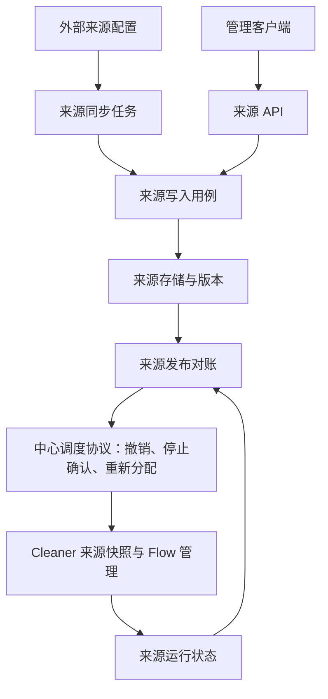

# EventSource 动态配置设计方案

状态：待评审方案，未实现。日期：2026-09-06。

本文只负责 EventSource 的独立管理、主动拉取/API 修改、来源版本和 Cleaner Flow 生效。
[部分配置动态化](dynamic-configuration.md)是另一项独立工作，分别评审、开发、验收和交付。
本文基于当前工作树取证，现行能力仍见[EventSource](../modules/event-source.md)与
[配置指南](../guides/configuration.md)，不代表动态 API、存储或 Leader 已经实现。

## 1. 范围与独立交付边界

目标是让 Linkd 独立维护事件源清单，来源可以由外部主动拉取或 API 修改，新增、修改、启停来源不再
依赖修改进程 YAML 并整体重启。

| 本项负责 | 本项不负责 |
| --- | --- |
| EventSource 的存储、查询、修改、导入、删除与管理归属 | 全局 Severity 等级表、priority 和全局默认值动态化 |
| 来源同步、来源版本、生效状态与回滚 | 通用配置中心或任意配置项热更新框架 |
| Cleaner 按来源创建、排空、替换 Flow | Lifecycle 等级比较与裁决策略动态切换 |
| 来源局部预算、认证轮换、清洗规则变更的安全边界 | 全局 Cleaner 默认预算、存储地址和 Mailbox 拓扑热更新 |

`EventSource.severity_mapping` 与来源 `default_severity` 是来源定义的一部分，仍归本项；
`Config.Severity.levels` 与全局 `default_severity` 归另一方案。二者字段含义相近，不代表同一管理对象。

**本项以全局 Severity 保持静态为基线，可以单独交付。** 来源映射只能引用当前配置中的等级，不新增、
删除或重排全局等级。先完成新增/启停/预算等管理能力；修改清洗语义需单独通过重放验收。
不把另一项的动态策略发布、生命周期改造或通用基础设施作为前置条件。

## 2. 当前证据与改动落点

| 代码 | 当前行为 | 本项调整 |
| --- | --- | --- |
| [config/load.go](../../internal/config/load.go)、[config/config.go](../../internal/config/config.go) | YAML 一次加载来源和 Severity | 仅拆出来源加载；Severity 继续静态加载 |
| [config/event_source.go](../../internal/config/event_source.go) | 来源 ID 全局唯一，包含租户覆盖、MQ、指纹和映射 | 增加来源管理封装；继续使用类型化校验 |
| [cleaner/scheduler.go](../../internal/cleaner/scheduler.go) | 启动时固定 Flow；任一失败取消全部 | 来源持续对账、状态与有界重建 |
| [cleaner/process/process.go](../../internal/cleaner/process/process.go) | 零来源直接等待退出；按启动来源数推导连接预算 | 零来源也监听变化；按进程总预算做动态准入 |
| [cleaner/factory.go](../../internal/cleaner/factory.go)、[event_factory.go](../../internal/cleaner/event_factory.go) | Factory 固定配置 | 固定全局 Severity，每条消息使用确定的来源版本 |
| [cleaner/runtime.go](../../internal/cleaner/runtime.go) | Event 创建、Mailbox 入队后 ACK；身份冲突可能判为确定性失败 | 来源规则跨版本重投不能误生成不同内容或 Discard |
| [controlplane/process/process.go](../../internal/controlplane/process/process.go) | 装配 ES/Redis 管理任务 | 增加来源 API、同步和生效对账任务 |

Lifecycle 本次继续读取持久化 Event，不因来源新增或启停切换全局策略。
来源故障隔离是对现有 Scheduler fail-fast 的有意调整；共享依赖或调度器损坏仍是进程级故障。

## 3. 管理模型、存储与权限

来源权威存储只保留以下两个对象，兼容 ES/MySQL；调度协议见
[中心化任务调度协议](task-scheduling-protocol.md)，不另建来源运行状态表。

| 对象 | 用途 |
| --- | --- |
| EventSourceRecord | 来源身份、管理归属、当前编辑配置/版本、published_release_id 与删除标记；单对象 CAS |
| EventSourceRelease | 单来源一次发布的完整不可变配置快照、发布版本、摘要、操作者与原因；幂等创建 |

Release 改为单来源发布，不是整份来源清单的原子快照；来源分别发布和生效，不包含全局 Severity。
先校验 Record 的编辑版本，再幂等创建完整 Release，最后 CAS 更新 Record 的 published_release_id。
指针提交成功才表示发布成立。CAS 失败留下未引用 Release，不执行它；指针成功但 Redis 更新失败由
持续对账恢复。ES/MySQL 使用相同的单对象契约，不承诺跨来源、Record/Release 或 Redis 的事务。
worker 按明确 Release ID 读取完整快照，不回读可编辑 Record 拼接配置，也不通过搜索“最新版本”猜发布。

来源数量、发布尺寸和历史保留有硬上限。编辑时初查 subscription 冲突，调度准入还需对实际消费范围做
原子互斥检查；并发发布导致相同订阅冲突时阻止后者运行并显示 blocked，不用仅跨文档查询保证唯一性。

Redis 保存来源同步缓存/可重建游标、worker 注册/心跳、assignment、运行状态与交接确认。
同步游标只有上游允许完整重新拉取/重复回放时才可仅缓存；需要长期 checkpoint 时保存到对应 Release
的提供方元数据，不能新建第三类权威对象或因 Redis 游标丢失跳过配置。
长期用户调度意图随 Record/Release 保存，具体 worker 分配在 Redis；Redis 协调历史丢失按调度协议
进入恢复屏障，不能直接重建分配后并行启动旧任务。

ES 与 MySQL 使用独立来源仓储并复用既有连接/底层能力，不向 Event/Alert Repository 加通用配置接口。
ES 发布按 ID 的实时读取验证指针/快照，列表查询的搜索可见性不能作为发布线性化点；不要求 ES 部署额外
提供 MySQL。列表发现延迟由有界对账处理，明确发布的 Release 可按 ID 加载。

管理键、缓存、审计和租约带 deployment 与管理作用域。`related_tenant_id` 是数据归属规则，不是配置
所有者。建议 platform 来源仅平台权限可管；tenant 来源绑定 owner 租户，不允许跨租户覆盖。
保留 deployment 内来源 ID 唯一规则。认证主体决定权限，不能信任请求 body 的 owner。

YAML 保留连接、认证、安全引用、进程资源上限与全局业务配置。动态来源模式下，YAML 不在启动时覆盖
来源库；允许显式首次导入并生成版本。未初始化与已发布空来源清单分别处理。开发 static 模式必须显式
选择，禁止同一来源同时存在文件与动态存储两个权威来源。

## 4. 写入方式：主动拉取与 API

两种入口仅在本项内部共用来源写入用例：权限 → 类型和引用校验 → CAS → 审计/持久化 → 来源生效。

来源标记 `managed_by = local | provider:<id>`。API 修改 local 来源；同步任务修改自己的 provider 来源。
API 修改 provider 业务字段返回冲突，接管需显式带 base revision 转移所有权。同步之后跳过已接管资源。
紧急停源可以接管后停用，不增加隐式多层 override，也不按时间先后相互覆盖。

主动拉取流程：

1. 单副本控制面或有效 Leader 携带有效游标拉取，限制超时、分页数、响应字节与并发。
2. 转换为 EventSource，校验租户、ID、Cleaner 注册、subscription 唯一性、预算及静态 Severity 引用。
3. 完整有效批次校验后逐来源幂等发布；允许部分成功，失败条目重试。全部成功才推进批次游标，
   不承诺跨来源事务；中途崩溃可安全重复同步。
4. 相同上游版本/内容不重复发布，错误按有上限退避加抖动重试。

网络失败、权限错误、分页中断、非法载荷不是删除指令。增量删除需要 tombstone；全量缺失对账必须有
上游同一完整快照的证据，且只处理该 provider 拥有范围。大量删除先生成可审查候选，不因异常空响应停源。

API 候选以 `/api/v1/event-sources` 为边界，提供来源 CRUD、批量校验、来源发布/回滚、同步状态和运行
状态查询，具体协议待实现前确认。修改带 expected revision，冲突拒绝覆盖；幂等键重试返回原结果，
同键不同载荷返回冲突。202 只表示受理，返回来源 release 与状态地址。先停用排空，再 tombstone；
保留恢复历史，不顺带清理业务 Event/Alert。Kafka 凭据与安全字段在接口、日志和审计统一脱敏。

## 5. 控制面与 Cleaner 生效



复用 `control-plane` 进程与 all-in-one 装配，不新增常驻进程。通知只加速加载，周期轮询来源发布指针
兜底；跳号时读取一致快照。消息热路径只读内存中的确定版本，不逐消息请求配置库。

Leader 协调来源同步与生效，不承接数据消费。采用中心化调度协议：首期一个来源 TaskKey 同时只分配
给一个 worker，worker 内并行处理 Kafka partition。未来跨 worker 扩容需明确不相交的 shard 领取范围。
worker 发现已发布版本变化立即开始停止，中心确认 Stopped 后分配下一代；失联自停与超时强切、防抖
和容器发布预算统一由调度协议定义。已健康 worker 的简单变更可 FastRestart，但不跳过停止确认。

来源状态为 `pending → preparing → applying → applied`，失败报告 blocked/failed、阶段与已生效范围。
准备校验类型、静态 Severity、节点能力、凭据可达性与总预算；加载快照不等于生效。实例报告每个来源
的 desired/loaded/applied revision，控制面持续对账；新实例取得有效来源配置后才接管消息。

| 来源变更 | 生效方式 |
| --- | --- |
| 新增/启用 | 通过准入后创建 Flow；新 group 的起始消费策略必须显式确定 |
| 停用 | 停止拉取，排空已领取消息，提交连续成功前缀，退出 Session |
| 局部运行预算 | 排空并重建该来源 Flow，遵守进程级硬上限 |
| 认证轮换 | 预检、排空、释放、重连，保持订阅身份和 offset |
| 来源 severity_mapping/default_severity | 仅引用静态等级，按第 6 节固定重放规则 |
| cleaner.type、fingerprint、related_tenant_id | 不开放普通在线修改，先制定停源与存量数据处理方案 |
| ID、Kafka 集群、topic、consumer_group | 作为身份/订阅迁移处理，不自动迁移或重置 offset |

来源停用后 Lifecycle 继续处理已持久化 Event，不清空 Kafka、Mailbox，不自动关闭历史 Alert。
新建来源也不能代替旧 Alert 的关闭与恢复事件路由设计。

预检失败可保留旧 Flow 并报告 blocked；持久化切换边界后不得悄悄回退。回滚创建新的来源 release，
不倒退版本或改写历史边界。单来源故障有限退避重建，共享故障按进程处理，暴露部分可用状态。

静态 Severity 在 Cleaner 副本之间仍须一致，可比较其规范化内容摘要做准入检查；这是静态依赖一致性
校验，不是动态全局配置发布。修改静态等级时仍按原有停机/重启约束处理，并保留重放所需解释规则。

## 6. 来源规则变更与跨版本重放


仅在处理开始时读取最新配置仍然不安全：消息在旧映射下已经创建 Event，Mailbox 入队前崩溃；重投时
若使用新映射，就会出现同一 Event ID 不同内容。当前存储会报告身份冲突，Cleaner 可能将其当作确定性
失败处理。即便没有字段冲突，在多消息展开或新旧解析结果不同的情况下也不能只靠“查到旧 Event 就复用”。

当前输入只支持 Kafka，建议首期为每个来源订阅维护持久化的 partition offset 规则区间：

```text
source-a / subscription-X / partition-0
  offset < 10500  → source revision 7（全局 Severity 固定）
  offset >= 10500 → source revision 8（全局 Severity 固定）
```

切换过程：暂停所有有关 partition 的新拉取，排空旧版本已领取消息并提交成功连续前缀；以每个 partition
已提交的 next offset 为候选边界，在稳定所有权下持久化完整边界，再恢复消费。预取但未提交的数据仍从
其 offset 对应版本重新处理。重投和 rebalance 必须根据区间选配置，不根据当前时间或所在实例选择。

- 边界绑定稳定订阅/集群/topic 身份，topic 删除重建不能误继承旧 offset 空间。
- 切换遇到未排空的失败消息则 blocked；不为发布强制提交、不越过失败 offset。
- rebalance 中止未完成准备并重新获取所有权；最终持久化检查发布代次和任期，防止旧 Leader 发布过期边界。
- 新 partition 在登记初始规则前暂停处理；offset reset/历史回放必须先验证历史区间和快照仍在。
- 失联旧实例恢复后必须先校验切换代次再拉取。仅改 consumer group 名称隔离版本会造成重复消费，不能作为切换方案。
- 同一原始 record 展开的全部 Event 固定同一配置；Event 持久化记录来源版本引用，且该引用不加入业务 ID。
- offset 区间及规则快照至少覆盖上游可重放窗口、故障恢复窗口和明确保留的回放数据；不能只保留“最近 N 个版本”。
- 达到版本/区间数量上限时阻止继续发布，不能删除仍被引用的历史。超出支持窗口的回放明确拒绝，不能套用最新配置。

这需要修改 Kafka 接入元数据、Flow 控制接口、Mapper 与存储元数据；当前 `Flow.Run` 本身不足以表达
暂停、排空、边界准备和应用确认。这是动态语义变更的交付前置条件，不应作为上线后的补丁。
同一进程的一次原子指针切换、一次 Kafka rebalance 或“给 Event 加 revision”均不能独立解决它。


## 7. 故障、容量与高可用

上游不可用时继续使用有效来源清单；冷启动无可信来源版本不进入 ready，不用空清单冒充成功。
本地缓存校验 deployment、schema、摘要和权限，只用于加速加载。

多副本运行使用调度协议的 session、assignment_epoch 和任务授权。短暂控制断连先暂停领取并容错，
持续失联在授权期限内自停；中心按最后已提交授权的到期时间加安全余量强切，不因一次心跳超时立即迁移。
普通来源发布/容器滚动重启采用主动停止确认，可立即接续；控制面或 Redis 权威历史丢失单独走恢复屏障。
异常接管必须验证旧代次隔离，不能把 Redis owner 更新等同于已阻止旧业务副作用。
所有来源操作有超时、并发和载荷上限，限制每 deployment 来源数和进程连接/内存/worker 总量。
新增来源超过预算时明确拒绝或等待准入，不按来源数无限扩容。历史保留容量不足阻止新发布。

运行状态展示来源版本、phase、切换 offset、最后错误、同步时间、Leader 任期与来源健康，区分保存、
应用和消费健康。DevTools 只读，写操作走来源 API。指标不将每个 revision 作为无限增长的 label。

## 8. 本项实施与验收

| 阶段 | 独立交付范围 | 验收重点 |
| --- | --- | --- |
| E1：来源管理 | 来源存储、导入、API、版本、审计 | CAS/幂等、租户隔离、脱敏、一致来源清单、空清单 |
| E2：动态运行与同步 | 零来源监听、启停、局部重建、主动拉取、状态；先单控制面 | 排空/取消、连续 ACK、预算、单源故障隔离、部分拉取失败不删源 |
| E3：来源语义修改 | 来源映射等规则的 offset 版本区间和回滚 | Event 已写但未入 Mailbox 时重投、多 Event 展开、切换崩溃恢复 |
| E4：多副本 | 接入公共调度协议、资格/租约、停止确认和超时强切 | rebalance、旧 Leader 拒写、失联自停/自动接管、发布防抖与旧代次隔离 |

E2 已形成来源动态管理闭环，但尚未验证的语义字段保持禁止在线修改。E3 只处理来源规则，不加入全局
Severity 动态更新；E4 完成后才承诺多副本可靠切换。每阶段单独改动、测试和交付。

代码实现按本项真实消费者定义窄接口，不创建通用配置框架或空包。实施时更新现行配置/来源文档，执行
`make check` 与 race；显式启用 Kafka/数据库集成和故障注入。当前只改设计，未实现或验证运行能力。

## 9. 事件与告警的版本追溯

Event 新增 event_source_version，由 EventFactory 注入实际使用的 EventSourceRelease 发布版本，
不是 Record 编辑版本；同一原始消息展开的 Event 固定该版本，不加入 Event ID 或 fingerprint。
Alert 创建时继承触发 Event 的版本，创建阶段 enrich 也使用同一 Release；以后普通更新不覆盖，
等级升级创建的新 Alert 继承本次触发 Event 的版本。Release 后续可包含来源 enrich 配置。
AlertLog 暂不新增顶层 event_source_version，避免混淆本次 Event 与历史 Alert 的来源版本；携带 Alert
快照时自然包含其版本。未来重新 enrich 的实际版本独立记录，不覆盖 Alert 创建依据。
以上字段尚未实现，实施时同步领域模型、存储、消费者和测试；不能把版本字段替代跨版本重放规则。

## 10. 本项待收敛决策

- ES/MySQL 两个来源对象的单对象操作、发布指针与历史清理细节。
- provider 的全量/增量、删除、版本与所有权转移契约。
- 来源执行租约、失联预算与上游可回放窗口。
- 第一批开放的在线修改字段，以及危险身份/指纹变更的独立处理流程。

另一项启用动态 Severity 后，来源只依赖只读等级视图来校验；引用新增等级时先完成等级配置生效，再发布
来源映射。两个发布分别记录版本和结果，不引入跨两项的统一发布事务。具体交互安全性由第二项交付负责。
