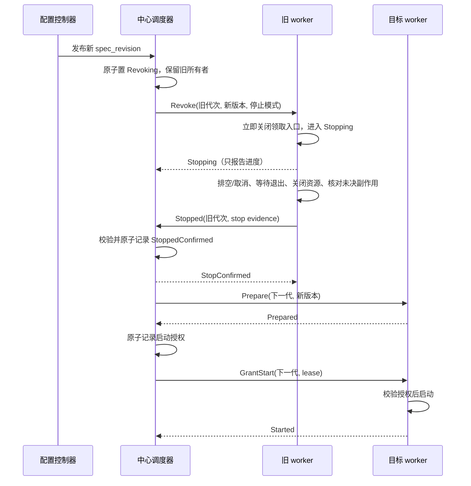

# 中心化任务调度协议

状态：设计草案，未实现。日期：2026-09-06。

本文设计跨模块复用的调度协议，首个消费者为 Cleaner，后续 Lifecycle 和其他模块可接入。
[EventSource 动态配置](event-source-dynamic-configuration.md)提供任务配置，本协议管理执行所有权；
[部分配置动态化](dynamic-configuration.md)仍是独立工作。当前代码不具备本文的完整停止握手、任务代次、
执行授权或可靠故障接管能力。本次只更新设计材料。

## 1. 目标与安全边界

用户要求：中心调度；worker 发现配置变更立即开始优雅停止；停止后报告，中心确认后再分配；失联主动
停止；简单变更可以快速重启；协议能扩展到 Lifecycle 等模块。

本协议采用安全优先原则：

1. 同一稳定 TaskKey 在任一时刻至多有一个执行所有者；配置更新不能通过换 task ID 绕过互斥。
2. 已发送过启动授权的 assignment，在停止确认或安全强切前始终视为可能执行，即使未收到 Running 报告。
3. worker 进入 Stopping 后不可恢复该 assignment；重连、迟到续租响应和配置回滚都不能重新开启它。
4. 中心先原子记录正常停止确认或超时强切决议，后允许下一代启动。已排空的 worker 不自行重启。
5. 正常切换收到停止确认后立即接续；异常切换在最后一次有效授权到期并经过安全余量后自动推进，
   不无限等待失联 worker 的报告。强切须满足本协议的自停、代次隔离和模块接管能力。
6. 一次心跳失败只进入容错窗口；停止、排空和强切时间统一推导，避免发布/重启引起反复迁移。

必须区分三个事实：中心只授予一个执行者、旧任务确实停止、旧请求不能迟到生效。
采用“worker 在授权内自停 + 调度器超时强切 + 执行代次隔离”的容灾协议。该保证依赖有界停止、可靠
计时/监督器及副作用隔离；无法运行的 watchdog 不能杀死被暂停的 VM。任务若没有完整资源 fencing 或
外部终止保障，不能仅凭 TTL 声称覆盖任意长暂停下的严格不重叠；这是适配器必须补齐的强切验收条件。
目标是超时自动恢复，Blocked 仅用于协调历史丢失、隔离失败等不满足强切安全条件的异常，不是普通失联
的默认结果。
## 2. 现有实现与适配点

| 当前代码 | 已有机制 | 本协议需要补充 |
| --- | --- | --- |
| [cleaner/scheduler.go](../../internal/cleaner/scheduler.go) | 每来源 Flow、Context 取消、等待退出 | 中心 assignment、停止证据、单任务状态机与重建 |
| [cleaner/runtime.go](../../internal/cleaner/runtime.go) | 停止拉取、排空预算、等待批次/后台 goroutine、连续 ACK | 独立准入闸门、停止原因/代次、可上报的排空结果与未决 I/O |
| [lifecycle/scheduler/handler.go](../../internal/lifecycle/scheduler/handler.go) | Mailbox 排空，租约续租失败时 cancelWork | 任务级资格丢失的传播、全体 handler 退出确认 |
| [lifecycle/scheduler/lock.go](../../internal/lifecycle/scheduler/lock.go) | compare-token 续租/释放 fingerprint lease | 不能将该锁当作通用任务所有权或跨存储 fencing |
| [controlplane/process/process.go](../../internal/controlplane/process/process.go) | 管理任务装配 | 中心协议、协调状态存储、worker 会话与调度对账 |

保留业务模块自己的 ACK、幂等、CAS 和 fingerprint 串行机制，调度协议不替代它们。

## 3. 调度单元和身份

| 字段 | 语义 |
| --- | --- |
| TaskKey | deployment、管理/租户作用域、kind、稳定资源 ID、可选稳定 shard ID |
| spec_revision | 任务期望配置版本；Cleaner 引用不可变 EventSourceRelease |
| worker_id / session_id | 稳定实例标识与本次进程启动会话；进程重启不能复用 session |
| authority_incarnation | 本次经过安全初始化的调度权威实例空间；Redis 重置后不能继续用旧空间 |
| leader_epoch | 同一权威空间内的调度领导任期 |
| assignment_epoch | 单个 TaskKey 的执行代次，每次重新分配递增，包括分给原 worker |
| command_id / report_id | 命令/报告去重标识，与确定的会话、代次、操作绑定 |
| lease_seq | 该 assignment 的续租请求/响应序号，拒绝乱序或重放续租 |

会话标识可以随机生成，但不能作为业务 Event 身份兜底。任务代次与 EventSource 发布版本不同：同一
Release 可以因故障恢复多次分配；Event.event_source_version 仍记录 Release 版本。

首期 Cleaner 用一个来源对应一个 TaskKey、一个 worker，在任务内部按 Kafka partition 并行。
来源数量增加可分配到不同 worker；单个来源需要跨进程扩容时，再实现具有不相交 partition 集合的稳定
子任务与明确所有权适配，不能将同一个来源任务复制多份后仍声称任务互斥。

Lifecycle 后续可按固定 Mailbox shard 建任务，必须先定义 shard 到实际领取范围的映射与防越界消费。
现行共享 Signal Stream 不会因为添加 shard 字段自动获得分片语义；调度核心不替业务模块猜测分区。
分片数变化是拓扑变更：必须先关闭全部重叠旧范围再开放新范围，而非只比较字符串 TaskKey 是否相同。

## 4. 职责与存储

中心调度服务是一个逻辑服务，首期装配进 control-plane；可以有多个 API/连接接入副本，但同一调度
范围只有一个有效决策者。配置控制器把已发布配置翻译成 DesiredTask，规划器选择节点，协议状态机
负责交接。worker agent 管理本机任务、心跳、独立 watchdog 和状态报告。

EventSourceRecord / EventSourceRelease 继续是 ES/MySQL 中仅有的两类来源持久化对象。
Redis 保存 worker 会话/能力/容量、DesiredTask 投影、assignment、停止确认与报告去重、租约、命令通知。
任务期望副本/放置约束若是用户长期意图，仍写来源配置；Redis 中的具体分配可以重算。

**可重建调度结果不意味着所有协调记录都可以随意丢失。** heartbeat 可以 TTL 过期；assignment、已
发送的启动授权、Stopped 确认不能随租约一起删除。过期只标记 Suspect，保留上一所有者与未决状态，
直到完成交接。Redis 丢失这些记录必须走第 10 节的恢复屏障，不能扫描来源后立刻重新发任务。

同一 TaskKey 的状态转移使用单一串行化边界，以 Redis Lua/CAS 原子检查 scope、incarnation、有效
Leader、旧代次、会话、状态和命令身份。状态先写入再发命令。中心 API 副本不能在存储提交前给出授权。
Redis Cluster 下，原子操作涉及的 Leader/任务键必须位于同一 hash slot；首期按调度范围固定一个 slot。
扩展为多个调度分区时，每个分区有独立 leader/slot，TaskKey 的分区映射固定，迁移需要交接屏障。

## 5. 任务状态机

| 中心状态 | 允许动作及转移条件 |
| --- | --- |
| Unassigned | 可以选择一个 worker 进入 Preparing；不得存在未决旧 assignment |
| Preparing | 发送 Prepare；仅允许加载配置、编译规则和无业务副作用的预检 |
| Starting | Prepared 后原子记录启动授权再发送 GrantStart；从此视为可能运行 |
| Running | 收到对应 Started 报告；允许有效续租 |
| Revoking | 撤销启动新工作资格，发送 Revoke，保留旧所有者；不分配新执行者 |
| StoppedConfirmed | 验证 Stopped 后原子确认；可以分配下一代或保持停用 |
| Suspect | 保留旧 owner，等待正常报告或达到强切期限，不立即迁移 |
| Fencing / ForcedStopped | 到达强切期限，关闭旧代次全部权限/完成必要隔离，记录强切后允许下一代 |
| Blocked | 协调状态不可信或隔离失败，不能安全执行强切；明确告警 |

worker 本地状态：`Idle → Preparing → Prepared → Running → Stopping → StoppedAwaitingConfirm → Idle`。
短暂失联在 Running 下进入 Suspect（暂停领取）；未开始 Stopping 且重新确认原授权时可以返回 Running。
Starting 期间撤销也按已可能运行处理。Prepare 失败无执行资格，但必须清理准备资源；GrantStart 可能
已经发出的情况下，不能以“没收到 Started”直接将任务退回 Unassigned。

停止确认原子操作可以同时保留旧代次结果并开放下一代分配。新旧代次所有权记录不覆盖丢失，迟到报告
只能查询到原确认结果，不能删除新 assignment。StopConfirmed 响应在网络中丢失不影响中心接管资格，
因为旧 worker 已不可逆地停止；旧 worker 重试报告得到相同结果。

## 6. 控制协议与正常切换

传输首期使用受认证的 HTTP 命令/报告接口和有界 long-poll 命令流；具体路由/载荷版本为实现时定义的
内部协议。业务正确性不依赖 TCP 连接、Pub/Sub 或通知不丢失。推送用于降低延迟，心跳带命令游标和
期望版本兜底；游标过期则获取本 worker 的完整一致 assignment 快照。

主要消息：Register、Heartbeat/Renew、Prepare/Prepared、GrantStart/Started、Revoke、Stopping、
Stopped/StopConfirmed、Snapshot。每条消息携带 scope、session、incarnation、assignment_epoch、
spec_revision 和命令/报告 ID；中心授权还带 leader_epoch、lease_seq 和有效期限。

GrantStart 可能在命令队列中滞留，worker 不从收到命令的时刻重新计算完整 TTL。首次运行前必须进行
一次新鲜的授权确认 RPC，按第 8 节的请求发起时间计算本地截止点；确认时若任务已撤销或资格过期则
禁止启动。首次确认是同一 assignment 的授权核验，不创建第二个 owner。

B 可以仍是 A，协议完全相同。中心只允许提前缓存配置/编译规则，不提前向另一个 worker 分配该任务的
执行权，也不提前开启 MQ subscription、定时器、数据库副作用或业务回调。

worker 发现更高的已发布目标版本或收到 Revoke 时立即关闭任务准入，不等下一次长周期调度；如果 worker
先通过配置通知发现变化，可以主动 Stopping 并向中心报告，由中心核对权威已发布版本后推进交接。
未发布草稿不触发停止。通知“立即”指收到可信变化后立即开始停止；通知丢失的发现上限由心跳/轮询周期约束。

变更多次到达时可把尚未分配的目标合并到最新版本。已 Revoking 的旧代次不恢复；已 GrantStart 的中间
版本必须完成自己的停止握手，不能用“目标更新了”跳过。回滚也是新配置目标、新 assignment。

## 7. 停止契约与快速重启

Stopped 是终止证明，不是收到撤销请求的 ACK。模块适配器必须满足：

- 不再领取消息、启动批次、调度定时器或生成新业务工作；本地状态不可逆。
- 所有任务 goroutine/子任务已退出，任务级 Session/连接与自动重连循环已关闭。
- 已领取消息完成允许的副作用和连续 ACK，或者保留为未确认供以后重放，不能为排空强制 ACK。
- 未完成的外部请求必须得到确定结果或受到可靠隔离。客户端取消不保证服务端撤销；无法核对时报告
  StopIncomplete/Blocked，不能报告安全停止。
- 停止报告包括任务/会话/代次、实际版本、原因、已退出证明、未确认工作摘要、模块特定 checkpoint 与
  未决副作用清单。只传有界摘要和安全引用，不传凭据或原始业务 payload。

调度器检查证据结构、模块能力及代次，并在状态存储提交确认；不要求业务模块完全排空上游积压。
“无未确认消息”不是停止必要条件，“无仍在执行或可能迟到生效的旧操作”才是安全交接要求。

| 模式 | 适用条件 | 执行方式 |
| --- | --- | --- |
| DrainRestart | MQ 消费、含在途批次/事务、影响解释规则或状态的变化 | 立即停领取，在预算内排空已领取工作，再关闭并确认 |
| FastRestart | 适配器明确证明无消费状态迁移、无未决外部副作用、取消后可完整退出 | 立即 cancel、join、close，报告停止后立刻授予下一代 |
| StopOnly | 停用/删除/worker 退出 | 按任务需要停止并确认，不产生下一次启动 |

简单变化是否可快速重启由类型化适配器对差异判断，默认 DrainRestart；调用方不能传任意 fast=true
绕过检查。FastRestart 不等待固定冷却时间或租约自然过期，但仍经过停止报告和中心确认。
无实际执行语义变化的元数据编辑可以仅更新展示，不触发任务重启，由适配器明确声明。

Cleaner：停 fetch，完成已领取批次的 Event/入 Mailbox 与连续 offset 提交，关闭 Kafka Session；MQ
尚有 backlog 不阻塞停机。规则切换 checkpoint 的持久化由来源 Release 生效协议处理。
Lifecycle：停止领取 Signal/新 Mailbox，退出已有 handler，完成或可靠留下处理进度，释放持有的
fingerprint lease；不能只停外层循环却保留后台 handler。现有 lease 释放不是全任务停止证明。

## 8. 失联自停、超时强切与防抖

worker agent 的控制心跳/watchdog 独立于业务线程、队列与连接池。心跳批量覆盖任务，但服务端明确返回
每个 assignment 的授权结果；某个任务已撤销时，worker 整体心跳成功不能替它续租。

### 8.1 两级失联处理

- 配置变更、Revoke、SIGTERM、确定的 session/epoch 无效：立即进入不可逆 Stopping。
- 连接断开或单次心跳失败：暂停新工作准入，进入 Suspect，保持已有任务在有效授权内排空/处理，
  控制连接退避重连。容错窗口内明确确认同一 assignment 仍有效，可恢复领取，不重启任务。
- 连续失败达到阈值且失联持续超过容错窗口，或授权剩余时间不足完成停止：进入不可逆 Stopping。
- 停止后只重报状态并等待中心确认；重连成功、迟到心跳和自动重连都不能复活旧 assignment。

中心同时将 worker 标记 Suspect 并暂停向它分配新任务，但不立即把它现有任务迁走。确认的健康心跳清除
连续失败计数；业务慢不等于控制失联。达到授权强切期限才由中心自动接管，不依赖 Stopped 必达。

### 8.2 候选时间预算

以下是保守初值，用于故障测试与上线压测收敛，不是已测量的生产推荐值。统一配置和派生，不让 worker、
调度器与部署模板各维护一套默认值。

| 参数 | 初值 | 用途 |
| --- | --- | --- |
| heartbeat_interval H | 3s | 有界抖动发送，最多不超过 H 的检测间隔 |
| heartbeat_rpc_timeout R | 2s | 检测控制网络黑洞 |
| consecutive_failures N | 3 | 避免单次失败触发任务重启 |
| reconnect_grace G | 10s | 从最后已确认成功的有效控制响应开始计时 |
| execution_lease L | 60s | 服务端每次成功授权的 TTL |
| shutdown_drain D | 20s | 最长排空时间，简单任务实际完成即返回 |
| forced_exit K | 5s | 超时后终止任务子进程/整个 worker 的预算 |
| safety_margin M | 10s | worker 提前停止与调度器延后接管各自留出的余量 |
| recovery_stable_window | 15s | 异常恢复后重新接任务前的连续稳定窗口 |
| placement_cooldown | 60s | 故障迁走的任务不因原节点立即恢复而搬回 |

要求保守满足 `max(N*(H+R), G) + D + K + M < L`。示例为 `15+20+5+10=50 < 60`。
超过预算的模块必须调整整组时间或拒绝调度。心跳重连退避不得越过停止检查，安全 deadline 不能加随机抖动。

worker 记录续租请求发起的单调时间 t0，成功响应后保守有效截止点为 `t0 + grantedTTL - M`；
不能从响应到达时再加完整 TTL。最晚在该截止点之前 D+K 开始停止，确保截止点前退出。
停止实际 deadline 取本地资格截止点和本次停止预算中的较早者。

中心强切时间至少为 `最后一次在权威状态中提交的 lease_expires_at + M`，不能以“最后一次收到心跳”
或通知断连时刻代替。已提交续租但响应丢失时，worker 可能更早停，但中心必须等待已授予的完整时间。
到达强切时间后，中心原子冻结旧 assignment、阻止晚到续租、完成模块要求的隔离并记录 ForcedStopped，
才可以授予下一代。过期后才到达的 Renew 请求不得重新延长资格，即使响应序号看起来较新。

lease_seq、session、代次和 Leader 任期全部匹配才接受续租；重试相同请求不重复延长，返回剩余有效期。
同一 TaskKey 的 renew/revoke/force 操作串行化；撤销后只允许有界 drain，不延长到新的执行租约。
中心时钟/Redis TTL 必须满足已声明的漂移上限，检测到时间大跳或权威状态回退进入恢复屏障。

从最近一次成功续租算，示例强切在约 70s 之后；故障若发生在授权周期中间，按实际剩余时间计算。
这只限制强切等待，不包含新实例启动、配置准备和存储恢复耗时，不能宣传成端到端 70s RTO。

### 8.3 watchdog 与强切保障

D 到期仍未停止则 cancel、关闭连接并 join；无法结束 goroutine 时，外部 supervisor 在 K 内结束任务
子进程。若业务直接运行于 worker 进程，必须结束整个 worker，其他任务也按异常停止处理。
在全 VM/OS 暂停下，本地 watchdog 无法按时运行；恢复后所有任务必须先检查资格，资源端拒绝旧代次。
若要求连旧任务纯计算也绝不与新任务重叠，则还需要部署侧终止/隔离旧执行环境的证明，超时本身不提供
这种证明。自动强切能力必须把该保证落实到模块与部署适配中，不只留一个 Redis token。

配置失联只影响 readiness/领取资格；不因几次网络失败立刻由 liveness probe 重启整个容器。
只有自身 watchdog/运行时失控或强制退出条件触发才进行进程终止，避免依赖故障造成重启风暴。

## 9. 正常发布、容器重启与异常接管

### 9.1 计划内发布走主动交接

1. worker 收到 SIGTERM 或幂等 preStop 请求，标记 Draining/NotReady，停止接受新任务并通知中心。
2. 立即停止各任务领取，在总预算内有界并发排空，不等到连接断开才启动关闭逻辑。
3. agent、控制连接和状态上报保持存活；业务任务停止后先报 Stopped，中心确认即可分配新任务，
   无需等待 L 或固定确认冷却时间。
4. 预停止 hook 与信号使用同一个一次性关闭流程，重复触发不延长 deadline。容器最终退出前完成报告，
   报告/确认超时则结束旧任务并退出，由中心走授权超时强切兜底。
5. 新 Pod 使用新 session，注册/准备完成后才接任务；旧 Pod 为 Terminating 或 NotReady 不能当作任务
   已停止。发布可先准备额外 worker 容量，再排空旧 worker，避免任务停好后无节点可接。

建议示例 `terminationGracePeriodSeconds >= 60`，实际至少覆盖 preStop 开销、整个进程任务排空预算、
强制退出、停止报告和其他资源释放余量。任务很多时计算有界并发停止的总时长，不以单任务 D 代替。
Kubernetes 在 preStop 执行前已经开始计终止宽限期，不能把 hook 和 SIGTERM 后排空各算一个完整窗口。
见[Kubernetes 容器生命周期 hook](https://kubernetes.io/docs/concepts/containers/container-lifecycle-hooks)
与[Pod 生命周期](https://kubernetes.io/docs/concepts/workloads/pods/pod-lifecycle/)，查阅日期 2026-09-06。

启动使用独立 startup budget，避免加载配置/建连接时被 liveness 反复杀掉。连接接入副本滚动发布尽量
保留或交接控制连接；短连接重建在 G 内恢复，不应触发所有 worker 重启。恢复稳定窗口仅用于异常离线后
再次接任务，不给正常首次启动、计划内交接或已健康 worker 的 FastRestart 强加等待。

### 9.2 异常路径

| 场景 | 中心行为 |
| --- | --- |
| 单次心跳失败/控制连接重建 | Suspect，暂停新分配；容错窗口内恢复不迁移 |
| Stopped 已确认但响应丢失 | 依据原子确认接续；旧 worker 重报得到原结果 |
| Revoke/Stopped/Started 丢失 | 重试/对账，视旧 assignment 可能执行；达到安全强切条件自动接管 |
| worker 崩溃或网络分区 | 停止续租，按最后有效授权期限 + M 强切，执行必要隔离 |
| worker 长暂停、请求可能迟到 | 强切时建立资源 fencing；严格执行不重叠还需进程/节点隔离 |
| 隔离失败、协调历史缺失 | Blocked 并告警，不能将不确定状态伪装成容灾成功 |
| 原节点恢复或 CrashLoop | 新 session，稳定观察后准入；任务保留在当前健康节点，冷却内不回迁 |

### 9.3 fencing 的真实边界

assignment_epoch 先隔离控制协议：旧报告、续租、命令不得影响新任务。副作用 fencing 还要求资源在原子
提交处验证代次并先建立屏障；“读 Redis 确认 owner，再无条件写 ES/MySQL”不能阻止检查后的旧写。
现有对象 CAS、Kafka group generation 和 fingerprint lease 各只覆盖部分路径，不能自动组成完整保证。
HTTP 调用、Kafka 输出、Mailbox ACK、迟到的存储请求均需适配验证；配置幂等也不能代替执行所有权。

正常 Stopped 报告可以通过核对未决请求证明安全；异常强切不能依赖失联 worker 自证，需要模块的原子
fencing/外部隔离能力。自动超时强切是 P3 的必要验收目标；未具备该能力的模块只能先交付正常交接，
明确不得宣称已经实现完整容灾协议。

## 10. 中心高可用、Redis 故障与安全恢复

Redis 可以保存调度状态，但普通异步复制下的自动主从切换不能独立保证协调历史不回退：Redis 官方
明确指出复制丢失锁写入可能造成两个持有者，Sentinel 也不保证故障时保留已确认写入。
证据见[Redis 分布式锁](https://redis.io/docs/latest/develop/clients/patterns/distributed-locks/)与
[Sentinel](https://redis.io/docs/latest/operate/oss_and_stack/management/sentinel/)，查阅日期为 2026-09-06。

因此分两种实施边界，不把 Redis SET NX 自动提升包装成严格互斥：

- 首期安全基线：受监督的单活动调度器、固定调度 Redis 权威端点，禁止未完成隔离的自动提升。
  调度器更换先由部署监督器终止/隔离旧调度进程。重启先进入 Recovering，校对全部可能已授权任务，
  对权威记录中已知 assignment 按正常确认或原租约强切期限接续；不能重新起算更短租约。Redis 重启
  或状态完整性未知同样进入全局恢复屏障。
- 后续自动 HA：需独立验证不回退的协调权威/共识方案与旧中心 fencing，再允许中心自动接管。
  Redis 仍可保存缓存、心跳与投影；若要求 Redis 单独承担权威，则必须证明部署的等价安全约束。
  当前不引入新的协调产品依赖，也不承诺仅靠普通 Sentinel 自动提升满足该条件。

Redis 数据丢失后旧命令和活着的 worker 不能消失在协议历史里。恢复必须从部署监督器取得完整存活
进程集合，停止/隔离所有旧中心与旧 worker、核对未决业务副作用，再显式建立新 authority_incarnation、
重注册并重建任务。无法取得完整集合或隔离证据时保持 Blocked，不能等一个最大 TTL 后猜测安全。
新的随机 incarnation 只能隔离消息命名空间，本身不是资源 fencing 或旧进程已死的证明。

普通 worker 故障按第 8–9 节自动强切；协调权威丢失是不同故障等级，不能复用仍可信的 lease 期限假设。
保持“两类来源持久化对象 + Redis 调度”，严重协调故障先安全恢复；自动中心 HA 另行验证，不偷渡到来源表中。

## 11. 扩展接口与容量

核心仅处理任务身份、差异结果、节点选择、状态机、授权、心跳、交接与恢复。模块适配器负责：

- 从权威配置构造 DesiredTask 和稳定 TaskKey，声明资源/能力要求与互斥范围。
- ClassifyChange 返回 NoExecutionChange / FastRestart / DrainRestart / TopologyChange。
- Prepare 只能预检无副作用资源；Start 仅在有效 GrantStart 下开放业务入口。
- StopAndJoin 返回停止证据或明确 StopIncomplete，不允许业务模块自行报告未验证的安全停止。
- 提供 checkpoint、异常外部操作核对、规则版本固定与资源 fencing 能力声明。

以上是候选接口职责，不预创建没有实现的包。当前 Flow.Run 需要由任务适配器封装/调整才能表达完整
生命周期，不能简单把返回 nil 当作停止证明。

规划器与协议执行分开：优先保留当前节点，按能力、租户权限、静态资源上限和剩余容量分配，限制每次
迁移数与单 worker 并发启停数，避免配置更新导致全局抖动。无容量保持 Pending，不突破硬限制。
心跳批量上报任务摘要，任务改变即时发送有界报告；重连抖动退避，通知队列溢出要求快照对账，不能
丢失 assignment 权威状态。调度分片按稳定 TaskKey 扩展，各分片保留相同的单 owner 协议。

协议版本和模块 capability 在 Register 时协商，不支持某停止模式或 schema 的 worker 不参与该任务。
控制连接 mTLS 或等价鉴权，授权绑定 session/scope/task，防止伪造他人 Stopped。租户权限在分配、读取
配置、上报和审计各层校验，诊断内容统一脱敏。

## 12. 验收与实施顺序

| 阶段 | 交付 | 核心证据 |
| --- | --- | --- |
| P1 | 单中心协议状态机、Redis 原子转移、模拟 worker | 任意重复/乱序/丢包下，不出现两个 owner；无停止确认或合法强切决议不能新 GrantStart |
| P2 | worker agent、独立 watchdog、Cleaner 适配 | 配置变更立即停领取、排空/连续 ACK、报告/确认、容错后自停、同机快速重启 |
| P3 | 进程监督、超时强切/隔离、发布重启、恢复屏障 | kill/网络分区后自动接续；SIGSTOP/迟到写不破坏隔离；滚动发布不抖动；Redis 回退安全阻塞 |
| P4 | Lifecycle 适配、稳定 shard 领取范围 | handler 全退出、无越界领取、旧/新 shard 迁移不重叠 |
| P5 | 自动 HA 与调度分区扩展 | 权威不回退、旧中心隔离、多分区故障恢复及容量验证 |

每阶段独立实现与交付；EventSource 先接入 P1–P3，不等待 Lifecycle 或全局配置动态化。
当前 all-in-one 也必须执行相同握手，不能把进程内调用作为跳过状态机的理由。

必须做消息序列/状态机不变量测试、race 与显式 Kafka/Redis/ES/MySQL 故障注入。测试记录旧任务最后一次
执行/副作用结束与新任务第一次执行的顺序；仅看 Redis 有一个 owner 或 PM2 online 不足以验收。
重点覆盖：停止报告伪造/错代次、迟到续租、Starting 时撤销、确认后中心崩溃、ABA 会话重启、控制网断但
业务网通、暂停后恢复、请求超时但服务端迟到写入、连续多次配置变更、fast 模式误用和协调记录丢失。
增加边界测试：N-1 次失败不重启、G 内重连不迁移、最后授权响应丢失不提前强切、SIGTERM/preStop
重复不延长 deadline、hook 占用宽限时间、中心接入副本滚动升级、CrashLoop/恢复不引起任务反复回迁。
实现后执行 `make check`；本文未执行代码测试或外部运行验证。
