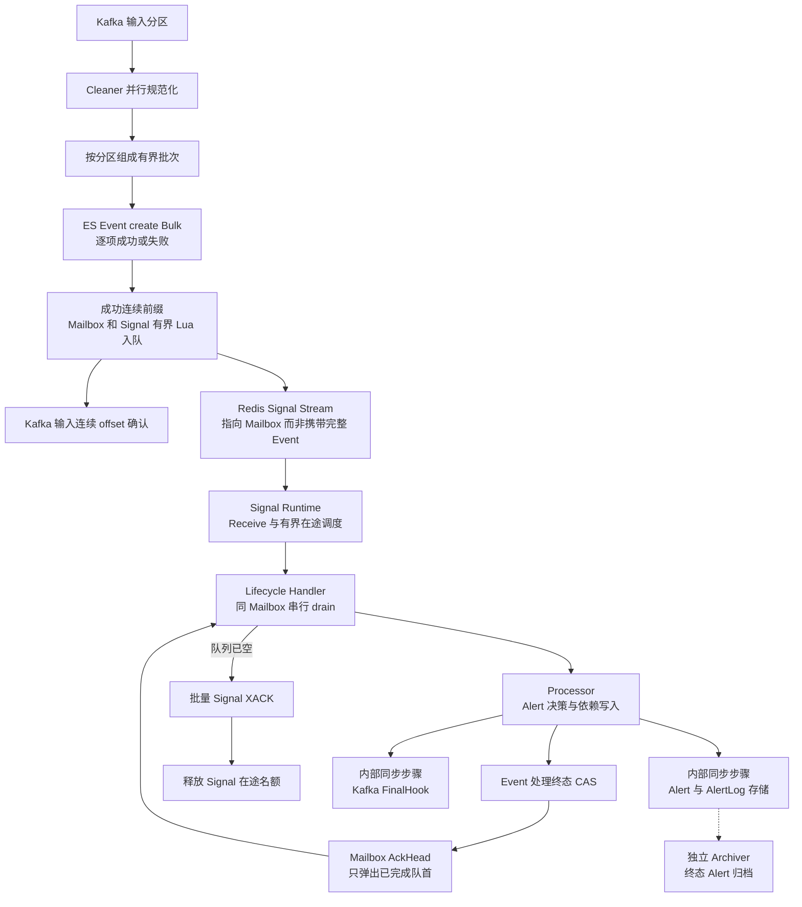
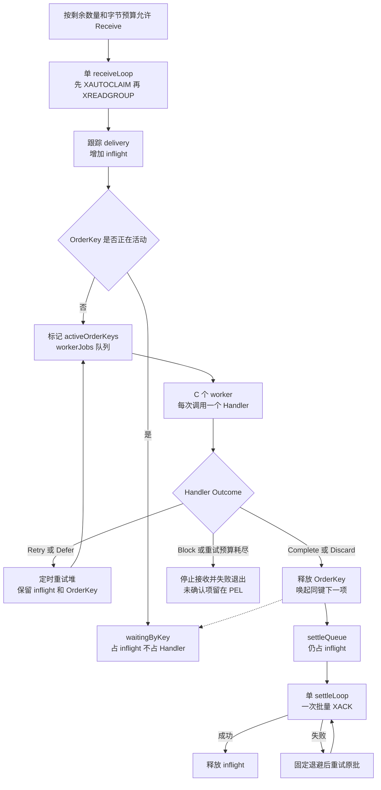
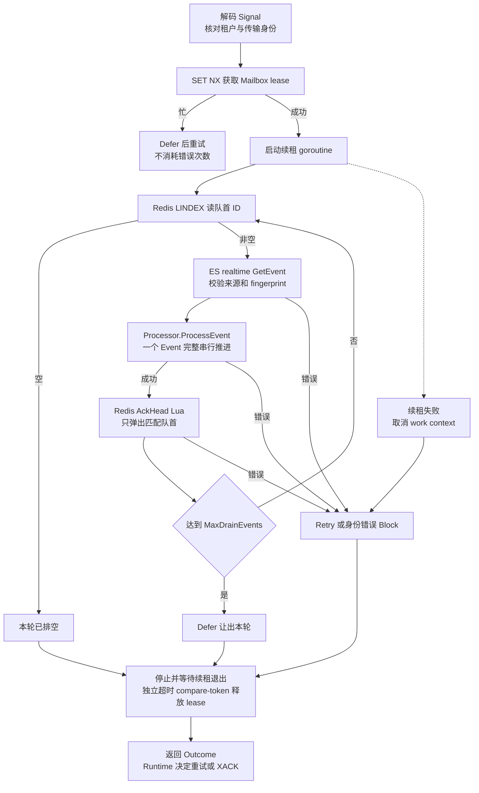
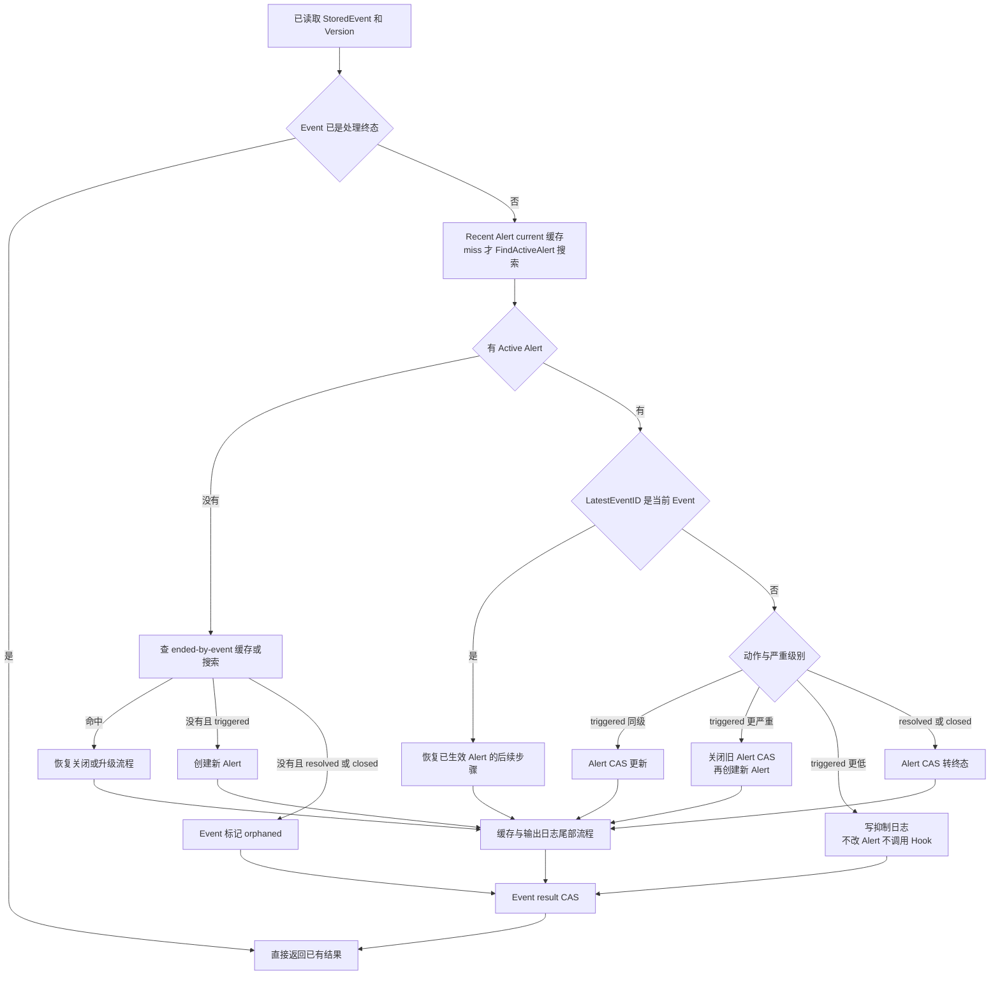
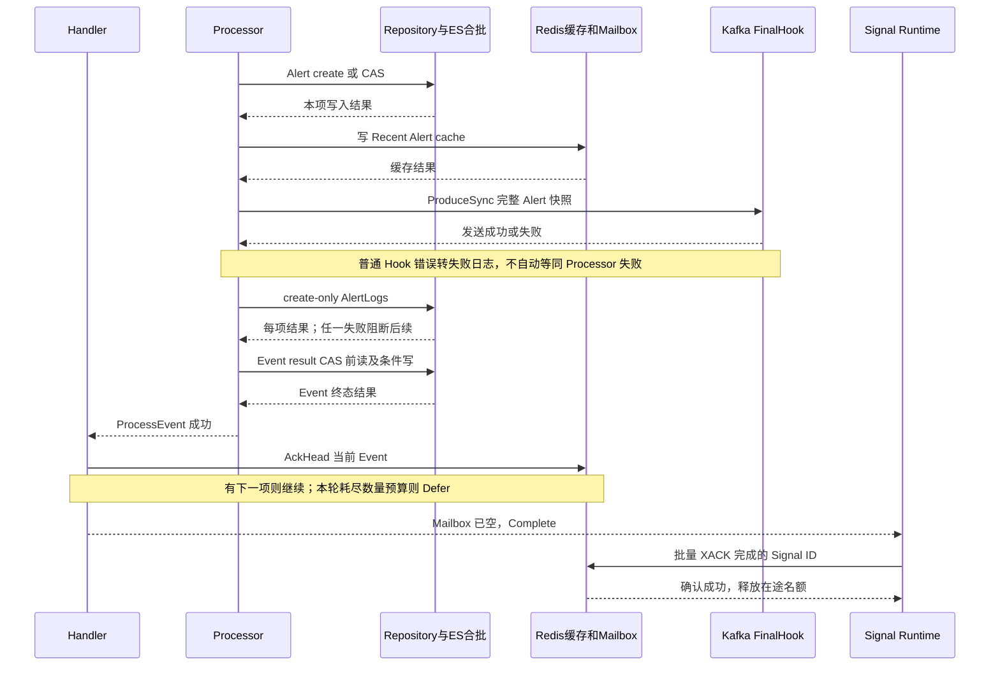
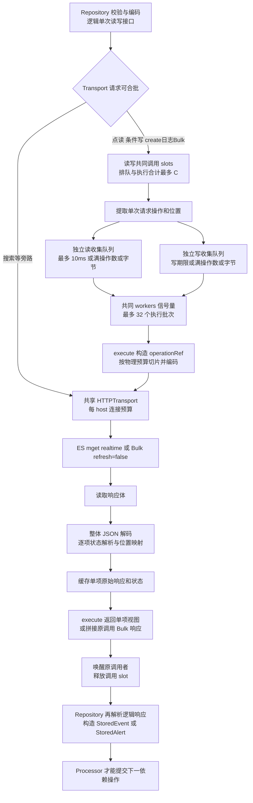
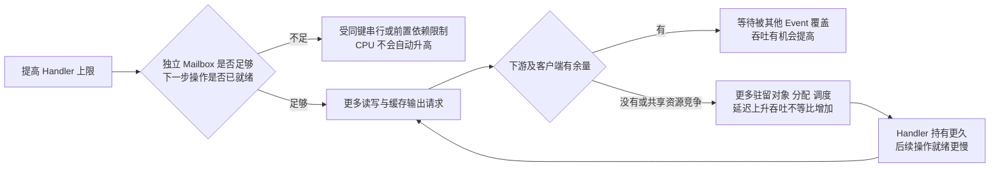

# Lifecycle 处理链路与并发控制审查

日期：2026-09-06。性质：当前工作区实现的代码审查说明，不是最终架构设计，也不是新的压测容量结论。

本文按真实调用顺序拆图，回答两个问题：消息究竟在哪些地方等待，以及为什么提高 `lifecycle.concurrency` 不一定能提高 CPU 利用率或最终吞吐。代码定位使用函数名，避免后续修改使固定行号失效。压测数据及对照结论以[压测报告](benchmarks/2026-09-04-lifecycle-elasticsearch-throughput.md)为准。

## 1. 先区分几层“并发”

`512 个 Handler`、`32 个读写批次槽位`、`516 条每目标主机 HTTP 连接上限`、`CPU 同时执行 Go 代码的能力`不是同一件事。它们不构成一个直接相乘的吞吐公式。

| 层次 | 控制的资源 | 等待时是否占用上层名额 | 能否直接增加 CPU 工作 |
| --- | --- | --- | --- |
| Signal 在途 | 已 Receive、尚未完成 XACK 的 Signal | 是，包括等待同键、重试、执行和待确认 | 不能，只是允许保留更多工作 |
| Lifecycle Handler | 正在处理一个 Mailbox 的 worker | 等 Redis、ES、Kafka、批次结果时仍占 worker | 只有该 Handler 当前可运行时才消耗 CPU |
| ES 批次执行 | 正在组装、请求、解析、分发结果的批次执行 goroutine | 是，直至 `execute` 结束 | I/O 等待不等于 CPU 执行；一个批次的解析循环本身串行 |
| HTTP 连接 | 每个 ES origin 的 HTTP transport 连接预算 | 连接等待仍占批次槽位 | 空连接不会产生业务操作 |
| Go 调度 | 可同时执行 Go 代码的运行时资源 | goroutine 被阻塞时通常让出执行机会 | 受可运行工作、宿主调度及运行时竞争共同影响 |

因此，进程 CPU 显示约 `200%`，在“一核为 100%”的口径下只说明该采样窗平均消耗约两核，不证明所有剩余核都能被当前依赖链直接利用，也不证明 GC、锁或 ES 是唯一瓶颈。尤其要区分 **Linkd 进程 CPU、ES 容器 CPU、宿主机 CPU**。本轮记录的 Linkd `GOMAXPROCS=14` 是诊断现场值，不是代码中的 Lifecycle 默认值；ES 四核配额也不是 Linkd 的 CPU 配额。

本次审查时另一次只读空闲快照为 `go_sched_gomaxprocs_threads=14`、`go_threads=30`、`go_goroutines=572`：当前进程并未被 `GOMAXPROCS` 限制为两核。但线程数或 goroutine 数量不等于同时做有效业务计算的数量，这个空闲快照也不能替代降速窗口的调度采样。

## 2. 从输入到最终确认：总览

图中实线表示处理依赖；虚线仅表示终态 Alert 的后续独立归档。Processor 内部的 Hook 调用和存储都是同步等待步骤，概览不展开它们之间的先后关系，完整顺序见第 6、7 节。所有连线都不表示跨系统事务。

三个确认不能混为一谈：

1. **Kafka 输入确认**：Event 已安全落库并完成 Mailbox 入队，或被确定性丢弃；不是等 Lifecycle 做完。
2. **Mailbox AckHead**：这一个 Event 的 Processor 已成功返回；同一 Mailbox 后面的 Event 不能越过它。
3. **Signal XACK**：对应 Handler 已确认 Mailbox 排空，或 Signal 被判定无效而丢弃；不是每处理一个 Event 就 XACK 一次。

一个 Signal 可以处理多个 Event；一个 Event 可以产生多个 ES 文档操作。比较“Events/s”“Signals/s”“Bulk operations/s”时必须先统一单位。

### 2.1 Cleaner 到 Mailbox 的边界

[Cleaner Runtime](../../internal/cleaner/runtime.go) 的 `runLaneBatch → finishLanePrefix → enqueueLanePrefix` 顺序为：Event 批量 create → 逐项归类 → 连续成功前缀入 Mailbox → Kafka 连续前缀确认。不同分区/批次可以并行，单分区仍受顺序和批次槽位约束。

[Mailbox Store](../../internal/lifecycle/mailbox/store.go) 的 `EnqueueBatch` 每次脚本最多 128 项、编码预算 1 MiB；超出时分块，首项失败后不继续推进后项。脚本内每项先检查 Mailbox 长度；空队列先 XADD Signal，再 RPUSH Event ID；非空队列只 RPUSH。Lua 串行执行意味着消费者看不到脚本执行中间状态，但 **Redis 脚本错误不会回滚之前已经成功的操作**。先 XADD 的顺序避免追加了引用却没有唤醒；失败可能留下空唤醒，需要由 Handler 收敛。

Mailbox 身份由租户、EventSource、fingerprint 共同构造。它没有依赖 Kafka 分区号，因此换分区不能让同一 fingerprint 的状态转换并行。入队也不能被理解成永久 Event ID 去重集合：结果未知后的重复引用由 Event 终态幂等与队首确认收敛。

Cleaner、Lifecycle、Archiver 各自装配 Repository；**Lifecycle 的跨 Event 合批器不包含 Cleaner 和 Archiver**。all-in-one 部署时它们仍共享进程 CPU、内存分配器、GC 和宿主资源。

## 3. 配置上限、实际资源和默认值

公式已核对 [LifecycleConfig.RuntimeConfig](../../internal/config/lifecycle.go)、[ElasticsearchWriteBatchConfig.WithDefaults](../../internal/config/write_batch.go)、[Lifecycle 装配](../../internal/lifecycle/process/process.go)、[Repository 装配](../../internal/store/assembly/repository.go)和 [HTTPTransport](../../internal/store/elasticsearch/http_transport.go)。下表“本轮”是本轮配置快照，不是默认值。

令 `C = lifecycle.concurrency`，`S = signal.max_batch_messages`，`D = signal.max_message_bytes`。

| 控制点 | 公式或实现 | 默认配置推导 | 本轮配置推导 |
| --- | --- | --- | --- |
| Handler worker | `C` | 32 | 512 |
| 单次 Receive / ACK 合批上限 | `S` | 128 个 Signal | 128 个 Signal |
| 在途 Signal 数量 | `I = max(4C, S)` | 128 | 2048 |
| 在途 Signal payload 字节预算 | `I × D`，默认 `D=64 KiB` | 8 MiB | 128 MiB |
| `workerJobs` / `workerResults` 容量 | 各 `I` | 各 128 | 各 2048 |
| 重试与 defer 队列数量 | `min(I, max(2C,1))` | 64 | 1024 |
| 单 Mailbox 待处理引用上限 | `mailbox.max_pending` | 128 | 128 |
| 单 Handler drain 数量预算 | `mailbox.max_drain_events` | 512 | 512 |
| 单 Handler 时间预算 | `process_timeout_seconds` | 30 秒 | 30 秒 |
| ES 调用准入 `slots` | `MaxCalls=C`；读写共用 | 32 | 512 |
| ES 读 / 写收集 channel | 各容量 `C`；总受共同 slots 限制 | 各 32，不是合计可入 64 | 各 512，不是合计可入 1024 |
| 单物理批次操作上限 `B` | `min(128,max(1,floor(C/2)))` | 16 | 128 |
| 写收集期限 | `B ms`；`B=1` 时 0 | 16 ms | 128 ms |
| 读收集期限 | `min(10ms,写期限)` | 10 ms | 10 ms |
| 编码后单批预算 | `max_bytes` | 4 MiB | 4 MiB |
| 读写共享执行槽位 | `min(32,max(1,C))` | 32 | 32 |
| Lifecycle HTTP 每 host 上限 | `clamp(C+4,4,1024)` | 36 | 516 |
| Lease TTL / 续租周期 / 释放超时 | 独立配置 | 60 / 20 / 3 秒 | 须与生效配置一起审查，不能用 Handler 数替代 |

`workerJobs` 容量不增加 worker 数；Signal 字节预算不包含后续读入的完整 Event/Alert、编码缓冲和 ES 响应。HTTP 上限同时作用活动/空闲连接管理，不会启动 516 个常驻业务请求。读写共享 32 个执行槽位，**不是读 32 加写 32**。

Lifecycle 的 Mailbox、lease 和 Recent Alert cache 共用一个 Redis client；Signal Session 另建一个 Redis client。[Redis client 装配](../../internal/redisclient/client.go)没有从 `C` 显式推导连接池预算，因此不能把 ES 的 516 推广到 Redis，也不能仅凭 Handler 数判断 Redis 池是否吃满。

### 3.1 并发与批量存在启动配置耦合

当 `C` 从 32 增加到 256，单批上限同时从 16 增加到 128，写等待也从 16ms 增加到 128ms；之后继续增加并发只扩大调用和在途预算，单批与等待都不再增长。

对**每个调用只有一个操作、每个 Handler 当前只等待一个调用**的阶段，256 个调用名额、每批 128 项大约只能组成两个满批；384 个调用名额最多约三个。32 是执行上限，不是一定有工作的 worker 数。实际还会有 Handler 停在缓存、Mailbox、Hook 或其他阶段，使同类就绪操作更少。

这只是满批资源算术，不是所有请求的硬并发上限：未满批到期可形成更多小批；一个 AlertLog 调用可以携带多项，需按操作数而不是调用数另算。`C>512` 后批量封顶 256，也不再保持这个比值。它说明目前自动公式可能同时拉长依赖等待，是必须单独检验的调度取舍，不能据此直接认定为本次降速的唯一根因。

## 4. Signal Runtime：哪些状态占着在途名额

代码入口：[consume.Runtime](../../internal/consume/runtime.go) 的 `tryReceive`、`dispatch`、`submit`、`handleWorkerResult`、`queueSettlement`、`handleSettleResult`；适配器：[Redis Stream Session](../../internal/consume/redisstream/session.go) 的 `Receive`、`Confirm`。

关键串行点：

- 一个 Runtime 的接收通道同一时刻只做一个 Receive；不是 512 个 worker 各自拉 Redis。
- `activeOrderKeys` 保证进程内同 Mailbox 不会同时跑两个 Handler；`waitingByKey` 是排队，不是忙等，也不占 Handler worker。
- 同键保护在 Handler 完成时释放，**不是等 Signal XACK 后释放**；但在途名额要等 XACK 成功才释放。
- `Retry` 和 `Defer` 都保留 OrderKey，后续同键消息不能越过当前项。`Defer` 不消耗错误尝试次数，但仍受队列容量、退出等约束。
- `settleLoop` 仍全局单执行通道，但 Redis 支持按完成 ID 批量 XACK：空闲立即发，发送期间把尚未发送、同 lane 的尾批合并到 `S` 上限，不主动等 ACK 凑批。它没有 Kafka offset 连续前缀要求。
- Receive、等待同键、worker 排队、执行、退避、待 XACK 都可占据 2048 个在途位置。不能用 `inflight=2048` 推断有 2048 个活跃 Event，甚至不能推断 512 个 Handler 都在运行。

单一 Stream/Group 是一个 lane；不能暂停 lane 的适配器在不可恢复错误或预算耗尽时会使 Runtime 失败退出。不能把一个热点 Mailbox 的问题理解成只影响一个隔离工作线程。

## 5. 一个 Handler：跨进程 Lease 包住整个 Mailbox drain

代码：[scheduler.Handler](../../internal/lifecycle/scheduler/handler.go) 的 `Handle`、`drain`、`renewLoop`；[RedisLocker](../../internal/lifecycle/scheduler/lock.go) 的 `Acquire`、`Renew`、`Release`。

Lease 与本地 OrderKey 分工不同：OrderKey 防同进程并发，Redis lease 防不同进程同时推进同一 Mailbox。租约随机 token 只表示所有权，不作为业务幂等身份。续租/释放使用 compare-token；续租失败取消后续工作，但不能撤销已经发出的 ES/Kafka 请求，仍需 CAS 和稳定身份恢复。

**一个 Mailbox 的 Event 是逐个处理、逐个 AckHead 的。** 即便有 128 个 Event 排队、512 个 worker、32 个 ES 槽位，这个 Mailbox 仍只有一个当前 Event 可以产生下一步依赖操作。增加并发只能帮助其他独立 Mailbox，不能将同键状态机自动并行化。

### 5.1 已复现的时间预算风险

当前 `consume.Runtime.handle` 把 `ProcessTimeout` 包在**整个 Handler 调用**外；不是每个 Event 各获得 30 秒。`MaxDrainEvents=512` 只是数量上限，未提供“接近时间预算时正常让出”的主动机制。

本次代码审查的隔离回归场景已经复现：单 Signal 指向 128 个健康 Event，每个处理约 1 秒；三次有界尝试合计成功约 90 个，仍剩 38 个，但 Runtime 以重试次数耗尽退出，Signal 未确认。它说明**持续有进展的热点队列也可能被判成错误重试失败**，不是业务 Event 都失败。该隔离场景不是本次 1000/s 压测已经发生这一错误的证据。

审查方向是区分“正常分段让出”和“真正失败”，保留已有完成前缀，而不是无条件增大超时、无限重试，或提前确认仍有待处理引用的 Signal。此处记录审查时实现；后续修复应同步检查 `Handler.drain` 和时间预算回归测试。

## 6. 一个 Event：分支与不可越过的依赖

其他无效转换走 rejected 终态。证据：[Processor](../../internal/lifecycle/processor.go) 的 `ProcessEvent`、`processUnprocessed` 和下表同名函数。

| 分支 | 必须按顺序发生的操作 | 额外说明 |
| --- | --- | --- |
| `createAlert` | 创建 Alert → PutCurrent → FinalHook → trigger/Hook 日志 → Event CAS | 已完成 Active lookup 的快速创建路径，避免再次做 Active 搜索 |
| `updateAlert` | Alert CAS → PutCurrent → FinalHook → Hook 日志 → Event CAS | 普通同级更新没有额外 trigger 操作日志 |
| `terminateAlert` | Alert CAS 为 recovered/closed → PutTerminal → FinalHook → recover/close 与 Hook 日志 → Event CAS | 终态 Alert 仍由后续独立 Archiver 迁移，不在这里同步归档 |
| `suppressEvent` | suppress 日志 → Event suppressed CAS | 不变更 Alert，不调用 Hook |
| `rotateAlert` | 旧 Alert 关闭 CAS → PutTerminal → 新 Alert create → PutCurrent → 旧 Alert Hook → 新 Alert Hook → 全部日志 → Event CAS | 不是两个 Alert 原子事务；必须支持中间成功后的恢复 |
| 无 Active 的 resolved/closed | Event orphaned CAS | 不虚构新的 Alert |
| `resumeActiveEvent` / `resumeEndedEvent` | 识别已经成功的 Alert 变更 → 补后续 Hook/日志/必要的新 Alert → Event CAS | 不简单重做所有 Alert 写入；Hook 可能再次调用 |

### 6.1 缓存不是只有命中率的问题

[Recent Alert Store](../../internal/lifecycle/recentalert/store.go) 缓存完整 `StoredAlert`（含版本），按租户和业务身份隔离；TTL 为 Active refresh interval 加 5 秒。current 缓存也可保留终态标记，避免 ES 搜索视图尚未刷新时读到旧 Active；ended-by-event 用于恢复。

- 缓存命中仍有 Redis 往返和完整 Alert 编解码，并非纯进程内指针读取。
- miss 后走 `FindActiveAlert` / `FindAlertEndedByEvent` 搜索并回填；这些搜索不走点读合批队列。
- Alert 已写成功但缓存更新失败时，Processor 不继续 Event 终态确认；重试需借助持久状态恢复。
- Alert CAS 版本冲突后先 realtime 读取当前 Alert 并 `Repair` 缓存，然后向现有重试路径返回冲突。

### 6.2 正常路径仍有 CAS 前回读

| 已拥有的数据 | Repository 再做什么 | 本次审查应守住的边界 |
| --- | --- | --- |
| Scheduler 已传入 Lifecycle Event 投影和版本 | `CompareAndSetLifecycleEventResult` realtime 重读相同投影，核对版本和 unprocessed 状态，通过 Bulk update 只写 `related_alert_id` 与 `processing` | 投影排除不参与裁决的 `source_raw_data`；仍验证租户、文档身份、预期版本和状态转换，并保留 ES CAS |
| Processor 已拿到 Active Alert 和版本 | `compareAndSetAlert` 根据版本定位索引并 realtime 读完整旧 Alert，核对版本、replacement 不变量，再编码写入 | “AfterActiveLookup” 不代表跳过 CAS 旧文档校验，只省 Active 搜索/刷新等待 |

ES 最终写入均带 `if_seq_no` / `if_primary_term`。前置读取成功不能代替写入时 CAS；同样，有 CAS 也不意味着可以不检查领域 replacement 是否合法。相关实现：[Event CAS](../../internal/store/elasticsearch/event.go) 的 `CompareAndSetLifecycleEventResult`、[Alert CAS](../../internal/store/elasticsearch/alert.go) 的 `compareAndSetAlert`。

## 7. 输出、日志、Event 终态与两种 ACK

**重要：当前实现并非“Kafka 输出成功才允许 Event 终态”。** [Kafka Hook](../../internal/lifecycle/kafkahook/hook.go) 使用 `ProduceSync` 并要求 all ISR ACK，调用方同步等待；但 [runFinalHook](../../internal/lifecycle/hook.go) 将普通发送错误或 Hook panic 记录为 `hook_failed` 日志，通常继续后续流程。context 已取消、日志构造/持久化失败等才向 Processor 返回错误。不能把“同步调用”误写成跨 Kafka 与 ES 的事务成功保证。

[appendAlertLogs](../../internal/lifecycle/log.go) 汇总本次决策的日志并逐项检查。已成功项通过确定性 log ID 和 create-only 在重试时吸收；某一项失败不能放行 Event CAS。输出可能因恢复被再次调用，稳定 MessageID 只提供消费者去重依据，不是发送端跨恢复的 exactly-once 承诺。

## 8. ES 合批器：请求和结果到底经过哪些中转

代码：[WriteBatchTransport](../../internal/store/elasticsearch/write_batch.go) 的 `Perform → run → execute → send → finish`；[Repository JSON 请求层](../../internal/store/elasticsearch/repository.go)；[诊断阶段定义](../../internal/store/elasticsearch/write_batch_diagnostics.go)。

### 8.1 并发并不是每项都获得一条异步流水线

- 实际接入点是 **HTTP Transport 包装层**。Repository 对调用者仍是同步接口，不是直接返回类型化的批量结果。包装层拆解请求，再将物理批次结果还原成原请求可读取的 HTTP 响应。
- 可合批的是 realtime 单文档 GET、`refresh=false` 的单文档 PUT create/index、POST update，以及限定的 create-only Bulk。点读的 `_source` 投影随各 mget doc 编码；`_search`、原生其他形态的 `_mget`、索引管理等未匹配请求直接旁路，不受合批调用 slots/worker 限制，但仍受底层 HTTP 连接限制。
- 两个 `run` 各自收集；满数量/字节立即触发，不等期限。首项期限不是每来一项都重新延后。触发后获取共同执行槽位，交给 goroutine 执行，再接着收下一批，不等待上一批请求完成。
- 物理切片严格受操作数/字节预算控制；一个逻辑日志 Bulk 可含多项，收集批与物理请求不是严格一对一。超过软字节预算但未超 Repository 硬上限的单项可以独立发送。
- 一个执行批次的 `send`、整体解码、逐项结果循环以及最终重组在这个执行 goroutine 中依次完成。**同一批里 200 项不是 200 个并行解析任务**。只有多个已就绪批次才能使用多个 worker。
- 当前代码已缓存读元信息及写编码，避免同一物理写片段二次编码。此次审查期间又引入 `batchItem`，保留 `send` 已解析的状态和单项视图，删除 `execute` 再次解码相同项的步骤；逻辑 Bulk 返回直接拼接已验证的原始 JSON，避免 Marshal 重扫。该局部优化已通过 `make check`、ES 集成测试、双后端 E2E 和三轮 focused race 测试；部署后的完整持续输入复测均速为 876.0/s，仍有后程降速，未观察到显著端到端收益，详见压测报告 4.21。后续三进程对照也未消除降速，不能将共用 Go 堆视为唯一原因。
- response envelope 解码、逐项状态解析、逻辑响应中转、Repository 语义解码仍真实存在，尚未变为类型化语义批量端口。它们既包含 CPU 工作，也可能在执行区间内被调度暂停；不能把已删除的重复 status 解码继续列作现状。
- 搜索、缓存、Hook、Mailbox AckHead 都在 ES 批次之外。增大写并发不能让尚未完成这些依赖的 Event 提前提交下一次 CAS。

### 8.2 指标边界不能相加错位

| 指标阶段 | 当前计时边界 | 不能直接推导什么 |
| --- | --- | --- |
| admission | 等待共同调用 slot | 不是 HTTP 连接等待 |
| collect | 从首调用入队到收集完成 | 不是每项平均排队；可能包含 goroutine 调度延迟 |
| worker_slot | 批次收齐后等共享执行槽位 | 接近零说明这一入口未饱和，不代表 ES 无压力 |
| operation_queue | 每物理操作入队到请求发送前 | 与 collect、worker_slot 等有重叠，不能简单相加 |
| encode | 物理请求正文组装 | 不包含全部领域 Normalize/Clone/Repository 编码 |
| connection / request_write / first_byte | HTTP trace 对应阶段 | 首字节含服务端前置处理、网络和客户端调度；不是纯 ES CPU 时间 |
| response_body | io.ReadAll 到读取完成 | 含网络收取、拷贝、分配和等待 |
| response_decode | 整体 envelope 解码 | wall time 不是纯 JSON CPU 样本 |
| response_items | 批次逐项状态检查与映射 | 后续 `execute` 的最终包装及 Repository 解码还在其外 |
| BatchFinished execution | 请求创建附近到 send 内逐项处理完成 | 不含凑批，不等于调用者从提交到拿到领域对象的完整时间 |
| server_took / paired_execution | 有合法 Bulk took 的同批服务端计时与客户端对应计时 | 两者差值不是纯网络；mget 没有 took 时不能补零参与比较 |

例如执行均值涨到四倍，只证明上述客户端执行边界变长；如果同批 `server_took` 只小幅上涨而 `response_items` 显著上涨，应首先解释客户端工作与运行时等待，而不能把全部增量归为磁盘 fsync。反之，服务端队列为零也不能排除单请求慢、分片串行、merge 争用或瞬时调度问题。

## 9. 错误、取消和关闭：不能为吞吐破坏的约束

| 场景 | 当前行为 | 已完成工作如何处理 |
| --- | --- | --- |
| Event/Alert CAS 冲突 | Processor 内最多 3 次重新决策；必要时修复 Recent cache | 重读 Event/Alert 后恢复，不覆盖新版本 |
| ES create 409 | realtime 读取并核对内容/身份 | 相同确定性身份与内容可幂等收敛，不把所有 409 当成功 |
| 日志部分成功 | 失败阻断 Event CAS | 成功 create 不回滚；重试按日志身份吸收 |
| 待发送调用取消 | 不发送被取消的操作；回收 slot | 不执行后续缓存/输出/ACK |
| 请求已发出后一个调用者取消 | 批次使用自己的执行 context，不取消其他项 | 本调用结果未知；不能宣称 ES 未执行，由幂等/CAS 恢复 |
| 批次某项失败 | 按原输入位置映射，不将其他项整体重试 | 成功调用可各自继续；同一逻辑日志调用要检查全部结果 |
| Lease 忙 | 有界延迟 Defer | 同键不向前推进，不消耗业务错误尝试 |
| Lease 续租失败 | 取消工作并 Retry | 已完成 Event/外部写入不能回滚 |
| XACK 失败 | 重试原确认批，不加入新 ID 扩大未知范围 | 在途仍保留，已完成业务不重复执行于本地确认重试 |
| Runtime 退出 | 停 Receive，有界 drain；随后取消 worker 并关闭 Session | 不提前 ACK 未完成 Signal，保留 PEL 供闲置 Claim |
| BatchTransport.Close | 停准入、取消批次 context、解除队列调用、等 goroutine 退出 | 每个调用最多交付一次结果，然后才关闭 Repository 资源 |

不要把“ClaimMinIdle 大于 process timeout 加 retry elapsed”的静态校验理解为无限队列等待安全证明。实际 delivery 的年龄还受本地排队、同键等待和确认延迟影响；跨进程 Claim 后的安全仍依赖 lease 与幂等。

## 10. 为什么加并发可能只增加等待和分配

这里并非断言存在某个无限空转循环，而是分清两个不同问题：

1. **有意串行依赖**：同键顺序、CAS、输出调用、日志、两层 ACK。可以占住大量 Handler，却没有同等规模的可运行 CPU 任务。
2. **可避免的工程开销**：已读对象再次全量读取/解码、多层 JSON 响应转接、反复 Clone/Normalize、热点调度或错误定时唤醒。需要通过代码和剖析证明具体位置，不能因为业务判断简单就忽略它们。

对于稳定窗口，可用近似 `吞吐 ≈ 真正参与处理的并发数 / 平均占用时间` 辅助核算，但单位必须一致：Handler 占用的是一个 Mailbox drain，Event 指标是一个 Event，批次指标是多个文档操作。把三者混用会制造“明明几百并发，却只占一个写槽位”的假矛盾。

CPU 有总量余量，也可能同时有单个热 goroutine 串行、等待某个 I/O、批次收集空窗和短时 runnable 尖峰。分钟平均 CPU 与调度 P99 描述不同维度；不能拿两核平均用量直接推导“运行时不存在竞争”，也不能只凭调度尾延迟认定 Go 调度器有缺陷。

## 11. 逐段审查清单与证据要求

| 优先项 | 要回答的具体问题 | 足以支持判断的证据 | 不能直接采取的捷径 |
| --- | --- | --- | --- |
| Handler 占用拆分 | 512 个 worker 是在 drain、等 lease、等读、等写、等 Kafka 还是等 Redis？ | 同窗口阶段占用、goroutine/block/CPU profile，区分排队与运行 | 只看 inflight 或 CPU 百分比 |
| 热点 Mailbox 的预算 | 有持续进展是否仍被整轮超时转换为失败？ | 上述隔离回归，以及正常让出/错误/续租丢失边界测试 | 无限增大 timeout/retry |
| CAS 前快照复用 | 能否减少已知版本的重复 Event/Alert 回读？ | 保留身份/租户/版本/转换校验的类型化接口与冲突测试 | 删除校验，仅依赖缓存值正确 |
| 物理合批响应路径 | 哪些 envelope 解析、逐项包装、再解析可合并？ | 按每 Event/每批分配量和 CPU 样本对照，保持逐项错误映射 | 直接并行所有 item 循环而扩大共享争用 |
| 搜索旁路 | cache miss 与恢复查询是否构成大量请求或大响应？ | 操作类型分布、缓存命中/失效、各索引查询耗时 | 删除正常恢复查询或把 miss 当成新建许可 |
| 等待与批量平衡 | 写等待是否把 Handler 长时间锁在依赖上？ | 满数量/字节/期限触发比例、每项排队、真实批量与总吞吐 | 继续同时增大并发和 wait，混淆变量 |
| 共享运行时资源 | Cleaner/观测/Repository 是否在同进程挤占分配和调度？ | 同负载 CPU/alloc/block 剖析和单变量隔离对照 | 从 ES CPU 不满直接推出网络瓶颈 |
| 输出正确性 | Hook 失败记日志后继续是否符合产品预期？ | 明确契约、失败日志与重放测试 | 把同步调用写成强成功门禁或自动改变 ACK 语义 |

这份文档的作用是让每一个等待点与一致性边界可审查。当前已明确存在多阶段串行和重复全量处理；哪些修改能够消除后程降速，仍要通过相同持续输入负载验证，而不是把静态流程图当作性能因果证明。
