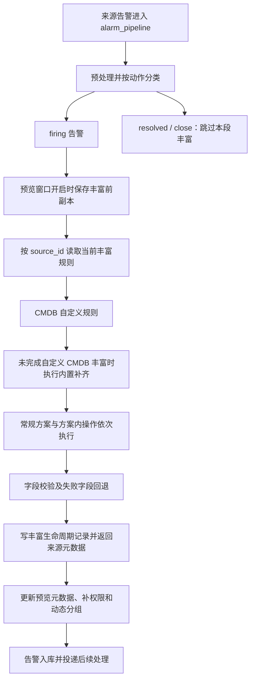

# Kingeye 告警源自定义丰富逻辑梳理

## 记录范围与证据基线

- 调研日期：2026-09-22。
- Kingeye 源码：`ecc936e86ae8dd268abe8403ddabceaeb879733e`，取证开始时工作区无修改。
- Linkd 对照源码：`f9e11e985956a5bff42883f4a669155daa3bfd84`，取证开始时工作区无修改。
- 主题：KAC 告警源配置的 CMDB 丰富与常规字段丰富，覆盖配置、执行、依赖、输出、失败处理及后续调整点。
- 验证方式：阅读生产代码、当前前端入口和已有测试；本次未执行 Kingeye 测试、访问线上配置或联调 MySQL、Redis、OneModel、ES。

本文记录上述 Kingeye 源码快照的行为，供后续讨论和调整使用，不代表线上所有环境已经部署该版本，
也不将旧实现中的细节、缺陷或字段布局自动确认为 Linkd 契约。Linkd 当前边界见
[Alert Enrich 设计](../design/enrich.md)，与本次需求的差异单列在第 9 节。

本文的“常规丰富”对应 `normal_rules`，包含自定义字段写入和已有字段改写。它与 KMC
`alarm_callback` 中的内置监控数据生成逻辑是不同链路；后者另见
[Kingeye 告警回调数据生成外部依赖盘点](kingeye-alarm-callback-data-dependencies.md)。

## 1. 先看结论

1. **丰富配置属于告警源。** `AlarmSource.alarm_enrich` 关联 `AlarmEnrich`，后者保存
   `cmdb_rules` 和 `normal_rules` 两个有序 JSON 数组。
2. **CMDB 先执行，常规丰富后执行。** CMDB 负责模型识别、实例定位、关系查询和属性映射；
   常规丰富负责字符替换、正则提取和字段调整。
3. **结果直接写入告警字典。** 可以新增自定义顶层字段，也可以覆盖已有字段。后面的方案和步骤读取
   前面修改后的值，没有统一的“只填空值”策略。
4. **在 firing 告警入库前执行。** 丰富后的业务、模型、实例等字段继续影响权限信息及下游策略处理。
   恢复和关闭消息不走这段丰富。
5. **执行器包含查询与写入副作用。** 除读取外部数据，还写丰富生命周期记录，并向预览链路提供字段来源信息。
   不能把整个 `EnrichRuleHandler.enrich()` 当成无副作用的纯转换函数。
6. **Linkd 尚未接入这套规则。** 当前 `source` Processor 只查询告警源名称；现有 CMDB/资源读取能力
   不等于已经支持 `cmdb_rules`。字段落点、执行时机、规则版本及输出消费都需要另行确认。

## 2. 配置模型与入口

### 2.1 配置归属

| 对象 | 作用 | 当前行为 |
|---|---|---|
| `AlarmSource` | 告警源 | `alarm_enrich` 是可空外键；正常创建入口不允许给已有方案的来源再次创建方案 |
| `AlarmEnrich` | 一个来源关联的丰富配置 | 保存两个规则数组，没有运行时按事件版本读取规则快照的逻辑 |
| `AlarmEnrichField` | 丰富字段目录 | 保存字段 key、展示名/别名、类型、分类、来源类型等元数据；不是规则执行结果 |
| `AlarmEnrichViewSet` | 管理入口 | 支持创建、查询、更新、删除、批量配置，带租户、License 和权限检查 |

处理告警时，`enrich_alarms()` 按 `source_id` 分组，通过 `AlarmSource.objects` 关联读取当前数据库中的
规则。规则按批次读取；不按告警发生时间恢复旧配置。批量配置入口对可操作来源删除旧方案再创建新方案。

证据：K1、K2、K3、K4。

### 2.2 CMDB 规则结构

下面是按当前执行器整理的最小结构示意，不是从线上导出的配置。`alarm_object_id` 必须替换为目标租户
实际的对象模型目录 ID；字段目录与前端展示附加信息按环境补充。

```json
{
  "name": "按告警对象定位主机并补充负责人",
  "alarm_object_id": 123,
  "obj_rules": {
    "A": {"field": "object", "condition": "wildcard", "value": "."},
    "expression": "A"
  },
  "inst_rules": {
    "A": {"field": "object", "condition": "term", "value": "bk_host_innerip"},
    "expression": "A"
  },
  "multi_model_rules": [],
  "enrich_fields": [
    {
      "key": "custom_owner",
      "key_display": "负责人",
      "value": "operator",
      "model_asst_info": []
    }
  ]
}
```

注意两个 `value` 的语义不同：

- `obj_rules` 的 `value` 是与告警字段比较的值。
- `inst_rules` 的 `field` 是告警字段，`value` 是 **CMDB 实例属性名**；将告警取值转换成实例查询条件。
- `enrich_fields` 的 `key` 是目标告警字段，`value` 是读取的实例属性名。
- `model_asst_info` 为空时从主实例取属性；非空时定位多模型链路上的关联实例。

### 2.3 常规规则结构

当前结构是“方案 → 匹配条件 → 有序操作列表”，不是模型旧注释中直接放 `type/fields/rules` 的扁平数组。

```json
{
  "name": "提取主机并调整标题",
  "match_rules": {
    "A": {"field": "content", "condition": "wildcard", "value": "host="},
    "expression": "A"
  },
  "enrich_settings": [
    {
      "type": "extract",
      "rules": [{"field": "content", "value": "host=([A-Za-z0-9.-]+)"}],
      "fields": [{"key": "custom_host", "key_display": "主机", "value": "$1"}]
    },
    {
      "type": "field_adjust",
      "rules": [],
      "fields": [{"key": "name", "key_display": "告警名称", "value": "${custom_host}: ${content}"}]
    }
  ]
}
```

证据：`process_normal_rules()` 的真实读取结构、当前前端 `normal-enrich-form.vue` 的保存参数，
以及 `test_normal_enrich`，见 K4、K8、K11。不要根据旧 `normal-enrich.vue` 或模型注释推断当前能力。

### 2.4 保存校验

- CMDB 与常规方案的名称放在同一个集合中检查重复，不能重名。
- CMDB 的 `obj_rules`、`inst_rules` 非空时执行 `ExpressionValidator` 校验。
- 多模型链路限制由动态配置给出；链路内部还检查重复模型和非末节点的单实例约束。
- `_validate_normal_rules()` 当前只检查方案名称重复；不能据此认为后台已完整校验常规条件、正则、目标字段及操作类型。
- 前端还有字段选择、必填和调试期间禁止保存等约束；它们不能等同于执行器的字段写入白名单。

## 3. 运行链路与顺序



补充边界：

- `ALARM_SOURCE_ACCESS` License 无效时，`enrich_alarms()` 直接返回原告警及空元数据；内置 CMDB
  补齐也随之跳过。空输入返回空结果。
- 不同来源通过 `ThreadPoolExecutor(settings.THREAD_NUM)` 并行；同一来源内的规则按数组顺序执行。
- 一个方案命中后不会统一终止整条链。后续适用方案仍可覆盖字段。
- 同一方案内的多个 `enrich_settings` 串行执行；后续常规方案的 `match_rules` 也读取更新后的告警。
- 常规丰富在 CMDB 后面，因此常规步骤提取出来的字段不会在本次执行中重新用于前面的 CMDB 实例定位。
- KAC 的每批 firing 都进入此入口；这里没有 Linkd 式“只有新建 Alert 才执行”的判断。

证据：K3、K4。已有测试将 `content` 连续替换成 `success`，下一方案再生成 `name=success-1`，
明确体现顺序依赖，见 K8。

## 4. CMDB 丰富

### 4.1 模型识别与实例定位

`EnrichRuleHandler` 初始化时读取当前租户 CMDB 模型目录，建立
`object_model_id → bk_obj_id` 映射。`_split_alarm()` 根据告警是否已有模型和实例身份分组。
缺少旧身份字段时，尝试从 `cw_object_model_code/cw_object_model_inst_id` 归一化得到
`bk_obj_id/bk_inst_id`。

| 输入状态 | 当前处理 |
|---|---|
| 模型和实例都有 | 按模型与实例 ID 查询；`enrich_inst_rules_to_policy()` 最终忽略额外实例匹配条件 |
| 有模型、没有实例 | 只考虑相同模型的方案；根据 `inst_rules` 将告警字段转换为实例属性过滤条件 |
| 没有模型，或只有实例没有模型 | 尝试 `obj_rules`；命中后设置 `bk_obj_id` 并补 `model_id/model_name`，再定位实例 |
| 没有实例 ID，也没有实例条件 | 不进行实例查询 |
| 模型目录中找不到 `alarm_object_id` | 跳过该 CMDB 方案 |

实例查询通过 `onemodel.search_instances(..., size=1)` 进行，当前只取第一条结果，没有在这一层校验
“结果是否唯一”，也没有显式指定稳定排序。不能把“多实例命中”理解为报错。

命中后更新 `bk_inst_id` 和 `model_inst_id`，实例内容缓存在当前 Handler 中，供字段映射复用。
查询并发限制为 `min(max(THREAD_NUM, 1), 查询数)`，但查询任务列表本身先完整构建。

实例条件中的 `regexp_extract` 先对告警字段做 `re.search()`：优先取第一个捕获组，无捕获组时取完整匹配。
没有匹配时使用一个特殊字符串作为查询值，希望得到空结果；这不是显式的“不匹配”结果类型。

证据：K4、K5。

### 4.2 多模型关联丰富

`multi_model_rules` 保存一组以 `next` 串接的关系链。主要字段包括 `link_id`、`bk_obj_id`、
`target_obj_id`、`bk_obj_asst_id`、`bk_asst_id`、`single`，末节点可以带实例过滤 `inst_rules`。

执行过程：

1. 从已经定位的主模型实例出发。
2. 根据关系两端决定查询方向，通过 `onemodel.search_instance_relations()` 查询关联实例 ID。
3. 非末节点使用返回的第一个实例继续向后走；末节点可保留多个实例。
4. 批量读取各节点实例详情，并应用末节点的实例过滤。
5. 用 `(link_id, bk_obj_asst_id, target_obj_id)` 定位关联结果，`enrich_fields.model_asst_info`
   指定从哪一组关联实例取值。

结构校验不允许同一条链重复出现模型；非末节点必须声明 `single=true`。当前执行器并不额外验证
非末节点实际只返回一个实例，而是取第一个。

动态配置为 `get_dynamic_config().domains.kac.strategy`：

| 配置 | 源码默认值 | 作用 |
|---|---|---|
| `multi_model_enrich.multi_model_enrich` | `false` | 是否执行多模型关系查询；关闭时主模型丰富仍可执行 |
| `multi_model_enrich.max_enrich_model` | `5` | 保存时限制所有链路除起点外的节点总数 |
| `multi_model_enrich.max_enrich_link` | `3` | 保存时限制链路数量 |
| `fields_length_constraints.multi_model_enrich_field.value` | `256` | CMDB 属性值拼接后的截断长度，当前同样作用于单实例属性 |

这些是代码默认值，不是本次核实的线上配置。证据：K2、K4、K6。

### 4.3 属性映射与展示值转换

首先对选中的实例读取 `enrich_field.value`，转成字符串，以逗号连接多个值，再按上述长度截断，
最后写入 `enrich_field.key`。写入通常会覆盖旧值，包括写成空字符串。

| 属性类型 | 当前转换 |
|---|---|
| 普通属性 | 转字符串；多个实例值使用逗号拼接 |
| `enum` | 用拼接结果查枚举展示映射，未命中时保留原字符串 |
| `num` | 在字符串后追加属性单位 |
| `time` | `T` 换为空格，去掉 `+` 后的时区部分与小数部分 |
| `objuser` | Redis 查用户展示名，转换为 `username(display_name)`，多用户以分号连接 |
| `organization` | Redis 查部门全路径，展示时去掉路径第一层；当前取值存在可疑下标行为，见第 8 节 |
| `bk_cloud_id` | Redis 查云区域名，转换为 `名称[id]` |

属性定义来自租户范围的 `CMDB_OBJECT_ATTRIBUTE_CACHE_KEY`，用户、部门和云区域展示信息也来自
对应 Redis 缓存。当前实现把原始属性和展示文本混在同一输出字段中，并没有同时保留结构化 raw/display 两份值。

### 4.4 内置补齐与自定义规则的关系

`builtin_cmdb_enrich()` 补缺失的业务、集群和模块 ID/名称；已有值通常保留。业务通过 OneModel 实例读取，
主机的集群/模块来自主机关系及业务拓扑。

- 自定义规则找到可用实例并准备映射属性时，先调用内置补齐，再写自定义字段，因此自定义映射可以覆盖补齐结果。
- 如果某条告警最终没有被标记为完成自定义 CMDB 丰富，则执行内置补齐作为回退。
- 有 CMDB 规则但未完成丰富时，先用原告警字典 `update()` 回填，再补齐。此操作只恢复原有 key，
  不会删除过程中新增的 key，不能称为完整事务回滚。
- “完成 CMDB 丰富”标记是在找到实例并处理映射字段后设置，不等同于字段一定有非空值，也不等同于
  仅完成模型或实例定位。

证据：K4 中 `enrich()`、`process_cmdb_rules()`、`builtin_cmdb_enrich()`。

## 5. 常规字段丰富

### 5.1 三种实际执行操作

| 类型 | 输入与行为 | 关键边界 |
|---|---|---|
| `replace` | 对 `fields` 中已有告警字段逐个执行 `rules` 的字符串替换 | 源字符串通过 `re.escape()` 处理；执行器没有读取 `is_regex` 来切换正则替换；遇到不存在的目标字段会 `break`，该操作中后续字段不再处理 |
| `extract` | 从 `rules[0].field` 读取一个告警字段，以 `rules[0].value` 执行 Python `re.findall()`，把结果代入各目标字段模板 | 只使用第一条提取规则；目标字段可以是新增字段；无匹配仍会进行模板赋值 |
| `field_adjust` | 按 `fields` 顺序执行模板替换后写入目标字段 | 支持常量、`${field}` 引用和字符串拼接；可新增或覆盖字段；后面的字段能读到前面的写入 |

目前执行器没有 `process_combine_rule()` 或 `process_match_update_rule()`。旧注释中的“字段合并”和
“匹配更新”不能作为两种独立运行时操作；对应效果由方案匹配条件与 `field_adjust` 组合表达。

### 5.2 正则提取结果的编号

- `re.findall()` 结果是字符串列表时，按结果序号生成 `$1`、`$2` 等变量。
- 如果结果元素是 tuple，即正则有多个捕获组，只使用**第一个匹配的各捕获组**生成编号。
- 例如 `机器位置\((\d)-(\d)-(\d)\)` 匹配 `机器位置(3-1-2)`，可以用 `$1/$2/$3` 生成 `3/1/2`。
- 源码使用的变量匹配式为 `r"(\$\w+?)"`，不是通用模板解析器。多位编号、缺少捕获组、空结果以及
  Python 与 Go 正则语法差异都应单独确定后续语义，不能仅按“支持正则提取”推断等价。

### 5.3 字段取值与模板替换

- 常规模板读取的是扁平告警字典的顶层 key，不支持通用 JSONPath 或任意嵌套路径。
- `field_adjust` 识别 `${word}`；提取模板识别 `$word`。它们不是同一套占位符语法。
- 替换模板中的 `action`、`level`、`status` 时，优先使用对应展示值映射。
- 字段调整的 `_get_value_from_dict()` 会把 `None`、`0`、`False` 等假值转换为空字符串；
  条件编译器自己的同名方法直接做 `str()`，因此 `None` 可能成为字符串 `"None"`，两处空值语义不同。
- `replace` 的多条规则逐条修改当前字符串；不要假设它是一次性、无级联的并行替换。

证据：K4 的 `process_replace_rule()`、`process_extract_rule()`、`process_field_adjust_rule()`、
`_format_var2value()`，以及 K8。

## 6. 匹配条件

方案匹配和模型匹配使用“命名条件 + `expression`”结构，如 `A and (B or C)`。
当前实现是已有 `ExpressionCompiler` 的自定义解释逻辑，并非 Python 表达式求值接口；后续如迁移，
应以明确语法和样例确认括号、逻辑优先级及大小写边界。

| 条件名 | 告警匹配侧行为 |
|---|---|
| `term` | 等于 |
| `wildcard` | 子串包含；不解释 `*`、`?` 通配符，也没有自动忽略大小写 |
| `regexp` | `re.findall()` 有结果即匹配 |
| `must_not_term` | 不等于 |
| `must_not_wildcard` | 不包含 |
| `regexp_extract` | 对源字段 `re.search()`，取完整匹配与比较值判断相等 |

没有 `match_rules` 的常规方案默认匹配所有输入告警。CMDB 没有 `obj_rules` 则不会靠该方案为无模型
告警识别模型，但仍可处理原本已有相应模型身份的告警。

三处正则提取实际并不相同：告警匹配取完整匹配，实例查询优先取第一捕获组，常规提取使用
`findall()` 编号映射。多模型末节点过滤又单独处理告警字段或常量，再与实例属性比较。

证据：K4、K5。不能把上述三种实现直接收敛成一个通用正则操作而不确认行为差异。

## 7. 输出、副作用与失败处理

### 7.1 输出及消费

`enrich_alarms()` 返回 `(alarms, enrich_metadata_map)`：

- `alarms` 是原结构上修改后的告警字典列表，自定义字段直接处于顶层。
- `enrich_metadata_map` 以 `alarm_id` 为 key，包含 `cmdb_enrichments`、`normal_enrichments` 和
  `field_enrich_mapping`，用于描述方案和影响字段，供丰富预览展示。
- `EnrichRuleHandler.enrich()` 内写 `AlarmLifeCycle.ENRICH` 生命周期记录。
- `AlarmEvent` 使用动态字段映射，自定义顶层字段可参与 ES 存储；这不意味着任意类型和任意目标字段
  都已通过校验。
- 丰富后才执行 `add_permission_info()`，使用业务、集群和模型实例信息生成权限标签与动态分组信息。
  这些字段已有值时部分逻辑会跳过，并非总是重算。

预览链路在窗口开启时保存丰富前副本，再结合入库结果和丰富元数据展示差异。本文只确认生产链路中的
这些调用位置，不把它描述成已经独立、无副作用的 dry-run 规则引擎。

### 7.2 失败隔离的实际粒度

| 失败位置 | 当前处理 |
|---|---|
| CMDB 单个方案 | 捕获异常后跳过当前方案，继续后续方案；已执行的字段修改不保证撤销 |
| 常规方案处理某条告警 | 异常后跳过该方案在这条告警上的剩余操作，继续后续迭代；保留之前的修改 |
| 单次主实例查询 | 记录异常并作为无实例结果处理 |
| 内置 CMDB 补齐 | 整体捕获异常并记录 warning，已完成的补齐可能保留 |
| 最终模型字段校验 | 调用 `AlarmEvent.clean_fields()`；捕获 `ValidationException` 后按实现条件恢复错误字段原值，并调整生命周期文案 |
| Handler 初始化、未捕获异常或 `future.result()` 失败 | 没有统一转成单来源失败结果，异常可能上抛到整个 `alarm_pipeline` |

校验发生在所有规则之后，因此即使某字段最后被回退，依赖该字段生成的其他字段也不会自动重新计算。
`clean_fields()` 的作用也不等于已经通过真实 ES 写入验证。

当前没有与 Linkd 对齐的 `succeeded/partial/failed/skipped` 结构化规则结果，也没有在此执行器内提供统一的
单规则超时、查询重试或失败告警后台重丰富机制。具体外部客户端仍可能各自配置超时/缓存。

证据：K3、K4、K9。

## 8. 依赖与需要单独审视的实现边界

### 8.1 外部依赖

| 依赖 | 用途 |
|---|---|
| Kingeye ORM | 读取来源与当前规则、字段目录、告警级别展示信息 |
| OneModel 门面 | CMDB 模型目录、主实例检索、关联关系及关联实例读取、业务实例读取 |
| Redis / 缓存 | 模型属性定义、用户/部门/云区域展示值、关系缓存、业务拓扑相关缓存 |
| DynamicConfig | 多模型开关、链路/节点限制、属性字符串截断长度 |
| License | `ALARM_SOURCE_ACCESS` 丰富入口开关 |
| KAC 存储 | 生命周期记录、告警及预览数据存储 |

即使只配置常规规则，Handler 初始化仍会读取模型目录、动态配置和 Redis 连接；主流程还可能进行内置
CMDB 回退。因此不能把当前“仅常规规则”的实际运行依赖简化为纯字符串运算。

### 8.2 源码观察到的边界与可疑点

以下用于后续设计和验证，不作为必须复制的兼容规则，也不表示已在线上复现：

| 观察项 | 源码证据与影响 |
|---|---|
| 多实例歧义 | 主实例查询 `size=1`，中间关联节点取第一个结果；没有唯一性冲突结果 |
| 不完整回退 | CMDB 未完成时用字典 `update()` 恢复原字段，不删除新增 key；规则中途异常也可能留下部分写入 |
| 字符串化与截断 | 多实例值直接逗号拼接，随后截断；类型、数组边界和部分展示转换信息可能丢失 |
| 部门取值可疑 | 属性已经被转换为字符串，`organization` 分支又取 `enrich_value_info[0]`，实际可能仅保留第一个字符 |
| 关联模型属性定义 | 字段来自关联模型时，属性元数据仍用主模型 `object_bk_obj_id` 查询；关联字段的 enum/unit 等展示转换需验证 |
| 常规字段目录维护结构滞后 | `update_create_enrich_field()` 及查询别名更新仍遍历 `normal_rule.fields`，执行器则读取 `normal_rule.enrich_settings[].fields`；当前嵌套规则的自动注册和别名刷新路径需补核 |
| 多模型条件对象被修改 | `get_dll_asst_inst_details()` 对末节点 `inst_rules` 执行 `pop("expression")`；同一链对象在多条告警间复用，后续告警的条件解释需验证 |
| 字段来源元数据不统一 | CMDB 来源映射使用字段展示名，常规来源映射使用字段 key；最终字段校验回退后也未重建这些元数据 |
| 租户线程上下文 | ORM/缓存依赖当前租户，多处 OneModel 调用显式传租户；外层来源并发使用标准库线程池，线程中读取租户需要专项验证 |
| 并发与总预算 | 外层来源线程池与内层实例查询线程池叠加；线程数有限不代表总查询量、总耗时及返回载荷都有统一硬上限 |

租户方面，本次看到模型目录和主实例查询等显式使用 `bk_tenant_id`，缓存 key 经
`get_tenant_cache_key()` 处理。但当前 `get_tenant_id()` 的底层是线程局部状态，外层
`p.submit(handler.enrich)` 没有在这一调用点显式捕获/恢复租户；不能仅凭入口 ORM 过滤就宣称整个
多线程执行过程已验证租户隔离。

证据：K1、K3、K4、K7、K9、K10。

## 9. 与 Linkd 的差异及待确认事项

本节只记录差异和问题，不指定新的 Processor 名称、目标 schema 或迁移方案。

| 关注点 | Kingeye 当前实现 | Linkd 对照基线 |
|---|---|---|
| 输入 | 可直接修改的扁平 Alarm 字典 | Normalize 后的 `domain.Alert` 副本 |
| 字段落点 | 覆盖原字段或新增顶层自定义字段 | `EnrichResult` 只写 `Alert.EnrichStatus/Enrich` |
| 调用时机 | 每批 firing 入库前 | 新建 Alert 路径；`close_and_create` 升级会新建并丰富，`update_current` 升级不重丰富 |
| 规则配置 | 通过当前来源关联实时读取 `AlarmEnrich` JSON | EventSource Release 配置有序 Processor 链，尚无这两类规则装配 |
| 来源 Reader | 读取 CMDB 和常规规则 | `AlarmSourceReader` 只读取来源名称 |
| CMDB 查询 | 布尔实例条件、任意配置关系链、展示属性转换 | 已有实例定位与特定资源拓扑 Reader，尚无本套规则执行接口 |
| 失败表达 | 生命周期文案、日志、部分字段回退 | Processor envelope、diagnostics 和聚合状态 |
| 输出消费 | 下游直接读取丰富后的 Alarm 字段 | KAC Hook 当前按固定 Processor/字段投影，不会自动接纳任意自定义字段 |

Linkd 证据：L1—L6。现行丰富设计中“等级升级重新丰富”的概括需要结合升级策略理解；
`update_current` 路径不调用新建丰富，已在 [KAC Alarm Hook 设计](../design/kac-alarm-hook.md) 中说明。
本次不调整这两份现行文档。

后续评审优先确认：

1. **能力范围：** 首批包含单模型、任意多模型链路、展示值转换、字段目录、预览中的哪些能力？
2. **字段归属：** 保留来源事实并输出丰富结果，还是允许覆盖标题、内容、标签或主体？哪些 key 明确禁止写入？
3. **规则顺序：** 是否保留 CMDB 在常规规则前的固定顺序？是否需要先提取字段再定位实例？
4. **身份与多命中：** 已有实例 ID 是否继续忽略匹配条件？多实例命中是报冲突、确定性选取，还是输出集合？
5. **配置版本：** Kingeye 继续作为规则编辑入口时，如何把规则纳入 EventSource Release、追踪版本和复现历史结果？
6. **值与失败语义：** 缺字段、空字符串、零、布尔、正则不匹配、截断和部分失败如何表达？是否按规则原子提交字段变化？
7. **执行时机和消费：** 每次 firing、仅首次创建还是支持重丰富？结果如何进入 KAC Hook、检索、展示和下游策略？
8. **运行约束：** 显式租户传递、查询/关系展开/正则/载荷预算、超时取消、规则级诊断和测试样例如何定义？

其中字段覆盖需求与 Linkd 现有 Enrich 边界存在实质差异，需要先作领域决策，再同步设计、实现与消费者。
不能只增加一个查询 Processor，就宣称已经支持 Kingeye 告警源自定义丰富。

## 10. 源码与测试索引

### 10.1 Kingeye

以下路径相对于本次取证的 Kingeye 仓库根目录，均对应本文记录的 commit。行号仅作定位辅助，
优先以类/函数名查找。

| 编号 | 文件与入口 | 对应内容 |
|---|---|---|
| K1 | `src/kingeye/kac/alarm_collect/models.py`：`AlarmEnrich`（39）、`update_create_enrich_field`（233）、`AlarmSource.alarm_enrich`（381）、`AlarmEnrichField`（963） | 配置、关联、字段目录 |
| K2 | `src/kingeye/kac/alarm_collect/serializers.py`：`AlarmEnrichSerializer`（26） | 保存、名称和 CMDB 规则校验 |
| K3 | `src/kingeye/kac/alarm/pipeline.py`：`alarm_pipeline`（146）、丰富预览相关函数 | 调用时机、权限、存储和后续投递 |
| K4 | `src/kingeye/kac/alarm_collect/clients/enrich_utils.py`：条件处理（133）、`EnrichRuleHandler`（259）、`enrich`（492）、CMDB（655）、常规（747）、操作实现（820）、`enrich_alarms`（992）、内置补齐（1039）、多模型（1202） | 核心执行逻辑 |
| K5 | `src/kingeye/kac/common/policy_utils.py`：`ExpressionCompiler`（265）、`enrich_inst_rules_to_policy`（1368） | 条件表达式与实例过滤转换 |
| K6 | `src/kingeye/base/config/kac.py`：`_MULTI_MODEL_ENRICH_DEFAULT`（50）、`_FIELDS_LENGTH_CONSTRAINTS_DEFAULT`（51） | 配置默认值 |
| K7 | `src/kingeye/kac/alarm_collect/views.py`：`AlarmEnrichViewSet`（1447） | 管理、别名更新和批量配置 |
| K8 | `src/kingeye/kac/tests/alarm_collect/test_enrich/test_process_normal_enrich.py` | 有界实例查询并发、字符替换、常规多方案顺序测试 |
| K9 | `src/kingeye/kac/alarm/models.py`：`AlarmEvent`（128）；`src/kingeye/kac/alarm_collect/enrich_preview/services.py` | 动态字段存储、预览结果与差异展示 |
| K10 | `src/kingeye/base/infras/threading/local.py`：`get_tenant_id`（188）、`get_tenant_cache_key`（206） | 线程局部租户、缓存 key |
| K11 | `src/web/src/projects/kac/src/views/alarm-source/source-access/alarm-enrich/index.vue`；同目录 `normal-enrich/normal-enrich-form.vue`、`normal-enrich/new-enrich-method.vue`、`cmdb-enrich/index.vue` | 当前前端入口与保存结构 |
| K12 | `src/kingeye/kac/tests/alarm_collect/test_enrich/test_mutil_enrich.py`；`src/kingeye/kac/tests/alarm_collect/test_alarm_enrich_model_directory.py` | OneModel 查询、实例过滤、多模型表达式/关系链及模型目录租户测试 |

本次只阅读已有测试，没有执行；表中的“测试”表示已有验证意图与断言，不表示当前环境测试通过。

### 10.2 Linkd

| 编号 | 文件 | 对应内容 |
|---|---|---|
| L1 | [Enrich 端口与调用保护](../../internal/lifecycle/enrich.go) | 输入隔离、结果只能写 enrich、失败降级 |
| L2 | [Lifecycle 处理计划](../../internal/lifecycle/plan.go) | 新建 Alert 与两种升级路径 |
| L3 | [EventSource 配置](../../internal/config/event_source.go)、[Processor 注册](../../internal/enrich/assembly/router.go) | 配置校验、处理器列表与装配 |
| L4 | [丰富 Scope 与 Reader](../../internal/enrich/scope.go)、[来源查询](../../internal/enrich/datasources/alarm_source_client.go) | 当前实例能力、来源仅查名称 |
| L5 | [Chain 执行](../../internal/enrich/enricher.go) | 顺序执行、失败隔离、结果封装 |
| L6 | [KAC 输出转换](../../internal/lifecycle/kachook/message.go) | 固定字段输出及 Processor 结果消费 |
