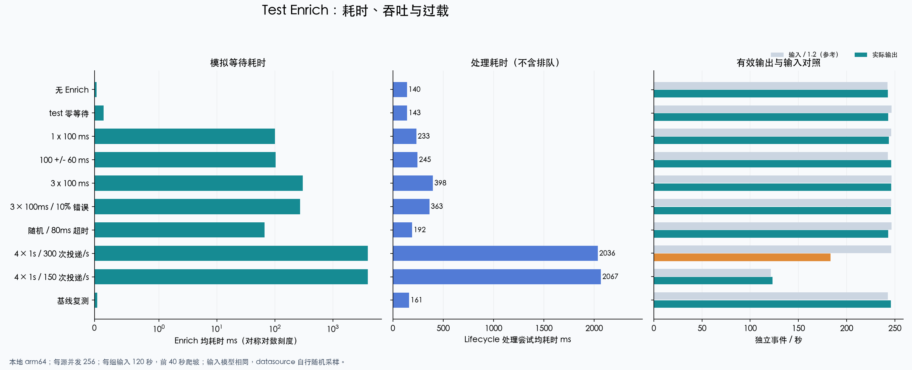
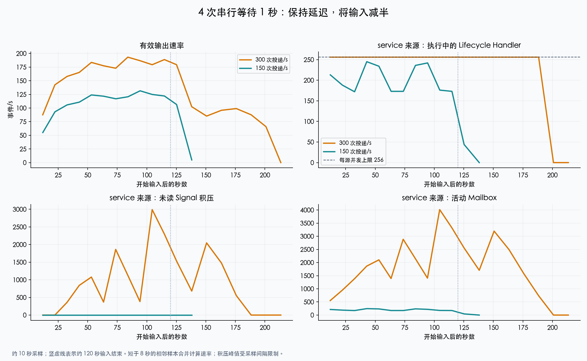

# Test Enrich 模拟负载性能对照

测试日期：2026-09-18，17:26–17:53（UTC+8）。代码快照：`f1319e34a7ce05523f48602adfd3230662903248`。

## 1. 结论

- **短等待主要增加处理耗时，本轮输入下没有造成持续吞吐下降。** 固定 100ms、随机 100 ± 60ms、串行 3 次 × 100ms 的 Enrich 实测均值分别为 100.6ms、102.3ms、303.5ms；各组有效输出约 244–246 Events/s，全部对账并排空。
- **长时间等待会耗尽单个来源的并发槽位，CPU 使用率并不能独立反映这种过载。** 4 次 × 1s、目标 300 次投递/s 时，有效输出降至 183.1 Events/s；service 来源采样到的未读 Signal 峰值为 2,991，Kafka lag 峰值为 4,570，Lifecycle 平均 CPU 仅 0.78 核。具体变化见第 5 节。
- **相同 4s 等待，将输入减半后表现明显改善。** 目标 150 次投递/s 的有效输出为 123.1 Events/s；积压及并发变化见对照图，不能据此推导精确的长期容量上限。
- **Enrich 失败与事件处理失败必须分开统计。** 每次调用 10% 错误、最多连续调用 3 次时，27.39% 的告警 Enrich 失败；80ms 超时组为 62.55%。两组仍完成全部告警、事件、日志和输出对账，失败结果真实落库。
- **零延迟 test 的直接开销较小。** 平均 Enrich 耗时 0.14ms；该结论仅适用于本轮两个小字段，未测试大字段序列化成本。

## 2. 环境与不变量

| 项目 | 条件 |
| --- | --- |
| 宿主机 | Apple M4 Pro，14 核、48 GiB，macOS/arm64，共享开发环境 |
| 运行方式 | Apple Container，Control Plane、Cleaner、Lifecycle 独立进程，Go 1.26.7 |
| Lifecycle | 4 vCPU / 2 GiB；每个来源并发 256；worker 总预算 512 |
| Cleaner / Control Plane | 分别 2 vCPU / 1 GiB、1 vCPU / 1 GiB |
| Elasticsearch | 7.17.7，4 vCPU / 4 GiB，heap 1 GiB；2 主分片、0 副本；refresh 5s |
| ES 写入 | 合批 128 项 / 128ms，读收集 10ms，共享执行并行度 32；AlertLog translog async |
| Redis / Kafka | Redis 7.2.16，1 vCPU / 1 GiB；Kafka 3.9.1，2 vCPU / 3 GiB，两个输入 topic 各 3 分区 |
| 调度与背压 | 每源 Signal 最大在途 1024；Mailbox 背压高/低水位 2048/1024；Lifecycle 处理超时 30s |
| 观测 | Prometheus 5s 抓取；实验每约 10s 直接采集累计指标和队列状态 |
| 数据复用 | 同一组进程、同一组已有索引顺序测试；各轮使用不同事件身份，不清空历史数据 |

每组持续输入 120 秒，前 40 秒作为爬坡段，比较约第 40–110 秒之间的累计指标增量。
实际采样边界及分母保存在 [summary.json](2026-09-18-test-enrich/summary.json)；由于采样离散，约在第 43–115 秒之间，窗口仍有少量爬坡影响。
各组间停止输入、等待 Kafka/Signal/PEL/Mailbox/归档全部排空，再发布下一组来源配置，并确认新版本任务运行。

输入模型沿用此前本地验证：infra/service 新告警比例 1:2，1 秒一个周期，平均存活 20 周期，20% 重复投递。
目标 300 次投递/s 对应每分钟 2,500 + 5,000 个新告警，即合计约 125 个新告警/s。
近稳态下，约 250 个独立事件/s 加上重投形成约 300 次投递/s；**300 次投递/s 并不代表 300 次 Enrich/s**。
150 次投递/s 组将新告警速率减半。所有 300 次投递/s 组实际生成和投递数量相同，便于对照。

`test` 只在新建 Alert 时执行，恢复等已有告警处理沿用已有 Enrich。
成功时写入两个固定字段 `benchmark: test-enrich`、`simulated: true`。
随机 sleep 由 datasource 自行生成，不配置随机种子。

## 3. 场景和统计口径

| 场景 | calls | sleep 期望 / 标准差 | sleep 上限 | 单次超时 | 单次错误率 |
| --- | ---: | --- | ---: | ---: | ---: |
| 无 Enrich / 末轮复测 | — | — | — | — | — |
| test 零等待 | 1 | 0 / 0ms | 500ms | 600ms | 0 |
| 固定等待 | 1 | 100 / 0ms | 500ms | 600ms | 0 |
| 随机等待 | 1 | 100 / 60ms | 500ms | 600ms | 0 |
| 多次调用 | 3 | 100 / 0ms | 500ms | 600ms | 0 |
| 随机报错 | 3 | 100 / 0ms | 500ms | 600ms | 10% |
| 超时 | 1 | 100 / 60ms | 500ms | 80ms | 0 |
| 长等待 / 流量减半 | 4 | 1,000 / 0ms | 1,000ms | 1,500ms | 0 |

`calls` 是每次 Enrich 内**依次执行**的 datasource 调用次数，第一次失败后立即结束，后续调用不会继续执行。
随机延迟服从正态采样，并截断到 `[0, sleep_max]`，所以配置期望、标准差不等于截断后的实际分布参数。

- 输入速率：两路输入 Kafka 的 offset 增量 / 观测时长，包含重投。
- 有效输出速率：输出 Kafka 的 offset 增量 / 观测时长；各组最终与独立事件数逐项对账。
- Enrich 均耗时：`linkd_enrich_attempt_duration_seconds_sum / count` 的窗口增量；包括成功和失败。
- Lifecycle 均耗时：`linkd_pipeline_attempt_duration_seconds` 的窗口增量；表示 `ProcessEvent` 的一次处理尝试，包含重投的快捷返回，**不包含进入处理器前的排队，不等于端到端延迟**。
- CPU：进程 CPU 累计秒数 / 观测秒数，1.00 表示平均使用 1 个 CPU 核；Lifecycle 配额为 4 核。
- 积压、RSS 与在途数：约 10s 采样的峰值，可能遗漏采样间峰值；PEL/pending 包含执行中和待确认项，不全部等价于未处理事件。
- 时间序列速率将间隔不足 8s 的相邻采样合并后计算，避免收尾时的密集采样放大单批消息波动；峰值仍从全部原始采样计算。
- P95/P99：来自既有直方图分桶；[明细](2026-09-18-test-enrich/summary.json)同时保留插值估计及所在桶上下界。主表使用累计和/计数得到的均值，避免把粗桶插值当作精确尾延迟。

## 4. 耗时、吞吐与失败结果

| 场景 | 实际投递/s | 有效输出 Events/s | Enrich 均值 ms | Lifecycle 均值 ms | Enrich 失败率 | Lifecycle CPU 核 |
| --- | ---: | ---: | ---: | ---: | ---: | ---: |
| 无 Enrich | 290.9 | 242.8 | 0.03 | 140.4 | 0.00% | 0.46 |
| test，零等待 | 295.9 | 243.0 | 0.14 | 142.5 | 0.00% | 0.49 |
| 固定 100ms | 295.4 | 244.0 | 100.63 | 232.8 | 0.00% | 0.65 |
| 随机 100 ± 60ms | 291.3 | 246.1 | 102.32 | 244.7 | 0.00% | 0.65 |
| 3 次 × 100ms | 295.9 | 246.2 | 303.48 | 397.8 | 0.00% | 0.81 |
| 3 次 × 100ms，每次 10% 错误 | 295.7 | 246.0 | 273.33 | 363.2 | 27.39% | 0.77 |
| 随机 100 ± 60ms，80ms 超时 | 295.9 | 243.1 | 66.04 | 192.3 | 62.55% | 0.56 |
| 4 次 × 1s，300 次投递/s | 295.6 | 183.1 | 4004.68 | 2036.0 | 0.00% | 0.78 |
| 4 次 × 1s，150 次投递/s | 145.8 | 123.1 | 4006.74 | 2066.8 | 0.00% | 0.59 |
| 无 Enrich，末轮复测 | 291.3 | 246.1 | 0.04 | 161.5 | 0.00% | 0.54 |

### 4.1 延迟增加与随机波动

无 Enrich 与零等待 test 的差值很小，处于本地顺序实验的抖动范围内，不能仅据这两个窗口精确声称整个 Pipeline 有多少固定开销。
100ms 固定等待增加后，吞吐仍能跟上，而处理尝试耗时明显增加；3 次串行调用的 Enrich 均值接近 300ms。
整个 Lifecycle 的变化还包含原有读写合批等待、重投和恢复事件的混合，不能简单等同于 sleep 的线性加法。

随机组超过 250ms 的 Enrich 占比为 **0.635%**，固定 100ms 组为 **0.000%**。
两者的 Enrich P95 都可能落在 `(100, 250]ms` 的同一桶内；这不代表尾部分布相同，也不适合用桶内插值排序两者优劣。

### 4.2 随机错误与超时

随机错误组实际执行 40,570 次 datasource 调用，其中 4,109 次失败，调用错误率 **10.13%**。
对应 4,109 / 15,000 个 Alert 的 Enrich 失败，即 **27.39%**。
其理论关系为 `1 - (1 - 0.1)^3 = 27.1%`，不能把每次调用的 10% 错误率直接当作整条 Enrich 的失败率。
由于失败后提前退出，平均执行 2.705 次调用，Enrich 均耗时降为 273.3ms；这反映少执行了工作，并不是成功路径获得了性能优化。

超时组的期望 sleep 为 100ms、标准差 60ms，而单次截止时间只有 80ms。
实测 9,382 / 15,000 个 Enrich 失败（62.55%），对应 datasource timeout 指标；平均 Enrich 等待限制为 66.0ms。
缩短超时可以减少等待占用，但本例以较高的丰富失败率为代价。

两组的持久化 Alert 均包含实际 `enrich_status` 和 test 处理器状态；成功保留配置字段，失败记录诊断且不写入成功字段。
Enrich 失败通过现有 Chain 隔离，未使这些事件的生命周期处理失败，也未改变最终事件、告警、AlertLog 和输出的数量。
实际状态计数和脱敏结构样例见 [persisted.json](2026-09-18-test-enrich/persisted.json)。

## 5. 长等待、热点来源与减半输入

| 指标 | 4 × 1s，300 次投递/s | 4 × 1s，150 次投递/s |
| --- | ---: | ---: |
| 有效输出 Events/s | 183.1 | 123.1 |
| Enrich 均耗时 ms | 4004.7 | 4006.7 |
| service Lifecycle Handler 在途峰值 | 256 | 245 |
| service Enrich 在途峰值 | 222 | 167 |
| service 未读 Signal 峰值 | 2,991 | 0 |
| service PEL/pending 峰值 | 1,024 | 245 |
| service Mailbox 采样峰值 | 4,015 | 245 |
| service Kafka lag 峰值 | 4,570 | 0 |
| infra 未读 Signal 峰值 | 0 | 15 |
| Lifecycle 平均 CPU 核 | 0.78 | 0.59 |
| Lifecycle RSS 采样峰值 MiB | 99.6 | 88.1 |
| 最后一次投递至首次观测全部排空的上界 s | 86.3 | 17.0 |

容量约束可以从**单个来源**解释：300 次投递/s 的模型中，service 每秒约新增 83.3 个告警，仅 4 秒丰富等待就需要约 `83.3 × 4 = 333` 个并发槽位，超过该来源的 256。
infra 每秒约新增 41.7 个告警，对应约 167 个等待槽位。
全局预算 512 不能在来源间任意借用；即使另一个来源仍有空闲，service 也受自身 256 并发限制。
恢复事件、存储和调度还需要额外时间，256/4 只是忽略这些成本的粗略上限。

流量减半后，service 的等待占用估算降到约 167，能够留出更多余量。
但实际 Handler 采样峰值仍达到 245/256，不能把 150 次投递/s 直接定为生产配额。
Mailbox 高水位是触发背压的阈值，并非活动 Mailbox 数量的硬上限；缓存检查和已接收的在途输入会使观测数量超过该阈值。
本轮数据支持“长 I/O 等待 + 单源并发约束”解释，不能将低 CPU 误读为不存在性能瓶颈；本次没有调整并发，因此也没有证明提高并发后一定获得等比例容量提升。

## 6. 完整性与复测

十组共投递 **313,268** 次，去重后形成 **261,365** 个 Event、
**142,500** 个 Alert、**522,730** 个 AlertLog，
输出 Kafka 共 **261,365** 条；每组数量均独立对齐。
每组新建告警数与 Enrich attempt 数、ES 中 Enrich 状态聚合数一致，重投没有重复产生 Enrich 调用。
每组最终 Kafka lag、Signal lag、PEL、Mailbox、lease、归档 backlog 均为 0。
实验期间 Control Plane、Cleaner、Lifecycle 日志均无新增 WARN/ERROR，Lifecycle 失败尝试为 0；
注入的 datasource 错误和超时已单独计入 Enrich 失败，不能把它们解读为没有发生故障注入。

末轮无 Enrich 复测的有效输出为 246.1 Events/s、Lifecycle 均耗时 161.5ms；
首轮分别为 242.8 Events/s、140.4ms。
吞吐恢复到基线范围，但平均处理耗时比首轮高约 15%，没有恢复到完全相同的数值。
该复测用于检查后续性能差异是否在移除负载后仍持续存在；顺序实验仍可能受到缓存、已有索引和宿主机调度影响。

## 7. 使用建议与边界

- 依据每秒新建告警数、串行调用总耗时和单源并发评估负载，不直接拿包含恢复和重投的输入 Events/s 计算 Enrich 次数。
- 观察每个来源的 Enrich 在途、未读 Signal、PEL 和 Kafka lag，并同时查看 CPU；只看整机 CPU 或汇总吞吐会掩盖热点来源。
- 错误率与超时应和“成功丰富的比例”一起评估。快速失败减少占用，但可能降低业务结果完整性。
- 本轮只覆盖固定小字段及 sleep 模拟的 I/O 等待，没有模拟真实 datasource 的连接池、网络、服务端限流、大返回体或 CPU 密集计算。
- 每种配置只运行一次 2 分钟，基线额外复测一次。这里的速率是有限窗口观测，不是最大容量、长期稳定性或生产 SLA；未测试进程故障恢复，也未以 AlertLog async 配置验证断电持久性。
- 本次没有修改运行时代码。完整参数规范见 [test Enrich 配置](../../guides/configuration.md)，处理边界见 [Lifecycle](../../modules/lifecycle.md)。

## 8. 数据附件

- [汇总 CSV](2026-09-18-test-enrich/summary.csv)：耗时、吞吐、失败率、资源、积压与逐组对账。
- [时间序列 CSV](2026-09-18-test-enrich/timeseries.csv)：约 10 秒间隔的输出、在途、CPU 与积压。
- [详细 JSON](2026-09-18-test-enrich/summary.json)：真实统计窗口、分桶边界、分来源指标和计数。
- [持久化验证 JSON](2026-09-18-test-enrich/persisted.json)：各轮 Alert 的 Enrich 状态聚合与成功/失败结构样例。
- [完整性验证 JSON](2026-09-18-test-enrich/verification.json)：累计对账、错误日志、队列排空和最终配置恢复结果。
