# Lifecycle GC 与调度 pprof 制品

本目录保留 2026-09-07 本地 1000 Events/s 诊断的关键可审查制品，不保留原始 CPU、allocs、
block、mutex 或 execution trace 二进制。SVG 由 `go tool pprof -svg` 与 Graphviz 15.1.1 生成，
属于带调用关系的 pprof 图；同名 `.txt` 是 top 50 摘要。

## 采样条件

- 三进程：Cleaner、Lifecycle、Control Plane；单 Lifecycle 并发 256，GOMAXPROCS 14，GOGC 100。
- 输入模型：目标 1000 Events/s，20% 重投，Event 平均生命周期 20 个一秒周期。
- `normal`：空索引组约第 1 分钟，Signal 未读为 0。
- `slow`：同轮约第 4.5 分钟，Lifecycle 已降速且 Signal 未读持续增长。
- `projection`：完成重复 Normalize、Lifecycle Event 投影、局部 CAS 和 telemetry AttributeSet 缓存后。
- CPU profile 为 20 秒；scheduler 图由降速段 5 秒 execution trace 的 sched profile 转换。

## 制品索引

| 角色/维度 | 正常段 | 降速段 | 优化后 |
| --- | --- | --- | --- |
| Lifecycle CPU | [SVG](lifecycle-normal-cpu.svg) / [top](lifecycle-normal-cpu.txt) | [SVG](lifecycle-slow-cpu.svg) / [top](lifecycle-slow-cpu.txt) | [SVG](lifecycle-projection-cpu.svg) / [top](lifecycle-projection-cpu.txt) |
| Cleaner CPU | [SVG](cleaner-normal-cpu.svg) | [SVG](cleaner-slow-cpu.svg) | [SVG](cleaner-projection-cpu.svg) / [top](cleaner-projection-cpu.txt) |
| Lifecycle alloc_space | - | [正常段到降速段差分 SVG](lifecycle-alloc-diff.svg) / [top](lifecycle-alloc-diff.txt) | [SVG](lifecycle-projection-allocs.svg) / [top](lifecycle-projection-allocs.txt) |
| Cleaner alloc_space | - | [正常段到降速段差分 SVG](cleaner-alloc-diff.svg) / [top](cleaner-alloc-diff.txt) | [SVG](cleaner-projection-allocs.svg) / [top](cleaner-projection-allocs.txt) |
| Lifecycle scheduler | - | [SVG](lifecycle-slow-scheduler.svg) / [top](lifecycle-slow-scheduler.txt) | Prometheus 对照见下表 |

## 图表预览

### Lifecycle CPU：正常段、降速段、优化后

| 正常段 | 降速段 | 投影与局部 CAS 优化后 |
| --- | --- | --- |
| [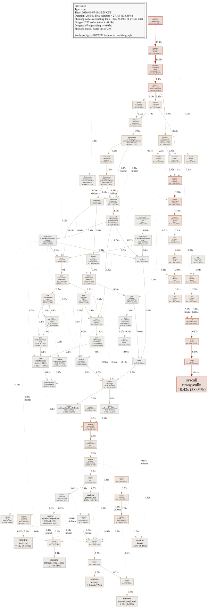](lifecycle-normal-cpu.svg) | [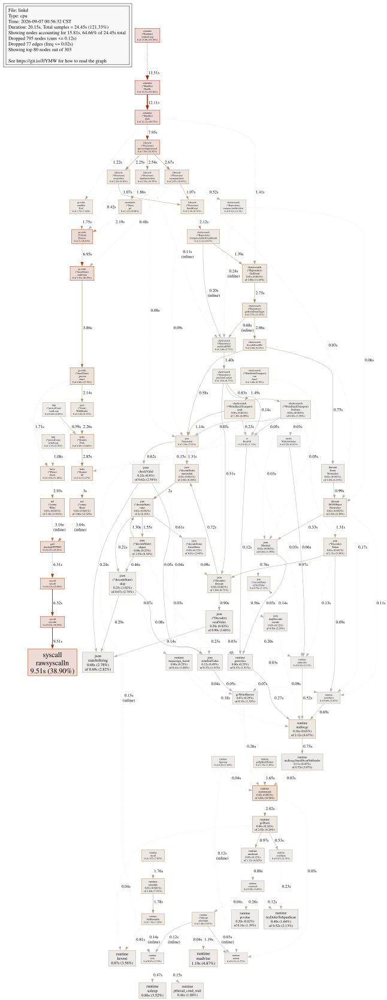](lifecycle-slow-cpu.svg) | [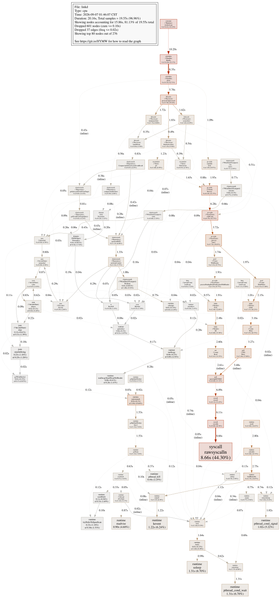](lifecycle-projection-cpu.svg) |

### Cleaner CPU：正常段、降速段、优化后

| 正常段 | 降速段 | 规范化与属性缓存优化后 |
| --- | --- | --- |
| [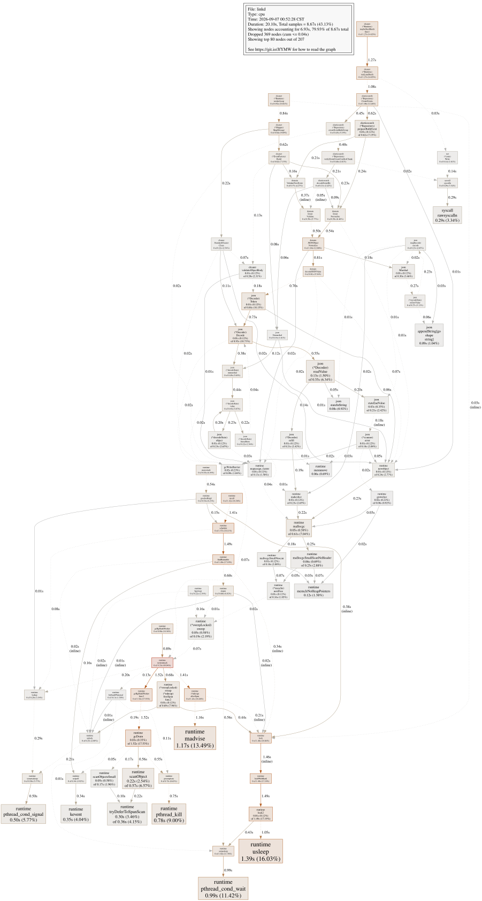](cleaner-normal-cpu.svg) | [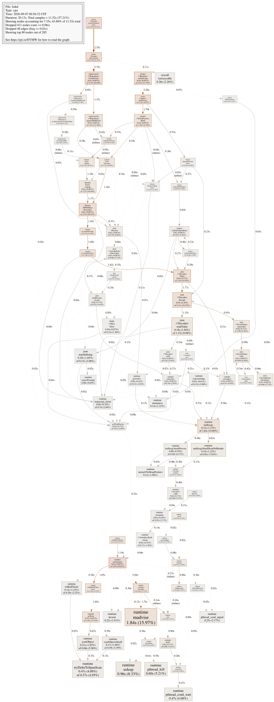](cleaner-slow-cpu.svg) | [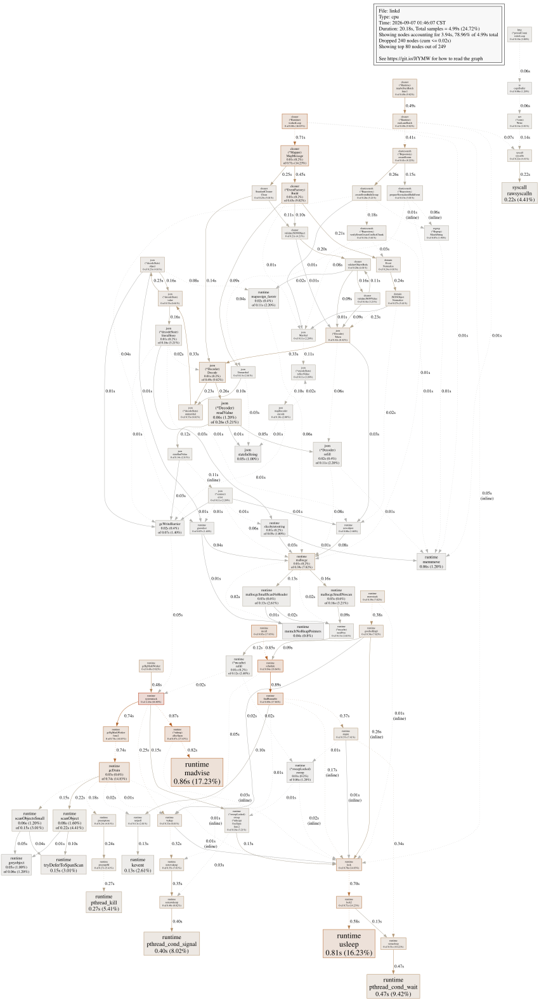](cleaner-projection-cpu.svg) |

### 正常段到降速段的分配差分

#### Lifecycle alloc_space 差分

[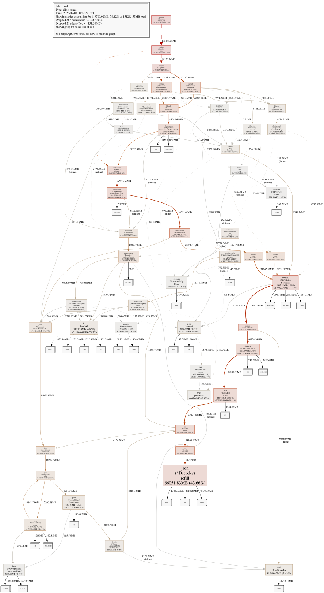](lifecycle-alloc-diff.svg)

#### Cleaner alloc_space 差分

[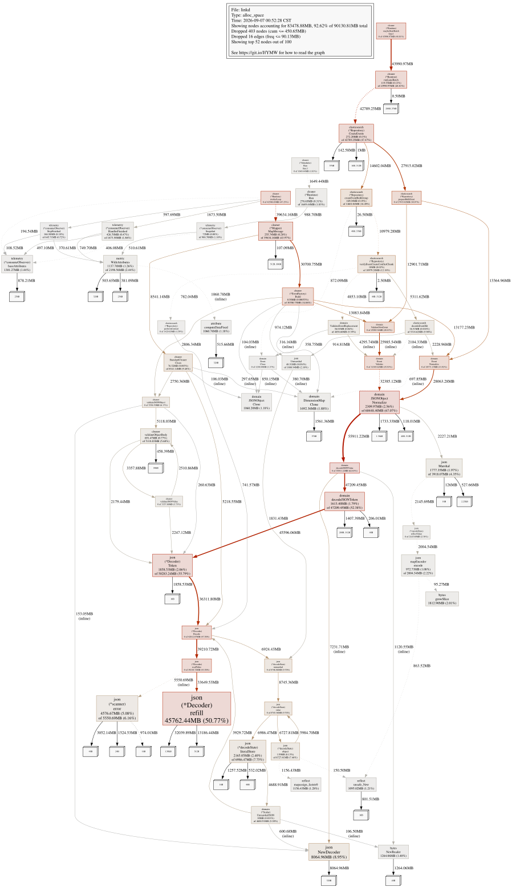](cleaner-alloc-diff.svg)

### 降速段 Lifecycle scheduler

[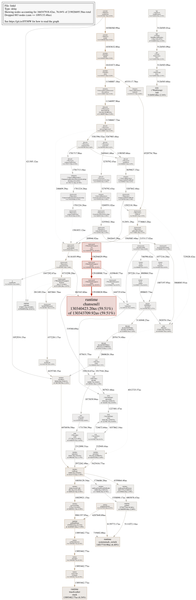](lifecycle-slow-scheduler.svg)

### 投影读取与局部 CAS 优化后的累计分配

| Lifecycle | Cleaner |
| --- | --- |
| [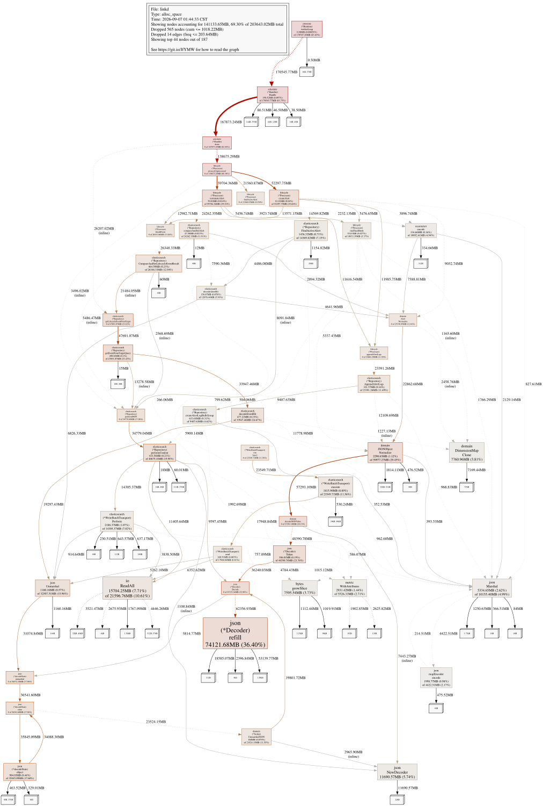](lifecycle-projection-allocs.svg) | [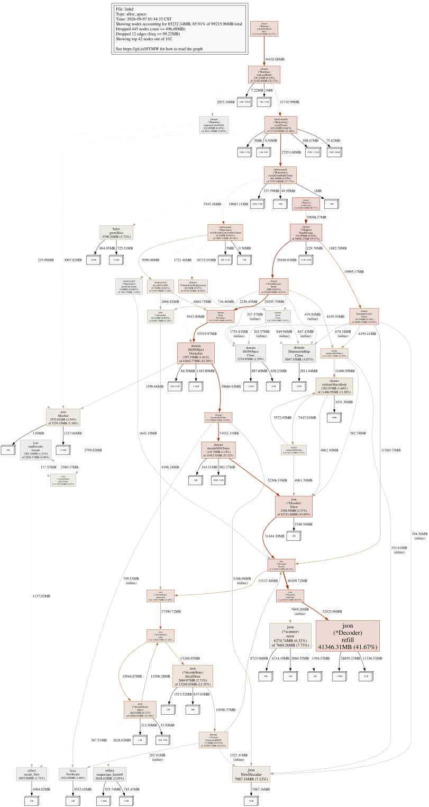](cleaner-projection-allocs.svg) |

## 关键发现

降速段相对正常段的 Lifecycle `alloc_space` 差分约 148GB，其中
`JSONObject.Normalize` 累计调用链约 75.5GB；Cleaner 差分约 88GB，其中同一调用链约 59GB。
Lifecycle scheduler 图显示 `WriteBatchTransport.finish` 的结果 channel 唤醒延迟被显著放大；
mutex 样本主要落在 runtime heap、GC 和调度内部，而非业务互斥锁。

| 末段指标 | 移除重复 Normalize 后 | 再增加投影读取、局部 CAS、属性缓存后 |
| --- | ---: | ---: |
| Lifecycle 吞吐 | 约 1043/s（包含追赶） | 约 993～997/s，与输入同步 |
| Signal 未读峰值 | 约 4769，输入期开始回落 | 0 |
| Lifecycle 分配 | 499.3MiB/s | 345.6MiB/s |
| Cleaner 分配 | 181.5MiB/s | 167.6MiB/s |
| Lifecycle GC 暂停占比 | 4.42% | 1.32% |
| Lifecycle runnable P99 | 9.40ms | 9.87ms |
| 写批请求体均值 | 140.7KiB | 85.3KiB |
| 写批执行 / ES took | 12.88 / 3.16ms | 8.66 / 3.30ms |

最终轮十分钟 Cleaner 与 Lifecycle 均完成 588,855 条；Kafka lag、Signal 未读始终为 0，
停止时 PEL 为 0。数据说明性能改善来自客户端分配、响应处理和写入载荷下降，而非 ES 服务端
执行时间或批次规模变化。

## 生成方式

```bash
go tool pprof -svg -output=<output.svg> ./bin/linkd <profile.pb.gz>
go tool pprof -top -nodecount=50 -output=<output.txt> ./bin/linkd <profile.pb.gz>
go tool pprof -svg -sample_index=alloc_space -base <normal-allocs.pb.gz> \
  -output=<diff.svg> ./bin/linkd <slow-allocs.pb.gz>
go tool trace -pprof=sched <trace.out> > <sched.pb.gz>
```

原始 profile 未纳入仓库，因此目录用于代码审查和结论追溯，不用于重新生成任意筛选视图。
