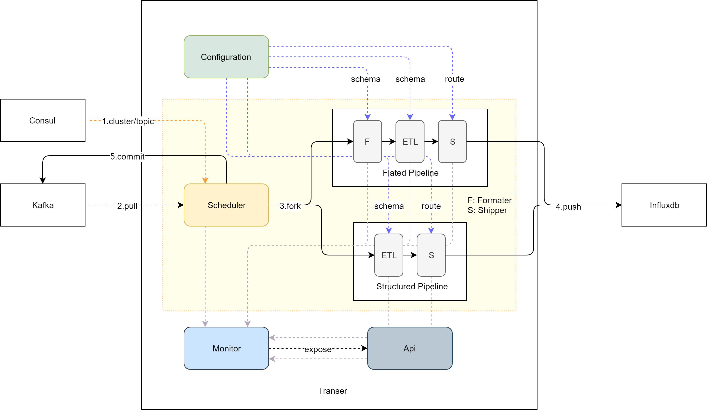

# Transfer

蓝鲸监控数据链路模块，用于处理采集器上报数据的收集，清洗和入库工作。

## 架构




## 命令

### 编译
```bash
$ make
```

### 自动补全

```bash
$ source <(transfer completion)
```

### 运行

```bash
$ transfer run -c transfer.yaml --pid /tmp/transfer.pid
```

### 查看版本信息

```bash
$ transfer version -h
Print version info

Usage:
  transfer version [flags]

Flags:
  -a, --all    show all version info
  -h, --help   help for version

Global Flags:
  -c, --config string   config file
```

### 查看配置信息

```bash
$ transfer confinfo -h
Show configure info

Usage:
  transfer confinfo [flags]

Flags:
  -h, --help   help for confinfo

Global Flags:
  -c, --config string   config file
```

### 发送信号

```bash
$ transfer signal -h
Send signal to daemon service

Usage:
  transfer signal [flags]

Flags:
  -h, --help               help for signal
  -s, --signal string      name of signal
  -v, --vars stringArray   request var

Global Flags:
  -c, --config string   config file
```

### 查看集群信息

```bash
$ transfer cluster
+--------+----------------------+-----------+-------+----------+------+
|        |          ID          |  ADDRESS  | PORT  |   TAGS   | META |
+--------+----------------------+-----------+-------+----------+------+
|        | bkmonitor-4241214155 | 10.0.0.1 | 10200 | transfer |      |
| leader | bkmonitor-3938735728 | 10.0.0.2 | 10200 | transfer |      |
|        | bkmonitor-4140341346 | 10.0.0.3 | 10200 | transfer |      |
+--------+----------------------+-----------+-------+----------+------+
3 healthy services found 
```

所有节点都会被解析到 **transfer.bkmonitor.service.consul** 域名下：

```bash
$ dig +short transfer.bkmonitor.service.consul
10.0.0.2
10.0.0.3
10.0.0.4
```

### 查看任务分配情况

```bash
$ transfer shadow
```

### 保存运行快照

```bash
$ transfer snapshot
```

该命令会在当前目录中生成一个带有时间的*tar.gz*文件，保存了整个集群的运行信息。


## 配置

```yaml
consul:
  address: 127.0.0.1:8500
  check_interval: 2s  # 配置节点变更监听间隔
  child_subpath: metadata/data_id  # 配置节点子路径
  event_buffer_size: 32  # 缓冲区大小
  root_path: bkmonitor_enterprise_production  # consul 根路径
  sampling_subpath: result_table  # 动态上报子路径
  sampling_time: 1  # 动态采集频率
  session_ttl: 10s  # session 过期时间
debug: true  # 是否 debug 模式
esb:
  address: http://paas.service.consul  # esb 地址
  bk_app_code: blueking
  bk_app_secret: xxx
  user_name: admin  # 以该用户调用 esb
http:
  host: 0.0.0.0  # 监控地址
  port: 8599  # 监听端口
influx:
  backend:
    buffer_size: 100  # 入库缓冲区大小
    flush_interval: 100ms  # 入库频率
    flush_retries: 3  # 入库失败重试次数
kafka:
  consumer_group_prefix: transfer/  # 消费组前缀
  initial_offset: -1  # 初始偏移位置(从最后开始)
  rebalance_timeout: 10s  # 消费组均衡超时
  reconnect_timeout: 10s  # 重连超时
  version: 0.0.0.1  # kafka 对应版本
logger:
  formatter:
    name: text  # 日志以文本格式打印
  level: trace  # 日志级别
  out:
    name: file  # 输出方式
    options:
      daily: true  # 按日轮转
      file: transfer.log  # 日志文件路径
      level: trace  # 写入文件的日志级别
      max_days: 5  # 最多保留天数
      max_size: 536870912  # 单文件最大字节数
      rotate: true  # 开启轮转
scheduler:
  cc_batch_size: 100  # cc 批量查询大小
  cc_cache_expires: 1h  # cc 缓存失效超时
  cc_check_interval: 10s  # cc 检查间隔
  check_interval: 1s  # 调度器调度间隔
  clean_up_duration: 3s  # 调度器清理超时
```


## 监控

### 指标
| 名称                                   | 描述                 | 模块       | 类型   |
|--------------------------------------|--------------------|----------| ------ |
| **consul_write_failed_total**        | 写 consul 失败次数      | 动态字段上报   | 计数器 |
| consul_write_success_total           | 写 consul 成功次数      | 动态字段上报   | 计数器 |
| **esb_request_fails_total**          | 请求 esb 失败次数        | CC 缓存    | 计数器 |
| esb_request_successes_total          | 请求 esb 成功次数        | CC 缓存    | 计数器 |
| esb_request_handle_seconds*          | 请求 esb 耗时分布        | CC 缓存    | 直方图 |
| go_gc_duration_seconds*              | gc 暂停耗时统计          | 系统       | 统计   |
| go_goroutines                        | goroutine 数量       | 系统       | 度量   |
| go_threads                           | 系统线程数量             | 系统       | 度量   |
| influx_backend_buffer_remains*       | influxdb 缓冲区饱和度分布  | influxdb | 直方图 |
| **pipeline_backend_dropped_total**   | 流水线后端丢弃消息数         | 流水线      | 计数器 |
| pipeline_backend_handled_total       | 流水线后端处理消息总数        | 流水线      | 计数器 |
| kafka_frontend_rebalanced_total      | kafka 重均衡次数        | kafka    | 计数器 |
| **pipeline_frontend_dropped_total**  | 流水线前端丢弃消息数         | 流水线      | 计数器 |
| pipeline_frontend_handled_total      | 流水线前端处理消息总数        | 流水线      | 计数器 |
| **pipeline_processor_dropped_total** | 流水线处理器丢弃消息数        | 流水线      | 计数器 |
| pipeline_processor_handled_total     | 流水线处理器处理消息总数       | 流水线      | 计数器 |
| pipeline_processor_handle_seconds*   | 流水线处理耗时分布          | 流水线      | 直方图 |
| **scheduler_panic_pipeline_total**   | 调度器捕获流水线 panic 次数  | 调度器      | 计数器 |
| **scheduler_pending_pipelines**      | 调度器挂起流水线数量         | 调度器      | 度量   |
| scheduler_running_pipelines          | 调度器运行流水线数量         | 调度器      | 度量   |
| **kafka_backend_dropped_total**      | 写 kafka 失败次数       | kafka    | 计数器 |
| kafka_backend_handled_total          | 写 kafka 成功次数       | kafka    | 计数器 |
| **redis_backend_dropped_total**      | 写 redis 失败次数       | redis    | 计数器 |
| redis_backend_handled_total          | 写 redis 成功次数       | redis    | 计数器 |
| argus_queue_capacity                 | 缓冲区队列总长度           | argus    | 度量 |
| argus_queue_remaining_capacity       | 缓冲区队列剩余长度          | argus    | 度量 |
| argus_queue_batch_size               | 缓冲区队列最大批量数         | argus    | 度量 |
| argus_queue_batch                    | 缓冲区队列单次批量数         | argus    | 度量 |
| argus_queue_batch_count              | 缓冲区请求次数            | argus    | 计数器 |
| argus_queue_handled_total            | 发送成功总数             | argus    | 计数器 |
| **argus_queue_dropped_total**        | 丢弃总数               | argus    | 计数器 |


## 信号

信号命令用于控制后台服务行为，提供了一种有轻微副作用的自恢复、调试机制。

### update-cc-cache

在下一次调度间隔时更新 CC 缓存：

```shell
$ transfer signal -s update-cc-cache -c transfer.yaml
```

### dump-host-info

在日志文件中打印 CC 缓存主机：

### dump-instance-info

在日志文件中打印 CC 实例主机:

```shell
$ transfer signal -s dump-host-info -c transfer.yaml
```

### set-log-level

临时更新日志级别：

```shell
$ transfer signal -s set-log-level -v level:info -c transfer.yaml
```


## 无数据问题排查流程

1. 检查集群状态是否有存活节点：`transfer cluster`
   - 如果没有存活节点，检查 transfer.pid 文件对应的进程是否存在
     - 不存在使用 supervisor 拉起
     - 存在则检查进程是否僵死
2. 检查 dataid 分配情况：`transfer shadow`
   - 如果检查单个 dataid，记下对应的节点
   - 如果没有找到对应的 dataid，需要检查元数据是否正确同步配置
3. 检查 metrics 是否有问题：`http://{{host}}:{{port}}/metrics`
   - 关注监控指标中加粗的指标状态
   - **scheduler_running_pipelines** 为0，说明没有流水线被启动
   - **scheduler_pending_pipelines** 不为0，说明有流水线被挂起
   - **pipeline_frontend_handled_total** 为0，数据源可能没有数据上报或元数据配置不正确
4. 检查日志是否有 CC 缓存或查询主机报错，如有则使用  *update-cc-cache* 信号更新缓存
5. 如果还有查询主机报错，使用信号 *dump-host-info* 将缓存打印出来，对比 CC 是否一致
6. 使用信号 set-log-level 将日志级别调整至 debug，跟踪日志流程排错

   - 如果日志长时间没有更新，请尝试 strace 排查进程是否假死，假死按后续步骤排查
   - 如果提示 kafka 没有 leader 或一直 rebalance error，请检查 kafka 和 Zookeeper 状态
   - 日志类似：`<db>:<data_id>:<result_table> dropped <n> points` 说明对应的存储不可用导致数据丢失，请排查对应的存储状态
   - 日志类似：`<etl>:<data_id> handle payload <sn>-<raw_data> failed: <message>`，说明 data_id 对应的上报数据不符合清洗格式，需要用户修改清洗配置或上报数据，但会导致数据丢失
   - 一般来说，错误级别日志说明环境或程序处理错误，需要运维和开发来处理，而警告级别则说明配置或数据问题，需要用户来处理
7. 保存当前进程信息：`transfer snapshot`
8. 将日志文件、进程信息和配置文件保存给开发排查

