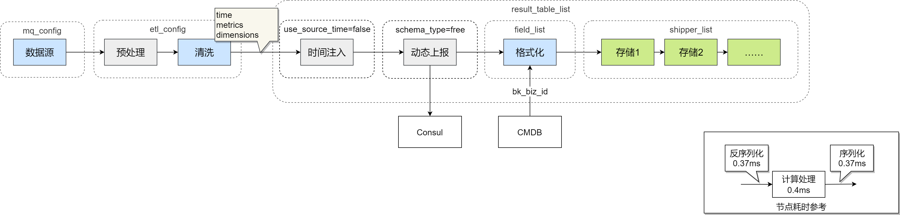

根据Consul路径信息及数据格式对应的流水线路径结构如下：

1. 为了解耦节点，各节点使用 json 格式传递数据，因此会增加序列化和反序列化耗时
2. 数据源根据 mq_config 来拉取指定队列数据
3. etl_config 来决定整条流水线状态
4. 每个流水线自行决定预处理和清洗方式，但需要保证清洗后的数据有统一格式
5. 格式化节点会将维度转化成字符串，同时给维度中加入业务 id
6. 如果 schema_type=free 会增加指标拆分节点，将多指标拆分成单指标
7. 根据 shipper_list 将最终数据入库
8. 节点功能不能过于复杂，但同时节点长度也不能太长
9. 特异性清洗在清洗及其前置节点完成
10. 通用化节点以格式化节点为分水岭，需要业务 id 的放到格式化之后，否则放置格式化之前

