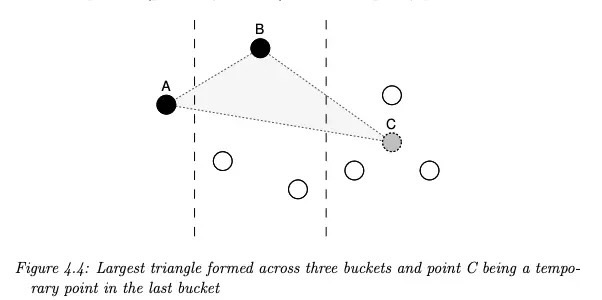

# LTTB Downsample

## 描述
当在给定范围内查询出对应结果时, 我们面临着一种情况在于该区间范围内的数据点过多的情况, 这时不仅在返回结果进行传输上的网络成本过高, 同时对于前端的渲染也存在较大的压力, 并很难通过某个具体的点看出它的真实值, 数据变得十分拥挤, 因此我们希望对超过指定阈值的数据进行降采样, 降低传输和渲染的复杂度, 同时在图表表现上却并不丢失整体数据趋势上的精准程度。在Unify-Query中, 我们按参考针对LTTB算法进行了实现: [LTTB] https://skemman.is/bitstream/1946/15343/3/SS_MSthesis.pdf

## 原理和具体实现
简单来说, 当数据量超过我们设定的阈值后, 对于当前查询返回的数据, 首尾两个数据点进行保存, 将剩余的点按照长度 / 阈值 的比值进行分桶。如何找到每一个桶内最能代表当前桶与前后桶之间趋势的点? 我们已知首尾两点是保留的, 基于第一个点, 进行第二个点的选择, 由于第三个点也是未知的, 因此需要一个临时点来代表第三个桶, 即取平均值, 同时遍历第二个桶中的点, 计算出其与第一个和第三个桶的代表点构成的三角形面积, 并取面积最大时的点作为当前桶的代表, 依次循环往复, 直到最后一个桶。



关于实现可以在 unify-query 模块下 downsample 找到 downsample.go, lttb.go

一般的, 在服务层面, 查询结果是一个 promql.points 的数组, 同时有一个 factor 参数, 表示降采样的阈值
```
func Downsample(points []promql.Point, factor float64) []promql.Point {
	var threshold int
	var downSamplePoints []promql.Point
	// threshold 最大值
	threshold = int(math.Ceil(float64(len(points)) * factor))
	downSamplePoints = lttbFunc(points, threshold)

	log.Debugf(context.TODO(), "downsample series done %s %d %s %d %s %d",
		"threshold", threshold,
		"rawPointCount", len(points),
		"downsamplePointCount", len(downSamplePoints),
	)
	return downSamplePoints
}
```

如何判断是否需要降采样? 在检查中, 通过采样的步长进行对比, 当传递的参数里, 降采样范围时间大于当前步长时间时, 进行降采样逻辑
```
func CheckDownSampleRange(step, downSampleRange string) (bool, float64, error) {
	var stepTime time.Duration
	var downSampleRangeTime time.Duration
	var dTmp model.Duration
	var err error
	dTmp, err = model.ParseDuration(step)
	if err != nil {
		return false, 0, err
	}
	stepTime = time.Duration(dTmp)
	dTmp, err = model.ParseDuration(downSampleRange)
	if err != nil {
		return false, 0, err
	}
	downSampleRangeTime = time.Duration(dTmp)

	return downSampleRangeTime > stepTime,
		float64(stepTime.Milliseconds()) / float64(downSampleRangeTime.Milliseconds()),
		err
}
```