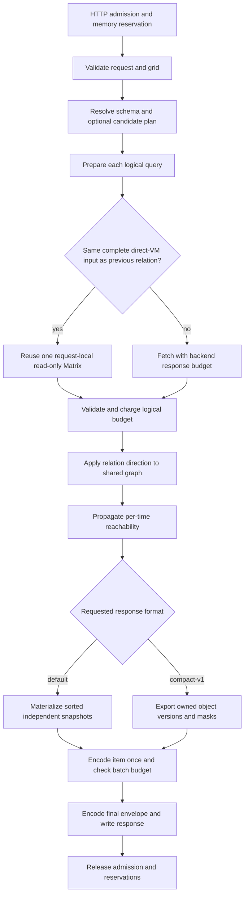

# Shared Topology Fetch, Output and Admission

This extends the shared topology API without changing the default snapshot
response. It is not evidence that a particular production capacity or latency
target has been met. Ordinary query routes retain their existing renderer.

## Execution



### Matrix Reuse

`cmdb.v1beta3.shared_topology_reuse_matrix` defaults to `true`. A single slot
is owned by the loader, never shared between requests. Preparation runs on
every logical query. Reuse requires matching serialized QueryTs, expression,
resolved VM expansion, user/tenant/scope, query parameters, storage types,
time range, step, lookback, exact/left-open grid and backend byte budget.
Ephemeral metadata hash IDs are excluded. Only direct-VM relation queries
are eligible; aggregated/non-direct routes fall back to fetching.

Empty and partial results can be reused. Errors cannot. Both applications
still validate the grid, contribute to partial status and consume logical
Matrix/graph budgets. The previous slot is dropped before a different fetch.
Apply never mutates the Matrix. There is no retry or cross-request cache.

`matrix-query-count` remains the logical loader count. New trace attributes
`matrix-physical-query-count`, `matrix-reused-query-count` and `matrix-reused`
separate actual loader fetch attempts from reuse. Physical load metrics no
longer charge reused data; `cmdb_timegraph_matrix_reuses_total` counts hits.
A loader fetch attempt is not necessarily one downstream HTTP request for
non-direct routes. Backend scanning cost remains unknown unless reported by
that backend; Matrix point/label counts are not a scan-cost measurement.

### Candidate Planning

`cmdb.v1beta3.shared_topology_plan_candidates` defaults to `false`.
The opt-in planner computes an H-hop type reachability upper bound, then keeps
**all relations incident to reachable types**, in their original order. This
retains seed/attribute contributions, boundary induced edges, self-relations
and cycles. Malformed relation shapes fall back to the original candidate set.
Root matcher pushdown is decided from the original schema relation set;
`target_types` is never used as a fetch whitelist.

This option is not byte-compatible with every unplanned execution: removing
unrelated candidate nodes can change encounter-order IDs, and skipped backend
queries no longer contribute errors/partial status. Use normalized resource
identity comparisons for graph equivalence and keep it disabled for clients
depending on exact request-local numbering or the old all-candidate partial
signal. IDs are not a cross-request entity identity contract.

## Response Formats

Default or `response_format: "snapshots"` on a query keeps the existing wire
shape, empty arrays, numeric IDs, ordering, messages and budgets. API conversion
transfers already-owned attribute maps; graph cleanup cannot mutate them. The
handler retains each checked item as RawMessage instead of retaining all its
objects and encoding them again. The final envelope still incurs validation,
copying and allocation: this is not streaming or zero-copy output.

`response_format: "compact-v1"` is an explicit per-query opt-in. It returns
`code`, time/grid fields, `response_format`, `compact`, and optional `message`.
It does **not** return `snapshots`. Failed items have `compact: null`; never
treat that as an empty successful graph. Unknown formats are rejected.

The `compact` object contains:

- `version: 1`, `timestamps`: the entire evaluation grid, including empty frames.
- `nodes`: full `{id, resource_type, dimensions, mask}` attribute versions.
- `edges`: full `{source, target, relation_type, metric_name, category, direction, mask}` versions.
- `partial`: ordered `{index, reason}` entries, including an empty reason when the frame is partial.
- `node_occurrences`, `edge_occurrences`: counts after expanding all frames,
  not dictionary sizes.

IDs are decimal strings, including values above JavaScript's exact Number
range. Masks are arrays of 16-character lowercase hexadecimal uint64 words.
Word 0 contains frames 0..63, with frame 0 in its least significant bit.
Trailing zero words can be omitted. For example, frame 64 alone is represented
by `["0000000000000000", "0000000000000001"]`. YOLO supports larger grids;
there is no new single-word or 60-point restriction in this protocol.

Node masks intersect reachability and the existing disjoint attribute-version
masks. Uncovered bits use the same stable-identity fallback as snapshots. Edge
masks intersect edge activity and both endpoint reachabilities. Target-type
filtering happens after propagation. Dictionaries own their maps and mask
strings before graph cleanup. Nodes are emitted in numeric ID order; versions
of one node have disjoint masks. Edges preserve the snapshot comparator order.
Filtering either dictionary for one frame therefore preserves snapshot order.

[The dependency-free JavaScript reader](examples/topology-compact.mjs) retains
IDs as strings and materializes only the requested frame. It validates masks,
overlapping node versions and dangling edges. Each returned frame owns its
dimension objects. The Node tests also compare server-produced fixtures.

```javascript
import { createTopologyReader } from "./topology-compact.mjs";
const reader = createTopologyReader(successfulItem.compact);
const frame = reader.frame(64);
```

Normal-mode expanded element/byte budgets are still charged **before target
filtering**, matching the snapshot path. Compact transport bytes are checked
separately by the HTTP batch budget. A smaller wire payload does not grant a
larger graph or expanded client view. Version-heavy inputs may compress poorly.

## Resource Protection

The following settings are under `cmdb.v1beta3`:

| Setting | Default | Meaning |
| --- | ---: | --- |
| `max_shared_topology_concurrent_requests` | 8 | Process-wide HTTP/model requests; immediate rejection, no queue |
| `max_shared_topology_reserved_bytes` | 4294967296 | Process-wide estimated in-flight reservation cap |
| `shared_topology_request_memory_bytes` | 536870912 | Minimum full-flight reservation per request |
| `shared_topology_memory_headroom_bytes` | 536870912 | Additional margin below observed available memory |
| `yolo_mode` | false | Explicit bypass of quantity/data/admission budgets; validation and cancellation remain |

Nonpositive values use the finite defaults, not unlimited mode. These starting
values are conservative configuration defaults, **not a recommended capacity
for every Pod**. Calibrate them for the actual CPU/memory limits, ordinary-query
baseline, labels, versions, GC behavior and downstream service capacity.

Reservations cover estimated simultaneous request/decode buffers, backend
buffers and Matrix conversion, cumulative graph/index costs, output objects,
retained encoded items and final encoding/write buffers. Estimates grow before
fetch/apply/output allocation and are rounded for output allocation chunks.
Stage estimates include 8x bounded backend bytes, 256 bytes per logical point,
1024 per returned series, 8x label bytes, and output/buffer multipliers. They
are deliberately conservative calibration inputs, **not exact object sizes**.
The full-flight minimum remains until the request completes. Existing hard
input, Matrix and graph/output limits remain; they are not replaced by estimates.

Admission and reservation growth additionally inspect host MemAvailable and
all visible cgroup v1/v2 memory limit/usage pairs, including visible ancestors.
Unlimited sentinels and read failures do not become infinite reservations: the
configured cap still applies. Namespace-hidden parents and shared external
activity cannot be certified by these reads. Memory paths are discovered once
per process; restart after moving a process to another cgroup. Observed current
usage may already include existing leases, so adding their reservations again
can reject conservatively. A check is not an atomic promise about future RSS.

The lease spans actual response writing, including proxy envelopes and write
failures. Nested model calls share it; release is idempotent. Active requests
and estimated reserved bytes are separate metrics. Rejections expose stable
`max_topology_concurrent_requests`, `max_topology_reserved_bytes` or
`max_topology_memory_headroom` reasons and count/limit attributes. Response
encoding and network writing have separate `http-response-encode` and
`http-response-write` spans; neither is a CPU-time measurement.

## Verification and Rollout

Tests cover independent/combined fetch reuse and planning, logical budget
charging on reuse, immutable Matrix application, owned results after cleanup,
randomized historical attributes/directions/partial at 1..257 points, exact
uint64 client IDs, induced edges, target post-filtering, cancellation, resource
rejection/recovery and direct/proxied writer failure cleanup. Go tests execute
the client fixture tests when Node is available; otherwise run them explicitly:

```sh
node --test docs/examples/topology-compact.test.mjs
GOTOOLCHAIN=go1.24.4 go test -race -tags=jsonsonic ./cmdb/v1beta3 ./service/http/api ./service/http/proxy ./metric
GOTOOLCHAIN=go1.24.4 go test -tags=jsonsonic ./cmdb/v1beta3 -run '^$' -bench BenchmarkTopologyOutputFormats -benchmem
```

The opt-in local pipeline probe supports `TG_PIPELINE_MODE=shared|compact`,
`TG_EDGES`, `TG_POINTS`, `TG_CONCURRENCY` and `TG_PIPELINE_YOLO=true`. It records
fixture/response hashes, stages, allocations, live/retained heap and GC. Use
independent processes and external RSS/cgroup sampling. There is no fixed 4-way
test ceiling, but increased load still needs measured headroom and a stop rule.
Synthetic tests are not real 10x business load or production tail-latency proof.

Validate a newly built image in an authorized test window before rollout.
Keep transport/HTTP2 failures separate from these optimization claims. Bounded
parallel fetch and frontier pushdown remain conditional follow-up experiments
only when post-reuse backend measurements justify them; this change does not
increase physical query concurrency or modify ordinary-query routing.
